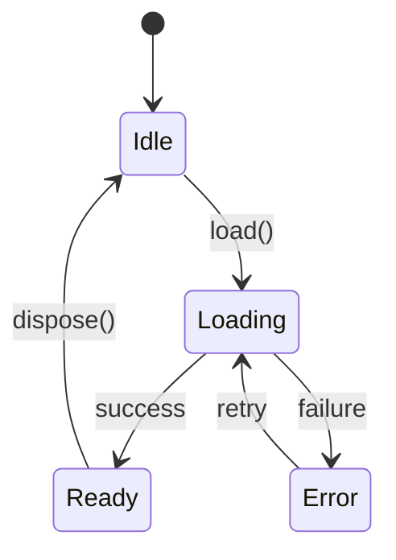
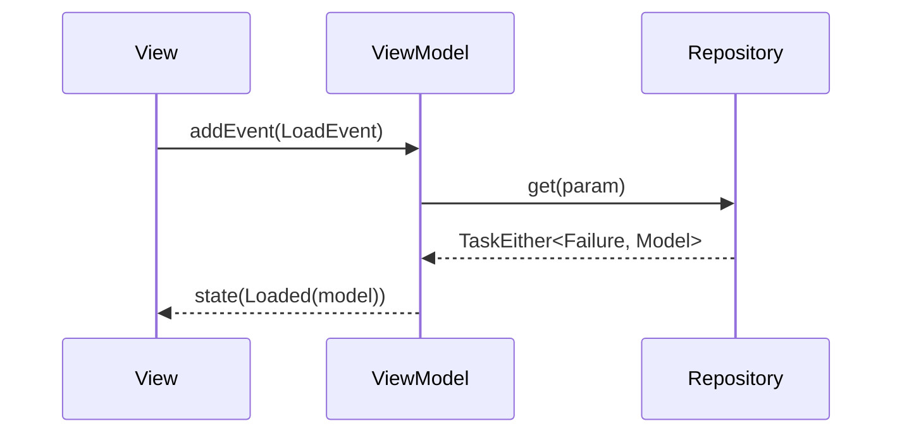
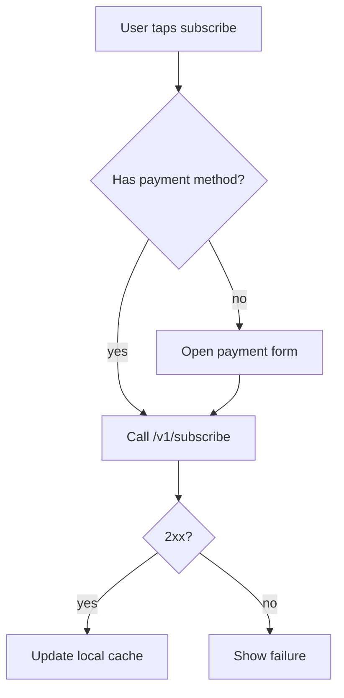
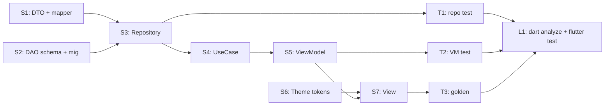

# Spec Authoring

Long-lived spec documents that describe **what** a feature is (requirements) and **how** it is built (design). Plans, todos, and progress trackers do **not** belong here — they are session-scoped and live in `agents/scratchpads/` or task lists.

## Location

Two layouts depending on where the `specs/` folder lives.

### Layout A — multi-topic (project root, package root)

At locations that may host **many specs across different topics**, every spec **MUST** use a `{topic}/` subfolder. This keeps topics isolated and makes adding a new spec a non-conflict change.

| Scope | Path |
|-------|------|
| Project-wide | `specs/{topic}/` |
| Package-scoped | `packages/{category}/specs/{topic}/` |

```
specs/onboarding/
├── requirements.md
├── design.md
├── researches/                              # optional, committed
│   ├── internal-feed-onboarding.researches.md
│   └── external-duolingo-streaks.researches.md
└── plan.md                                  # optional, GITIGNORED (local-only)

packages/common/specs/cache_policy/
├── requirements.md
└── design.md
```

### Layout B — single-topic (anywhere else)

When `specs/` lives **deeper** than the project / package root — typically next to the implementation it documents (a feature, an app subfolder, a platform subfolder) — a single topic is the norm. The `{topic}/` subfolder is unnecessary and the docs **MAY** sit directly under `specs/`.

If a deeper location ever needs more than one topic, switch back to Layout A (`{topic}/` subfolders) for *all* specs in that folder — don't mix.

| Scope | Path |
|-------|------|
| Feature-scoped | `features/{name}_feature/specs/{requirements,design}.md` (or `specs/{topic}/...` if multiple topics) |
| App-scoped | `apps/{name}_app/specs/{requirements,design}.md` (or `specs/{topic}/...` if multiple topics) |
| Platform / subfolder | `features/{name}_feature/{platform}/specs/{requirements,design}.md` |

```
features/club_feature/specs/
├── requirements.md
├── design.md
├── researches/                              # optional, committed
│   └── internal-club-cheering.researches.md
└── plan.md                                  # optional, GITIGNORED (local-only)

features/meta_feature/android/specs/
├── requirements.md
├── design.md
└── researches/...
```

### Required + optional artifacts (both layouts)

Each spec location **MUST** contain `requirements.md` and `design.md`. Both files are required; partial specs are not allowed.

A spec location **MAY** also contain:
- A `researches/` subfolder with one or more `{target}.researches.md` files capturing internal/external research that informs the requirements or design (see [Research notes](#research-notes-researchestargetresearchesmd)).
- A `plan.md` file holding the local, step-by-step implementation plan for the current `design.md` (see [Plan](#plan-planmd)). **Gitignored** — local working scratch only.

## requirements.md

**Purpose:** describe the problem, who it serves, and what the system must do — **not** how to build it.

**Skill:** `/create_requirements` bootstraps the document — it is the **special case of `requirements.md` written for a Jira issue** (posts the result to the issue description while preserving existing content, restructures existing requirements when given an issue key). For non-Jira-tracked work, hand-author following the same structure. The structural rules below apply either way.

### Required sections

1. **Problem Statement** — the user/business pain in plain language (1–3 paragraphs). Why this work exists.
2. **Scope** — bullet list of what is included.
3. **Out of Scope** — bullet list of what is explicitly excluded. Critical for preventing drift.
4. **User Stories** — for **user-perceived** experience. Format: `As a {persona}, I want {capability}, so that {benefit}.` Group by persona or flow when many.
5. **Use Cases** — for **system-level** behavior, constraints, and contracts that aren't directly observed by the user (auth refresh, retry policy, cache invalidation, error mapping). Format: actor → trigger → preconditions → main flow → alternative flows → postconditions.
6. **Verification (통과 항목)** — the acceptance criteria that decide "done." Each story or use case must have at least one criterion. Write them so anyone (QA, PM, another dev) can independently judge pass/fail.

   - Format: `Given {context}, when {action}, then {observable outcome}.` Or a numbered checklist when state-based.
   - Tag each item by *the kind of artifact* that closes it. Each tag maps 1:1 to something `design.md` must specify (see [Verification](#verification)):

     | Tag | Closes when… | Design.md must specify | Skill that authors / runs it |
     |-----|--------------|------------------------|------------------------------|
     | `[test]` | An automated test passes | Test layer (unit / widget / golden / integration), target, file path, fixtures, pass condition | `/create_test` (bootstrap) → `/verify_test` (run + check coverage) |
     | `[lint]` | Static analysis passes | Rule (`dart analyze`, custom lint, formatter, type check) and config | `/verify_test` (treats analyze + lint as part of the verification sweep) |
     | `[qa]` | A manual QA scenario is exercised and signed off | Link to the QA scenario in `qa_{version}.md` | `/create_qa` (generates the QA checklist file from a version range or build #) |
     | `[telemetry]` | A production metric stays within a threshold | Dashboard link (Datadog / Crashlytics / GA4) + threshold | (no skill — hand-link the dashboard) |
     | `[approval]` | A stakeholder explicitly signs off (legal, accessibility, design) | Stakeholder + approval doc / Slack thread | `/verify_presentation` for visual / Figma sign-off; otherwise hand-track |

   - Reference the story / use case it covers (e.g., "covers Story 2, Use Case 4").
   - **Example:**
     ```markdown
     - [test] Given a logged-in member with no payment method, when they tap subscribe, then the payment form opens. (Story 1)
     - [test] Given an expired access token, when any API call fires, then the token is refreshed once before retry; second failure pops the session. (Use Case 3)
     - [lint] No `// ignore: invalid_use_of_protected_member` survives in the new ViewModel.
     - [qa] Given iPad mini 5 / iPadOS 26 with <100MB free, when the feed scrolls 50 cards, then no crash and memory stays <600MB.
     - [telemetry] Crash-free sessions for the feed screen ≥ 99.95% over 7 days post-release.
     - [approval] Forbidden-landing copy approved by legal.
     ```
   - Anti-pattern: vague criteria like "feature works correctly" or "no regression" without an observable rule.

### Optional sections

- **Design Principles** — guiding tradeoffs (e.g., "favor offline-first over freshness", "fail closed on permission errors"). Useful when designers/engineers face recurring choices.
- **Glossary** — domain terms that recur across the doc.
- **References** — sources that **constrain** the requirements: legal/compliance docs, platform guidelines (Apple HIG, Material), partner contracts, regulatory rules, prior tickets, market research, customer interviews. Link out — don't paraphrase. Each reference should answer "why is this requirement non-negotiable?" In-depth research goes in `researches/{target}.researches.md`.
- **Open Questions** — explicit unknowns. Resolve before `design.md` lands.

### When to use story vs. use case

| Aspect | User Story | Use Case |
|--------|------------|----------|
| Driven by | A persona's goal | A system contract |
| Visible | Yes (UI, copy, output) | Often invisible (background job, retry, mapping) |
| Trigger | User action | User OR system event |
| Output | Narrative | Step-by-step actor/system flow |
| Example | "As a member, I want to see only my paid content so that I don't waste time on locked items." | "When the access token expires, the auth service refreshes it once; on second failure, the session pops and the user is sent to login." |

A feature usually has **both**.

### Anti-patterns

- Implementation details (class names, file paths, library choices) — those belong in `design.md`.
- Sprint-tracker noise (status, assignee, ETA).
- Open-ended "we should consider…" without a decision or an Open Questions entry.

## design.md

**Purpose:** describe the implementation **design** for the requirements — not a project plan, not a checklist of steps.

**Skill:** `/create_spec` bootstraps the document — it explores the codebase architecture, analyzes Figma designs via MCP, makes design decisions, and (when run after `/create_requirements`) posts the result alongside the requirements on a Jira issue. For non-Jira-tracked work, hand-author following the same structure.

### Required content

1. **Overview** — 2–4 sentences linking the design to the requirements doc and naming the dominant approach (e.g., "session-scoped facade over a CachePolicyable repository").
2. **Diagrams** — at least one **dynamic** UML diagram via Mermaid. Pick what fits the problem; do not draw all of them.
3. **Concrete artifacts** — example code snippets, class/object/composite-structure diagrams, naming conventions, profile diagrams as needed.

### Diagram catalog

Prefer **dynamic** diagrams over static ones — they encode runtime behavior, where bugs hide.

| UML diagram | Mermaid block | When to use |
|-------------|---------------|-------------|
| **Use Case** | `flowchart` with actor + ellipses | Map actors → goals at a glance |
| **Activity** | `flowchart TD` with decision diamonds | Multi-branch business flow with conditions |
| **State Machine** | `stateDiagram-v2` | Anything with an explicit `enum State` (player, auth, download) |
| **Sequence** | `sequenceDiagram` | Cross-component message ordering, async interactions |
| **Communication** | `flowchart LR` with numbered edges | Same intent as sequence but emphasizes participants over time |
| **Interaction Overview** | nested `flowchart` referring to sequence diagrams | Top-down view that wires sub-flows |
| **Timing** | Mermaid lacks native timing diagrams — use a labeled `gantt` or text timeline | Real-time / latency budgets |
| **Class** | `classDiagram` | Type relationships when interfaces and inheritance matter |
| **Object** | `flowchart` with snapshot nodes | Concrete instance graph at a moment in time |
| **Composite Structure** | `flowchart` with subgraphs as parts/ports | Internal structure of a complex component |
| **Package** | `flowchart` with subgraphs | Cross-module dependency layout |
| **Profile** | `classDiagram` with `<<stereotype>>` | Project-specific stereotype rules (e.g., `<<CachePolicyable>>`) |

### Mermaid examples

**State machine** (most common in this codebase):



**Sequence**:



**Activity**:



### Naming conventions

When the design introduces a new pattern, document its naming convention inline. Reference [`code_style.rules.md`](code_style.rules.md), [`feature.rules.md`](feature.rules.md), and the relevant ViewModel/Repository/DAO rules instead of restating them.

### Trade-offs / Pros & Cons (optional)

Where `requirements.md` declares **Scope** and **Out of Scope** to bound *what* is built, `design.md` may declare **Trade-offs** and **Pros & Cons** to bound *how* it's built. Include this section when the design picks one approach over plausible alternatives, and the reasoning would otherwise be lost.

Skip when the choice is obvious or there's only one reasonable path — don't invent alternatives just to fill a section.

**Format options:**

- **Trade-offs** — paragraph or bullets describing the dominant axis being traded ("we prioritize X at the cost of Y because…"). One per non-trivial decision.
- **Pros & Cons** — for chosen approach when alternatives were considered. Two-column or per-option:

  ```markdown
  #### Approach: session-scoped facade over CachePolicyable

  **Pros**
  - Reuses existing scope lifecycle — no new disposal hooks
  - Cache invalidation already handled by the policy

  **Cons**
  - Couples the feature to session push/pop ordering
  - Failure semantics inherited from the facade, not customizable per-call

  **Considered alternatives**
  - App-scoped singleton — rejected: leaks user state across login switches
  - Per-screen ViewModel-owned — rejected: duplicates cache logic 3x

  **Why this won:** {one-sentence summary of the deciding factor}
  ```

**When to promote / demote:**

- A trade-off that becomes a hard rule across the project → move to `agents/rules/`.
- A trade-off where the alternatives needed full investigation → move the comparison body to `researches/{target}.researches.md` and keep only the conclusion here.
- A trade-off the team is still debating → keep in `Open Questions` of `requirements.md`, not here.

### Verification

Every `[test]`- or `[lint]`-tagged criterion in `requirements.md#verification` **MUST** map to a concrete automated check designed here. Other tags (`[qa]`, `[telemetry]`, `[approval]`) only need a one-line note on how the check happens — the design isn't responsible for executing them.

**Skills that close verification items:**

- `/create_test` — bootstraps `[test]` items: repository / DAO / ViewModel / ViewCommand / view-behavior / fake-use-case skeletons.
- `/verify_test` — runs and checks coverage for the `[test]` and `[lint]` items added or changed in the current branch. Use after implementation, before commit.
- `/create_qa` — produces the `qa_{version}.md` checklist that `[qa]` items reference.
- `/verify_presentation` — closes `[approval]` items that are about visual fidelity (golden vs. Figma oracle, design sign-off).
- `[telemetry]` — no skill; hand-link the dashboard and threshold here.

For each `[test]` / `[lint]` criterion, specify:

| Field | Example |
|-------|---------|
| **Layer** | unit / widget / golden / integration / lint / static-analysis |
| **Test target** | `GetSubscribeRepository`, `SubscribeViewModel`, `SubscribeScreen` golden |
| **Test file location** | `features/{feature}/test/...` (follows [`test.rules.md`](test.rules.md)) |
| **Fixtures / fakes** | `FakeSubscribeUseCase`, `MembershipModelFixture`, `DioAdapter` mock |
| **Pass condition** | Exact assertion in observable terms — same wording as the criterion |

```markdown
#### T1 — `[test]` Token refresh on 401 (Use Case 3)

- **Layer:** unit + integration
- **Target:** `AuthInterceptor`, `GetMeRepository` happy + retry path
- **Files:** `packages/common/test/services/auth/auth_interceptor_test.dart`
- **Fakes:** `DioAdapter` (replies 401 once, then 200), `FakeAuthTokenDao`
- **Pass:** `expect(refreshCalls, equals(1))` on first 401; `expect(sessionPopped, isTrue)` on second 401.
```

**Rules:**

- Map by criterion ID using a tag-prefixed counter — `T1`, `T2` for `[test]`; `L1`, `L2` for `[lint]`; `Q1` for `[qa]`; `Tel1` for `[telemetry]`; `A1` for `[approval]` — so `plan.md` can reference each verification task without remapping.
- Don't duplicate rule content from [`test.rules.md`](test.rules.md) / [`view_model_test.rules.md`](view_model_test.rules.md) / [`view_test.rules.md`](view_test.rules.md). Link to the relevant rule and only specify what's specific to *this* feature (target, fixtures, pass condition).
- Reuse existing fakes/fixtures when possible. New fakes are a code-change too — call them out so they don't get missed.
- For `[qa]` / `[telemetry]` / `[approval]` items, one-line note is enough (e.g., "QA checklist `qa_3.30.0.md#feed-onboarding`", "Datadog dashboard `feed-stability`", "Legal Slack thread `#legal-2026-04-29`").
- If a criterion is tagged `[test]` or `[lint]` but cannot be automated economically, downgrade the tag in `requirements.md` (most often to `[qa]`) and explain why here. Don't write design for verification that won't actually run.

### References (optional)

Sources that **inform** the design choice: prior implementations to benchmark against, existing conventions being extended, third-party patterns, library docs, blog posts, RFCs. Distinct from requirements `References` — those constrain *what* must be built; design References guide *how*.

- Internal benchmarks: link to `path:line` of an existing implementation that the design extends or mirrors.
- External benchmarks: link to the source (RFC, library README, video timestamp). Note the version/commit so future readers can find the same artifact.
- For substantive comparison ("we evaluated A vs. B vs. C"), move it to `researches/{target}.researches.md` and link from here.

### Anti-patterns

- A list of TODOs / checkboxes. Move to `agents/scratchpads/{topic}.md`.
- Status updates ("currently working on …"). Move to a scratchpad.
- Code that duplicates what exists in the codebase — link to the file with `path:line` instead.
- Static-only diagrams when the problem is dynamic (state, ordering, concurrency).

## Research notes (`researches/{target}.researches.md`)

**Purpose:** capture internal/external case studies, comparative analysis, and exploratory findings that inform — but are not themselves — requirements or design decisions.

Use research notes when the work is too long to inline as a `References` bullet, or when the analysis itself is the deliverable (e.g., "evaluated 4 charting libraries before picking fl_chart"). Without a research note, the *why* behind a requirement or design choice gets lost.

### Location & Naming

All research notes live under a `researches/` subfolder of the topic. Files are named `{target}.researches.md` where `{target}` names the subject in kebab-case. Be specific:

| Good | Bad |
|------|-----|
| `researches/internal-feed-onboarding.researches.md` | `researches/onboarding.researches.md` |
| `researches/external-duolingo-streaks.researches.md` | `researches/competitors.researches.md` |
| `researches/flutter-overlay-libraries.researches.md` | `researches/libraries.researches.md` |
| `researches/ios-26-background-lifecycle.researches.md` | `researches/ios.researches.md` |

Multiple research notes per topic are fine — one per distinct line of inquiry is preferred over one mega-doc. The subfolder keeps the topic root scannable when more than one or two notes accumulate.

### Required sections

1. **Subject** — one-sentence statement of what is being researched.
2. **Why** — link back to the spec section (`requirements.md#scope` or `design.md#overview`) that needed this. If a research note has no consumer, delete it.
3. **Findings** — the substantive content. Internal: code paths, prior incidents, prior tickets. External: vendor docs, competitor analysis, library comparison, blog posts, papers. Cite versions/commits/dates.
4. **Implications** — bullet list of how the findings should affect the spec. This is what `requirements.md` / `design.md` consumes.

### Optional sections

- **Methodology** — how the research was conducted (only when it matters: "tested on iPad mini 5 / iOS 26.3.1", "manually instrumented X for 24h").
- **Open Questions** — what's still unknown and should be revisited.

### Anti-patterns

- A research note without a `Why` link — orphaned research rots fastest.
- Pasting full vendor docs — link to them, summarize the relevant 1–2 paragraphs.
- Restating findings as requirements — once a finding becomes a constraint, move it into `requirements.md` and reference the research note.

## Plan (`plan.md`)

**Purpose:** the step-by-step implementation plan for the current `design.md`. Local, ephemeral, **gitignored** — it captures *your* in-progress execution against the design, not a shared artifact.

### Why gitignored

- Plans go stale fast and are noisy in PRs.
- Different developers may slice the same design differently — committing one plan implies a single canonical sequence, which is rarely true.
- The committed truth is the **outcome** (code + updated `design.md`), not the journey.

If a plan element is worth preserving across sessions/developers (a non-obvious ordering constraint, a deferred sub-task), promote it: ordering → `design.md`, deferred work → an Open Questions entry or a Jira ticket. Then drop it from `plan.md`.

### Structure

Free-form for implementation phases, **but the plan MUST end with a Verification phase** that runs every check designed in `design.md#verification`. The plan is not "done" until verification passes.

```markdown
# Plan — {topic}

Tracking against [design.md](design.md).

## Phase 1 — foundation
- [ ] **S1** Add CachePolicyableGetableRepository skeleton
- [ ] **S2** Wire DI factory in SessionObserver
- [x] **S3** Generate DTOs via swagger_parser

## Phase 2 — view layer
- [ ] **S4** ViewModel with state machine (see design.md#state)
- [ ] **S5** View bindings + AppSemantics

## Phase 3 — Verification (REQUIRED)
- [ ] **T1** Token-refresh on 401 — `auth_interceptor_test.dart` (covers requirements T1)
- [ ] **T2** Subscribe-button widget test — `subscribe_screen_test.dart` (covers T2)
- [ ] **T3** Goldens for empty / loading / loaded — `subscribe_screen_golden_test.dart` (covers T3)
- [ ] **L1** `dart analyze` clean across changed files
- [ ] **L2** `flutter test` for affected packages
- [ ] **Q1** QA scenario from `qa_{version}.md` — link entry in `agents/scratchpads/`
- [ ] **Tel1** Crash-free sessions dashboard — Datadog `feed-stability` link
- [ ] **A1** Legal copy review for forbidden landing — Slack link

## Notes
- ...
```

Use checklists, status markers, "next:" prompts — anything that helps *you* drive the work.

**Verification phase rules:**

- Implementation tasks use `S*` (Step) prefixes; verification tasks use the tag-prefixed IDs that match `design.md#verification`: `T*` for `[test]`, `L*` for `[lint]`, `Q*` for `[qa]`, `Tel*` for `[telemetry]`, `A*` for `[approval]`. Same ID across `requirements.md` → `design.md` → `plan.md` so changes are easy to trace.
- Every `[test]` and `[lint]` criterion gets at least one task in this phase. Missing one means the plan is not ready to land.
- `[qa]` / `[telemetry]` / `[approval]` items can be checked off when the QA doc is filed / dashboard is wired / sign-off is recorded — not when the implementation is "probably fine."
- `dart analyze` and `flutter test` for the affected scope are **always** plan items (typically `L1` / `L2`), even when the design doesn't mention them.

### Dependency graph (optional)

When tasks span multiple layers (data + VM + view + native) and some can run in parallel, include a Mermaid dependency graph so you (or another agent) can pick up independent branches without re-deriving the order. Skip for short, strictly-sequential plans.

Use a `flowchart LR` with one node per task ID. Tasks on the same column are independent and can be worked in parallel; arrows encode hard ordering only.



Reference task IDs in your checklist so the graph and the checklist stay in sync:

```markdown
## Phase 1 — data
- [ ] **S1** DTO + mapper — see design.md#mapper
- [ ] **S2** DAO schema + migration v22 → v23
- [ ] **S3** Repository (depends on S1, S2)

## Phase 2 — domain + view (S5 + S7 can run in parallel after S4)
- [ ] **S4** UseCase
- [ ] **S5** ViewModel
- [ ] **S6** Theme tokens (independent — start anytime)
- [ ] **S7** View (depends on S5, S6)
```

**Rules:**
- Only encode hard dependencies (compile / runtime ordering). Soft preferences belong in `Notes`.
- Keep node labels short — full task description stays in the checklist.
- One graph per plan. If you need more, the plan is too big — split the design or sequence into phases.

### Anti-patterns

- Committing `plan.md` (it must remain in `.gitignore`).
- Letting `plan.md` outlive the work — delete or archive when the design lands.
- Duplicating `design.md` content as plan items. The plan references the design, doesn't repeat it.
- Encoding soft preferences as graph edges — over-constrains parallelism.
- Skipping the Verification phase, or treating it as optional — every plan ends here.
- Listing tests as a single "write tests" item without mapping to the criterion IDs from `requirements.md#verification`.

## Plans vs. specs

| Artifact | Lives in | Lifetime | Contents |
|----------|----------|----------|----------|
| **requirements.md** | `specs/{topic}/` | Long-lived; updated when requirements change | Problem, scope, stories, use cases, constraint references |
| **design.md** | `specs/{topic}/` | Long-lived; updated when design changes | Diagrams, structure, conventions, design references |
| **researches/{target}.researches.md** | `specs/{topic}/researches/` | Long-lived but quotable — refresh when the source moves | Findings, comparisons, prior-art summaries that inform requirements/design |
| **plan.md** | `specs/{topic}/` (gitignored) | Session/work-scoped — delete when the design lands | Local step-by-step execution checklist for the current design |
| **Implementation plan (cross-topic)** | `agents/scratchpads/` or task tool | Session-scoped | Step-by-step "do X then Y" that doesn't belong to a single spec topic |
| **Progress / status** | Jira / scratchpads | Session-scoped | Who's doing what, when |

If you find yourself writing "next, we will…" or "TODO:" in a spec file, it belongs in a scratchpad or a task list — not here.

## Workflow

1. **Draft requirements first.** Use `/create_requirements` to seed `requirements.md` from briefs/Notion/FigJam. Iterate until Scope, Out of Scope, **and Verification** are explicit.
2. **Capture research as you go.** When you investigate something substantial (an incident, competitor, library), drop it in `researches/{target}.researches.md` and link from `requirements.md#references` or `design.md#references`. Don't lose the reasoning.
3. **Resolve open questions.** Do not start `design.md` while `Open Questions` is non-empty.
4. **Author design.md.** Pick the smallest set of dynamic diagrams that captures the runtime behavior. Add static diagrams only when type relationships are non-obvious. Map every `[test]` and `[lint]` verification criterion to a concrete check in `design.md#verification` — if you can't, downgrade the tag in `requirements.md` (usually to `[qa]`) and explain why.
5. **Cross-link.** `design.md` links back to `requirements.md` at the top. `requirements.md` links forward to `design.md` once it exists. Both link to relevant `researches/{target}.researches.md` files.
6. **Drive execution with `plan.md`.** Local-only — track phases, checkboxes, and ordering against the design. Plan **MUST** end with a Verification phase that checks off every item from `design.md#verification`. Promote anything worth preserving into `design.md` or a Jira ticket; delete the plan when the work lands.
7. **Update together.** When a requirement changes, the design must be updated (or deliberately marked deferred). Drift between the two is a smell. When the source of a research note becomes stale, refresh the note or mark it superseded.
8. **Retro at the end of a working session.** Run `/retro` to fold session learnings back into the spec — new constraints into `requirements.md`, design adjustments into `design.md`, prior-art discoveries into a new or updated `researches/{target}.researches.md`. Anything reusable across topics can also flow into `agents/rules/`. The retro closes the loop so the next session starts from the *current* spec, not a stale one.

## Related

- [`documentation.rules.md`](documentation.rules.md) — token-efficient writing style for agents docs (also applies inside specs).
- [`documentation_memory.rules.md`](documentation_memory.rules.md) — what to capture as long-lived memory vs. ephemeral notes.
- `/create_requirements` skill — bootstraps `requirements.md` from briefs / Notion / FigJam. **Special case:** when the source/target is a Jira issue, the skill reads/writes the issue description directly. For non-Jira work the same structure applies, hand-authored.
- `/create_spec` skill — bootstraps `design.md` from a Jira issue + Figma MCP analysis. Pairs with `/create_requirements`.
- `/create_test` skill — bootstraps `[test]` verification items (repository / DAO / ViewModel / ViewCommand / view-behavior tests, fake-use-case skeletons).
- `/verify_test` skill — runs and audits coverage for `[test]` + `[lint]` items on the current branch; use before commit.
- `/create_qa` skill — generates `qa_{version}.md` (or `qa_build#N.md`) checklists that `[qa]` verification items reference.
- `/verify_presentation` skill — closes `[approval]` verification items tied to visual fidelity (golden vs. Figma oracle, design sign-off).
- `/retro` skill — at session end, fold what changed back into the relevant spec topic (new constraints → `requirements.md`, design tweaks → `design.md`, prior-art findings → `researches/{target}.researches.md`) and into `agents/rules/` for cross-topic reuse.
