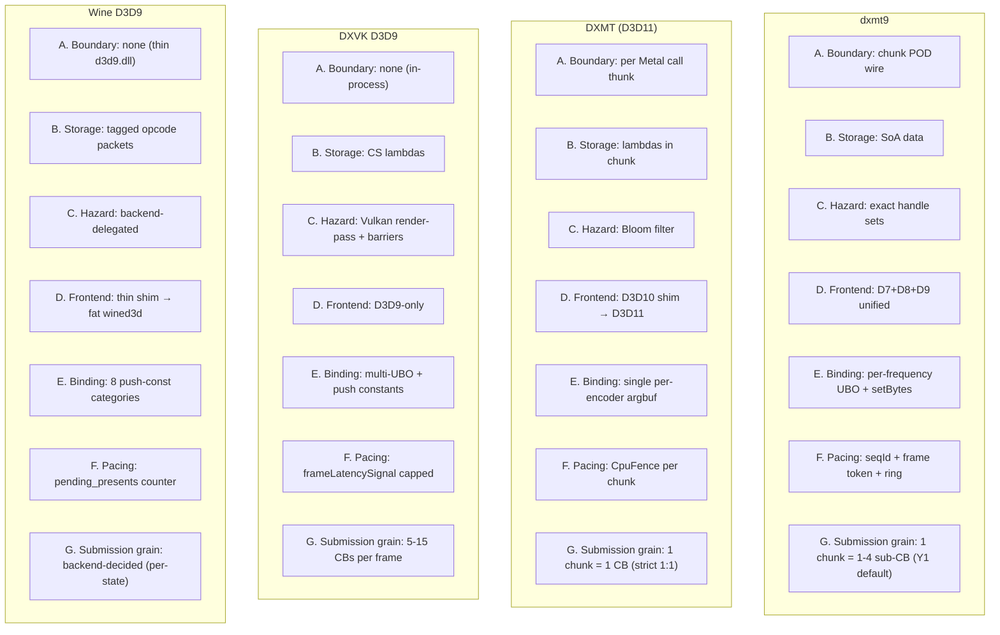
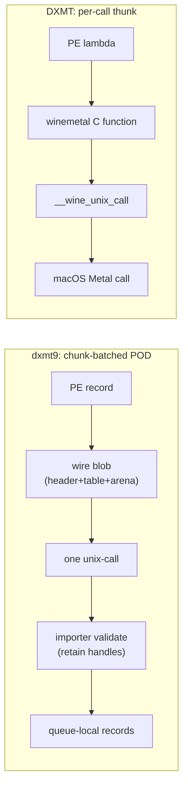
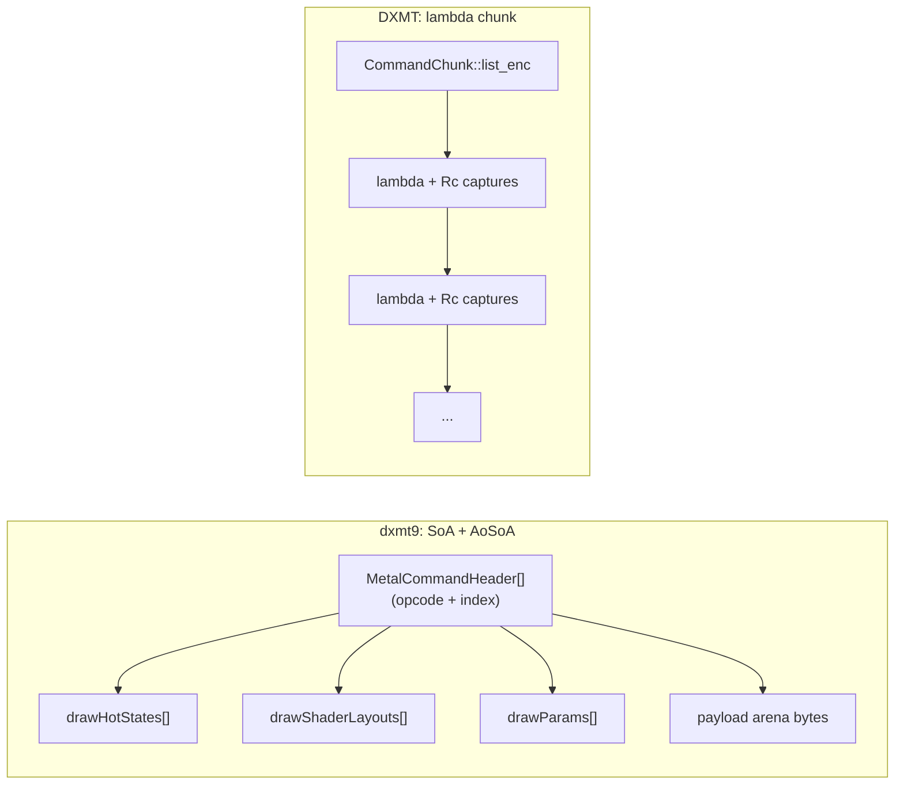
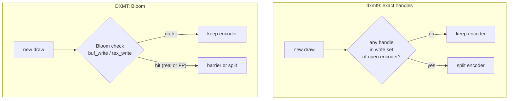
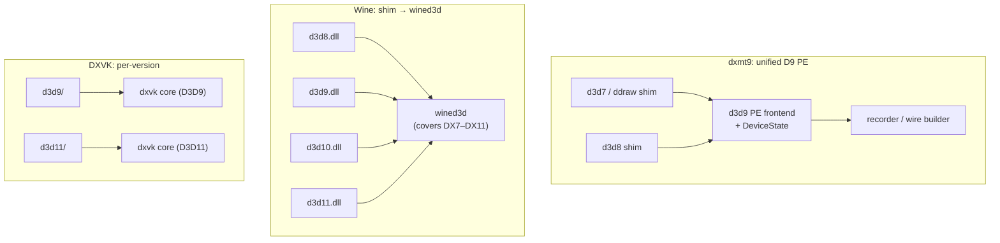
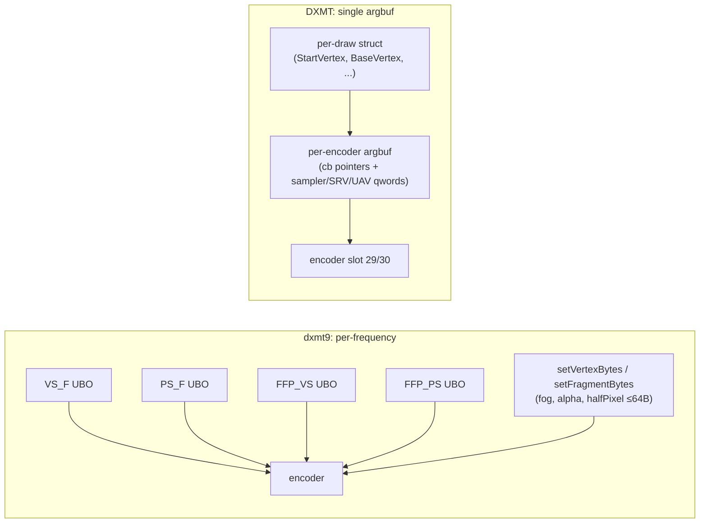
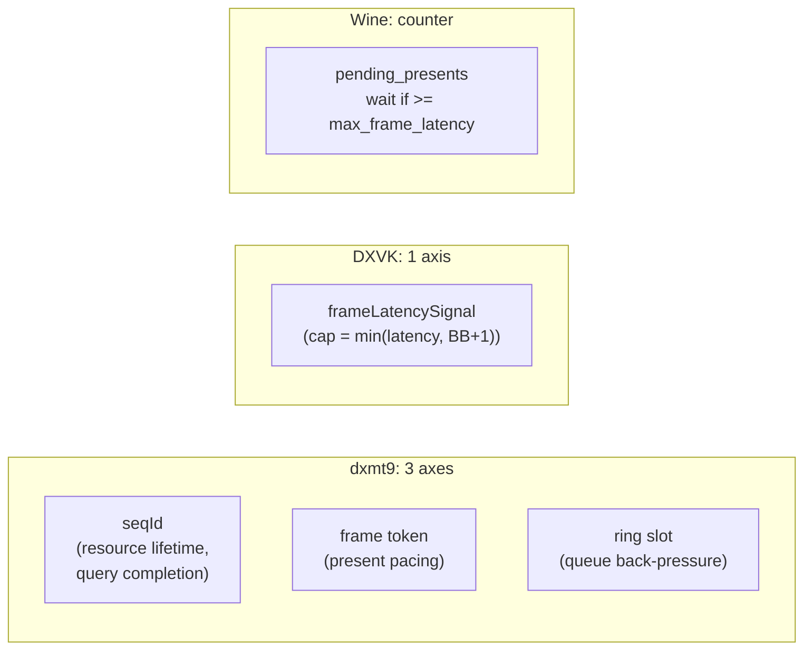
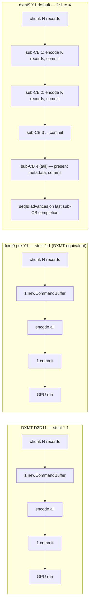

# Architecture Comparison: dxmt9 vs DXMT, DXVK D3D9, Wine D3D9

This note compares dxmt9's architectural decisions against three reference
projects, framed as concrete trade-offs (pros / cons / when each shape wins)
rather than as a documentation diff.

Sources:
- `specs/archicture/design.md` — dxmt9 architecture.
- `docs/research/dxmt.md` — DXMT (D3D11→Metal on Wine).
- `docs/research/dxvk-d3d9.md` — DXVK D3D9 (D3D9→Vulkan).
- `docs/research/wine-d3d9.md` — Wine builtin D3D9 over wined3d.

The comparison is organized along six architectural axes. dxmt9's choices on
all six rest on a single underlying bet:

> **D3D9 workloads pay more for encoder splits and fine-grained per-stage
> binding than they do for ABI-boundary work, so it pays to amortize the
> boundary in exchange for finer state and hazard control.**

If that bet is wrong for a given title (very short chunks, simple shaders,
few hazards), the DXMT shape would outperform.

---

## Axis Overview

---

## A. ABI Boundary Granularity

This is the largest architectural divergence. dxmt9 must cross a Wine PE/unix
boundary; DXMT also runs on Wine but crosses it at a different granularity;
DXVK and Wine don't cross a process boundary at all at the D3D layer.

| Project | Crosses boundary | Form |
|---|---|---|
| **dxmt9** | **per chunk** (hundreds–thousands of commands) | one POD wire blob, one unix-call |
| DXMT | **per Metal API call** | `winemetal_thunks` — thin C-ABI marshal |
| DXVK | n/a | direct Vulkan calls |
| Wine D3D9 | n/a (boundary lives below wined3d backends) | — |

**Pros (dxmt9 batched POD)**
- syscall and marshal cost is bounded by chunk count, not draw count. A
  5000-draw frame still pays O(chunks/frame) boundary work.
- single validation gate on the unix side; PE side never holds Metal/macOS
  pointers, simplifying reset/lost-device.
- payload is already a serialized form → free to dump, hash, replay → strong
  test and TLA+ story.

**Cons**
- two memory hops: PE record → wire blob → queue-local. Memory bandwidth cost.
- versioned schema with offset/size validation. Adding a new command touches
  PE producer, wire layout, importer, encoder.
- the importer is a single hot path. Bugs there block everything.

**Trade-off shape**
DXMT's per-call thunk wins when per-frame Metal-call count is low (D3D11 +
argbuf bind once + setBufferOffset per draw). D3D9 has more, smaller Metal
calls (FFP, frequent state churn, smaller draws), so the per-chunk amortization
matters more than the boundary's per-call cost.

---

## B. Command Storage: Code vs Data

| Project | Form | Dispatch |
|---|---|---|
| **dxmt9** | **SoA arrays per command type + header indexing** | switch on opcode |
| DXMT | C++ lambdas placement-new'd into `cpu_command_allocator` ring | direct lambda call |
| DXVK | polymorphic CS command objects | virtual dispatch |
| Wine D3D9 | tagged opcode packets, POD bodies | switch on tag |

**Pros (dxmt9 SoA)**
- POD storage is naturally serializable for the PE/unix boundary, hashable
  for cache keys, dump-able for debugging.
- dependency information lives in explicit handle tables, not hidden inside
  lambda captures → analyzable, testable, makes axis C's exact hazard model
  feasible.
- replay loop is cache-friendly in theory; type-erased dispatch is a jump
  table with no virtual call overhead.

**Cons (implementer-facing, not user-facing)**
- adding a new command shape costs ~4–5 sites: opcode enum, record array,
  wire schema, importer arm, encoder arm. **This is implementer overhead;
  it does not affect runtime performance.** New command kinds are rare events
  (~10 total for full D3D9 coverage: DrawRun, Clear, Copy, StretchRect,
  ColorFill, Readback, Present, Query, Resolve, Marker).
- variable-size payloads (UP data, vertex/index buffers) need a payload arena
  with offset/size discipline.
- arrays can become sparse if a command type appears once per frame —
  capacity is reserved but unused.

**End-user-visible perf impact: small in isolation.**
The SoA-vs-lambda choice on its own moves frame time very little. Both forms
avoid hot-path heap allocation; both keep storage in chunked allocators with
warm i-cache for the dominant command type per frame; both dispatch through
a single function-pointer indirection. Theoretical cache-locality wins exist
but are sub-millisecond on typical encode loops.

**The real value of SoA is as an enabler.** It is what makes the other axes'
choices buildable in their stated form:

| Other axis | Why SoA enables it |
|---|---|
| A. chunk POD wire | SoA is already the serialized shape; lambdas would need conversion |
| C. exact hazard | dependency handles are explicit fields, not opaque lambda captures |
| E. per-frequency binding | dirty-mask × category gating is natural over typed record arrays |

The causal chain for end users is:
**chunk POD boundary + exact hazard + per-frequency binding → faster frames.**
SoA is chosen because it is the natural form to build those three on; not
because the storage shape itself is faster.

**Trade-off shape**
Lambdas are the lowest-friction way for an implementer to add a new command
(DXMT's whole point). dxmt9 accepts the higher per-command implementation
cost in exchange for a storage form that aligns with axes A, C, and E. If
those three axes were not chosen the way they are, lambdas would be the
right answer.

---

## C. Hazard Tracking

| Project | Model | Cost | Precision |
|---|---|---|---|
| **dxmt9** | **exact read/write handle sets per encoder** | O(set size) per registration | exact |
| DXMT | `PartitionedBloomFilter64<16>` × {buf,tex} × {r,w} | O(1) constant | probabilistic, false positives |
| DXVK | Vulkan render-pass compatibility + explicit barriers | driver-delegated | exact |
| Wine D3D9 | (none at this layer; backend-delegated) | — | — |

**Pros (dxmt9 exact)**
- zero false positives → no spurious encoder splits → maximum render-pass
  merging → fewer load/store transitions on tile GPUs.
- "encoder split count" is a clean regression signal. Bloom can't give you
  that — a split could be real or false-positive.
- debuggable: when a split happens, you know exactly which handle caused it.

**Cons**
- per-encoder memory grows with handle count. DXMT's Bloom is fixed ~32 B
  per filter regardless of workload.
- registration cost is O(set size); Bloom is O(k) for k hash functions.
- handle hashing must be cheap and correct. Cannot use PE COM pointers
  (process-local, not stable) — must use retained backend handles.

**Trade-off shape**
For tile-based GPUs (Apple Silicon), every encoder split costs a tile flush.
False positives hurt. For workloads with many resources where most
"may-conflict" Bloom hits are real anyway, Bloom's constant memory might win
on the CPU side. **The bet here is that GPU-side savings from zero FP exceed
CPU-side cost of exact set management.** Worth verifying on real titles.

---

## D. Frontend Layer Ownership

| Project | Shape |
|---|---|
| **dxmt9** | **D7 + D8 + D9 forwarded to a single PE frontend**; one DeviceState |
| DXMT | D3D10 shim → D3D11 (one-level shim) |
| DXVK | D3D9-only; D3D11 is a separate project |
| Wine D3D9 | thin `d3d9.dll` forwarder → fat `wined3d` (covers all D3D versions) |

**Pros (dxmt9 unified)**
- one validation surface, one state machine, one test matrix. D7/D8 paths
  inherit DXMT-style queue ownership for free.
- caps differences across D7/D8/D9 are a single capability matrix.

**Cons**
- the D9 PE frontend grows to absorb D7/D8 quirks (ddraw clipper, palette
  formats, surface flips). D9-only conformance refactors carry D7/D8
  regression risk.
- shim isolation (DXMT's D3D10→D3D11 boundary) would have prevented that
  leakage.

**Trade-off shape**
Wine sits at one extreme (one wined3d for everything), DXVK at the other
(D9 and D11 fully separate). dxmt9 is mid-table, leaning toward unification.
The bet: shared queue/encoder ownership wins outweigh the cost of having
D7-era concepts visible in D9 frontend code.

---

## E. Resource Binding Strategy

| Project | Model | Slots |
|---|---|---|
| **dxmt9 (planned)** | **per-frequency UBO + `setVertexBytes`/`setFragmentBytes`** | multiple slots + push |
| DXMT | one per-encoder argument buffer | slot 29 (cb table), slot 30 (resources) |
| DXVK | multi-UBO + Vulkan push constants (~60 B) | VS 0–5, PS 0–2, push |
| Wine D3D9 | 8 push-constant categories with dirty bitmask; SPIRV bakes offsets at compile time | per-category |

**Pros (dxmt9 per-frequency)**
- "VS dirty only" — a common case — skips the PS upload entirely. DXMT's
  monolithic argbuf re-encodes the whole stage table.
- ≤64 B scalars (fog color, alpha ref, half-pixel offset, vertex base) bypass
  the per-frame ring entirely via `setBytes`.
- SM 1–3 has no DXBC reflection pipeline equivalent to DXMT's
  `MTL_SHADER_REFLECTION`. Building per-frequency UBOs avoids needing one.

**Cons**
- per draw, dxmt9 issues N `setBufferOffset` calls vs DXMT's effective 1.
  Inside the encoder this is more API traffic (the chunk boundary
  amortizes only the PE/unix crossing, not the encoder→Metal calls).
- the dirty mask × stage × kind matrix grows with each new uniform category.

**Trade-off shape**
DXMT's single-argbuf design is shaped by D3D11 binding semantics and is the
right answer when per-draw work is dominated by "rebind the whole stage
table." D3D9's `D3D9FixedFunctionVS` (~1.5 KB) and `D3D9FixedFunctionPS`
(~32 B) are dramatically different sizes and update at different frequencies
— bundling them into one argbuf wastes bandwidth.

---

## F. Frame Pacing and Synchronization Tokens

| Project | Tokens | Pacing policy |
|---|---|---|
| **dxmt9** | **seqId + frame token + ring back-pressure** | three independent axes |
| DXMT | `CpuFence` per chunk | implicit via ring depth |
| DXVK | `frameLatencySignal` | `min(maxFrameLatency, BackBufferCount + 1)` |
| Wine D3D9 | `pending_presents` counter + `present_event` | wait only when over limit |

**Pros (dxmt9 three axes)**
- resource lifetime, present pacing, and queue back-pressure are decoupled.
  A query/readback wait does not block present, and vice versa. Independence
  is normative (`R-ARCH-6.8`) and observable via per-axis wait counters
  (`R-ARCH-6.9`); the only relation between the two seqId timelines is the
  ordering invariant `presentCompletedSeqId ≤ completedSeqId`.
- maps cleanly onto separate TLA+ models (`PresentFrameLatency.tla`,
  `QuerySeqId.tla`, `CommandQueue.tla`), each modelling one progress signal,
  **plus the composite `ConcurrentProgressSignals.tla` which directly proves
  the three independence liveness properties** (`NoQueryWaitBlocksPresent`,
  `NoFrameLatencyBlocksQuery`, `NoRingPressureBlocksPresentCompletion`).
  Independence is **formally verified**, not just stated.

**Cons**
- three tunables (ring depth, max frame latency, back-buffer count) with
  cross-effects. Performance tuning has more knobs.
- larger formal verification surface — three liveness properties to maintain
  in the composite model on top of the per-axis safety invariants.

**Trade-off shape**
Wine's single counter is the simplest correct model and works because Wine
defers most lifetime concerns to the backend. DXVK adds a frame-latency cap
because D3D9 explicitly defines `SetMaximumFrameLatency`. dxmt9 splits
further because D3D9 query/readback is frequent and tying queries to present
pacing would create unnecessary stalls. The independence rule makes the
common pattern "stalled occlusion query during a heavy frame" not regress
present pacing — a coupling that an implementer might add accidentally if
the spec only stated the ordering invariant.

---

## G. Submission Grain (Per-Chunk Command-Buffer Count)

This axis was **implicit / not surfaced** in earlier revisions of this
document. The SFIV measurement (2026-05-10, see
`docs/perfomance-bottleneck.md`) made it visible as a **standalone
bottleneck independent of the F axis pacing decisions**.

| Project | Chunk : CB mapping | Per-frame CBs (typical) | Producer ↔ consumer queue | Notes |
|---|---|---|---|---|
| **dxmt9 (pre-Y1)** | 1 : 1 | 1 per chunk × chunks/frame | encode-thread single-producer; `splitBeforeBlockingPresent()` was the lone exception | implicit invariant; not stated in R-BACK-2 |
| **dxmt9 (Y1 default, R-BACK-2.34)** | 1 : 1-4 | 4 per chain (cap=4) × chunks/frame | unchanged single-producer; sub-CB chain shares one seqId | R-BACK-2.29..2.34 |
| DXMT (D3D11) | **1 : 1** (verified `dxmt_command_queue.cpp:135-141`) | 1 per chunk × chunks/frame | encode + finish threads, single-producer queue | NO sub-CB split anywhere in source; chunk-level ring of 32 slots |
| DXVK | 1 : N (per-frame submission split) | 5-15 per frame at semantic boundaries | single-producer / single-consumer (CSThread) | each `vkQueueSubmit` carries one VkCommandBuffer |
| Wine | n/a (no chunk concept) | backend-decided (per-state-change-ish) | one opcode per D3D9 call | wined3d does not chunk |

**dxmt9 Y1 is more aggressive than DXMT on this axis** — DXMT keeps
strict 1 chunk = 1 CB, dxmt9 chains up to 4 sub-CBs per chunk. The G
axis is therefore a dxmt9-original divergence, not a DXMT borrowing.
(An earlier revision of this table claimed DXMT had a "submission
slot chain" with N CBs per logical batch; that was wrong. DXMT's
`CommandChunk::encode` runs the chunk's entire `list_enc.execute(enc)`
into one CB, which is then committed once.)

### Why dxmt9 went past DXMT here

Single-CB-per-chunk forces encode CPU and GPU execute time to add to
the frame budget rather than overlap. SFIV measurement (P1, U1, BB1
in `docs/sfiv-benchmark-measurement.md`):

- P1 (1:1, DXMT-equivalent shape): 13.25 fps, encode 69 ms ≈ GPU 69
  ms ≈ frame budget. Each phase consumed roughly the whole budget,
  neither hid the other.
- BB1 (1:1-to-4, Y1 default): 19.77 fps (+49%), encode 41 ms, GPU
  per-CB 45 ms. The chain's leading sub-CBs run on GPU while the
  encode thread is still building the chain tail.

This is decoupled from F-axis pacing: dxmt9's 3-axis model
(seqId / frame token / ring slot, R-ARCH-6) already permits one
seqId to span N sub-CBs as long as `completedSeqId` advances only
when the chain's last CB completes (R-BACK-2.29). The present-frame-
token axis only advances on the present-bearing sub-CB (the chain's
tail per R-BACK-2.30), so frame pacing is unchanged.

### Why DXMT didn't go this way (and what we know)

DXMT chose the simpler 1:1 mapping. The likely D3D11 reasons (we
have not seen this written down anywhere; this is inference, not
fact):

- D3D11 chunks are larger and more uniform than D3D9 chunks under
  the dxmt9 chunk-record model, so the per-chunk encode + GPU phases
  are already roughly equal-sized.
- Apple Silicon TBDR penalty for small CBs (tile flush per commit) is
  steeper as a fraction of total cost on the simpler / smaller D3D11
  draws DXMT mainly targets — see `docs/research/g-axis-tuning.md`
  cost model.
- D3D11 fence model is single-event-per-CpuFence; dxmt9's sub-CB
  chain reuses dxmt9's seqId / frame-token decoupling.

dxmt9 only wins here because it has different counters as objectives
(D3D9 chunks are smaller and more numerous) and the 3-axis pacing
provides cheap support for the chain.

### dxmt9's chosen position

| Element | dxmt9 keeps | dxmt9 borrows from DXMT | dxmt9-original |
|---|---|---|---|
| Wire format | chunk POD (R-BACK-2.18) | — | yes (PE/unix Wine boundary) |
| Storage shape | SoA data (R-BACK-2.21) | — | yes |
| Submission grain | — | — | **yes** (R-BACK-2.29..2.34) |
| Fence model | one seqId per chunk (R-BACK-2.13) | basic chunk-fence shape | extended for sub-CB chain |
| Queue model | single-producer encode thread | encode + finish thread split, ring back-pressure | yes (3-axis pacing on top) |
| Hazard tracking | exact sets (R-BACK-2.28) | — | yes (DXMT uses Bloom) |

See R-BACK-2.29..2.34 in `specs/backend/requirements.md` for the
contract and `docs/research/dxmt.md` "Submission Model (G axis)" for
the corrected DXMT source survey.

---

## Summary Table

| Axis | dxmt9 | DXMT | DXVK | Wine |
|---|---|---|---|---|
| A. Boundary | **chunk POD** | per-call thunk | none | none |
| B. Storage | **SoA data** | lambdas | lambdas | tagged opcodes |
| C. Hazard | **exact sets** | Bloom | Vulkan-native | backend |
| D. Frontend | **D7+D8+D9 unified** | D10→D11 shim | D9-only | thin → wined3d |
| E. Binding | **per-frequency + push** | single argbuf | multi-UBO + push | 8 categories |
| F. Pacing | **3 axes** | CpuFence | frameLatencySignal | counter |
| G. Submission grain | **1 chunk → 1-4 sub-CB** (Y1 default) | 1 chunk → 1 CB (strict 1:1) | 5-15 CBs/frame at semantic boundaries | backend-decided |

Bold cells are dxmt9's choices. Each is a deliberate divergence justified by
D3D9 workload characteristics (small/many Metal calls, FFP, frequent
queries, hazard-sensitive tile GPUs) rather than by following the closest
reference (DXMT) point-by-point.

**Where end-user-visible perf actually comes from.** Not every axis moves the
needle for users:

| Axis | End-user impact | Notes |
|---|---|---|
| A. Boundary | **High** | bounds CPU submission cost on draw-heavy frames |
| B. Storage | **Low (direct); High (indirect)** | enables A/C/E; storage form alone is sub-millisecond |
| C. Hazard | **High** | encoder splits → tile flushes → frame time on Apple Silicon |
| D. Frontend | **Low** | code organization; no hot-path effect |
| E. Binding | **Medium-to-High** | per-draw upload bytes on memory-BW-bound titles |
| F. Pacing | **Medium** | stutter / spike control on query-heavy titles |
| G. Submission grain | **High** | hides GPU lead time under CPU encode; SFIV 13fps → projected ~20fps after split |

Axis B is unusual: the storage shape itself is roughly perf-neutral vs the
lambda alternative, but it is the form that makes the high-impact axes
(A, C, E) buildable as designed. The "new command addition is heavier" cost
on axis B is implementer-facing, not end-user-facing, and is paid roughly
ten times across the project's lifetime.

---

## When the Bet Could Fail

The dxmt9 architecture is shaped by one hypothesis: **D3D9 workloads pay more
for fine-grained encoder/binding decisions than they do for the ABI boundary
work needed to enable them.** The architecture would be sub-optimal if a real
title exhibits any of:

| Signal | Implication |
|---|---|
| chunk commits per frame approach D3D9 call count | per-call thunk model (DXMT) would be lighter |
| encoder split count near zero regardless of model | exact hazard tracking is wasted; Bloom would do |
| single shader, single render target, simple FFP | unified argbuf would be simpler than per-frequency |
| query/readback usage near zero | three-axis pacing is over-engineered |
| D7/D8 usage near zero | D9-only frontend (DXVK shape) would be cleaner |
| `encode_chunk_cpu_ms` and `completion_wait_ms` persistently equal at frame budget | single-CB-per-chunk is the bottleneck; G-axis multi-CB target is mandatory (SFIV 2026-05-10 measurement falsifies the implicit "1 chunk = 1 CB" choice) |

These are all observable. The benchmark and counter design in
`specs/archicture/design.md` §7 already enumerates the relevant signals
(`bridge ops/frame`, `encoder split count`, `pre-acquire wait`, etc.) so the
hypothesis can be falsified with evidence rather than assumed.

---

## See Also

- `specs/archicture/design.md` — authoritative dxmt9 architecture.
- `docs/research/dxmt.md` — DXMT reference notes.
- `docs/research/dxvk-d3d9.md` — DXVK D3D9 reference notes.
- `docs/research/wine-d3d9.md` — Wine D3D9 reference notes.
- `docs/perfomance-bottleneck.md` — DrawUniforms split planning, where axis E
  lands in implementation terms.
