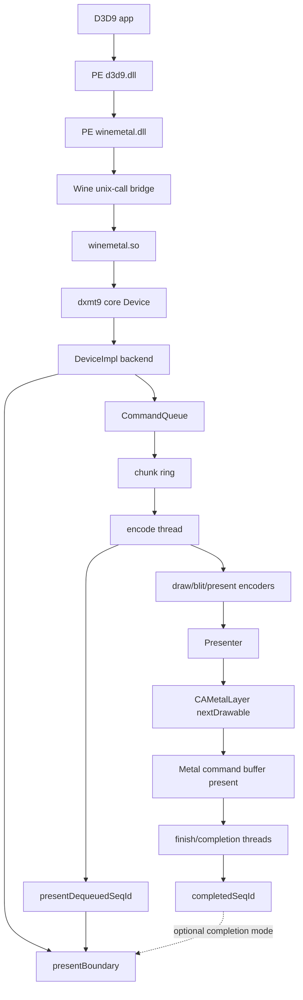
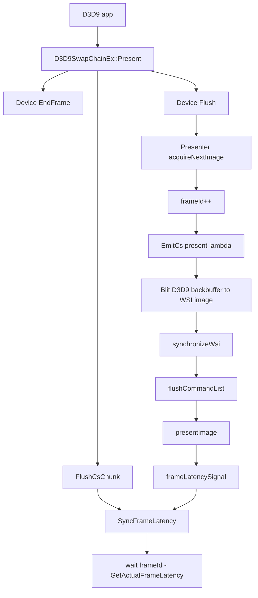
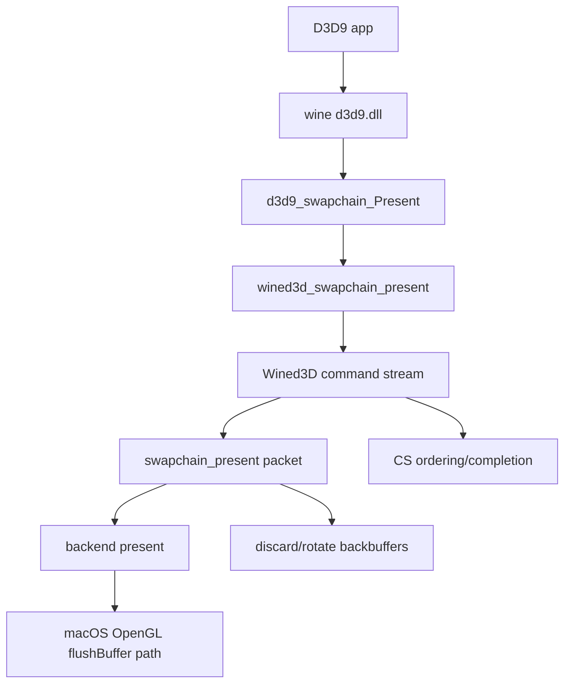

# DXMT9 Performance Bottleneck Notes

Date: 2026-04-26

Scope:

- macOS Wine D3D9 path, with dxmt9 PE `d3d9.dll` + PE `winemetal.dll` + unix `winemetal.so`.
- Main references: `~/workspaces/dxvk`, `~/workspaces/wine`, current repo experiment results under `experiments/output`.
- This document keeps the current file spelling, `perfomance-bottleneck.md`, to match the existing path.

## Current dxmt9 Shape

Important current behavior:

- `DeviceImpl::present()` submits present, then applies immediate-present latency boundary unless disabled or vsync path already flushes.
- `CommandQueue::presentBoundary()` waits for `presentSeqId - maxFrameLatency`.
- Default `maxFrameLatency` is currently `3`; experiment override `DXMT9_MAX_FRAME_LATENCY=4` improved both BasicHLSL and Tutorial07.
- `DXMT9_DISABLE_PRESENT_BOUNDARY=1` improves elapsed time in BasicHLSL but does not encode all submitted presents, so it is not a safe fix.

## DXVK D3D9 Shape

Observed DXVK rule:

- `PresentImage()` acquires WSI image first, emits present work to the CS thread, flushes the CS chunk, then calls `SyncFrameLatency()`.
- `GetActualFrameLatency()` caps latency by device latency and `BackBufferCount + 1`.
- The wait is a frame-latency fence rule, not a blanket "wait until this present is fully idle" rule.

Local reference points:

- `~/workspaces/dxvk/src/d3d9/d3d9_swapchain.cpp`
- `~/workspaces/dxvk/src/dxvk/dxvk_presenter.cpp`

## Wine D3D9 Shape

Observed Wine-DX9 rule:

- D3D9 present is forwarded to Wined3D swapchain present.
- Wined3D routes present through its command stream, then the backend present path performs the platform-specific swap/flush.
- The app-facing D3D9 layer is not expected to synchronously perform all GPU completion for every immediate present.

Local reference points:

- `~/workspaces/wine/dlls/d3d9`
- `~/workspaces/wine/dlls/wined3d`

## Assumptions

- The current oracle named `vanilla` is Wine builtin D3D9, not a native Windows/D3D9 hardware oracle.
- FPS is measured from app log frame count divided by process elapsed time in `scripts/run_experiment.py`.
- The tested SDK samples are simple immediate-present workloads; they amplify present pacing and next-drawable waits more than heavy shader or draw workloads.
- SSIM below 1.0 is accepted by the current harness threshold, but it still means there is remaining visual delta versus the stored reference.
- `present_acquire_wait_ms` includes time blocked around CAMetalLayer drawable acquisition.
- `present_boundary_wait_ms` measures CPU-side wait imposed by dxmt9's present latency boundary.
- `queue_writer_wait_ms == 0` means the current measured slowdown is not primarily chunk-ring writer backpressure.
- `pipeline_builds == 2` in these samples means pipeline creation is no longer the main repeated bottleneck after the StretchRect fast path.
- `DXMT9_DISABLE_PRESENT_BOUNDARY=1` is an experiment only. It can hide wait time by allowing unencoded presents at process end.

## Results So Far

PE/Wine binding:

- Initial failing mode: `WINEDLLOVERRIDES=d3d9=b` caused Wine to reject staged `d3d9.dll` as `not a builtin`.
- Root cause: the raw PE DLLs were copied before `winebuild --builtin` postprocess was guaranteed.
- Fix added: `scripts/install_heroic_wine.sh` now runs matching Meson `.dll.postproc` targets before staging.
- Fix added: PE `d3d9.dll` and PE `winemetal.dll` are staged into both the Wine runtime and the prefix `system32` / `syswow64` locations.
- Verification: `BasicHLSL` now passes with `d3d9=b`; bridge fallback gets a valid unix-call handle.

Baseline performance, current default latency:

| app | vanilla fps | dxmt9 fps | speedup | present encoded | boundary wait ms | acquire wait ms | writer wait ms | PSO builds |
|---|---:|---:|---:|---:|---:|---:|---:|---:|
| BasicHLSL | 21.42 | 19.60 | 0.915 | 240/240 | 1107.726 | 1149.380 | 0.000 | 2 |
| Tutorial07 | 17.01 | 15.19 | 0.894 | 180/180 | 835.299 | 948.997 | 0.000 | 2 |

Latency experiment results:

| app | mode | fps | present encoded | boundary wait ms | acquire wait ms | writer wait ms |
|---|---|---:|---:|---:|---:|---:|
| BasicHLSL | default latency 3 | 19.60 | 240/240 | 1107.726 | 1149.380 | 0.000 |
| BasicHLSL | `DXMT9_MAX_FRAME_LATENCY=4` | 22.11 | 240/240 | 979.113 | 1053.542 | 0.000 |
| BasicHLSL | `DXMT9_MAX_FRAME_LATENCY=6` | 21.46 | 240/240 | 1038.101 | 1177.356 | 0.000 |
| BasicHLSL | `DXMT9_DISABLE_PRESENT_BOUNDARY=1` | 21.12 | 222/240 | 0.000 | 1213.750 | 1074.493 |
| Tutorial07 | default latency 3 | 15.19 | 180/180 | 835.299 | 948.997 | 0.000 |
| Tutorial07 | `DXMT9_MAX_FRAME_LATENCY=4` | 16.22 | 180/180 | 857.823 | 941.476 | 0.000 |

Current interpretation:

- The main measured bottleneck is present pacing: `present_acquire_wait_ms` plus `present_boundary_wait_ms`.
- The queue writer path is healthy in the default and latency-4 cases: `queue_writer_wait_ms=0`.
- The no-boundary experiment is not structurally safe because submitted present count and encoded present count diverge.
- The latency-4 experiment is the best safe result so far: it keeps all presents encoded while improving fps.
- The likely next tuning target is the exact immediate-present latency rule, not draw encoding or pipeline creation.

## Open Questions

- Should dxmt9 keep D3D9 default maximum frame latency at `3` and document `DXMT9_MAX_FRAME_LATENCY=4` as a performance override?
- Or should the backend present-boundary rule internally allow one extra queued present while preserving the public D3D9 max-latency value?
- Should `GetActualFrameLatency()` be made more DXVK-shaped by considering `BackBufferCount + 1` explicitly per swapchain?
- Are the SSIM deltas in BasicHLSL and Tutorial07 expected from color/present-path differences, or do they indicate remaining rendering correctness work?
