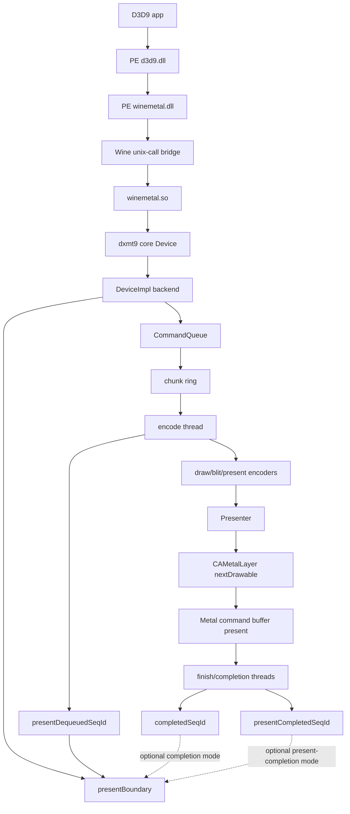
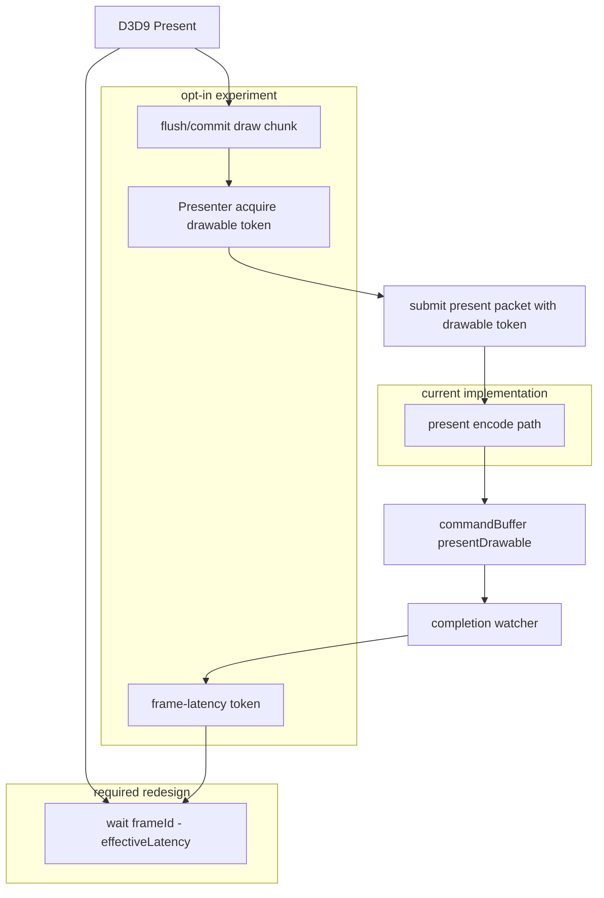
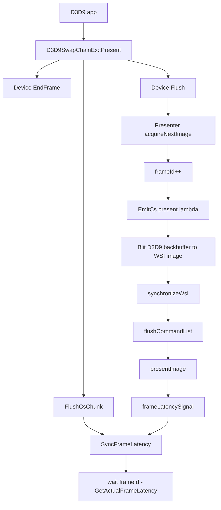
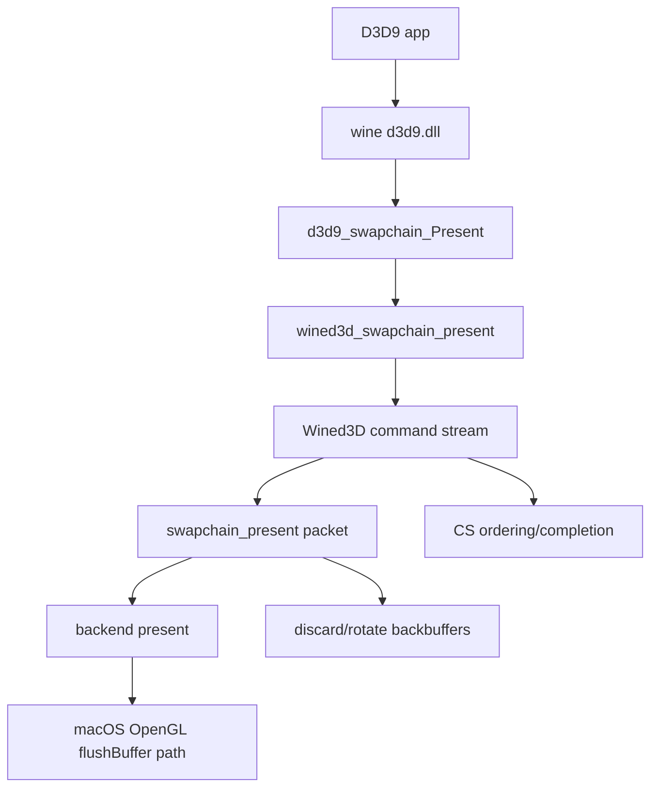

# DXMT9 Performance Bottleneck Notes

Date: 2026-04-26

Scope:

- macOS Wine D3D9 path, with dxmt9 PE `d3d9.dll` + PE `winemetal.dll` + unix `winemetal.so`.
- Main references: `~/workspaces/dxvk`, `~/workspaces/wine`, current repo experiment results under `experiments/output`.
- This document keeps the current file spelling, `perfomance-bottleneck.md`, to match the existing path.

## Current dxmt9 Shape

Important current behavior:

- `DeviceImpl::present()` submits present, then applies immediate-present latency boundary unless disabled or vsync path already flushes.
- `CommandQueue::presentBoundary()` waits for `presentSeqId - maxFrameLatency`.
- Default `maxFrameLatency` is now `4`, adopted from the best safe experiment below.
- `DXMT9_SPLIT_PRESENT_CHUNK=1` and `DXMT9_SPLIT_PRESENT_ACQUIRE=1` are experiments only. The existing split-present run was slower, so they are not defaults.
- `DXMT9_PRESENT_ACQUIRE_ON_SUBMIT=1` is also experimental. It moves drawable acquisition out of the encode worker, but the first measurement is slower because it doubles command-buffer traffic.
- `DXMT9_PRESENT_ASYNC_ACQUIRE=1` is experimental too. It is queue-owned, keeps command-buffer count stable, queues per-present drawable tokens, and serializes actual `nextDrawableRetained()` work to avoid retained-drawable hoarding.
- `DXMT9_PRESENT_BOUNDARY_PRESENT_COMPLETION=1` is experimental. It makes `presentBoundary()` wait on a present-bearing command-buffer completion watermark instead of encode-thread present dequeue.
- `DXMT9_CAP_FRAME_LATENCY_TO_BACKBUFFERS=1` is experimental. It applies the DXVK-like effective latency rule `min(appLatency, BackBufferCount + 1)` to the present boundary only.
- `DXMT9_DISABLE_PRESENT_BOUNDARY=1` improves elapsed time in BasicHLSL but does not encode all submitted presents, so it is not a safe fix.

## Target Present Path

The target is not to remove frame latency. The target is to stop using encode-thread progress as the pacing primitive. DXVK separates draw flush, WSI acquire, present submission, and frame-latency wait; dxmt9 should converge on the same shape.

Desired ownership:

- `Presenter`: owns CAMetalLayer properties, drawable acquisition state, and one outstanding drawable token per window.
- `CommandQueue`: owns chunk ordering, present packet execution, completion signaling, and frame-latency token advancement.
- `DeviceImpl`: injects public D3D9 latency value and presentation callbacks only; it should not define the acquire/boundary mechanics.
- `SwapChain`: owns the `Presenter` and passes per-present dimensions/source/backbuffer metadata.

Migration steps:

1. Do not default the existing naive split knobs. The split-present experiment increased command buffers and made Tutorial07 much slower.
2. Implemented behind `DXMT9_PRESENT_ACQUIRE_ON_SUBMIT=1`: move `nextDrawable()` out of `Presenter::encodeCommands()` into a synchronous `Presenter::acquireDrawable()` token path.
3. Implemented behind `DXMT9_PRESENT_ASYNC_ACQUIRE=1`: `CommandQueue::submitPresent()` starts drawable acquisition through a Presenter-owned acquire thread and passes a future-like token to the present packet. The current shape queues tokens for every present but allows only one retained/in-flight `nextDrawableRetained()` acquisition at a time, so the encode path no longer falls back to blocking `nextDrawable()`.
4. Do not default either token path yet. Synchronous token acquire removes boundary wait but doubles command buffers. The first async implementation could produce high peak FPS but also produced fallback-heavy runs; the current queued-token version removes fallback/spikes but is not consistently faster than default latency 4.
5. Implemented behind `DXMT9_PRESENT_BOUNDARY_PRESENT_COMPLETION=1`: add a queue-owned `presentCompletedSeqId_` watermark advanced by the completion watcher for present-bearing command buffers, and let `presentBoundary()` wait on that token.
6. Do not default completion-token boundary yet. It is structurally closer to DXVK/Wine pacing, but the first BasicHLSL run is slower than the best async-only run.
7. Implemented behind `DXMT9_CAP_FRAME_LATENCY_TO_BACKBUFFERS=1`: pass `SwapDesc::backBufferCount` from the D3D9 swapchain to the backend and cap the immediate-present boundary latency by `BackBufferCount + 1`.
8. Do not default the cap alone yet. The cap reduces max waits and helps present completion, but current samples lose FPS unless paired with queued async acquire.

## DXVK D3D9 Shape

Observed DXVK rule:

- `PresentImage()` acquires WSI image first, emits present work to the CS thread, flushes the CS chunk, then calls `SyncFrameLatency()`.
- `GetActualFrameLatency()` caps latency by device latency and `BackBufferCount + 1`.
- The wait is a frame-latency fence rule, not a blanket "wait until this present is fully idle" rule.

Local reference points:

- `~/workspaces/dxvk/src/d3d9/d3d9_swapchain.cpp`
- `~/workspaces/dxvk/src/dxvk/dxvk_presenter.cpp`

## Wine D3D9 Shape

Observed Wine-DX9 rule:

- D3D9 present is forwarded to Wined3D swapchain present.
- Wined3D routes present through its command stream, then the backend present path performs the platform-specific swap/flush.
- The app-facing D3D9 layer is not expected to synchronously perform all GPU completion for every immediate present.

Local reference points:

- `~/workspaces/wine/dlls/d3d9`
- `~/workspaces/wine/dlls/wined3d`

## Assumptions

- The current oracle named `vanilla` is Wine builtin D3D9, not a native Windows/D3D9 hardware oracle.
- FPS is measured from app log frame count divided by process elapsed time in `scripts/run_experiment.py`.
- The tested SDK samples are simple immediate-present workloads; they amplify present pacing and next-drawable waits more than heavy shader or draw workloads.
- SSIM below 1.0 is accepted by the current harness threshold, but it still means there is remaining visual delta versus the stored reference.
- `present_acquire_wait_ms` includes time blocked around CAMetalLayer drawable acquisition.
- `present_boundary_wait_ms` measures CPU-side wait imposed by dxmt9's present latency boundary.
- `queue_writer_wait_ms == 0` means the current measured slowdown is not primarily chunk-ring writer backpressure.
- `pipeline_builds == 2` in these samples means pipeline creation is no longer the main repeated bottleneck after the StretchRect fast path.
- `DXMT9_DISABLE_PRESENT_BOUNDARY=1` is an experiment only. It can hide wait time by allowing unencoded presents at process end.

## Results So Far

PE/Wine binding:

- Initial failing mode: `WINEDLLOVERRIDES=d3d9=b` caused Wine to reject staged `d3d9.dll` as `not a builtin`.
- Root cause: the raw PE DLLs were copied before `winebuild --builtin` postprocess was guaranteed.
- Fix added: `scripts/install_heroic_wine.sh` now runs matching Meson `.dll.postproc` targets before staging.
- Fix added: PE `d3d9.dll` and PE `winemetal.dll` are staged into both the Wine runtime and the prefix `system32` / `syswow64` locations.
- Verification: `BasicHLSL` now passes with `d3d9=b`; bridge fallback gets a valid unix-call handle.

Baseline performance, previous default latency 3:

| app | vanilla fps | dxmt9 fps | speedup | present encoded | boundary wait ms | acquire wait ms | writer wait ms | PSO builds |
|---|---:|---:|---:|---:|---:|---:|---:|---:|
| BasicHLSL | 21.42 | 19.60 | 0.915 | 240/240 | 1107.726 | 1149.380 | 0.000 | 2 |
| Tutorial07 | 17.01 | 15.19 | 0.894 | 180/180 | 835.299 | 948.997 | 0.000 | 2 |

Latency experiment results:

| app | mode | fps | present encoded | boundary wait ms | acquire wait ms | writer wait ms |
|---|---|---:|---:|---:|---:|---:|
| BasicHLSL | previous default latency 3 | 19.60 | 240/240 | 1107.726 | 1149.380 | 0.000 |
| BasicHLSL | new default latency 4 | 22.11 | 240/240 | 979.113 | 1053.542 | 0.000 |
| BasicHLSL | `DXMT9_MAX_FRAME_LATENCY=6` | 21.46 | 240/240 | 1038.101 | 1177.356 | 0.000 |
| BasicHLSL | `DXMT9_DISABLE_PRESENT_BOUNDARY=1` | 21.12 | 222/240 | 0.000 | 1213.750 | 1074.493 |
| Tutorial07 | previous default latency 3 | 15.19 | 180/180 | 835.299 | 948.997 | 0.000 |
| Tutorial07 | new default latency 4 | 16.22 | 180/180 | 857.823 | 941.476 | 0.000 |

Present-path redesign experiments:

| app | mode | fps | present encoded | boundary wait ms | acquire wait ms | command buffers | note |
|---|---|---:|---:|---:|---:|---:|---|
| BasicHLSL | `DXMT9_PRESENT_ACQUIRE_ON_SUBMIT=1` | 19.11 | 240/240 | 0.000 | 681.102 | 484 | Not a default: lower waits, but worse elapsed time from extra command-buffer work. |
| BasicHLSL | `DXMT9_PRESENT_ASYNC_ACQUIRE=1`, queue-owned one outstanding | 24.76 | 240/240 | 72.611 | 95.369 | 245 | Promising rerun: stable command-buffer count and much lower present waits. One previous run still showed a 1s spike. |
| BasicHLSL | `DXMT9_PRESENT_ASYNC_ACQUIRE=1 DXMT9_PRESENT_BOUNDARY_PRESENT_COMPLETION=1` | 21.86 | 240/240 | 90.649 | 121.087 | 245 | Structurally closer completion-token boundary; slower than the best async-only run, but no 1s wait spike in this run. |
| Tutorial07 | `DXMT9_PRESENT_ASYNC_ACQUIRE=1`, queue-owned one outstanding | 18.35 | 180/180 | 49.298 | 56.040 | 185 | Promising: faster than vanilla Wine-DX9 in this run. |
| Tutorial07 | `DXMT9_PRESENT_ASYNC_ACQUIRE=1 DXMT9_PRESENT_BOUNDARY_PRESENT_COMPLETION=1` | 18.31 | 180/180 | 58.596 | 62.770 | 185 | Roughly equal to async-only; validates the completion watermark path without extra command buffers. |
| Tutorial07 | split-present experiment | 7.69 | 179/179 | n/a | 4892.999 | 364 | Not a default: naive split was much slower. |

Same-load rerun after split counters and queued-token async acquire:

| app | mode | fps | present encoded | issued/fallback tokens | boundary wait ms | acquire wait ms | token wait ms | command buffers | note |
|---|---|---:|---:|---:|---:|---:|---:|---:|---|
| BasicHLSL | current default latency 4 | 20.31 | 240/240 | 0/0 | 1554.455 | 1678.596 | 0.000 | 245 | Baseline for this machine-load window. |
| BasicHLSL | old async busy-fallback run | 8.57 | 240/240 | 50/190 | 16945.275 | 17595.923 | 130.215 | 245 | Confirms fallback path can reintroduce 1s stalls. |
| BasicHLSL | queued-token async | 18.76 | 240/240 | 240/0 | 1515.808 | 1778.592 | 1716.275 | 245 | Stable, no fallback, but token wait replaces encode-side acquire wait. |
| BasicHLSL | queued-token async + present-completion boundary | 19.36 | 240/240 | 240/0 | 1517.065 | 1773.489 | 1706.433 | 245 | Slightly better than queued-token async in this run. |
| Tutorial07 | current default latency 4 | 15.32 | 177/180 | 0/0 | 1364.586 | 1496.152 | 0.000 | 183 | Baseline in this machine-load window. |
| Tutorial07 | queued-token async | 15.33 | 180/180 | 180/0 | 940.930 | 1150.781 | 1112.201 | 185 | Similar fps, but all presents encode and max waits drop below 36ms. |
| Tutorial07 | queued-token async + present-completion boundary | 15.64 | 180/180 | 180/0 | 1199.710 | 1375.766 | 1332.689 | 185 | Slightly faster in this run, but waits are higher than queued-token async. |

Effective latency cap experiment, same-load follow-up:

| app | mode | fps | present encoded | issued/fallback tokens | boundary wait ms | acquire wait ms | token wait ms | command buffers | note |
|---|---|---:|---:|---:|---:|---:|---:|---:|---|
| BasicHLSL | default latency 4 | 20.31 | 240/240 | 0/0 | 1554.455 | 1678.596 | 0.000 | 245 | Reference from same-load window. |
| BasicHLSL | `DXMT9_CAP_FRAME_LATENCY_TO_BACKBUFFERS=1` | 17.57 | 240/240 | 0/0 | 1595.597 | 1783.629 | 0.000 | 245 | Lower max waits, lower FPS. Not a standalone default. |
| BasicHLSL | queued-token async | 18.76 | 240/240 | 240/0 | 1515.808 | 1778.592 | 1716.275 | 245 | Stable but not faster than default. |
| BasicHLSL | queued-token async + latency cap | 20.28 | 240/240 | 240/0 | 750.028 | 823.347 | 768.195 | 245 | Best opt-in combo for BasicHLSL in this window; roughly ties default FPS while halving wait totals. |
| Tutorial07 | default latency 4 | 15.32 | 177/180 | 0/0 | 1364.586 | 1496.152 | 0.000 | 183 | Some presents did not encode before process end. |
| Tutorial07 | `DXMT9_CAP_FRAME_LATENCY_TO_BACKBUFFERS=1` | 14.32 | 180/180 | 0/0 | 1115.769 | 1187.320 | 0.000 | 185 | Safer completion and lower max waits, but lower FPS. |
| Tutorial07 | queued-token async | 15.33 | 180/180 | 180/0 | 940.930 | 1150.781 | 1112.201 | 185 | Stable present count. |
| Tutorial07 | queued-token async + latency cap | 16.33 | 180/180 | 180/0 | 664.172 | 704.405 | 671.604 | 185 | Best opt-in combo for Tutorial07 in this window. |

Present policy repeated A/B, 3 runs per app/mode:

- Harness: `scripts/run_dx9_present_policy_ab.py --runs 3 --tag 20260426-present-policy-r3`
- Output: `experiments/output/dx9-present-policy-ab/20260426-present-policy-r3/summary.md`

| app | mode | pass | fps mean [min,max] | present encoded mean | fallbacks mean | boundary wait ms mean | acquire wait ms mean | token wait ms mean | command buffers mean |
|---|---|---:|---:|---:|---:|---:|---:|---:|---:|
| BasicHLSL | default | 3/3 | 20.78 [19.55, 22.00] | 240.0 | 0.0 | 1065.418 | 1176.668 | 0.000 | 245.0 |
| BasicHLSL | queued-token async | 3/3 | 21.50 [20.66, 21.92] | 240.0 | 0.0 | 1009.216 | 1184.615 | 1121.129 | 245.0 |
| BasicHLSL | queued-token async + latency cap | 3/3 | 21.73 [21.58, 21.94] | 240.0 | 0.0 | 963.009 | 1108.349 | 1042.976 | 245.0 |
| Tutorial07 | default | 3/3 | 15.58 [13.37, 16.76] | 180.0 | 0.0 | 901.246 | 1001.165 | 0.000 | 185.0 |
| Tutorial07 | queued-token async | 3/3 | 15.87 [14.77, 16.68] | 180.0 | 0.0 | 573.846 | 682.392 | 638.290 | 185.0 |
| Tutorial07 | queued-token async + latency cap | 3/3 | 16.41 [16.18, 16.65] | 180.0 | 0.0 | 853.892 | 971.094 | 931.594 | 185.0 |

Broader present policy A/B, 3 runs per app/mode:

- Harness: `scripts/run_dx9_present_policy_ab.py --runs 3 --timeout 45 --app dx-sdk-basichlsl --app dx-sdk-tutorial07 --app dxut-simple-sample --app irrlicht-managed-lights --app dxmt9-water-rt --app dxmt9-multitexture-terrain --tag 20260426-present-policy-broad-r3`
- Output: `experiments/output/dx9-present-policy-ab/20260426-present-policy-broad-r3/summary.md`
- Result: 54/54 runs passed.
- HDR follow-up: `scripts/run_dx9_present_policy_ab.py --runs 3 --timeout 45 --app dx-sdk-hdrformats --tag 20260426-hdrformats-present-policy-r3`
- HDR output: `experiments/output/dx9-present-policy-ab/20260426-hdrformats-present-policy-r3/summary.md`
- HDR result: 9/9 runs passed. The previous apparent hang did not reproduce under the explicit timeout/debug lane.

| app | default fps | queued-token async fps | queued-token async + latency cap fps | best mode | async+cap vs default |
|---|---:|---:|---:|---|---:|
| BasicHLSL | 22.35 | 22.96 | 23.08 | async+cap | +3.3% |
| Tutorial07 | 17.87 | 17.87 | 17.81 | async | -0.3% |
| HDRFormats | 18.08 | 18.06 | 18.14 | async+cap | +0.3% |
| DXUTSimpleSample | 17.56 | 17.20 | 17.30 | default | -1.5% |
| Irrlicht ManagedLights | 17.31 | 17.87 | 18.13 | async+cap | +4.7% |
| WaterRT | 18.19 | 18.14 | 18.14 | default | -0.3% |
| MultiTextureTerrain | 18.37 | 18.21 | 18.45 | async+cap | +0.4% |

Preacquire policy triage:

- Harness: `scripts/run_dx9_present_policy_ab.py --runs 3 --timeout 45 --mode default --mode preacquire --mode preacquire-cap --app dx-sdk-basichlsl --app dxut-simple-sample --app irrlicht-managed-lights --app dxmt9-water-rt --tag 20260426-present-preacquire-triage-r3`
- Output: `experiments/output/dx9-present-policy-ab/20260426-present-preacquire-triage-r3/summary.md`
- Result: 36/36 runs passed. The first triage showed that the old preacquire path mostly missed because encode could race ahead while the prefetch thread was still in-flight.

| app | default fps | preacquire fps | preacquire + latency cap fps | best mode | preacquire+cap vs default |
|---|---:|---:|---:|---|---:|
| BasicHLSL | 23.79 | 23.60 | 22.74 | default | -4.4% |
| DXUTSimpleSample | 18.16 | 18.18 | 17.83 | preacquire | -1.8% |
| Irrlicht ManagedLights | 18.17 | 17.90 | 18.29 | preacquire+cap | +0.6% |
| WaterRT | 18.16 | 18.39 | 18.27 | preacquire | +0.6% |

Preacquire in-flight wait follow-up:

- Change: when `DXMT9_PRESENT_PREACQUIRE=1`, encode now waits for an already in-flight prefetch instead of immediately issuing a second `nextDrawable()`.
- Harness: `scripts/run_dx9_present_policy_ab.py --runs 3 --timeout 45 --mode default --mode preacquire --mode preacquire-cap --app dx-sdk-basichlsl --app dxut-simple-sample --tag 20260426-present-preacquire-wait-r3`
- Output: `experiments/output/dx9-present-policy-ab/20260426-present-preacquire-wait-r3/summary.md`
- Result: 18/18 runs passed.

| app | mode | fps mean [min,max] | pre hits mean | pre misses mean | pre wait ms mean | note |
|---|---|---:|---:|---:|---:|---|
| BasicHLSL | default | 26.59 [25.76, 27.41] | 0.0 | 0.0 | 0.000 | current-load baseline |
| BasicHLSL | preacquire | 22.98 [17.86, 27.48] | 237.7 | 2.3 | 423.819 | hit rate fixed, FPS regressed |
| BasicHLSL | preacquire + latency cap | 25.65 [24.45, 26.33] | 238.7 | 1.3 | 417.418 | still below default |
| DXUTSimpleSample | default | 18.04 [12.26, 21.01] | 0.0 | 0.0 | 0.000 | noisy baseline |
| DXUTSimpleSample | preacquire | 20.64 [20.06, 21.01] | 179.0 | 1.0 | 50.782 | improved and stable |
| DXUTSimpleSample | preacquire + latency cap | 12.25 [12.22, 12.27] | 179.0 | 1.0 | 60.929 | cap is harmful here |

Current interpretation:

- The main measured bottleneck is present pacing: `present_acquire_wait_ms` plus `present_boundary_wait_ms`.
- The queue writer path is healthy in the default and latency-4 cases: `queue_writer_wait_ms=0`.
- The no-boundary experiment is not structurally safe because submitted present count and encoded present count diverge.
- The latency-4 experiment is the best safe result so far and is now the default: it keeps all presents encoded while improving fps.
- Moving acquire out of the encode worker is directionally correct but not enough by itself. It must avoid command-buffer doubling, retained-drawable hoarding, fallback-to-blocking acquire, and long wait spikes.
- Split counters now show the important distinction: `present_async_acquire_wait_ms` measures the acquire thread's `nextDrawableRetained()`, while `present_token_wait_ms` measures encode-thread waiting for that token. In queued-token mode these are nearly equal, so overlap is still weak for immediate-present samples.
- A queue-owned present-completion token now exists as an opt-in boundary source. It is structurally cleaner, but not yet the fastest measured default.
- The DXVK-like `BackBufferCount + 1` cap is useful only as part of a combined present policy so far. Alone it lowers worst-case waits but costs FPS; combined with queued async it is the best opt-in result in the repeated BasicHLSL/Tutorial07 A/B.
- The first two-app repeated A/B suggested `queued async + effective latency cap` as the strongest candidate policy, but the broader A/B weakens that conclusion: it helps BasicHLSL, Irrlicht, and slightly HDRFormats/MultiTextureTerrain, is neutral for Tutorial07/WaterRT, and regresses DXUTSimpleSample.
- Waiting for an in-flight preacquire fixes the old preacquire hit/miss shape, but it is still not a default policy: it helps DXUTSimpleSample and hurts BasicHLSL under the same run shape. It remains useful as an opt-in diagnostic for "previous-frame acquire can overlap" workloads.
- The present policy should stay opt-in for now. The next useful step is not flipping the default; it is either app-class gating or reducing `present_token_wait_ms` so async acquire overlaps real CPU/GPU work instead of shifting the wait to a later queue point.

## Open Questions

- Should `queued async + effective latency cap` be gated by swapchain/present workload shape instead of becoming a global default?
- Should the cap be applied only when async drawable tokens are enabled, given that cap-alone lowered FPS in both samples?
- Are the SSIM deltas in BasicHLSL and Tutorial07 expected from color/present-path differences, or do they indicate remaining rendering correctness work?
