# DXMT9 Performance Bottleneck Notes

Date: 2026-04-26

Scope:

- macOS Wine D3D9 path, with dxmt9 PE `d3d9.dll` + PE `winemetal.dll` + unix `winemetal.so`.
- Main references: `~/workspaces/dxvk`, `~/workspaces/wine`, current repo experiment results under `experiments/output`.
- This document keeps the current file spelling, `perfomance-bottleneck.md`, to match the existing path.

## Bound Legend

- CPU-bound: app thread, Wine PE thunking, D3D9 state validation, command recording, resource marking, encode-thread command generation, and CPU-side transient upload bookkeeping.
- GPU/driver-bound: Metal command buffer execution, CAMetalLayer drawable acquisition, present scheduling, compositor pacing, and driver-side resource allocation.
- Sync-bound: CPU waits caused by queue, drawable, frame-latency, or GPU-completion fences. These are CPU stalls whose root cause may be GPU/driver progress.

## Current dxmt9 Shape

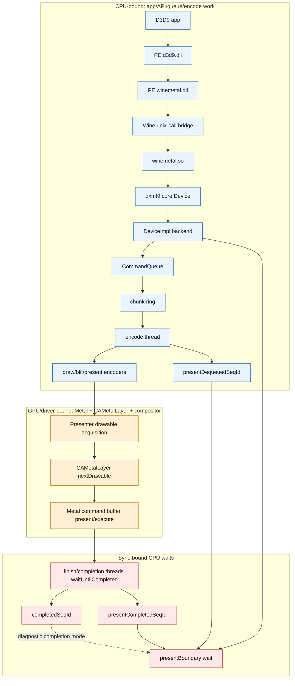

### Current dxmt9 Sequence

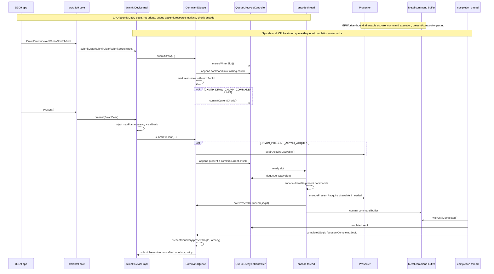

### Current dxmt9 Chunk State

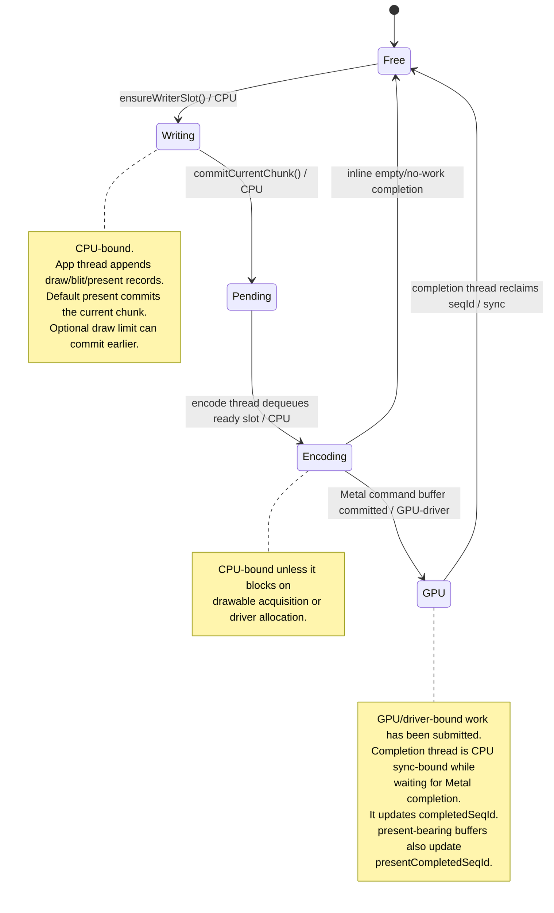

### Current dxmt9 Buffering Strategy

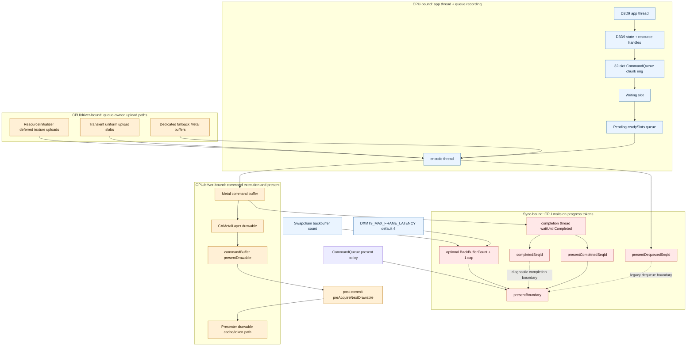

## Draw-Path Probe DoD

Post-SFIV split diagnostics indicate draw completion dominates, so the draw path must be measurable before changing behavior.

- [x] Render pass and split counters distinguish normal pass reuse from forced splits.
- [x] Pipeline cache hit/miss counters expose state churn and shader variant pressure.
- [x] Draw call and triangle counters quantify per-frame draw-path volume.
- [x] Bind churn counters track vertex/index buffers, textures, samplers, and render targets.
- [x] Shader/compat wait buckets separate shader variant, compatibility flags, and related completion waits.
- [x] Indexed draw counters distinguish direct indexed draws from diagnostic expansion.
- [x] Hazard probe counters distinguish exact overlap from legacy Bloom overlap and Bloom false positives.
- [x] Present source counters identify selected source validity, source size, destination size, handle, texture, format, and sample count.
- [ ] Async/preacquire policy is intentionally postponed until direct draw, exact hazard, and present-source signals are clean.

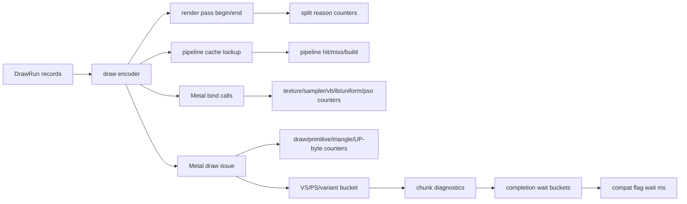

Current draw/hazard/present findings:

- Default indexed draws stay direct: the production path issues Metal indexed draws against the bound or UP index buffer. `DXMT_FORCE_EXPAND_INDEXED=1` is an opt-in diagnostic/compatibility lane that expands indexed geometry into a transient non-indexed stream; it should not be used as a default performance fix.
- Exact hazard tracking replaces Bloom-based split decisions. Bloom overlap and Bloom false-positive counters are useful diagnostics, but render-pass split decisions must be driven by exact handle overlap so false positives do not create avoidable encoder churn.
- SFIV present source selection is not currently suspect. The source counter lane reports a valid 1280x720 source, matching `present_src=1280x720` and `present_dst=1280x720` in the SFIV samples.
- Async acquire, preacquire, and latency-cap tuning should stay opt-in and paused for this investigation until draw completion and exact-hazard split counts explain the dominant stalls without relying on present-policy changes.

Current buffering implications:

- The chunk ring has 32 slots and an in-flight cap of 31 chunks.
- Default present appends a present command to the current chunk and commits it; draw-only workloads can build very large chunks until a flush/readback/present boundary.
- Transient draw-uniform data is queue-owned and slab-backed. The recent cleanup rotates retained transient slabs instead of allocating one Metal buffer per draw.
- `DXMT9_DRAW_CHUNK_COMMAND_LIMIT=<N>` is an opt-in guard against huge draw-only chunks. It is not a default because smaller chunks reduce sequence tail latency but increase command-buffer completion overhead.
- Present pacing now lives in `CommandQueue::submitPresent()`: `DeviceImpl::present()` injects max latency and presentation callback metadata, while the queue applies the frame-token boundary after accepting the present packet.

### Bound Classification

| Region | Bound type | Main counters | Current interpretation |
|---|---|---|---|
| D3D9 API, PE bridge, `submitDraw()` | CPU-bound | `submit_draw`, process elapsed | High draw count stresses command recording and resource marking. |
| Chunk append / writer slot | CPU sync-bound when saturated | `queue_writer_wait_ms` | Recent probes show this is not the primary limiter when it stays near zero. |
| Chunk commit / ready-slot publish | CPU sync-bound when ring is full | `queue_commit_wait_ms` | Useful for detecting too many small chunks or GPU not freeing slots. |
| Encode thread / draw encoders | CPU-bound with driver allocation edges | `command_buffers`, `metal_buffers`, `metal_buffer_bytes` | Large transient allocation volume can make CPU encode behave like driver-bound work. |
| CAMetalLayer drawable acquire | GPU/driver/compositor-bound, observed as CPU wait | `present_acquire_wait_ms`, `present_token_wait_ms` | Dominates present-only workloads when compositor pacing stalls acquisition. |
| Metal command buffer execution | GPU-bound, observed by completion thread | `completion_draw_wait_ms`, `completion_present_wait_ms`, `completion_wait_ms` | Grows when chunks are split too aggressively or GPU work is heavy. |
| Frame/present boundary | CPU sync-bound | `present_boundary_wait_ms`, `queue_sequence_wait_ms` | Root cause can be encode backlog, GPU completion, or drawable pacing depending on selected boundary mode. |
| Draw-only giant chunks | CPU encode tail plus sync wait | `queue_sequence_wait_ms`, `command_buffers` | `DXMT9_DRAW_CHUNK_COMMAND_LIMIT=256` reduces tail latency but does not remove per-draw encode/upload cost. |

### Bottleneck Re-evaluation

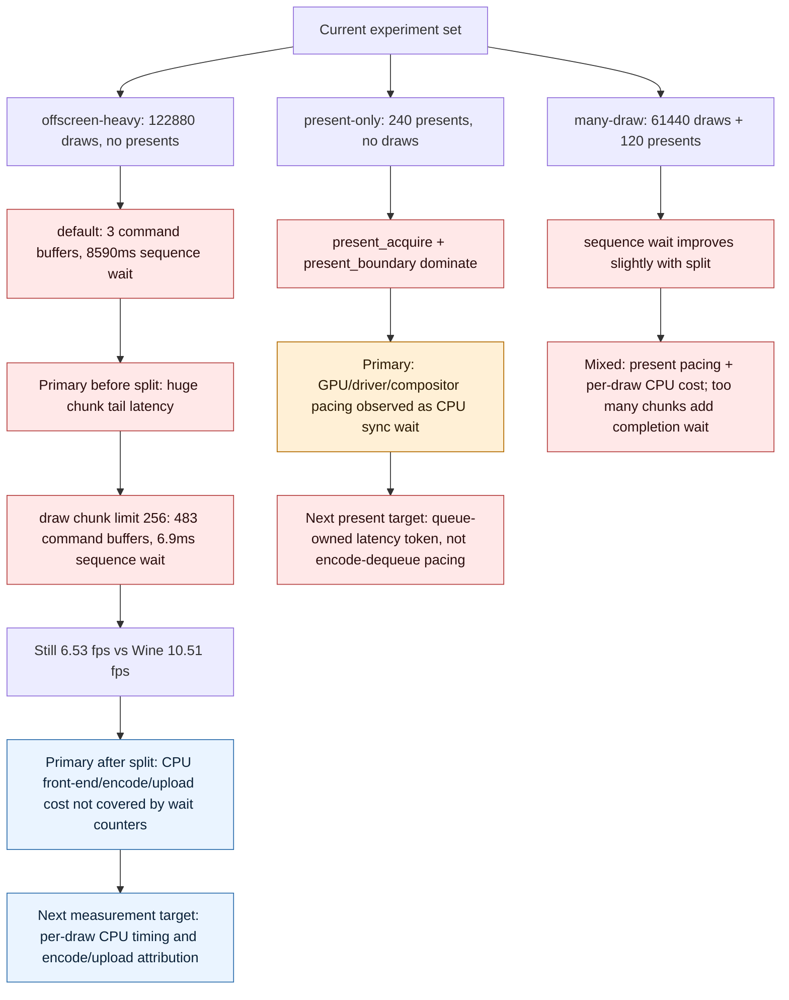

Current interpretation:

- Present-only is a valid isolation of CAMetalLayer/compositor pacing. The measured dxmt9 loss is mostly sync-bound CPU time waiting on GPU/driver-present progress.
- Offscreen-heavy proves present is not the only issue. After `DXMT9_DRAW_CHUNK_COMMAND_LIMIT=256`, the giant sequence wait is gone, Metal buffer churn is gone, and draw completion wait is only hundreds of ms; the remaining multi-second elapsed gap is therefore mostly CPU work not yet timed by counters.
- Many-draw is the mixed case. Splitting chunks reduces sequence wait but increases draw-completion wait. That means chunk splitting is a tail-latency control, not a general performance fix.
- The next bottleneck target should be reduced as CPU time: `submitDraw()` wall time, encode-thread `encodeChunk()` wall time, transient uniform upload time, command-buffer creation/commit time, and per-draw fixed-function state lowering.

Instrumentation pass:

- Added `PerformanceProbe` in-app `QueryPerformanceCounter` timings. The result JSON now includes `perf_probe_timings`.
- Added dxmt9 CPU counters to the existing `[dxmt9-perf]` line. The result JSON now includes submit/encode/upload/command-buffer CPU time in `dxmt9_perf_counters`.
- Smoke validation outputs:
  - `experiments/output/dxmt9-perf-offscreen-heavy-instrumentation-smoke/result.json`
  - `experiments/output/dxmt9-perf-many-draw-instrumentation-smoke/result.json`
- Full reference outputs:
  - `experiments/output/dxmt9-perf-offscreen-heavy-instrumentation-drawflush256/result.json`
  - `experiments/output/dxmt9-perf-many-draw-instrumentation-default/result.json`

| app | mode | process fps | process elapsed s | app total ms | render frame ms | draw loop ms | submitDraw CPU ms | encodeChunk CPU ms | encodeDraw CPU ms | transient upload CPU ms | sequence wait ms | completion wait ms |
|---|---|---:|---:|---:|---:|---:|---:|---:|---:|---:|---:|---:|
| offscreen-heavy | `DXMT9_DRAW_CHUNK_COMMAND_LIMIT=256` | 6.43 | 18.671 | 9425.730 | 8467.626 | 8431.020 | 4638.556 | 3664.204 | 3574.412 | 2968.533 | 7.081 | 279.998 |
| many-draw | default | 8.01 | 14.973 | 5455.159 | 4419.008 | 3827.204 | 1899.229 | 2238.123 | 2166.603 | 1838.429 | 16.896 | 93.388 |

Instrumentation interpretation:

- The offscreen-heavy full run confirms the remaining gap is CPU front-end/encode/upload dominated after chunk tail latency is removed. `queue_sequence_wait_ms` is only 7.081 ms, while app draw loop is 8431.020 ms, `submitDraw()` CPU is 4638.556 ms, and transient upload CPU is 2968.533 ms.
- The many-draw full run shows the same shape with present mixed in. Present acquire is only 12.054 ms in this run; the heavier costs are draw loop, submit, encode, and transient upload.
- `process_elapsed_sec` remains much larger than in-app `total_ms`. This confirms the previous concern: process-level FPS is still useful for end-to-end comparison, but not for attributing the renderer hot path.
- Short offscreen smoke runs below the catalogue `capture_frame=120` do not force readback/flush, so they validate parser wiring but not GPU encode behavior. Full offscreen runs must reach the capture/readback frame or explicitly flush.

### Experiment Suitability

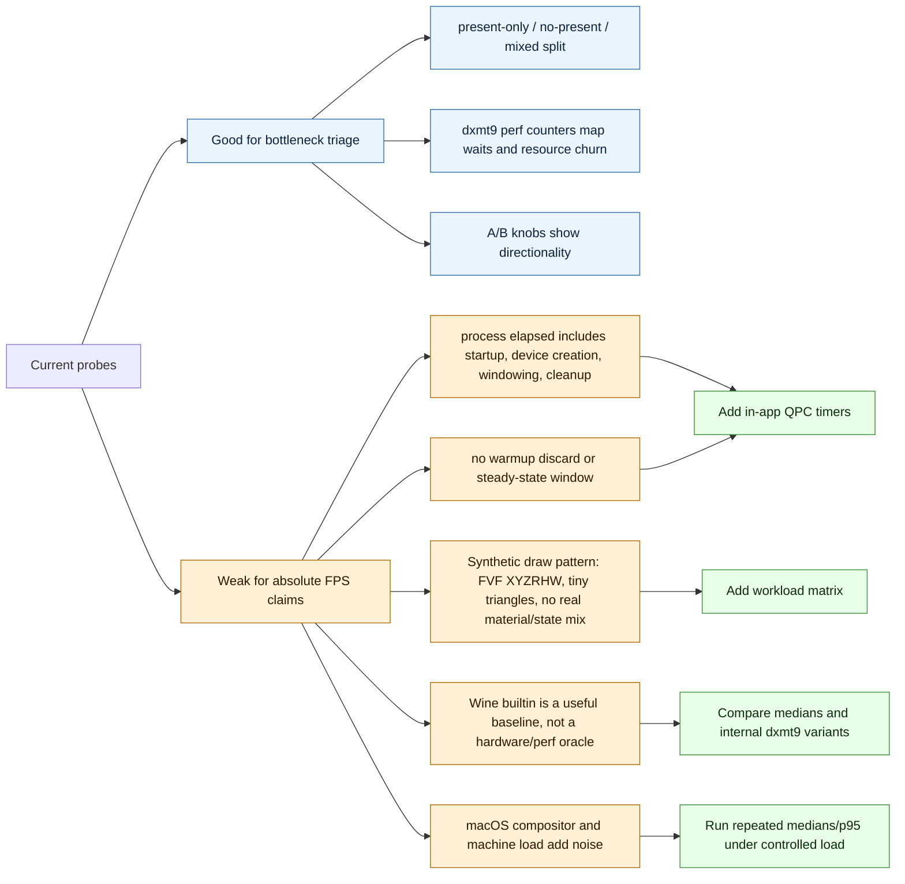

Suitability verdict:

- The current experiments are appropriate for structural triage: they separate present pacing, no-present draw encoding, and mixed present+draw behavior.
- They are still not sufficient for absolute performance claims. The reported FPS is `frames / process_elapsed_sec` from `scripts/run_experiment.py`, so it includes process startup, Wine prefix/runtime overhead, window creation, device/resource creation, render loop, teardown, and any final flush.
- The new in-app and dxmt9 CPU counters now attribute the main renderer hot path, but the process-level metric remains useful only as an end-to-end number.
- The Wine builtin lane is a practical compatibility/performance baseline, not an oracle proving what "CPU D3D9" should cost. Wined3D has its own command stream and backend acceleration.

Implemented measurement changes:

1. In-app `QueryPerformanceCounter` timing around window/device/resource creation, render frame, draw loop, Present, message pump, and cleanup.
2. dxmt9 counters for `submitDraw()` CPU time, `encodeChunk()` CPU time, `encodeDraw()` CPU time, command-buffer creation/commit CPU time, and transient upload copy/allocation time.

Remaining measurement changes:

1. Report warmup-discarded steady-state FPS, median frame time, p95, and max, not only process elapsed FPS.
2. Add fixed-function lowering sub-counters inside `encodeDraw()` to split pipeline lookup, uniform build, FVF decode, stream binding, and actual draw encoding.
3. Add workload variants: clear-only no-present, single draw with many primitives, many draws with identical state, many draws with forced state changes, texture sampling, render-to-texture then present, and backbuffer count 1/2/3.
4. Keep current probes as regression/triage tests, but do not use them alone to decide default performance policy.

Important current behavior:

- `DeviceImpl::present()` supplies public D3D9 present metadata; `CommandQueue::submitPresent()` commits the present chunk and applies the immediate-present latency boundary unless disabled or vsync path already flushes.
- `CommandQueue::presentBoundary()` waits for `presentSeqId - maxFrameLatency`.
- Default `maxFrameLatency` is now `4`, adopted from the best safe experiment below.
- `DXMT9_SPLIT_PRESENT_CHUNK=1` and `DXMT9_SPLIT_PRESENT_ACQUIRE=1` are experiments only. The existing split-present run was slower, so they are not defaults.
- `DXMT9_PRESENT_ACQUIRE_ON_SUBMIT=1` is also experimental. It moves drawable acquisition out of the encode worker, but the first measurement is slower because it doubles command-buffer traffic.
- `DXMT9_PRESENT_ASYNC_ACQUIRE=1` is experimental too. It is queue-owned, keeps command-buffer count stable, queues per-present drawable tokens, and serializes actual `nextDrawableRetained()` work to avoid retained-drawable hoarding.
- `DXMT9_PRESENT_ASYNC_ACQUIRE=1`, `DXMT9_PRESENT_ACQUIRE_ON_SUBMIT=1`, and `DXMT9_PRESENT_PREACQUIRE=1` are postponed as default candidates for this investigation until draw completion and exact hazard split counters are clean.
- `DXMT9_PRESENT_BOUNDARY_PRESENT_COMPLETION` is ON by default. It makes `presentBoundary()` wait on a present-bearing command-buffer completion watermark instead of encode-thread present dequeue; set it to `0` only for regression comparison.
- `DXMT9_CAP_FRAME_LATENCY_TO_BACKBUFFERS=1` is experimental. It applies the DXVK-like effective latency rule `min(appLatency, BackBufferCount + 1)` to the present boundary only.
- `DXMT9_DRAW_CHUNK_COMMAND_LIMIT=<N>` is experimental. It commits the current chunk from `submitDraw()` once the current chunk reaches `N` commands, reducing huge no-present chunk tail latency without changing the default path.
- `DXMT_FORCE_EXPAND_INDEXED=1` is experimental/diagnostic. The default draw path remains direct indexed draw; expansion is only for isolating index/vertex fetch correctness or compatibility.
- `DXMT9_DISABLE_PRESENT_BOUNDARY=1` improves elapsed time in BasicHLSL but does not encode all submitted presents, so it is not a safe fix.

## Target Present Path

The target is not to remove frame latency. The target is to stop using encode-thread progress as the pacing primitive. DXVK separates draw flush, WSI acquire, present submission, and frame-latency wait; dxmt9 should converge on the same shape.

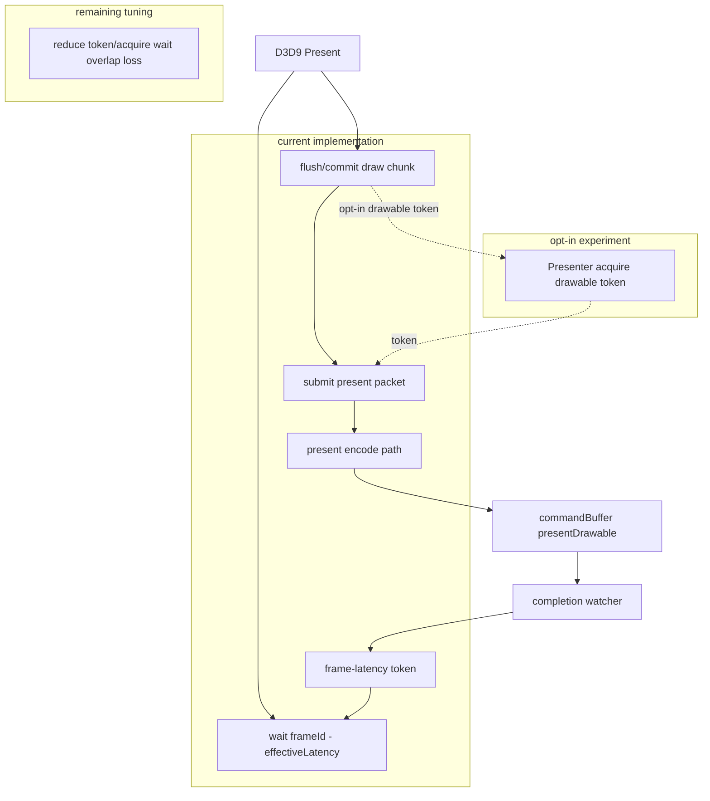

Desired ownership:

- `Presenter`: owns CAMetalLayer properties, drawable acquisition state, and one outstanding drawable token per window.
- `CommandQueue`: owns chunk ordering, present packet execution, completion signaling, and frame-latency token advancement.
- `DeviceImpl`: injects public D3D9 latency value and presentation callbacks only; it should not define the acquire/boundary mechanics.
- `SwapChain`: owns the `Presenter` and passes per-present dimensions/source/backbuffer metadata.

Migration steps:

1. Do not default the existing naive split knobs. The split-present experiment increased command buffers and made Tutorial07 much slower.
2. Implemented behind `DXMT9_PRESENT_ACQUIRE_ON_SUBMIT=1`: move `nextDrawable()` out of `Presenter::encodeCommands()` into a synchronous `Presenter::acquireDrawable()` token path.
3. Implemented behind `DXMT9_PRESENT_ASYNC_ACQUIRE=1`: `CommandQueue::submitPresent()` starts drawable acquisition through a Presenter-owned acquire thread and passes a future-like token to the present packet. The current shape queues tokens for every present but allows only one retained/in-flight `nextDrawableRetained()` acquisition at a time, so the encode path no longer falls back to blocking `nextDrawable()`.
4. Do not default either drawable-token acquire path yet. Synchronous token acquire removes boundary wait but doubles command buffers. The queued async version removes fallback/spikes but is not consistently faster than default latency 4.
5. Implemented as the default boundary source: add a queue-owned `presentCompletedSeqId_` watermark advanced by the completion watcher for present-bearing command buffers, and let `presentBoundary()` wait on that token.
6. Keep the older completion/dequeue boundary modes only as regression diagnostics. The default pacing contract is now present-completion based.
7. Implemented behind `DXMT9_CAP_FRAME_LATENCY_TO_BACKBUFFERS=1`: pass `SwapDesc::backBufferCount` from the D3D9 swapchain to the backend and cap the immediate-present boundary latency by `BackBufferCount + 1`.
8. Do not default the cap alone yet. The cap reduces max waits and helps present completion, but current samples lose FPS unless paired with queued async acquire.
9. Implemented: move the boundary decision from `DeviceImpl::present()` into `CommandQueue::submitPresent()`. This keeps frame-token ownership with the queue; `DeviceImpl` only supplies per-present public latency/callback metadata.

## DXVK D3D9 Shape

Detailed notes live in `docs/research/dxvk-d3d9.md`.

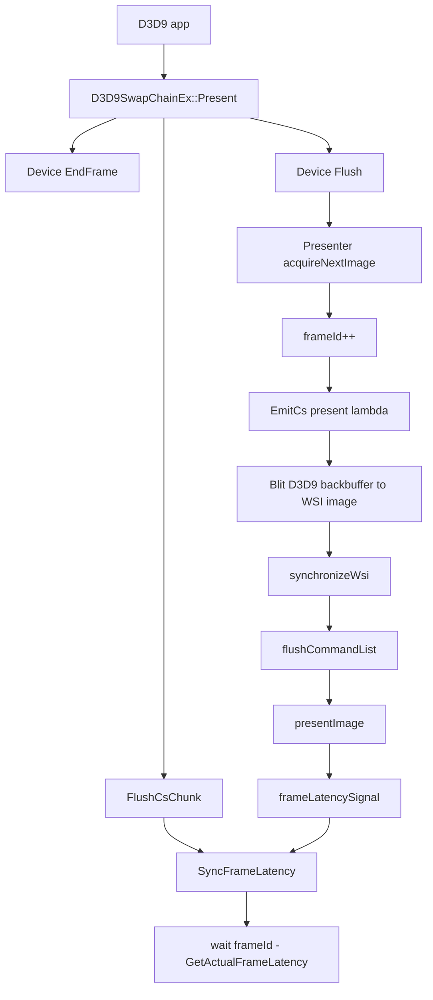

Observed DXVK rule:

- `PresentImage()` acquires WSI image first, emits present work to the CS thread, flushes the CS chunk, then calls `SyncFrameLatency()`.
- `GetActualFrameLatency()` caps latency by device latency and `BackBufferCount + 1`.
- The wait is a frame-latency fence rule, not a blanket "wait until this present is fully idle" rule.

Local reference points:

- `~/workspaces/dxvk/src/d3d9/d3d9_swapchain.cpp`
- `~/workspaces/dxvk/src/dxvk/dxvk_presenter.cpp`

## Wine D3D9 Shape

Detailed notes live in `docs/research/wine-d3d9.md`.

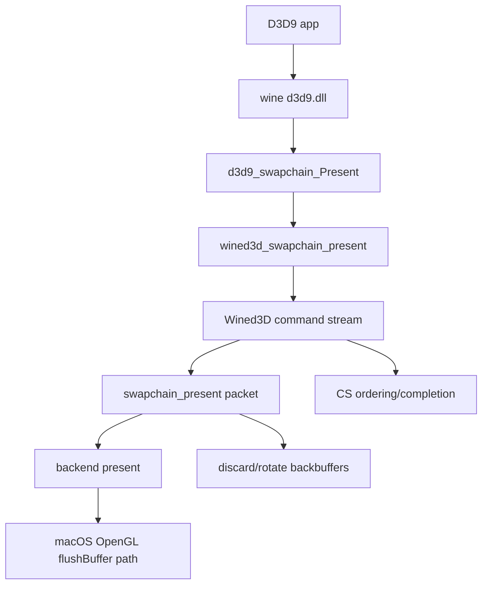

Observed Wine-DX9 rule:

- D3D9 present is forwarded to Wined3D swapchain present.
- Wined3D routes present through its command stream, then the backend present path performs the platform-specific swap/flush.
- The app-facing D3D9 layer is not expected to synchronously perform all GPU completion for every immediate present.

Local reference points:

- `~/workspaces/wine/dlls/d3d9`
- `~/workspaces/wine/dlls/wined3d`

## Assumptions

- The current oracle named `vanilla` is Wine builtin D3D9, not a native Windows/D3D9 hardware oracle.
- FPS is measured from app log frame count divided by process elapsed time in `scripts/run_experiment.py`.
- The tested SDK samples are simple immediate-present workloads; they amplify present pacing and next-drawable waits more than heavy shader or draw workloads.
- SSIM below 1.0 is accepted by the current harness threshold, but it still means there is remaining visual delta versus the stored reference.
- `present_acquire_wait_ms` includes time blocked around CAMetalLayer drawable acquisition.
- `present_boundary_wait_ms` measures CPU-side wait imposed by dxmt9's present latency boundary.
- `queue_writer_wait_ms == 0` means the current measured slowdown is not primarily chunk-ring writer backpressure.
- `pipeline_builds == 2` in these samples means pipeline creation is no longer the main repeated bottleneck after the StretchRect fast path.
- `DXMT9_DISABLE_PRESENT_BOUNDARY=1` is an experiment only. It can hide wait time by allowing unencoded presents at process end.

## Results So Far

PE/Wine binding:

- Initial failing mode: `WINEDLLOVERRIDES=d3d9=b` caused Wine to reject staged `d3d9.dll` as `not a builtin`.
- Root cause: the raw PE DLLs were copied before `winebuild --builtin` postprocess was guaranteed.
- Fix added: `scripts/install_heroic_wine.sh` now runs matching Meson `.dll.postproc` targets before staging.
- Fix added: PE `d3d9.dll` and PE `winemetal.dll` are staged into both the Wine runtime and the prefix `system32` / `syswow64` locations.
- Verification: `BasicHLSL` now passes with `d3d9=b`; bridge fallback gets a valid unix-call handle.

SFIV `-benchmark` after WoW64 handle fix:

- The WoW64 handle fix made the SFIV benchmark reach the renderer path reliably enough for bottleneck triage.
- The benchmark issues a `StretchRect` every frame, so present analysis must separate backbuffer/RT blit cost from the final swapchain present.
- Removing the stateMutation-triggered flush eliminated one avoidable CPU-side queue drain before the per-frame blit/present path.
- Removing the sync-present flush stopped forcing a full queue flush on present; the default path now relies on the queue-owned present boundary instead.
- Latest sample: `experiments/output/sfiv-benchmark-counters-20260506-081950`, 75 s timeout, `DXMT9_PE_CHUNK_MAX_RECORDS=256`.
- `StretchRect` is not the remaining GPU bottleneck in this sample: `stretch_copy=719`, `stretch_pass=0`, `stretch_full=719`.
- The final present is a full-screen render pass every frame: `present_pass=720`, `present_src=1280x720`, `present_dst=1280x720`.
- Present source counters show a valid source selection for the same sample: the selected source is 1280x720, so the current evidence does not point at a missing, invalid-sized, or wrong backbuffer source.
- The remaining dominant completion stall is still the combined frame command buffer: `completion_draw_present_wait_ms=59840.106`, while `completion_stretch_wait_ms=0.000`.
- Drawable acquire is also large in the same sample: `present_acquire_wait_ms=58187.489`. This points at present/acquire pacing or the full frame command-buffer composition rather than StretchRect render-pass cost.
- Follow-up split-present sample: `experiments/output/sfiv-benchmark-split-present-20260506-083114`. Present-only completion is cheap (`completion_present_only_wait_ms=70.402`), while the draw+StretchRect chunk dominates.
- Follow-up split-stretch+present sample: `experiments/output/sfiv-benchmark-split-stretch-present-20260506-083604`. Isolated StretchRect completion is cheap (`completion_stretch_wait_ms=40.831`), isolated present completion is cheap (`completion_present_only_wait_ms=125.609`), and draw completion dominates (`completion_draw_wait_ms=41138.643`).
- This means the slow SFIV animation is primarily draw/GPU completion, not the full-screen StretchRect copy or the present pass. Flicker is likely a pacing/stutter symptom on top of low frame rate unless a separate visual correctness trace proves otherwise.

Latest counter sample:

| metric | value | interpretation |
|---|---:|---|
| `stretch_copy` | 719 | Same-size full-screen StretchRect uses the blit-copy fast path. |
| `stretch_pass` | 0 | No StretchRect render-pass work observed. |
| `present_pass` | 720 | Present still draws a full-screen textured triangle every frame. |
| `present_source_valid` / `present_source_size` | valid / 1280x720 | Present source selection is valid in the SFIV sample. |
| `completion_draw_present_wait_ms` | 59840.106 | Completion waits are on command buffers containing draw + present work. |
| `completion_stretch_wait_ms` | 0.000 | StretchRect is not isolated as a waiting command buffer. |
| `present_acquire_wait_ms` | 58187.489 | Drawable acquisition/backpressure is comparable to completion wait. |

Split diagnostics:

| mode | path | key result | conclusion |
|---|---|---|---|
| `DXMT9_SPLIT_PRESENT_CHUNK=1` | `experiments/output/sfiv-benchmark-split-present-20260506-083114` | `completion_present_only_wait_ms=70.402`, draw+StretchRect chunk still large | Present-only pass is not the main stall. |
| `DXMT9_SPLIT_STRETCH_CHUNK=1 DXMT9_SPLIT_PRESENT_CHUNK=1` | `experiments/output/sfiv-benchmark-split-stretch-present-20260506-083604` | `completion_draw_wait_ms=41138.643`, `completion_stretch_wait_ms=40.831`, `completion_present_only_wait_ms=125.609` | Draw command buffers dominate the frame time. |

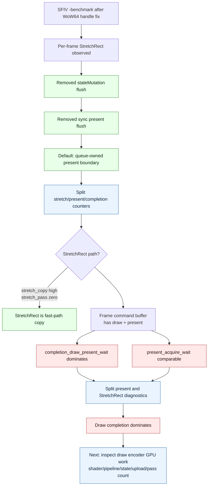

Baseline performance, previous default latency 3:

| app | vanilla fps | dxmt9 fps | speedup | present encoded | boundary wait ms | acquire wait ms | writer wait ms | PSO builds |
|---|---:|---:|---:|---:|---:|---:|---:|---:|
| BasicHLSL | 21.42 | 19.60 | 0.915 | 240/240 | 1107.726 | 1149.380 | 0.000 | 2 |
| Tutorial07 | 17.01 | 15.19 | 0.894 | 180/180 | 835.299 | 948.997 | 0.000 | 2 |

Performance probe split:

- Harness: `bash scripts/run_dx9_performance_suite.sh --timeout 45 --app dxmt9-perf-present-only --app dxmt9-perf-offscreen-heavy --app dxmt9-perf-many-draw`
- Latest follow-up output: `experiments/output/dx9-performance-suite/summary.md`
- Probe source: `experiments/apps/PerformanceProbe/PerformanceProbe.cpp`

Initial probe result before transient-upload cleanup:

| app | vanilla fps | dxmt9 fps | speedup | present encoded | dxmt9 Metal buffers | dxmt9 Metal buffer bytes | sequence wait ms | boundary wait ms | acquire wait ms |
|---|---:|---:|---:|---:|---:|---:|---:|---:|---:|
| present-only | 21.21 | 18.84 | 0.888 | 240 | 2 | 7.4 MB | 63.602 | 1673.659 | 1809.674 |
| offscreen-heavy | 11.13 | 3.72 | 0.334 | 0 | 244839 | 2234.3 MB | 13914.131 | 0.000 | 0.000 |
| many-draw | 10.06 | 8.22 | 0.817 | 120 | 12004 | 124.7 MB | 72.421 | 47.722 | 11.188 |

Follow-up after rotating transient upload slabs and removing duplicate draw-uniform upload:

| app | vanilla fps | dxmt9 fps | speedup | present encoded | dxmt9 Metal buffers | dxmt9 Metal buffer bytes | sequence wait ms | boundary wait ms | acquire wait ms |
|---|---:|---:|---:|---:|---:|---:|---:|---:|---:|
| present-only | 21.21 | 18.84 | 0.888 | 240 | 2 | 7.4 MB | 63.602 | 1673.659 | 1809.674 |
| offscreen-heavy | 10.51 | 4.48 | 0.427 | 0 | 135 | 1119.5 MB | 8590.868 | 0.000 | 0.000 |
| many-draw | 11.21 | 8.24 | 0.736 | 120 | 4 | 15.8 MB | 14.886 | 0.000 | 13.939 |

Interpretation:

- `present-only` confirms a present/compositor pacing gap: dxmt9 is 0.888x and the waits are almost entirely present boundary + drawable acquire.
- `offscreen-heavy` proves the larger gap is not only present. With zero presents and zero drawable acquire, dxmt9 is still 0.427x after cleanup.
- The transient cleanup removed the pathological per-draw Metal buffer count in draw-heavy probes, but offscreen-heavy still allocates over 1 GB of transient uniform slabs and waits 8.6 s on sequence completion.
- This points at chunk sizing and per-draw uniform upload volume: a no-present workload can accumulate a huge draw chunk before a forced readback/flush, so encode completion becomes the bottleneck.

Automatic draw-chunk flush experiment:

- Harness: direct `run_experiment.py` runs of `dxmt9-perf-offscreen-heavy` and `dxmt9-perf-many-draw` with `DXMT9_DRAW_CHUNK_COMMAND_LIMIT=<N> DXMT_PERF_COUNTERS=1`.
- The switch is opt-in. Default behavior remains the follow-up row above.

| app | mode | fps | command buffers | Metal buffers | Metal buffer bytes | sequence wait ms | draw completion wait ms |
|---|---|---:|---:|---:|---:|---:|---:|
| offscreen-heavy | vanilla Wine-DX9 | 10.51 | n/a | n/a | n/a | n/a | n/a |
| offscreen-heavy | default dxmt9 | 4.48 | 3 | 135 | 1067.6 MB | 8590.868 | 243.539 |
| offscreen-heavy | `DXMT9_DRAW_CHUNK_COMMAND_LIMIT=2048` | 5.78 | 63 | 123 | 971.6 MB | 95.175 | 100.490 |
| offscreen-heavy | `DXMT9_DRAW_CHUNK_COMMAND_LIMIT=512` | 6.43 | 243 | 3 | 11.6 MB | 11.177 | 162.399 |
| offscreen-heavy | `DXMT9_DRAW_CHUNK_COMMAND_LIMIT=256` | 6.53 | 483 | 3 | 11.6 MB | 6.909 | 283.141 |
| offscreen-heavy | `DXMT9_DRAW_CHUNK_COMMAND_LIMIT=128` | 6.50 | 963 | 3 | 11.6 MB | 3.874 | 574.406 |
| many-draw | vanilla Wine-DX9 | 11.21 | n/a | n/a | n/a | n/a | n/a |
| many-draw | default dxmt9 | 8.24 | 125 | 4 | 15.1 MB | 14.886 | 0.664 |
| many-draw | `DXMT9_DRAW_CHUNK_COMMAND_LIMIT=256` | 8.45 | 365 | 4 | 15.1 MB | 5.158 | 152.897 |

Interpretation:

- The experiment confirms that huge draw chunks are a real tail-latency problem. Offscreen-heavy improves from 4.48 FPS to 6.53 FPS as sequence wait drops from 8590.868 ms to 6.909 ms.
- The curve flattens around 256 commands. Going from 256 to 128 reduces sequence wait further, but draw completion wait doubles and FPS does not improve.
- The many-draw workload improves only slightly because present boundaries already break work into smaller chunks. The increased draw completion wait means this should not become a default solely from micro-benchmark data.
- Remaining gap versus vanilla Wine-DX9 is not explained by chunk tail latency alone. After the best chunk split, offscreen-heavy is still 0.62x of vanilla, so the next target is per-draw encode/upload cost rather than present pacing.

PE recorder bridge experiment:

- Harness: `DXMT9_PROBE_FRAMES=20 DXMT9_PROBE_DRAWS=64 DXMT_PERF_COUNTERS=1 scripts/run_experiment.py run dxmt9-perf-many-draw`.
- Baseline output: `experiments/output/dxmt9-perf-many-draw-bridge-counter-smoke/result.json`.
- Packet output: `experiments/output/dxmt9-perf-many-draw-draw-packet-queue-token-smoke/result.json`.
- Chunk output: `experiments/output/dxmt9-perf-many-draw-draw-chunk-state-delta-smoke/result.json`.
- Generic chunk output: `experiments/output/dxmt9-perf-many-draw-generic-command-chunk-smoke/result.json`.
- **DXMT9_PE_STATE_SHADOW** is now ON by default (Phase 22). The PE-side shadow defers every fixed-function `Set*` (RS / Texture / StreamSource / FVF / VS / PS / VDecl / RT / DS / Viewport / Scissor / TSS / Sampler / Material / ClipPlane / Transform / Light / LightEnable). Set `DXMT9_PE_STATE_SHADOW=0` only as a regression-detection escape hatch.
- **DXMT9_PE_DRAW_CHUNK** is now ON by default (Phase 19). The recorder accumulates up to 64 records (configurable via `DXMT9_PE_CHUNK_MAX_RECORDS`) / 256 KB (`DXMT9_PE_CHUNK_MAX_BYTES`) and submits a versioned POD `D9CCommandChunk` through `commit_chunk`. Set `DXMT9_PE_DRAW_CHUNK=0` only for bisecting recorder-introduced bugs.
- **DXMT9_PE_DRAW_FULL_SNAPSHOT=1** (Phase 16, default OFF) is a debug knob that forces every draw packet to carry the COMPLETE PE shadow as a self-contained snapshot, bypassing delta encoding. Costs ~10× wire bandwidth + disables run-coalescing; intended for stress testing and replay debugging.
- The shadow also performs PE-side state-delta suppression for identical hot-state values, so redundant state calls do not split a pending draw chunk.
- Per Phase 28, `Set*` never crosses PE/unix in default chunk mode. Pending hot state at a barrier (Clear / Present / surface op / readback) is encoded as a `D9C_COMMAND_RECORD_APPLY_STATE` chunk record, NOT as per-call `dxmt9c_device_set_*` unix-calls. The bridge counters for `set_render_state` / `set_texture` / `set_stream_source` / `set_fvf` should read 0 in the default path.

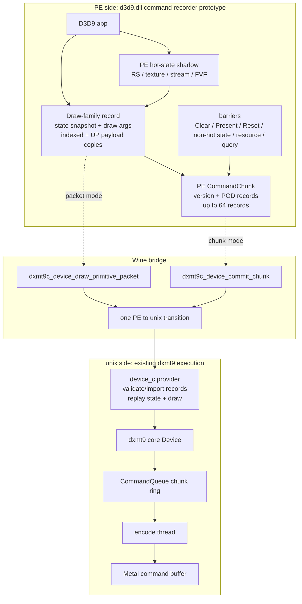

| mode | env | bridge total | bridge state | bridge draw | draw primitive | draw packet | draw primitive chunk | commit chunk |
|---|---|---:|---:|---:|---:|---:|---:|---:|
| baseline call-through (legacy) | `DXMT9_PE_STATE_SHADOW=0 DXMT9_PE_DRAW_CHUNK=0` | 1414 | 44 | 1280 | 1280 | 0 | 0 | 0 |
| PE shadow only (legacy chunk off) | `DXMT9_PE_DRAW_CHUNK=0` | 1374 | 4 | 1280 | 1260 | 20 | 0 | 0 |
| Default (current production path) | _unset / both default ON_ | 114 | 4 | 20 | 0 | 0 | 0 | 20 |
| Full snapshot stress mode | `DXMT9_PE_DRAW_FULL_SNAPSHOT=1` | 114 | 4 | 20 | 0 | 0 | 0 | 20 |

Interpretation:

- The bridge counter proves the structural difference: the legacy baseline crossed PE/unix once per D3D9 draw plus once per hot state call.
- PE shadow alone removes the explicit state bridge calls but keeps per-draw bridges. Useful for bisecting recorder-introduced bugs (DXMT9_PE_DRAW_CHUNK=0).
- **Default production path** matches the upstream DXMT chunk model: 1280 app draws + 1280 hot state calls collapse to 20 `commit_chunk` unix bridges for this 20-frame/64-draw workload — a ~12× reduction in PE/unix transitions, with `set_render_state` / `set_texture` / `set_stream_source` / `set_fvf` bridge counters at 0.
- Full snapshot mode shares the same bridge counter profile (still 20 commits) but emits ~10× more wire bytes per chunk and disables run-coalescing — only useful for debugging.
- Barrier state is now chunk-recorded via `D9C_COMMAND_RECORD_APPLY_STATE`; hot `Set*` calls should not appear as PE/unix setter bridges in the default path.
- Present frame-token boundary ownership is now queue-side: `CommandQueue::submitPresent()` accepts the present packet, allocates/uses the present sequence token, and applies the boundary policy before returning. The default wait target is now present-completion, not encode-dequeue.
- State-delta hashing is currently a simple equality check over the PE hot-state shadow, not a full pipeline-state hash.
- This is now the default recorder path. Current chunk barriers cover common state/resource/query/readback ordering points, and the command chunk covers `DrawPrimitive`, `DrawIndexedPrimitive`, `DrawPrimitiveUP`, and `DrawIndexedPrimitiveUP`; broader game coverage still needs stateblock/shadow invalidation and resource-lifetime hazard tests.
- The default path reduces PE/unix bridge pressure only. Backend `submitDraw`, encode, and transient upload work still happen per draw after the provider replays the chunk, so further speedup needs backend-side compact command records and upload coalescing.

SFIV geometry corruption diagnostics:

- Set `DXMT9_TRACE_DRAW_GEOMETRY=1` to emit one `[dxmt9-geometry]` line per issued Metal draw; set it to `N > 1` to sample every Nth issued draw. `DXMT9_TRACE_DRAW_GEOMETRY_LIMIT=N` caps emitted lines. `DXMT_TRACE_FILE=/path/to/log` mirrors the same lines to a file.
- Geometry trace fields include `seq`, `api`, `metal`, `source` (`direct` / `up` / `expanded`), `shaderPath` (`vs` / `ffp`), `baseVertex`, `startVertex`, `startIndex`, `indexType`, `stream0Offset`, `stream0Stride`, effective uniform stream offset/stride, `declHash`, `fvf`, VS/PS hashes, UP byte counts, and a compact vertex declaration element list.
- Backend `DrawParam` currently does not carry the D3D9 `MinVertexIndex` / `NumVertices` hint fields to `dxmt9_draw_encoder.mm`; the geometry trace prints `minVertex=na numVertices=na` until those fields are preserved in the command path.
- With `DXMT_PERF_COUNTERS=1`, the final `[dxmt9-perf]` line now includes aggregate geometry buckets: FFP vs VS, indexed index16/index32, direct/UP/expanded, non-zero base vertex/start index/stream0 offset, and last observed stream0 stride / vertex-decl hash.

Latency experiment results:

| app | mode | fps | present encoded | boundary wait ms | acquire wait ms | writer wait ms |
|---|---|---:|---:|---:|---:|---:|
| BasicHLSL | previous default latency 3 | 19.60 | 240/240 | 1107.726 | 1149.380 | 0.000 |
| BasicHLSL | new default latency 4 | 22.11 | 240/240 | 979.113 | 1053.542 | 0.000 |
| BasicHLSL | `DXMT9_MAX_FRAME_LATENCY=6` | 21.46 | 240/240 | 1038.101 | 1177.356 | 0.000 |
| BasicHLSL | `DXMT9_DISABLE_PRESENT_BOUNDARY=1` | 21.12 | 222/240 | 0.000 | 1213.750 | 1074.493 |
| Tutorial07 | previous default latency 3 | 15.19 | 180/180 | 835.299 | 948.997 | 0.000 |
| Tutorial07 | new default latency 4 | 16.22 | 180/180 | 857.823 | 941.476 | 0.000 |

Present-path redesign experiments:

| app | mode | fps | present encoded | boundary wait ms | acquire wait ms | command buffers | note |
|---|---|---:|---:|---:|---:|---:|---|
| BasicHLSL | `DXMT9_PRESENT_ACQUIRE_ON_SUBMIT=1` | 19.11 | 240/240 | 0.000 | 681.102 | 484 | Not a default: lower waits, but worse elapsed time from extra command-buffer work. |
| BasicHLSL | `DXMT9_PRESENT_ASYNC_ACQUIRE=1`, queue-owned one outstanding | 24.76 | 240/240 | 72.611 | 95.369 | 245 | Promising rerun: stable command-buffer count and much lower present waits. One previous run still showed a 1s spike. |
| BasicHLSL | `DXMT9_PRESENT_ASYNC_ACQUIRE=1 DXMT9_PRESENT_BOUNDARY_PRESENT_COMPLETION=1` | 21.86 | 240/240 | 90.649 | 121.087 | 245 | Structurally closer completion-token boundary; slower than the best async-only run, but no 1s wait spike in this run. |
| Tutorial07 | `DXMT9_PRESENT_ASYNC_ACQUIRE=1`, queue-owned one outstanding | 18.35 | 180/180 | 49.298 | 56.040 | 185 | Promising: faster than vanilla Wine-DX9 in this run. |
| Tutorial07 | `DXMT9_PRESENT_ASYNC_ACQUIRE=1 DXMT9_PRESENT_BOUNDARY_PRESENT_COMPLETION=1` | 18.31 | 180/180 | 58.596 | 62.770 | 185 | Roughly equal to async-only; validates the completion watermark path without extra command buffers. |
| Tutorial07 | split-present experiment | 7.69 | 179/179 | n/a | 4892.999 | 364 | Not a default: naive split was much slower. |

Same-load rerun after split counters and queued-token async acquire:

| app | mode | fps | present encoded | issued/fallback tokens | boundary wait ms | acquire wait ms | token wait ms | command buffers | note |
|---|---|---:|---:|---:|---:|---:|---:|---:|---|
| BasicHLSL | current default latency 4 | 20.31 | 240/240 | 0/0 | 1554.455 | 1678.596 | 0.000 | 245 | Baseline for this machine-load window. |
| BasicHLSL | old async busy-fallback run | 8.57 | 240/240 | 50/190 | 16945.275 | 17595.923 | 130.215 | 245 | Confirms fallback path can reintroduce 1s stalls. |
| BasicHLSL | queued-token async | 18.76 | 240/240 | 240/0 | 1515.808 | 1778.592 | 1716.275 | 245 | Stable, no fallback, but token wait replaces encode-side acquire wait. |
| BasicHLSL | queued-token async + present-completion boundary | 19.36 | 240/240 | 240/0 | 1517.065 | 1773.489 | 1706.433 | 245 | Slightly better than queued-token async in this run. |
| Tutorial07 | current default latency 4 | 15.32 | 177/180 | 0/0 | 1364.586 | 1496.152 | 0.000 | 183 | Baseline in this machine-load window. |
| Tutorial07 | queued-token async | 15.33 | 180/180 | 180/0 | 940.930 | 1150.781 | 1112.201 | 185 | Similar fps, but all presents encode and max waits drop below 36ms. |
| Tutorial07 | queued-token async + present-completion boundary | 15.64 | 180/180 | 180/0 | 1199.710 | 1375.766 | 1332.689 | 185 | Slightly faster in this run, but waits are higher than queued-token async. |

Effective latency cap experiment, same-load follow-up:

| app | mode | fps | present encoded | issued/fallback tokens | boundary wait ms | acquire wait ms | token wait ms | command buffers | note |
|---|---|---:|---:|---:|---:|---:|---:|---:|---|
| BasicHLSL | default latency 4 | 20.31 | 240/240 | 0/0 | 1554.455 | 1678.596 | 0.000 | 245 | Reference from same-load window. |
| BasicHLSL | `DXMT9_CAP_FRAME_LATENCY_TO_BACKBUFFERS=1` | 17.57 | 240/240 | 0/0 | 1595.597 | 1783.629 | 0.000 | 245 | Lower max waits, lower FPS. Not a standalone default. |
| BasicHLSL | queued-token async | 18.76 | 240/240 | 240/0 | 1515.808 | 1778.592 | 1716.275 | 245 | Stable but not faster than default. |
| BasicHLSL | queued-token async + latency cap | 20.28 | 240/240 | 240/0 | 750.028 | 823.347 | 768.195 | 245 | Best opt-in combo for BasicHLSL in this window; roughly ties default FPS while halving wait totals. |
| Tutorial07 | default latency 4 | 15.32 | 177/180 | 0/0 | 1364.586 | 1496.152 | 0.000 | 183 | Some presents did not encode before process end. |
| Tutorial07 | `DXMT9_CAP_FRAME_LATENCY_TO_BACKBUFFERS=1` | 14.32 | 180/180 | 0/0 | 1115.769 | 1187.320 | 0.000 | 185 | Safer completion and lower max waits, but lower FPS. |
| Tutorial07 | queued-token async | 15.33 | 180/180 | 180/0 | 940.930 | 1150.781 | 1112.201 | 185 | Stable present count. |
| Tutorial07 | queued-token async + latency cap | 16.33 | 180/180 | 180/0 | 664.172 | 704.405 | 671.604 | 185 | Best opt-in combo for Tutorial07 in this window. |

Present policy repeated A/B, 3 runs per app/mode:

- Harness: `scripts/run_dx9_present_policy_ab.py --runs 3 --tag 20260426-present-policy-r3`
- Output: `experiments/output/dx9-present-policy-ab/20260426-present-policy-r3/summary.md`

| app | mode | pass | fps mean [min,max] | present encoded mean | fallbacks mean | boundary wait ms mean | acquire wait ms mean | token wait ms mean | command buffers mean |
|---|---|---:|---:|---:|---:|---:|---:|---:|---:|
| BasicHLSL | default | 3/3 | 20.78 [19.55, 22.00] | 240.0 | 0.0 | 1065.418 | 1176.668 | 0.000 | 245.0 |
| BasicHLSL | queued-token async | 3/3 | 21.50 [20.66, 21.92] | 240.0 | 0.0 | 1009.216 | 1184.615 | 1121.129 | 245.0 |
| BasicHLSL | queued-token async + latency cap | 3/3 | 21.73 [21.58, 21.94] | 240.0 | 0.0 | 963.009 | 1108.349 | 1042.976 | 245.0 |
| Tutorial07 | default | 3/3 | 15.58 [13.37, 16.76] | 180.0 | 0.0 | 901.246 | 1001.165 | 0.000 | 185.0 |
| Tutorial07 | queued-token async | 3/3 | 15.87 [14.77, 16.68] | 180.0 | 0.0 | 573.846 | 682.392 | 638.290 | 185.0 |
| Tutorial07 | queued-token async + latency cap | 3/3 | 16.41 [16.18, 16.65] | 180.0 | 0.0 | 853.892 | 971.094 | 931.594 | 185.0 |

Broader present policy A/B, 3 runs per app/mode:

- Harness: `scripts/run_dx9_present_policy_ab.py --runs 3 --timeout 45 --app dx-sdk-basichlsl --app dx-sdk-tutorial07 --app dxut-simple-sample --app irrlicht-managed-lights --app dxmt9-water-rt --app dxmt9-multitexture-terrain --tag 20260426-present-policy-broad-r3`
- Output: `experiments/output/dx9-present-policy-ab/20260426-present-policy-broad-r3/summary.md`
- Result: 54/54 runs passed.
- HDR follow-up: `scripts/run_dx9_present_policy_ab.py --runs 3 --timeout 45 --app dx-sdk-hdrformats --tag 20260426-hdrformats-present-policy-r3`
- HDR output: `experiments/output/dx9-present-policy-ab/20260426-hdrformats-present-policy-r3/summary.md`
- HDR result: 9/9 runs passed. The previous apparent hang did not reproduce under the explicit timeout/debug lane.

| app | default fps | queued-token async fps | queued-token async + latency cap fps | best mode | async+cap vs default |
|---|---:|---:|---:|---|---:|
| BasicHLSL | 22.35 | 22.96 | 23.08 | async+cap | +3.3% |
| Tutorial07 | 17.87 | 17.87 | 17.81 | async | -0.3% |
| HDRFormats | 18.08 | 18.06 | 18.14 | async+cap | +0.3% |
| DXUTSimpleSample | 17.56 | 17.20 | 17.30 | default | -1.5% |
| Irrlicht ManagedLights | 17.31 | 17.87 | 18.13 | async+cap | +4.7% |
| WaterRT | 18.19 | 18.14 | 18.14 | default | -0.3% |
| MultiTextureTerrain | 18.37 | 18.21 | 18.45 | async+cap | +0.4% |

Preacquire policy triage:

- Harness: `scripts/run_dx9_present_policy_ab.py --runs 3 --timeout 45 --mode default --mode preacquire --mode preacquire-cap --app dx-sdk-basichlsl --app dxut-simple-sample --app irrlicht-managed-lights --app dxmt9-water-rt --tag 20260426-present-preacquire-triage-r3`
- Output: `experiments/output/dx9-present-policy-ab/20260426-present-preacquire-triage-r3/summary.md`
- Result: 36/36 runs passed. The first triage showed that the old preacquire path mostly missed because encode could race ahead while the prefetch thread was still in-flight.

| app | default fps | preacquire fps | preacquire + latency cap fps | best mode | preacquire+cap vs default |
|---|---:|---:|---:|---|---:|
| BasicHLSL | 23.79 | 23.60 | 22.74 | default | -4.4% |
| DXUTSimpleSample | 18.16 | 18.18 | 17.83 | preacquire | -1.8% |
| Irrlicht ManagedLights | 18.17 | 17.90 | 18.29 | preacquire+cap | +0.6% |
| WaterRT | 18.16 | 18.39 | 18.27 | preacquire | +0.6% |

Preacquire in-flight wait follow-up:

- Change: when `DXMT9_PRESENT_PREACQUIRE=1`, encode now waits for an already in-flight prefetch instead of immediately issuing a second `nextDrawable()`.
- Harness: `scripts/run_dx9_present_policy_ab.py --runs 3 --timeout 45 --mode default --mode preacquire --mode preacquire-cap --app dx-sdk-basichlsl --app dxut-simple-sample --tag 20260426-present-preacquire-wait-r3`
- Output: `experiments/output/dx9-present-policy-ab/20260426-present-preacquire-wait-r3/summary.md`
- Result: 18/18 runs passed.

| app | mode | fps mean [min,max] | pre hits mean | pre misses mean | pre wait ms mean | note |
|---|---|---:|---:|---:|---:|---|
| BasicHLSL | default | 26.59 [25.76, 27.41] | 0.0 | 0.0 | 0.000 | current-load baseline |
| BasicHLSL | preacquire | 22.98 [17.86, 27.48] | 237.7 | 2.3 | 423.819 | hit rate fixed, FPS regressed |
| BasicHLSL | preacquire + latency cap | 25.65 [24.45, 26.33] | 238.7 | 1.3 | 417.418 | still below default |
| DXUTSimpleSample | default | 18.04 [12.26, 21.01] | 0.0 | 0.0 | 0.000 | noisy baseline |
| DXUTSimpleSample | preacquire | 20.64 [20.06, 21.01] | 179.0 | 1.0 | 50.782 | improved and stable |
| DXUTSimpleSample | preacquire + latency cap | 12.25 [12.22, 12.27] | 179.0 | 1.0 | 60.929 | cap is harmful here |

Current interpretation:

- The main measured bottleneck is present pacing: `present_acquire_wait_ms` plus `present_boundary_wait_ms`.
- The probe split updates that statement: present pacing explains the immediate-present SDK samples, but no-present draw-heavy workloads expose a separate draw chunk / transient upload bottleneck.
- The queue writer path is healthy in the default and latency-4 cases: `queue_writer_wait_ms=0`.
- `queue_writer_wait_ms=0` does not mean the draw path is healthy. `offscreen-heavy` shows `queue_sequence_wait_ms` can dominate when a large draw chunk is forced to complete.
- The no-boundary experiment is not structurally safe because submitted present count and encoded present count diverge.
- The latency-4 experiment is the best safe result so far and is now the default: it keeps all presents encoded while improving fps.
- Moving acquire out of the encode worker is directionally correct but not enough by itself. It must avoid command-buffer doubling, retained-drawable hoarding, fallback-to-blocking acquire, and long wait spikes.
- Split counters now show the important distinction: `present_async_acquire_wait_ms` measures the acquire thread's `nextDrawableRetained()`, while `present_token_wait_ms` measures encode-thread waiting for that token. In queued-token mode these are nearly equal, so overlap is still weak for immediate-present samples.
- A queue-owned present-completion token is now the default boundary source. This matches the spec/upstream ownership model; it still needs repeated performance A/B because it does not by itself solve drawable-acquire overlap.
- The DXVK-like `BackBufferCount + 1` cap is useful only as part of a combined present policy so far. Alone it lowers worst-case waits but costs FPS; combined with queued async it is the best opt-in result in the repeated BasicHLSL/Tutorial07 A/B.
- The first two-app repeated A/B suggested `queued async + effective latency cap` as the strongest candidate policy, but the broader A/B weakens that conclusion: it helps BasicHLSL, Irrlicht, and slightly HDRFormats/MultiTextureTerrain, is neutral for Tutorial07/WaterRT, and regresses DXUTSimpleSample.
- Waiting for an in-flight preacquire fixes the old preacquire hit/miss shape, but it is still not a default policy: it helps DXUTSimpleSample and hurts BasicHLSL under the same run shape. It remains useful as an opt-in diagnostic for "previous-frame acquire can overlap" workloads.
- The optional drawable-acquire and latency-cap policies should stay opt-in for now. The next useful step is app-class gating or reducing `present_token_wait_ms` so async acquire overlaps real CPU/GPU work instead of shifting the wait to a later queue point.
- For the current SFIV draw/hazard/present investigation, async acquire and preacquire are explicitly postponed until direct indexed draws, exact hazard splits, and present-source validity counters are clean.
- The next draw-side target is automatic chunk flushing or compact per-draw uniform upload so no-present workloads do not build very large command chunks and transient uniform slabs.

## Open Questions

- Should `queued async + effective latency cap` be gated by swapchain/present workload shape instead of becoming a global default?
- Should the cap be applied only when async drawable tokens are enabled, given that cap-alone lowered FPS in both samples?
- Are the SSIM deltas in BasicHLSL and Tutorial07 expected from color/present-path differences, or do they indicate remaining rendering correctness work?
