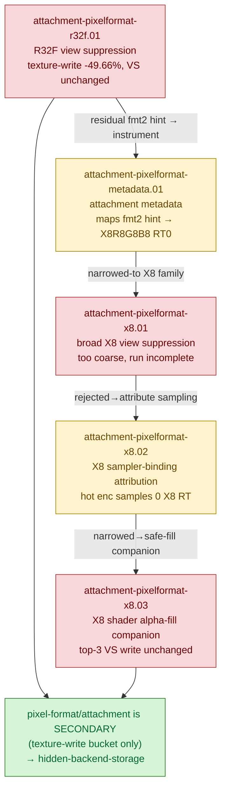

# Attachment / Pixel-Format — RT PixelFormatView suppression and lossless-compression hints

> Part of the 3DMark05 GT1 GPU-bottleneck investigation. Root map: [[overview]].

## Scope & question

This domain owns every attempt to chase Xcode's **lossless-compression**
insight: a render target carrying Metal `PixelFormatView` usage (and the
swizzled shader-read view dxmt9 attaches to honor D3D9's expanded read contract)
is excluded from Metal compression even when the captured frame uses it as a
render target only. The experiments suppress that view for R32F RTs and for
X8R8G8B8/X8B8G8R8 RTs, add attachment-metadata and X8 sampler-binding
instrumentation to map the hint to concrete hot-encoder RT shapes, and add a
shader-side X8 alpha-fill companion so an X8 view could be dropped safely. The
question each asks: *does pixel-format/attachment shape own the ~1.6 GiB VS
buffer-write bucket?* The answer is consistently **no** — these probes move the
texture-write bucket, not the VS-write owner.

## Hypotheses & verdicts

| # | Hypothesis | Verdict | Evidence |
|---|-----------|---------|----------|
| H1 | R32F RT `PixelFormatView`/shader-read view owns GT1 GPU cost | rejected (texture-write `-49.66%`, VS write unchanged) | [[attachment-pixelformat-r32f.01]] |
| H2 | Per-encoder attachment metadata can map Xcode's `fmt2` compression hint to hot RT shapes | tooling (maps to X8R8G8B8 RT0 in enc0/2; `usage=0x2` is not an unsampled proof) | [[attachment-pixelformat-metadata.01]] |
| H3 | Allocation-wide X8 RT view suppression removes the `fmt2` hint and moves cost | rejected (too coarse; run incomplete; X8 rows mostly textured) | [[attachment-pixelformat-x8.01]] |
| H4 | The hot GT1 encoder actually samples X8 RT aliases (so suppression matters there) | tooling/refuted (hot enc `60/2` samples 0 X8 RT; sampling only in post passes) | [[attachment-pixelformat-x8.02]] |
| H5 | Shader X8 alpha-fill + view suppression moves the texture/store or VS-write bucket | rejected (hot passes 0 alpha-fill; top-3 VS write unchanged `~1627.25MiB`) | [[attachment-pixelformat-x8.03]] |

## Verification methods

- **`DXMT9_SUPPRESS_RT_PIXEL_FORMAT_VIEW=1`** — drops the swizzled shader-read
  view on **R32F** RTs only; proves the texture-write bucket halves while VS
  write does not move. Correctness-risky if the RT is later sampled.
- **`DXMT9_SUPPRESS_X8_RT_PIXEL_FORMAT_VIEW=1`** (`--suppress-x8-rt-pixel-format-view`)
  — same suppression for X8R8G8B8/X8B8G8R8 RTs; isolated from the R32F flag so
  the two families compare independently. Correctness-risky for the D3D X8
  alpha-fill contract.
- **`DXMT9_X8_SHADER_ALPHA_FILL=1`** (`--x8-shader-alpha-fill`) — companion that
  forces sampled alpha to `1.0` in MSL when an active sampler binds an X8
  texture (`ShaderVariantKey::x8AlphaOneTextureMask`), so an X8 view could be
  dropped without losing alpha-fill. Expands PSO identity; gputrace-gated.
- **Attachment metadata in `DXMT9_PERF_ENCODER_BREAKDOWN=1`** — per-encoder RT/
  depth format, size, bytes-per-pixel, alias handle, `desc.usage`, swizzle, and
  shader-read-view request; maps the Xcode compression hint to RT shapes.
- **X8 binding counters** (`fragment_texture_binding_*`, `x8_rt_texture_binding_*`,
  `x8_shader_alpha_fill_*`) — separate "RT allocation needs a view sometime in
  its lifetime" from "the current hot encoder samples that X8 RT".
- **Finalizer gates** — `--require-xcode-counter-coverage`,
  `--require-dxmt-join-coverage`, `--require-top-pso-attribution` certify the
  joined Xcode/dxmt rows before any pass/fail claim.

> Caveat: all of these suppressions are **paired-gputrace diagnostics**, not
> correctness-preserving defaults. `usage=0x2` (`UsageRenderTarget`) is not proof
> a resource is never sampled; dropping a shader-read view breaks the D3D9
> expanded-read / X8 alpha-fill contract if the app later samples the RT.

## Experiment dependency graph

## Results synthesis

What is settled: **PixelFormatView suppression is a real but secondary lever.**
Removing R32F RT shader-read views halved Xcode's texture-write bucket
(`22.0 → 11.1 MiB`, `-49.66%`) and trimmed device write `-0.64%` — genuine
Metal lossless-compression / texture-write pressure relief. But none of it moved
the frame limiter: top-3 VS buffer write stayed `~1.627 GiB` and `1.000x`
unexplained by dxmt CPU writers across every probe (R32F suppression, broad X8
suppression, and the X8 shader alpha-fill companion's `34.641ms` gputrace). The
attribution work showed *why*: the Xcode `fmt2` hint maps to the hot
`X8R8G8B8` RT0, but the hot encoder `60/2` (`56.83%` GPU, `981 MiB` VS write,
`1268` fragment texture bindings) samples **zero** X8 RT aliases — X8 sampling
lives only in the tiny post/resolve passes (`<0.4%` GPU each), so allocation-wide
suppression is both unjustified and ineffective on the bottleneck path.

What is closed: pixel-format/attachment shape is **not** the first-order GPU
owner. It is also correctness-risky as a default (dropping a shader-read view
breaks D3D9 expanded-read / X8 alpha-fill if the RT is later sampled), so the
flags remain opt-in diagnostics. The surviving owner is hidden Apple GPU
vertex/tiler/parameter (TVB) backend storage — confirmed again here by offline
codegen showing only `184B` VS IR return / `128B` scratch against `1150–1603 B`
of Xcode VS write per invocation. A future X8 optimization, if pursued, would
need a per-alias lifetime or sampled-channel proof, not a blanket view removal.

## Cross-references
- [[hidden-backend-storage]] — the surviving first-order owner every probe in this domain points back to; the VS-write density / TVB model these texture-write deltas fail to touch.
- [[render-pass-store]] — sibling secondary class: RT/depth re-entry and store traffic, the other pass/attachment lever that does not move the VS-write bucket.
- [[backend-shape-classifiers]] — companion correctness-invalid/opt-in state classifiers (alpha/depth/cull/etc.) that, like these flags, reject their own state as the VS-write owner.
- [[overview]] — root map and priority DAG; this domain sits in the secondary (texture-write / lossless-compression) tier, below the hidden vertex backend.
