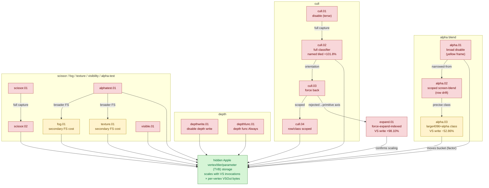

# Backend Shape Classifiers — correctness-invalid state toggles that test ownership of the hidden VS-write bucket

> Part of the 3DMark05 GT1 GPU-bottleneck investigation. Root map: [[overview]].

## Scope & question

This domain owns the family of **correctness-invalid diagnostic probes** that
toggle a single render / raster *state* (alpha blend, depth write, depth compare,
cull, scissor, fog, texture sampling, fragment visibility, indexed expansion,
alpha-test discard) to ask one question: does that state own the dominant Xcode
"VS Buffer Device Memory Bytes Written" bucket (~1.6 GiB across the top-3 GT1
frame60 encoders)? These probes deliberately render the wrong image — they are
classifiers gated on Xcode VS-write / VS-invocation deltas, **never optimizations**.
Almost every state was rejected: it moves GPU timing and sometimes the small
*named* tiled counters, but not the hidden bucket. Two state axes are notable
exceptions: a scoped **alpha-blend**-off on the large4096+alpha class moved the
bucket substantially, and forced **indexed expansion** nearly doubled it
(confirming indexed-submission pressure is real and must be kept).

## Hypotheses & verdicts

| # | Hypothesis | Verdict | Evidence |
|---|-----------|---------|----------|
| H1 | Broad alpha-blend state owns the VS-write bucket | rejected (GPU +1.72%, VS write +0.00%; yellow frame) | [[backend-shape-classifiers-alpha.01]] |
| H2 | Scoped screen-blend alpha-off proves blend ownership | rejected as proof (hot-row set drifts) | [[backend-shape-classifiers-alpha.02]] |
| H3 | Scoped large4096+alpha blend-off moves the bucket | **significant factor** (top VS write −52.86%); not a fix (correctness-invalid) | [[backend-shape-classifiers-alpha.03]] |
| H4 | Depth-write state owns the bucket | rejected (depth write −68.87%, VS write +0.01%, GPU +8.34%) | [[backend-shape-classifiers-depthwrite.01]] |
| H5 | Depth-compare (func Always) owns the bucket | rejected (VS write +0.041 MiB, GPU +5.03%) | [[backend-shape-classifiers-depthfunc.01]] |
| H6 | Cull state bit owns the bucket | rejected (VS write −0.00%, GPU +1.84%) | [[backend-shape-classifiers-cull.01]] |
| H7 | Cull moves the hidden bucket (full capture) | rejected; named tiled +101.8% but VS write flat → named tiler ≠ hidden bucket | [[backend-shape-classifiers-cull.02]] |
| H8 | Cull *orientation* (force back) owns the bucket | rejected (VS write +0.01%, GPU +1.50%) | [[backend-shape-classifiers-cull.03]] |
| H9 | Row/class-scoped cull owns one row's share | rejected (VS write −0.02%, named tiled +33.3%, GPU +1.58%) | [[backend-shape-classifiers-cull.04]] |
| H10 | Scissor state owns the bucket | rejected (VS write +0.06%, GPU +4.19%) | [[backend-shape-classifiers-scissor.01]] / [[backend-shape-classifiers-scissor.02]] |
| H11 | Fog source/blend owns the bucket | secondary (GPU −2.68%, FS write −10.3%, VS write +0.00%) | [[backend-shape-classifiers-fog.01]] |
| H12 | Fragment texture sampling owns the bucket | secondary (GPU −3.72%, top-3 VS write −3.24%, enc2-specific) | [[backend-shape-classifiers-texture.01]] |
| H13 | Hidden writes are coupled to fragment visibility | rejected (VS write +0.042 MiB, GPU +5.13%) | [[backend-shape-classifiers-visible.01]] |
| H14 | Indexed-submission pressure drives the bucket | confirmed (expand: GPU +87.74%, VS write +98.10%) — keep indexed path | [[backend-shape-classifiers-expand.01]] |
| H15 | Alpha-test discard owns the bucket / force-frag delta | rejected (GPU +1.72%, VS write +0.00%) | [[backend-shape-classifiers-alphatest.01]] |

## Verification methods

- **`DXMT9_PROBE_DISABLE_ALPHA_BLEND`** (+ `_ROW/_ROWS/_CLASS/_CLASSES`) — disable
  Metal blending while preserving color-write masks; broad form yields a yellow
  frame, scoped class form (`large4096,alpha-blend`) is verifiable via
  `probe_disable_alpha_blend_draws`. Proves alpha blend is a significant factor in
  the hidden backend shape for the alpha class.
- **`DXMT9_PROBE_DISABLE_DEPTH_WRITE`** — keep depth test, suppress writes; isolates
  depth attachment traffic from the bucket.
- **`DXMT9_PROBE_DEPTH_FUNC_ALWAYS`** (`--probe-depth-func-always`) — keep depth
  enable/write, force compare `Always`; isolates depth-compare shape from writes.
- **`DXMT_DISABLE_CULL`** (`--disable-cull`) and **`DXMT_DEBUG_FORCE_CULL_MODE`**
  (`--force-cull-mode none|front|back`) — broad cull removal / forced orientation;
  move named tiler/cull/clip counters but not the hidden bucket.
- **`DXMT9_PROBE_FORCE_CULL_MODE`** (+ `_ROW/_ROWS/_CLASS/_CLASSES`) — row/class-scoped
  cull override; verified per-row via the encoder breakdown's effective cull bucket.
- **`DXMT_DISABLE_SCISSOR`** (`--disable-scissor`) — drop scissor; GPU-time only.
- **`--disable-fog`** — strip fog-factor reads / fog blend path; secondary fragment cost.
- **`--force-texture-white`** — replace fragment texture samples with `float4(1.0)`;
  secondary, pass-specific (enc2) cost.
- **`DXMT_DEBUG_FORCE_VISIBLE`** (`DXMT9_DEBUG_FORCE_VISIBLE_DRAW`) — force visibility /
  blend / write-mask; tests fragment-visibility coupling.
- **`DXMT_FORCE_EXPAND_INDEXED`** (`--force-expand-indexed`) — flatten indexed draws to
  transient vertices; the decisive primitive-pressure classifier (doubles the bucket).
- **`DXMT_DISABLE_ALPHA_TEST`** (`--disable-alpha-test`) — strip generated alpha-test
  `discard_fragment()`; isolates the discard branch.
- **Finalizer gates** — every probe is finalized with `--require-xcode-counter-coverage
  --require-dxmt-join-coverage --require-top-pso-attribution` and, where shaders are
  dumped, `--require-shader-dump-matches`. These probes are **correctness-invalid**;
  they are judged only by Xcode VS-write / VS-invocation / hidden-estimate deltas, not
  by image fidelity.

## Experiment dependency graph

## Results synthesis

The settled result across this domain is consistent: **toggling a render/raster
state changes GPU timing and can move the small *named* tiled/cull/clip counters
(~30 MiB scale), but it does not move the ~1.6 GiB hidden VS-write bucket.** Depth
write, depth compare, cull (broad, orientation, and row/class-scoped), scissor,
fragment visibility, and alpha-test discard are all rejected as the first-order
owner — each leaves top-3 VS write within ±0.06% while GPU time drifts within
backend noise. The cull classifier is especially clarifying: it doubles the named
tiled counter while the hidden bucket stays flat, proving the named tiler counters
are ~55x too small to be the owner. Fog and texture sampling are amber
**secondary** fragment costs (≈ −2.7% / −3.7% GPU), real but not first-order, and
the texture effect is pass-specific (`60/2`).

Only two state axes move the bucket materially. **Alpha blend**, scoped to the
large4096+alpha class, cut top VS write `−52.86%` and bytes/invocation `−43.56%`
(amber: a confirmed *significant factor* in the hidden backend shape, but
correctness-invalid and not a fix). **Forced indexed expansion** nearly doubled the
bucket (`+98.10%`) while CPU bind churn *decreased*, proving the owner is GPU-side
vertex/primitive backend behavior tied to submitted primitive pressure — and that
the indexed submission path must stay mandatory. Both point at the same place: the
hidden bucket is owned by Apple GPU vertex-stage / tiler / parameter (TVB) backend
storage that scales with VS invocations × per-vertex VSOut bytes, and the only
correctness-preserving lever found is reducing VS invocations via index-cache
locality. Nothing here is open as a primary fix; the residual work is on the
locality / primitive axes, not state toggles.

## Cross-references
- [[hidden-backend-storage]] — the surviving owner every rejection in this domain points to (hidden TVB/parameter storage, VS-write density, scaling).
- [[vsout-layout]] — sibling axis: fog/texture/visibility classifiers also refute visible per-vertex width as the owner.
- [[index-cache-locality]] — the accepted production win; the expand and scoped-alpha findings here motivate reducing VS invocations within a mandatory indexed path.
- [[index-reuse-measurement]] — quantifies the indexed reuse / cache-miss shape that the force-expand classifier confirms is load-bearing.
- [[overview]] — root map, priority DAG, and synthesis.
