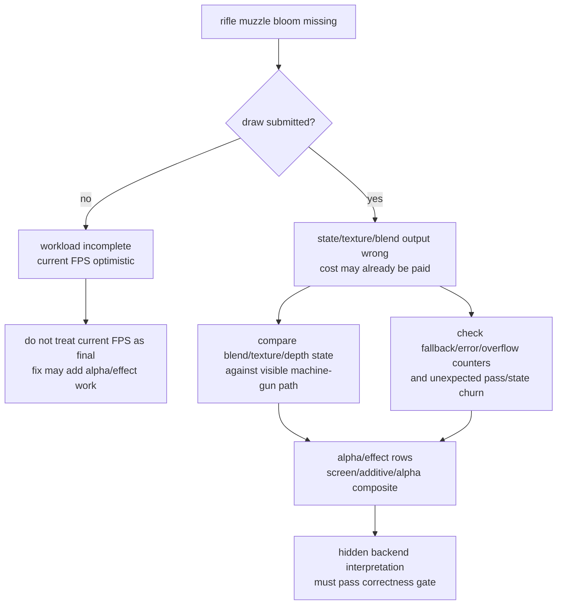
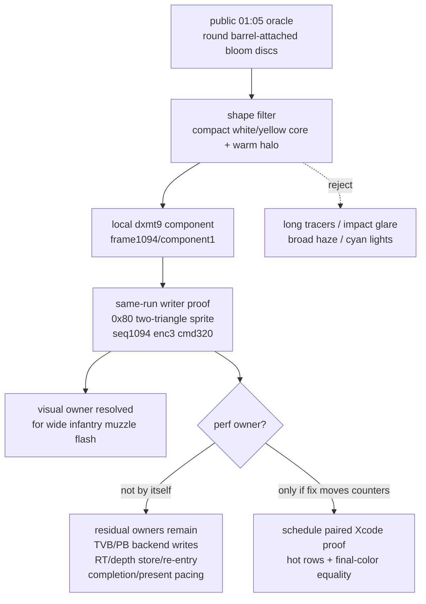
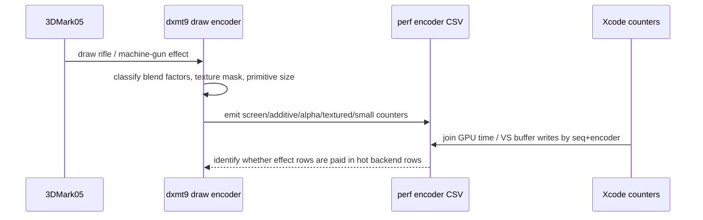
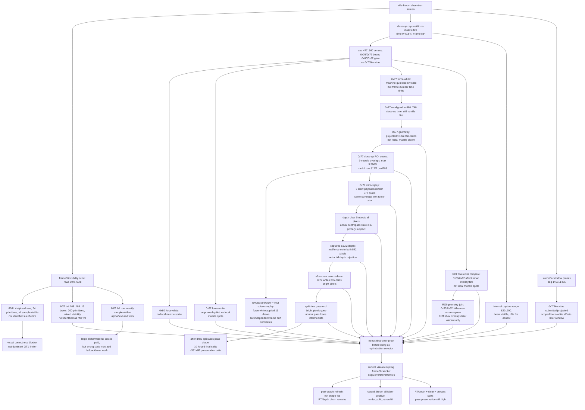

# Rifle Muzzle Bloom Correctness Gate for Alpha/Effect Rows

**Observation.** The machine-gun bloom / muzzle flash path is visible, and the
public `01:05` GT1/demo oracle shows rifle shots as smaller weapon-attached
circular white/yellow bloom discs. The user-provided `01:05` YouTube frame is
the strongest frame-level oracle so far: several infantry rifles show compact
round white/yellow bloom discs at the barrel tips, not long tracer strips,
impact sparks, or broad screen haze. This is a correctness issue, but it also
affects how GT1 performance baselines should be interpreted.

**Current visual status.** The rifle muzzle fire/bloom should no longer be
treated as a globally absent effect. The latest local evidence points to
dynamic DEFAULT buffer DISCARD/rename backing selection: queued draws that kept
only a logical `BufferHandle` could bind a newer active Metal buffer at encode
time. The current code now snapshots concrete stream/IB Metal backings in a
separate per-draw `DrawBindingSnapshot` payload, while `DrawBindingOverride`
remains the compact logical binding delta. The telemetry below still matters
because the optimized snapshot path must be revalidated against the round-bloom
oracle and checked for performance side effects.
The first follow-up split-payload scout reduces the old snapshot-bloated
binding override payload (`252,327,296` -> `84,775,040` bytes for about the
same 302k override records), so future visual/perf comparisons should use the
separate `DrawBindingSnapshot` model rather than the earlier enlarged
`DrawBindingOverride` model.
A later in-place capture-plist retry
(`app-d3d9-3dmark05-captureplist-frame60-gputrace-r1`) is useful as a current
visual/capture split: it rendered normally without `MTL_CAPTURE_ENABLED=1`, and
`actual.png` at HUD `Time 0:58.77` / `Frame 1025` contains visible compact
white/yellow rifle/effect bloom in the wide infantry window. A right-effect
component scan found a leading candidate bbox `1300,556..1370,602` with
`warm=528`, `white=136`, and max `[255,255,255]`, but the relaxed component
scan also shows the effect can merge into large spark/glow regions. Therefore
this is a visual-positive / draw-owner-negative sample: at that point the
visual-target gate remained `blocked-components-no-local-writer` until same-run
effect geometry or Xcode draw inspection ties the component to a local
`0x7f`/`0x75` source row.
A later same-run capture/effect-geometry and after-draw color-history pass now
does that for the wide infantry oracle with a different source class: the local
weapon-attached disc is a two-triangle `0x80` sprite, post-split
`seq=1094/enc=3/draw=0/cmd=320`, not `0x7f`/`0x75`.

**Priority policy.** Visual parity is the next gate. Historical large white
bloom mistakes were large enough to move performance, and the latest visual
fixes around ship-engine glow / bloom-like lighting appear to have small
positive timing side effects. GT1 FPS should therefore stay a diagnostic number
until the rifle muzzle effect is either rendered correctly or proved to be a
tiny, already-submitted row. Do not spend the next paired Xcode capture on this
branch before isolating the final-color writer for the rifle shot.

**Current working hypothesis.** Treat a missing bloom/glow effect as a possible
wrong-path performance symptom, not as a free optimization. If the effect is
absent because dxmt9 skips work, current FPS is optimistic. If the effect is
absent because state, texture identity, alpha blending, depth, or render-target
ordering is wrong, the renderer can still pay the visible draw cost while also
paying extra fallback, overflow, overwrite, or pass-churn cost. Recent
ship-engine blue glow fixes with small heuristic timing gains support keeping
this hypothesis live, even though the current frame60 smoke has not yet found
skipped/error/overflow/hazard-split evidence.

**Performance meaning.**

- If the rifle effect draw/pass is **not submitted**, current FPS is optimistic:
  the measured workload is lighter than a correct D3D9 frame. This would not
  explain why GT1 is slow; it means a fixed renderer may become slightly more
  expensive.
- If the draw is submitted but the final pixels are wrong, the GPU may already
  be paying the vertex/tiler/blend cost. Do **not** treat that as perf-neutral:
  wrong alpha/texture/depth state can also route through fallback, error,
  overflow, or overwrite paths that make correctness itself part of the
  bottleneck.
- Because screen-blend and large alpha classes have already moved the hidden
  backend bucket in correctness-invalid probes, alpha/effect correctness is not
  separable from the performance gate.

**Current implication after the `01:05` oracle.** The confirmed local writer is
a small `0x80` two-triangle sprite. That resolves the current visual-owner
question for the wide infantry scene, but it does not make the muzzle flash the
primary GT1 performance owner. Existing no-gputrace counters around the positive
run stay quiet for skipped draws, Metal command-buffer errors, hazard splits,
and map-buffer waits. The residual performance owner still points at hidden
vertex/tiler backend traffic, render-pass store/re-entry traffic, and
completion/present pacing. Treat muzzle correctness as a required visual parity
gate and as a wrong-path/perf-coupling sentinel; only promote it to a new Xcode
performance target if a same-input fix changes hot-row counters or final-color
store/pass behavior.





## Added telemetry

Encoder breakdown now exposes alpha/effect classifiers so the next GT1 run can
separate "effect missing from workload" from "effect submitted but rendered
wrong":

| Field | Meaning |
|---|---|
| `blend_screen_draws` | `ALPHABLENDENABLE && SRC=InvDestColor && DEST=One && OP=Add` |
| `blend_additive_draws` | `ALPHABLENDENABLE && SRC=One && DEST=One && OP=Add` |
| `blend_alpha_composite_draws` | `ALPHABLENDENABLE && SRC=SrcAlpha && DEST=InvSrcAlpha && OP=Add` |
| `alpha_blend_textured_{draws,primitives,vertices}` | alpha-blended draws that bind at least one texture |
| `alpha_blend_small_{draws,primitives,vertices}` | alpha-blended draws with `primitive_count <= 63`, a sprite/effect candidate bucket |

These fields are emitted in `[dxmt9-perf-encoder ...]`, preserved by
`scripts/tools/summarize_3dmark05_perf.py`, and joined into Xcode counter reports
as `dxmt_*` columns.



## Current candidate rows

`app-d3d9-3dmark05-rifle-alpha-telemetry-r1` was run as a no-gputrace
instrumentation smoke with `--frame 60 --no-gputrace --encoder-breakdown-seq 60
--timeout 180`. It timed out at the wrapper watchdog (`225s`) and produced
`partial-log` artifacts, so it is not a final performance run. It is enough to
prove the telemetry is populated. Run-level `draw_skipped_no_pipeline=0` was
present in the log, so this run does not show a pipeline-build failure as the
reason for a missing effect draw.

The frame60 encoder breakdown splits the alpha/effect candidates as:

- `60/2`: large alpha/textured row, `145` alpha-blended draws and `292,082`
  alpha-blended indexed-triangle primitives. The new classifier splits this into
  `103` screen-blend draws, `0` additive draws, `42` alpha-composite draws,
  `145` alpha-blended textured draws, and `22` small alpha-blended draws
  (`236` small primitives). This is performance-relevant even if the rifle
  effect itself is not isolated there.
- `60/8`: small alpha/textured row, `4` alpha-blended draws and `24` primitives,
  all alpha-composite and all small/textured, with `2` X8 RT texture-binding
  samples. This is a plausible sprite/post-effect class and should be checked
  when the rifle shot is visible.

An exploratory, unpaired join against the existing
`post-visualfix-frame60-baseline-r1` Xcode counter CSV was written to
`traces/app-d3d9-3dmark05-rifle-alpha-telemetry-r1/analysis/`. Because the Xcode
counters are from an earlier paired capture while the alpha/effect CSV is from a
current no-gputrace smoke, this is a **candidate-selection join**, not proof.
Still, the row labels line up with the known hot frame shape:

| Row | Xcode GPU share | Xcode VS buffer write | New alpha/effect attribution | Interpretation |
|---|---:|---:|---|---|
| `60/2` | `57.07%` | `981.159 MiB` | `103` screen, `42` alpha-composite, `145` textured, `22` small | If rifle bloom is in this row/class, correctness is also a performance gate. |
| `60/8` | `0.44%` | `0.000 MiB` | `4` alpha-composite, `4` textured, `4` small, `2` X8 RT texture samples | If rifle bloom is only here, it is likely a visual blocker, not the primary GT1 limiter. |

## Draw-level alpha probe

`app-d3d9-3dmark05-rifle-alpha-draw-probe-r1` was run with
`--frame 60 --no-gputrace --encoder-breakdown-seq 60 --measure-index-reuse`.
This is a mutation-free per-draw probe and finished with `status=pass`.
It produced `395` indexed probe rows:

- `60/2`: `187` draw rows, `145` alpha-blended rows.
- `60/8`: `5` draw rows, `4` alpha-blended rows.

The analysis artifacts live under
`traces/app-d3d9-3dmark05-rifle-alpha-draw-probe-r1/analysis/`:

- `frame60-60-2-alpha-draws.csv`
- `frame60-60-2-alpha-shader-with-msl-summary.csv`
- `frame60-60-8-alpha-draws.csv`
- `frame60-60-8-alpha-shader-with-msl-summary.csv`

The shader evidence uses the existing frame60 shader dump at
`traces/app-d3d9-3dmark05-frame60-trim-varyings-smoke-r1/analysis/shaders/msl`.

**`60/2` split.** The hot alpha row is not one effect. It is a sequence of
large screen-blend and standard-alpha material groups:

| Group | Draw indices | Draws | Primitives | Shader alpha evidence | Meaning |
|---|---:|---:|---:|---|---|
| screen, scissor on, PS `0xe2e1407f3be7deb` | `42..74` | `33` | `55,509` | dynamic expression, texture samples | Performance-relevant; not blend-off equivalent. |
| screen, scissor off, PS `0x503d342c94267c4e` | `84..125` with gaps | `33` | `55,509` | dynamic expression, texture samples | Performance-relevant; not blend-off equivalent. |
| standard alpha, PS `0x11cc89f85cc54054` | `126..167` with gaps | `38 + 4` | `97,294` | varying alpha | Performance-relevant; not blend-off equivalent. |
| small screen, PS `0xd3bae24e6d632f2d` | `168..186` | `19` | `200` | constant-one alpha, texture samples | Small effect-like tail inside the hot row, but still screen blend. |

All `60/2` rows remain correctness-sensitive. The large backend clue from
alpha-blend-off stays useful as a diagnostic, but the draw-level evidence
confirms it is not a production fix.

**`60/8` split.** The tiny row is a plausible sprite/post-effect candidate:

| Group | Draw indices | Draws | Primitives | Shader alpha evidence | Meaning |
|---|---:|---:|---:|---|---|
| standard alpha, PS `0x687cbac939b25a92` | `1` | `1` | `2` | constant-one alpha, texture sample | Tiny visual candidate; not a primary GPU limiter. |
| standard alpha, PS `0x32290b454906af4e` | `2..4` | `3` | `22` | constant-one alpha, texture samples | Tiny visual candidate; Xcode row is only `0.44%` GPU. |

If the rifle muzzle bloom belongs only to `60/8`, fixing it should not explain
the current low FPS. If it belongs to the `60/2` alpha material sequence, the
correction is also part of the hot backend row and must be included in the next
paired Xcode/gputrace proof.

## Visibility scout

`app-d3d9-3dmark05-rifle-alpha-visibility-r1` was run with
`--frame 60 --no-gputrace --encoder-breakdown-seq 60 --measure-index-reuse
--visibility-scout-rows 60/2,60/8`. This is still not final-color proof: the
visibility scout only reports whether samples survive at that draw point. It is
useful for separating obviously absent/no-sample work from submitted,
sample-visible work.

Artifacts:

- `traces/app-d3d9-3dmark05-rifle-alpha-visibility-r1/analysis/frame60-visibility-scout-summary.md`
- `traces/app-d3d9-3dmark05-rifle-alpha-visibility-r1/analysis/frame60-60-2-tail-visibility-summary.md`
- `traces/app-d3d9-3dmark05-rifle-alpha-visibility-r1/analysis/frame60-60-8-visibility-summary.md`

| Window | Draws | No-sample | Sample-visible | Visible samples | Miss32 delta | Interpretation |
|---|---:|---:|---:|---:|---:|---|
| `60/8` draws `1..4` | `4` | `0` | `4` | `67,370` | `-48` | Tiny submitted/sampled effect-class candidate; not proven to be rifle muzzle fire and not a primary limiter. |
| `60/2` draws `168..186` | `19` | `9` | `10` | `39,654` | `-209` | Small screen-blend tail inside the hot row; possible visual/effect tail, not proven rifle muzzle fire, and tiny locality denominator. |
| full `60/2` row | `187` | `25` | `162` | n/a | n/a | The hot row is mostly sample-visible alpha/textured material work, so any correctness-preserving optimization still needs final-color proof. |

The rifle bloom observation therefore narrows only the performance
interpretation, not the visual bug itself. If the missing rifle effect is only a
`60/8`-style sprite/post-effect row, a fix should not explain the current low
FPS. If it is a missing draw outside the captured candidates, the current FPS is
slightly optimistic because the frame is incomplete. If it is part of `60/2`,
the measured workload is already dominated by submitted sample-visible
alpha/textured material, and the next proof must be final-color/final-writer
aware rather than visibility-only.

## Rifle-window effect texture probe

The later rifle/tracer scene was re-probed with effect-draw texture filters and
projected geometry logging after the visual observation persisted. These runs
were timeout-finalized no-gputrace diagnostics, not performance baselines:

- `app-d3d9-3dmark05-rifle-fireatlas-project-rifle-window-r1`
- `app-d3d9-3dmark05-rifle-effect-seqrange-r1`
- `app-d3d9-3dmark05-rifle-glow128-project-r1`
- `app-d3d9-3dmark05-rifle-force-white-07f-handle-r1`
- `app-d3d9-3dmark05-rifle-force-white-07f-row1450-1455-noenc-r1`

Artifacts are under the matching `traces/<run-id>/analysis/` directories. The
large raw seq-range logs were removed after writing
`effect-draw-summary.md`.

**Fire atlas (`0x20000010000007f`).** The 1024x256 DXT1 fire atlas is submitted
in the rifle-window scene with the same simple effect VS/PS pair used by the
visible machine-gun flame (`VS 0x8046aaf9f26deff7`,
`PS 0xd3bae24e6d632f2d`). Projected bbox evidence shows it is not a missing
draw:

| Window | Draw shape | Projected state | Interpretation |
|---|---|---|---|
| seq `1454/11` tail | `4` small triangle-list draws, fire atlas | logical screen bbox roughly `x=575..1011`, `y=288..591`, all refs projected visible | Draw is paid and screen-visible; not proven to be the missing rifle muzzle flame. |
| seq `1455/11` tail | `4` small triangle-list draws, fire atlas | logical screen bbox roughly `x=562..1072`, `y=262..629`, mostly/all refs projected visible | Draw overlaps the right-side rifle/tracer region, not the clearly missing foreground muzzle flame. |

Follow-up A/B:

- Whole-handle `--probe-force-texture-white-texture0 0x20000010000007f`
  turns the visible machine-gun fire atlas into a large white sprite. This
  confirms the handle filter hits the real flame-atlas sampling path.
- Row-scoped no-encoder
  `--probe-force-texture-white-rows 1450/11,1451/11,1452/11,1453/11,1454/11,1455/11`
  reaches the rifle-window scene (`Time 0:58.12`, `Frame 1036`) and the runtime log reports
  `encode_draw_pso_prefetch_bypass_probe=24`. This confirms that the scoped
  fire-atlas probe applied in the rifle-window neighborhood without needing
  heavy encoder breakdown.
- The row-scoped image still does not prove that this is the exact missing
  close-up rifle muzzle writer. It proves the fire atlas is not globally absent
  from the rifle scene and that final-color isolation must be done against the
  specific expected muzzle pixels/frame.

**Tracer/beam candidates.** The broad seq-range draw trace (`1350..1500`)
identified the same effect shader pair on `512x64` textures:

| Texture | Preview meaning | Draws in seq range | Interpretation |
|---|---|---:|---|
| `0x200000100000075` | warm beam/tracer with a small round flare at the head | `235` small draws / `2,820` primitives | Likely rifle/tracer streak work, not a standalone fire/bloom sprite. |
| `0x200000100000076` | beam/tracer texture seen in earlier sidecars | `148` small draws / `2,368` primitives | Confirms tracer path is submitted. |
| `0x20000010000007f` | flame/smoke atlas | `228` small draws / `1,368` primitives | Submitted and projected, but not yet final-color identified as rifle muzzle fire. |

**128x128 glow candidates.** `0x80` (white circular glow) and `0x82`
(blue-white rectangular glow) are also submitted in the rifle-window range, but
their captured vertices are screen-space/post-effect shaped:
`pos_min=(-0.5,-0.5,0,1)`, `pos_max=(1023.5,767.5,0,1)`. They are not local
muzzle billboards. The projection helper intentionally refuses these as normal
clip-space VS constants (`projected_refs=0`), which is a diagnostic limitation
for this screen-space shader but enough to classify the geometry shape.

**Close-up capture recheck.** The wrapper now accepts `--capture-delay-sec SEC`
plus deterministic internal backbuffer capture controls (`--capture-frames`,
`--capture-range`, `--capture-dir`). `--capture-delay-sec` is useful for
wall-clock screenshot smokes because the catalogue default captures a later GT1
scene; `--capture-range` is useful for frame-window probes that should not open
Xcode. A no-gputrace, no-encoder run with `--capture-delay-sec 64` reached the
close-up window (`app-d3d9-3dmark05-rifle-closeup-capture64-noenc-r1`,
`Time 0:49.84`, `Frame 884`) and still showed no rifle muzzle fire.

The deterministic baseline range
`app-d3d9-3dmark05-rifle-capture-range820-900-noenc-r1`
captured internal frames `820,840,860,880,900` under
`traces/<run-id>/analysis/captures_png/`. The close-up frames include visible
cyan beam/tracer samples, but no orange/white rifle muzzle bloom:

| Internal frame | HUD time/frame | Visual note |
|---:|---|---|
| `820` | `0:46.25` / `812` | close-up; cyan beam at right edge; no muzzle fire |
| `860` | `0:48.45` / `852` | close-up; cyan beam near top; no muzzle fire |
| `880` | `0:49.61` / `872` | close-up; cyan beam at right edge; no muzzle fire |

The existing effect census for the close-up seq range (`477..560`) shows
`0x76`, `0x77`, `0x80`, and `0x82` repeatedly, but no `0x7f` fire atlas in that
window. This lowers the current close-up hypothesis from "fire atlas submitted
but invisible" to "close-up is using beam/glow candidates or a still-unseen draw,
not the known machine-gun fire-atlas path."

Follow-up close-up A/B:

- `app-d3d9-3dmark05-rifle-forcewhite-tex80-range820-900-noenc-r1` applied the
  `0x200000100000080` 128x128 force-white probe
  (`encode_draw_pso_prefetch_bypass_probe=964`). The same frame window still
  does not show a local muzzle sprite; any visible change is background/glow
  shaped rather than the missing rifle fire.
- `app-d3d9-3dmark05-rifle-forcewhite-tex82-range820-900-noenc-r1` applied the
  `0x200000100000082` 128x128 force-white probe
  (`encode_draw_pso_prefetch_bypass_probe=783`). It can affect a large
  translucent overlay/tint, but it also does not create a local muzzle-fire
  sprite in the close-up range.
- `app-d3d9-3dmark05-rifle-forcewhite-tex77-range820-900-noenc-r1` applied the
  `0x200000100000077` 512x64 force-white probe
  (`encode_draw_pso_prefetch_bypass_probe=1718`) and proved that `0x77` can
  produce a very large white/pink machine-gun muzzle bloom. However, the probe
  changes performance enough that internal frame `820` drifts to HUD
  `Time 0:55.65`, not the baseline close-up `Time 0:46.xx`; frame number alone
  is not animation-time stable under heavy visual probes.
- `app-d3d9-3dmark05-rifle-forcewhite-tex77-range660-740-noenc-r1` re-aligned
  `0x77` to the close-up by capturing earlier internal frames. It hit the
  close-up time window (`0:46.39`, `0:47.82`, `0:49.60`) with
  `encode_draw_pso_prefetch_bypass_probe=1644`, but still did not produce the
  missing rifle muzzle fire. This makes `0x77` unlikely to be the close-up
  final-color writer, despite being a submitted beam/flame-family texture.
- `app-d3d9-3dmark05-rifle-effect-tex77-geometry-seq477-560-r1` logged
  `264` projected `0x77` geometry rows in the close-up census range. The draws
  are submitted, depth-tested with depth writes off, and projected-visible, but
  their screen bounds are mostly thin strips such as `x=690..707/y=336..343`,
  `x=922..936/y=281..286`, or wider horizontal strips with only `~10..30px`
  height. This shape fits tracer/impact strips better than a large radial rifle
  muzzle bloom.

**ROI final-color comparison.** `compare_experiment_images.py` now accepts
repeatable `--roi L,T,R,B[:name]` regions, so existing deterministic close-up
captures can be re-scored without another run. The first ROI check compared
baseline frame `820` from
`app-d3d9-3dmark05-rifle-capture-range820-900-noenc-r1` against the force-white
candidate captures:

- `app-d3d9-3dmark05-rifle-forcewhite-tex80-range820-900-noenc-r1`
- `app-d3d9-3dmark05-rifle-forcewhite-tex82-range820-900-noenc-r1`
- `app-d3d9-3dmark05-rifle-forcewhite-tex77-range820-900-noenc-r1`
- the time-realigned
  `app-d3d9-3dmark05-rifle-forcewhite-tex77-range660-740-noenc-r1`

Regions:

| ROI | Rect | Purpose |
|---|---|---|
| `muzzle-candidate` | `700,230,800,330` | approximate weapon muzzle/right-front area in baseline frame `820` |
| `right-weapon-region` | `650,180,900,380` | wider weapon/soldier/right-cover area |
| `cyan-beam-region` | `840,120,1024,260` | known visible cyan beam / overlay region |

Results:

| Candidate | Full changed % | Muzzle ROI changed % | Muzzle max delta | Reading |
|---|---:|---:|---:|---|
| `0x80` force-white frame820 | `92.37%` | `99.83%` | `101` | affects final color broadly and removes/changes beam/overlay tone, but does not create a local muzzle sprite |
| `0x82` force-white frame820 | `92.57%` | `100.00%` | `145` | large rectangular overlay/tint final-color writer, not local rifle fire |
| `0x77` force-white frame820 | `96.49%` | `100.00%` | `255` | frame-number drift / large global change; not useful as same-time proof |
| `0x77` force-white frame660 vs baseline820 | `81.80%` | `85.08%` | `69` | time-realigned closer but still broad drift; does not identify a local muzzle sprite |

This adds one useful distinction. `0x80`/`0x82` are not "no final-color effect"
textures; they definitely affect the image. But their effect shape is global
overlay/tint/beam-like, not the expected close-up orange/white muzzle fire.
`0x77` remains noisy because the force-white probe changes timing and broad
beam/flame-family output. ROI comparison therefore narrows the candidate list
but still does not prove the missing rifle final-color writer. The next useful
probe needs either a true draw-local final-writer oracle or a much smaller
mutation window around expected muzzle pixels.

**ROI geometry overlap.** `summarize_effect_geometry_roi.py` now joins
`dxmt9-effect-geometry` rows to the same screen-space ROIs. It uses projected
`screen_min/screen_max` when the helper has clip-space projection data, and
falls back to screen-space `pos_min/pos_max` for pretransformed/fullscreen glow
quads. This is deliberately only bbox candidate evidence; a large projected
bbox can cover a ROI without proving that the primitive becomes the final-color
writer for the expected muzzle pixels.

Generated summaries:

- `traces/app-d3d9-3dmark05-rifle-fireatlas-project-rifle-window-r1/analysis/fireatlas-roi-geometry.md`
- `traces/app-d3d9-3dmark05-rifle-glow128-project-r1/analysis/glow128-roi-geometry.md`

Results:

| Probe | Rows with bbox | Overlap rows | Reading |
|---|---:|---:|---|
| `0x7f` fire atlas, later rifle-window | `636` | `835` | Projected bboxes overlap all three ROIs, but many boxes are very large/offscreen and this is a later-window probe, not the close-up missing-effect frame. It proves the atlas can occupy comparable screen regions; it does not identify the close-up final writer. |
| `0x80`/`0x82` 128x128 glow | `264` | `792` | All ROIs are covered by `screen-space-pos` fullscreen quads. This confirms the force-white image changes are overlay/glow-shaped and explains why ROI color deltas were broad rather than local muzzle-sprite shaped. |
| `0x77` close-up seq `477..560` | `427` | `264` | Regenerated in `app-d3d9-3dmark05-rifle-effect-tex77-geometry-seq477-560-commandindex-r2` after rebuilding the native `winemetal.so`/`libdxmt9_native.dylib` path. It overlaps the muzzle ROI only `9` times, with max ROI coverage `5.586%`; the larger `thin-strip-candidate` ROI catches `187` rows but still only thin strip geometry. |

The useful distinction is now: geometry overlap can rank candidates, but final
color still needs a draw-local writer oracle or a targeted mutation. The
fullscreen glow path is a valid visual/perf coupling suspect because it touches
the relevant pixels broadly; it is not by itself the missing rifle muzzle flash.
The fire atlas path remains visible/submitted in related rifle windows, while
the close-up census still lacks `0x7f`. The close-up `0x77` path still looks
like tracer/impact geometry rather than a wide orange/white muzzle bloom: its
best current muzzle ROI hit is `seq=517/encoder=2/draw=1`, bbox
`x=666.831..723.417`, `y=231.283..255.138`, intersection `558.613px`, and ROI
coverage `5.586%`.

`plan_effect_roi_forcewhite_probes.py` now turns ROI geometry CSVs into
draw-local force-white queues. It records the important index convention:
`dxmt9-effect-geometry` logs `encoder_draw_index` as 1-based (`stats.drawCalls +
1`), while `DXMT9_PROBE_INDEXED_TRIANGLE_ENCODER_DRAW_MIN/MAX` matches the
pre-increment 0-based `stats.drawCalls` value. The queue prefers
`command_index` when the geometry log has it, because global draw ordinals were
already proven run-local and failed to replay the candidate. The current
close-up `0x77` queue is:

- `traces/app-d3d9-3dmark05-rifle-effect-tex77-geometry-seq477-560-commandindex-r2/analysis/tex77-roi-forcewhite-queue.md`

The rank-1 muzzle command scopes mutation to `row 517/2`, texture
`0x200000100000077`, probe draw index `0`, and `command_index=293`.
`app-d3d9-3dmark05-rifle-tex77-commandindex-roi-forcewhite-r01-muzzle-candidate-tex77-s517-e2-d1-ci293`
captured frames `820..900`, but still reported
`encode_draw_pso_prefetch_bypass_probe=0`. That means the command-index
selector did not hit a draw in the replayed force-white run. Treat this as a
selector/replay instability finding, not as final proof that `0x77` has no
final-color role. The geometry shape still argues that `0x77` is a
tracer/impact strip rather than the missing radial rifle muzzle fire, and the
next proof should be same-run final-writer instrumentation or direct gputrace
draw inspection rather than another independent run keyed by ordinal/command
slot.

`app-d3d9-3dmark05-rifle-tex77-roi-scissor-forcewhite-r01-s517-e2-d0`
then removed the command-index selector and limited the raster footprint to the
approximate muzzle ROI (`700,230,800,330`) with
`DXMT9_PROBE_SCISSOR_RECT`. This no-gputrace run timeout-finalized through the
watchdog, but emitted usable logs and captured frames `820..900`. It reported
`encode_draw_pso_prefetch_bypass_probe=11`, so the row/texture/draw selector did
hit and did force the diagnostic PSO path. However, baseline-vs-probe and
probe-vs-previous-replay image diffs were dominated by independent-run
animation/frame drift rather than a clean local muzzle delta. The generated crop
montage lives at
`traces/app-d3d9-3dmark05-rifle-tex77-roi-scissor-forcewhite-r01-s517-e2-d0/analysis/roi_montage_820_900.png`.
This is a useful negative gate: draw-local selectors can apply, but independent
frame-number replays are still not a final-color oracle. The next reliable
proof needs same-run final-writer capture/mutation or direct Xcode draw
inspection, not another ordinal/command-index replay.

**`0x77` mini-replay/depth gate.**
`app-d3d9-3dmark05-rifle-tex77-s517-e2-d261-272-payload-r1` reran the
close-up `0x77` selector with shader, texture, constant-buffer, stream, and
index payload dumps. The first payload attempt used the stale draw-0 queue and
dumped no geometry. The successful payload run shows why: even within
consecutive no-gputrace breakdown runs, the same row-local texture window moved
from encoder draw `261..272` to `267..278`. Treat row/draw/command indices as
run-local selectors, not stable cross-run identities.

The successful payload captured six consecutive `0x77` rows:

| Run-local window | Draw ordinals | Shape | State |
|---|---:|---|---|
| `517/2` encoder draws `267..272` | `324077..324082` | `6` draws, each `16` primitives / `48` indices, `stream0_stride=24` | `texture0=0x200000100000077`, `alpha_blend=1`, `src_blend=10`, `dst_blend=2`, `depth_enabled=1`, `depth_write=0`, `depth_func=4` |

`tex77-mini-replay-manifest.json` was built from the payload under
`traces/app-d3d9-3dmark05-rifle-tex77-s517-e2-d261-272-payload-r1/analysis/`.
The manifest has `draw_count=6`, `missing_draw_shader_files=0`, and resolves the
draw-hash shader pair:

- VS `0x8046aaf9f26deff7`
  (`translated-vs-shader-9243263275715391479-source-6133452543898343157.metal`)
- PS `0xd3bae24e6d632f2d`
  (`translated-fs-shader-15256755514141519661-source-14290151759992571626.metal`)

Standalone Metal mini-replay with the real `0x77` texture sidecar succeeds:

| Replay | Texture input | Depth clear | Nonzero pixels | BBox | Reading |
|---|---|---:|---:|---|---|
| original FS/texture | `0x77` sidecar | `1.0` | `577` | `142,244..680,340` | Produces small orange/white streaks; the candidate draw is not blank. |
| force fragment color | none | `1.0` | `577` | `142,244..680,340` | Geometry/depth coverage equals the real FS output footprint. |
| force fragment color | none | `0.0` | `0` | n/a | The same draw is fully depth-rejected against a near/zero clear. |

`app-d3d9-3dmark05-rifle-tex77-depth-s517-e2-r1` then dumped the actual
`517/2` depth attachment (`0x300000100000001`) with
`DXMT9_DUMP_DEPTH_ATTACHMENT_*`. The run timeout-finalized as expected, but wrote
`depth-s517-e2.bin` plus JSON metadata:

- format `D24X8`, Metal pixel format `260`, `1024x768`, row bytes `4096`,
  byte count `3,145,728`.
- The float depth distribution is far-range, roughly `0.993832..0.999492`;
  the `0x77` mini-replay bbox has depth `0.999229..0.999433`.
- The matching indexed probe from the earlier payload run shows every `517/2`
  draw has `depth_write=0`, so an end-of-encoder depth dump is not dirtied by
  later depth writes in this row.

Using this captured depth as mini-replay `--depth-input` produces:

| Replay | Depth input | Nonzero pixels | BBox | Reading |
|---|---|---:|---|---|
| original FS/texture | captured `517/2` depth | `542` | `160,244..680,340` | Actual depth rejects only `35` pixels vs clear-depth replay. |
| force fragment color | captured `517/2` depth | `542` | `160,244..680,340` | Coverage still equals the real FS/texture footprint. |

So depth is real and relevant, but not the full explanation for the missing
close-up rifle fire: captured `517/2` depth still lets almost all of these
`0x77` pixels through. The priority now shifts from "depth alone hides this
candidate" to final-writer overwrite/blend/order, animation-time mismatch, or a
separate still-unidentified close-up muzzle draw.

`app-d3d9-3dmark05-rifle-tex77-payload-color-frame517-r1` then added same-run
color attachment sidecar capture for `517/2` while re-dumping the `0x77`
payload. Color render-target handles are not stable across runs, so
`DXMT9_DUMP_COLOR_ATTACHMENT_INDEX=0` is the useful gate rather than a fixed
handle. This run used `--frame 517`, which is required because the wrapper's
encoder-breakdown default otherwise scopes probe rows to frame/seq `60`.

The run captured `11` `0x77` probe rows, with the selected payload window at
`517/2` encoder draws `267..272` (`draw ordinals 324821..324826`), and wrote
`color-s517-e2.bin`:

| Sidecar | Metadata | Result |
|---|---|---|
| color attachment index `0` | `X8R8G8B8`, `1024x768`, `rowBytes=4096`, handle `0x300014f0000000a` | Pass-end color dump succeeded for the same run that captured `0x77` geometry/texture payloads. |
| `0x77` mini bbox `142,244..680,340` | avg `[56.36, 50.67, 40.27]`, max `[206,199,174]` | No bright/orange-white final color remains at pass end. |
| muzzle guess ROI `700,230..800,330` | avg `[61.47,55.96,45.16]`, max `[170,164,140]` | No local muzzle-like bright final color. |
| full color attachment | max `[211,205,197]`, bright pixels `0` for channel `>220` | The pass-end frame has no white bloom/flash-class pixels. |

This is a stronger negative than the cross-run force-white probes: in the same
run, the `0x77` draw payload exists, standalone replay can render it, captured
depth mostly lets it survive, but the render-pass end color attachment contains
no bright trace of it. That does **not** prove `0x77` is impossible as an
intermediate contribution, because later draws in the same pass can still
overwrite or blend it away before the sidecar is copied. It does lower the
candidate from "missing because blank/depth-skipped" to "not the observed
pass-end final writer". The next precise proof would need draw-boundary color
history, direct Xcode draw inspection, or a final-writer oracle that can stop
after the target draw without relying on cross-run frame numbers.

`app-d3d9-3dmark05-rifle-tex77-afterdraw-color-frame517-r2` then added the
first draw-boundary color-history probe. The diagnostic ends the render encoder
immediately after the selected draw, dumps color attachment index `0`, and
reopens the pass with load for the remaining draws. This is intentionally
pass-shape-mutating and is only a correctness diagnostic. The first attempt with
a fixed draw number missed because the target draw index drifted between runs;
the robust selector is `seq=517`, `enc=2`, `texture0=0x200000100000077`.

The successful run hit `seq=517/enc=2/draw=272` (`draw ordinal 323408`) with
`texture0=0x200000100000077`, `primitive_count=16`, `vertex_count=48`,
`alpha_blend=1`, `src_blend=10`, `dst_blend=2`, and `depth_write=0`, and wrote
`color-after-first-tex77.bin`:

| Sidecar | Metadata | Result |
|---|---|---|
| after-draw color attachment index `0` | `X8R8G8B8`, `1024x768`, `rowBytes=4096`, handle `0x300015d0000000a`, `afterDraw=1`, draw `272` | Draw-boundary dump succeeded immediately after the first selected `0x77` draw. |
| `0x77` mini bbox `142,244..680,340` | avg `[57.10,51.37,41.11]`, max `[255,255,252]`, bright pixels `27`, white pixels `7` | The candidate writes bright orange/white pixels immediately after the draw. |
| muzzle guess ROI `700,230..800,330` | avg `[62.93,57.44,46.64]`, max `[159,154,133]`, bright pixels `0` | The known approximate close-up muzzle ROI still does not show a local bloom. |
| full color attachment | max `[255,255,252]`, bright pixels `174`, white pixels `7` | Bright effect-class pixels exist before pass-end. |

Compared with the prior pass-end color sidecar, this flips the specific
question from "does `0x77` ever write bright color?" to "why does a bright
intermediate not survive the normal pass-end store?" The after-draw crop
contains a small orange/white point, while the pass-end crop for the same logical
row family has no channel above `220`. This supports the user's broader
correctness/performance hypothesis: an absent bloom is not automatically a
workload reduction. A wrong pass/blend/order path can hide submitted pixels while
still paying draw cost and can also add extra overwrite, preservation, or
fallback-shaped work.

**Current-build draw-boundary history.** A follow-up run added directory-mode
color sidecars with `DXMT9_DUMP_COLOR_ATTACHMENT_TEXTURE0S` so multiple
candidate textures can be captured without relying on frame-local draw numbers:

- `app-d3d9-3dmark05-rifle-tex77-tex80-color-history-frame517-r1`
- selector: `seq=517`, after-draw, color index `0`,
  `texture0s=0x200000100000077,0x200000100000080`
- result: `10` sidecars, all `texture0=0x200000100000077`; `0x80` did not match
  this frame-517 attachment history
- command index in this non-mutating run: `306`

The matching split-free pass-end check was:

- `app-d3d9-3dmark05-rifle-tex77-passend-color-frame517-current-r1`
- selector: `seq=517`, `enc=2`, color index `0`, no after-draw split

| Capture | Result |
|---|---|
| split-free current pass-end | `mini bbox` max `[207,199,175]`, bright `0`, white `0`; full attachment max `[211,205,197]`, bright `0`, white `0` |
| after-draw history, last `0x77` sidecar | `mini bbox` max `[255,255,250]`, bright `273`, white `5`; full attachment max `[255,255,254]`, bright `522`, white `12` |
| after-draw history sequence | encoders `2..11`, all command index `306`; the bright pixels remain through the selected `0x77` group |
| pass-shape cost | after-draw history adds `render_split_final=10` and raises tile-preservation bytes from `211,128,176,640` to `211,527,811,072` (`~381MiB`) versus the split-free pass-end run |

The reproducible ROI summary was generated with
`scripts/tools/summarize_color_attachment_dumps.py` and is stored at
`traces/app-d3d9-3dmark05-rifle-tex77-tex80-color-history-frame517-r1/analysis/color-history-summary.md`
with CSV output beside it.

Follow-up instrumentation now writes `commandDrawIndex` and `commandDrawCount`
into color sidecar metadata and directory-mode filenames. Use those fields on
the next run to distinguish "multiple draw-run items inside one command" from
"the same command repeated after diagnostic splits"; the `r1` artifacts above
predate that extra metadata.

`app-d3d9-3dmark05-rifle-tex77-tex80-color-history-frame517-r2` reran the same
selector after the sidecar metadata update. It timeout-finalized normally and
wrote `16` after-draw color sidecars with command-local draw-run positions:

| Texture | Command / command-draw range | Full-frame brightness | Mini / muzzle ROI brightness | Reading |
|---|---|---:|---:|---|
| `0x200000100000077` | `319:0/9..8/9`, `320:0/4..3/4` | max `[237,235,232]`, `34` bright pixels, `0` white pixels; hot pixel near `(1016,674)` | `0` bright pixels in both the mini bbox and muzzle guess ROIs | Current run-local `0x77` matches are small screen-blend/tracer-class work, not the close-up muzzle ROI writer. |
| `0x200000100000080` | `322:0/3..2/3` | max `[249,255,255]`, `355` bright pixels, `18` white pixels; hot pixel near `(483,381)` | `0` bright pixels in both the mini bbox and muzzle guess ROIs | `0x80` is a real bright glow/overlay contributor in this frame, but still not local rifle muzzle fire. |

The regenerated summaries are:

- `traces/app-d3d9-3dmark05-rifle-tex77-tex80-color-history-frame517-r2/analysis/color-history-summary.md`
- `traces/app-d3d9-3dmark05-rifle-tex77-tex80-color-history-frame517-r2/analysis/color-history-full-summary.md`

This rerun also confirms that draw-boundary color histories are a heavy
diagnostic mutation: `render_split_final=16` and tile-preservation bytes rose to
`211,812,536,320`, about `652.66MiB` above the split-free current pass-end check.
The useful new evidence is the command-local attribution, not the extra pass
splits.

`app-d3d9-3dmark05-rifle-effect-tex80-geometry-seq477-560-r1` then reran a
non-mutating `0x80` geometry census for the same close-up sequence window. This
run finished with `status=pass`, `render_split_final=0`, and `102`
`dxmt9-effect-geometry` rows. Every row is the same 128x128 texture class
rendered as a screen-space fullscreen quad:

| Evidence | Result |
|---|---|
| Texture / shape | `0x200000100000080`, `primitive_type=3`, usually `2` primitives / `6` indices |
| Blend/depth | `src_blend=5`, `dst_blend=2`, depth test on, depth write off |
| Screen bbox | `pos_min=(-0.5,-0.5,0,1)`, `pos_max=(1023.5,767.5,0,1)`, `bbox_source=screen-space-pos` |
| ROI join | `102` rows overlap every tested ROI by construction; max ROI coverage is `100%` for muzzle/right/thin-strip and `99.728%` for the cyan-beam ROI |
| Frame517 sample | one run-local row at `517/2`, command `303`, ordinal `325168`, fullscreen bbox |

Artifacts:

- `traces/app-d3d9-3dmark05-rifle-effect-tex80-geometry-seq477-560-r1/analysis/tex80-roi-geometry.md`
- `traces/app-d3d9-3dmark05-rifle-effect-tex80-geometry-seq477-560-r1/analysis/tex80-roi-forcewhite-queue.md`

The force-white queue is intentionally de-duplicated by `command_index` when it
is present, because multiple ordinals can map to the same command-local draw
selector. The queue is useful only if we need to prove global overlay behavior;
it is not a local muzzle-fire queue. `0x80` is therefore a submitted glow/post
overlay contributor, not the missing radial rifle muzzle fire.

This is a stricter reading than "some later draw overwrites it." Across the
current instrumented runs, the diagnostic split can materialize bright
intermediate effect pixels (`r1`), but the command-attributed rerun (`r2`) also
shows run-local selector drift: `0x77` can be only a small non-local bright trace,
while `0x80` contributes a bright full-frame glow away from the muzzle ROIs. The
open branch is therefore draw/blend/depth order, tile load/store/preservation
behavior, the diagnostic pass split changing state shape, animation/frame-window
mismatch, or a separate still-unidentified close-up muzzle draw outside the
current candidate textures. Do not treat the after-draw split as a production
fix; it is pass-shape-mutating evidence.

The crop montage lives at
`traces/app-d3d9-3dmark05-rifle-tex77-s517-e2-d261-272-payload-r1/analysis/mini-replay-tex77-crop-montage.png`.

This changes the interpretation of `0x77`. It is not an unimplemented or skipped
draw class: in isolation, it can render a small additive-looking beam/spark
shape using the real texture and shader. With the captured depth input it still
mostly survives, so if it does not appear in the final close-up frame, the
leading suspects are now draw/blend/depth order, render-pass load/store
preservation, the diagnostic split changing pass shape, a frame-window mismatch,
or a separate untracked muzzle draw. The same-run color sidecar further lowers
`0x77` as the final close-up muzzle writer because no bright pass-end color is
left where the standalone replay draws pixels. This supports the broader
correctness/performance hypothesis: the missing rifle effect is not automatically
"free performance"; a wrong depth/pass/blend path can hide pixels while still
paying draw cost and potentially adding extra pass churn or wrong-path work.

One process lesson came out of this probe: the first command-index collection
(`...commandindex-r1`) still lacked `command_index=` in runtime logs because
the native Unix provider was stale. `libdxmt9_runtime.a` had rebuilt, but the
installed `build-x86_64-builtin/src/winemetal/unix/winemetal.so` did not contain
the new encoder strings until
`ninja -C build-x86_64-builtin src/libdxmt9_native.dylib src/winemetal/unix/winemetal.so`
was run. Before trusting a 3DMark05 trace after native encoder edits, verify
the staged `winemetal.so` contains the new diagnostic string or rebuild the
native targets explicitly.

**Updated verdict.** The current evidence rules out a simple "fire atlas draw is
globally missing" explanation. The renderer is paying for the flame atlas in
the later rifle-window scene, and a scoped fire-atlas force-white probe affects
that neighborhood. The earlier `517/2` mini-replay and color sidecars prove that
the submitted `0x77` candidate can render a small orange/white streak in
isolation, is depth-sensitive, and can produce bright intermediate pixels when a
diagnostic after-draw split forces a boundary. However, the latest visual check
shows `seq=517` is not the foreground close-up rifle muzzle frame, so those
artifacts are not final-writer proof for the missing close-up muzzle flash. The
open bug is now narrower: identify the final-color writer for the exact expected
rifle muzzle pixels in the verified close-up window and decide whether normal
pass ordering/load-store behavior masks a submitted contribution, or whether
3DMark05 uses a separate draw outside the current candidate textures for the
close-up muzzle flash.

## Close-up s820 correction and candidate census

The latest pass fixes one process error in the earlier rifle notes: `seq=517`
is not the close-up rifle muzzle frame. Visual inspection of the pass-end/capture
artifacts puts that frame in a wider scene, so the `517/2` ROI/color history is
now only pass-shape and selector evidence. It must not be used as proof for the
foreground close-up rifle muzzle final writer.

The close-up window was re-probed at `seq=820` with a visual ROI check first:

- `app-d3d9-3dmark05-rifle-muzzle-closeup-s820-effect-passend-r1`
- `traces/app-d3d9-3dmark05-rifle-muzzle-closeup-s820-effect-passend-r1/analysis/captures_png/frame000820-rois.png`
- `traces/app-d3d9-3dmark05-rifle-muzzle-closeup-s820-effect-passend-r1/analysis/captures_png/frame000820-rifle-corrected-rois.png`
- `traces/app-d3d9-3dmark05-rifle-muzzle-closeup-s820-effect-passend-r1/analysis/effect-geometry-roi.md`
- `traces/app-d3d9-3dmark05-rifle-muzzle-closeup-s820-effect-passend-r1/analysis/pass-end-summary.md`
- `traces/app-d3d9-3dmark05-rifle-muzzle-closeup-s820-effect-passend-r1/analysis/pass-end-rifle-corrected-summary.md`

The capture is a real close-up rifle frame (`Time 0:46.36`, HUD frame `812`).
Use `frame000820.png` and the pass-end sidecars as the `seq=820` oracle.
Do not use the run-level `actual.png` for this frame: in this run it is a later
HUD frame (`984`) and contains a large working machine-gun muzzle flash from a
different moment. YouTube footage such as James Mackenzie's `3DMark05 | 4K
2160p` (`https://www.youtube.com/watch?v=JbKmFz6v9uk`, embedded from
`https://www.jamesfmackenzie.com/2022/04/10/3dmark05-3d-mark-05-demo-4k-2160p/`)
is useful as a human visual oracle for the expected white/orange muzzle/particle
shape, while the Futuremark reviewer guide's image-quality
capture/reference-rasterizer path is the preferred exact oracle when available
(`https://file.4gamer.net/old2/other/reviewers_guide_for_3DMark05.pdf`).
HEXUS' launch review also describes GT1's heavy-weapon fire as driving the
particle renderer, which matches the white/orange flash expectation rather than
the cyan beam/post rows
(`https://m.hexus.net/tech/reviews/graphics/878-futuremarks-3dmark05-an-introduction/?page=3`).
The same YouTube clip gives a useful rifle/small-weapon oracle around
`00:01:00.6..00:01:05`: the visible infantry shots are short-lived circular
white/yellow bloom discs attached to the weapon muzzle, smaller than the
machine-gun plume but similar in saturated-core/post-bloom behavior. The
user-captured `01:05` frame from `JbKmFz6v9uk` is the clearest reference and
shows several rifle shots as simple round bloom discs. Around `00:01:18` the
close-up crouched-rifle pose similar to local `seq=820` does **not** show a
muzzle bloom, so a single `seq=820` frame must be treated as a close-up negative
sample rather than definitive proof of a firing animation moment.

The YouTube oracle was then made explicit with a small clipped analysis window
instead of relying only on memory/manual viewing:

- `app-d3d9-3dmark05-gt1-external-oracle-r1`
- source clip: `youtube-gt1-small-flash-60-64.mp4`
- frame contact sheet:
  `traces/app-d3d9-3dmark05-gt1-external-oracle-r1/analysis/youtube-60-64-allframes-montage.png`
- top warm-frame contact sheet:
  `traces/app-d3d9-3dmark05-gt1-external-oracle-r1/analysis/youtube-60-64-warm-top-montage.png`
- local comparison:
  `traces/app-d3d9-3dmark05-gt1-external-oracle-r1/analysis/youtube-positive-vs-dxmt9-wide-scout.png`

The positive frames at approximately `60.6s`, `61.5s`, `61.9s`, `63.3s`, plus
the user-captured `01:05` frame, show the expected small-weapon effect: a
barrel-attached circular white/yellow bloom disc with a bright core and warm
fringe. This is the shape oracle; a broad final-frame warm count alone is
insufficient because it also matches tracer lines, impact glare, and warm
environment lighting. Treat the public-video oracle as positive only when the
component is anchored to the barrel tip, has a saturated white/yellow core with
a warm halo, and appears/disappears over a very short firing window. Reject long
horizontal or diagonal tracers, box-impact sparks, broad screen haze, cyan
engine/beam lights, and warm background panels even if they pass the scalar
warm-pixel threshold.
When using public YouTube GT1/demo footage as the oracle, use it only to define
the expected visual class and event timing. Promotion still requires a local
same-frame proof that the candidate draw is the final-color writer for the
weapon-attached muzzle pixels.

The first ROI was shifted too far right. A corrected rifle muzzle box around
the visible barrel/tip area still shows no warm or white final-color result on
the pass-end backbuffer (`enc=10`, `X8R8G8B8`):

| ROI | Pass-end max RGB | Bright | White | Reading |
|---|---:|---:|---:|---|
| `rifle-muzzle-corrected` `620,200..770,330` | `[94,102,99]` | `0` | `0` | no orange/white local muzzle final color; `warm=0` |
| `rifle-forward-corrected-wide` `600,180..800,360` | `[105,102,99]` | `0` | `0` | wider barrel/front area also has `warm=0` |
| old right-shifted `700,190..850,330` | `[83,95,90]` | `0` | `0` | still useful as a negative/right-side control |
| `cyan-beam-top` `520,60..980,190` | `[136,134,131]` | `0` | `0` | the sampled `820` still does not contain the later visible cyan beam |
| `full` | `[255,255,255]` | `19,894` | `10,996` | bright floor/HUD/post pixels exist elsewhere |

The R32F pass-end rows (`enc=1/3`) are not RGB evidence; the summarizer reports
byte-interpreted values for them. They show cyan-style `bright` hits in the
corrected rifle ROI, but the new warm-pixel counter rejects them (`warm=0`).
Only the X8 color/backbuffer attachment is valid for local visual proof.

The same close-up effect geometry census also changes the candidate list:

| Candidate | s820 evidence | Current classification |
|---|---|---|
| `0x200000100000075/076/077/07f` | absent in the s820 effect census | not the close-up frame writer in this sample |
| `0x20000010000008d` | `2048x2048 R32F`, many projected strips, no point sprites | shadow/depth input, not a color fire texture |
| `0x20000010000005a` | `1024x1024 DXT1`, material atlas; local bbox can cover the weapon | weapon/material work, not a standalone muzzle sprite |
| `0x20000010000008b` | `128x32 A8R8G8B8`; texture dump shows blue numeric glyphs | HUD/digit or mask-like input, not a fire atlas |
| `0x20000010000008c` / `0x20000010000008e` | `1024x768 X8R8G8B8` scene textures | screen/post sources, not local muzzle geometry |

Artifacts for the texture check:

- `app-d3d9-3dmark05-rifle-muzzle-closeup-s820-texture-candidate-dump-r1`
- `traces/app-d3d9-3dmark05-rifle-muzzle-closeup-s820-texture-candidate-dump-r1/analysis/textures_png/candidate-textures-montage.png`

The raw s820 telemetry confirms that the close-up effect rows are all indexed
triangle draws: `602` effect rows, `point_sprite_state=0`, `point_sprite_candidate=0`,
and `primitive_type=3` for every row. No point-sprite muzzle path is visible in
the current s820 census.

The after-draw color-history check then tested whether the candidate screen/post
and material draws produce a bright intermediate that the final pass later loses:

- `app-d3d9-3dmark05-rifle-muzzle-closeup-s820-candidate-color-history-r1`
- selector: `seq=820`, after-draw, command index `1..235`,
  `texture0s=0x5a,0x8b,0x8c,0x8d,0x8e`
- `traces/app-d3d9-3dmark05-rifle-muzzle-closeup-s820-candidate-color-history-r1/analysis/color-history-summary.md`
- `traces/app-d3d9-3dmark05-rifle-muzzle-closeup-s820-candidate-color-history-r1/analysis/visual/muzzle-bright-afterdraw-vs-final-montage.png`

| ROI | Bright rows | Most relevant rows | Reading |
|---|---:|---|---|
| `rifle-muzzle-tight` `705,230..790,310` | `4 / 109` | `cmd=231` `0x8c`, `cmd=233` `0x8b`; hot `(728,296)`, `12` bright, `4` white | tiny weapon/barrel specular highlight, not a radial orange/white muzzle flash |
| `rifle-muzzle-tip` `700,190..850,330` | `5 / 109` | same `cmd=231/233`, plus `cmd=226` `0x8c` with no white | no local fire sprite shape |
| `rifle-weapon-wide` | `44 / 109` | `0x5a` material/post rows around `(657,356)` and `0x8c/0x8b` post rows | weapon/floor/body highlight class, too broad for muzzle proof |
| `cyan-beam-top` | `0 / 109` | none | selected s820 draw window is not the cyan beam |
| `full` | `45 / 109` | `cmd=231/233` screen/post rows | bright post/floor/HUD pixels exist but are not local muzzle fire |

The visual montage shows the four bright tight-ROI sidecars and the split-free
final crop. The bright pixels are small white highlights on/near the weapon and
do not form the expected rifle muzzle flame.

The corrected warm ROI rerun then removed the remaining coordinate ambiguity:

- `app-d3d9-3dmark05-rifle-muzzle-closeup-s820-corrected-warm-roi-summary-ci0-260-r5`
- selector: `seq=820`, after-draw, command index `0..260`,
  corrected ROIs `620,200..770,330` and `600,180..800,360`
- `traces/app-d3d9-3dmark05-rifle-muzzle-closeup-s820-corrected-warm-roi-summary-ci0-260-r5/analysis/s820-corrected-warm-roi-summary.csv`

This diagnostic run timed out at the wrapper watchdog after writing the ROI CSV,
so use it as color-history evidence, not as a full benchmark result. It reached
`579` rows per ROI and commands `1..225`. Both corrected rifle ROIs have
`warm_rows=0`, `white_rows=0`, and `max_warm=0`. They still show many
`bright_rows` (`243`), but every top row is cyan/post-like (`max=(128,255,255)`,
`warm=0`, e.g. `ci=106` with `hot=(690,274)[95,175,255]`). This distinguishes
the missing rifle flash from the working machine-gun/large-gun flash seen in
later frames: the corrected rifle ROI has neither a final white/orange writer
nor an intermediate white/orange writer in the sampled command window.

The working machine-gun/large-gun positive oracle was then measured with the
same warm ROI counters:

- `app-d3d9-3dmark05-machinegun-positive-warm-roi-summary-s984-ci0-260-r1`
- selector: `seq=984`, after-draw, command index `0..260`,
  ROIs `0,320..390,510`, `0,350..300,470`, and `300,310..450,500`
- `traces/app-d3d9-3dmark05-machinegun-positive-warm-roi-summary-s984-ci0-260-r1/analysis/s984-machinegun-warm-roi-summary.csv`

This run also timeout-finalized after writing the ROI CSV. It reached
commands `1..190`. The positive path is unambiguous: `warm_rows=9`,
`white_rows=5`, and the wide ROI reaches `36,548` warm pixels / `25,201`
white pixels. The first warm source appears at `cmd=182`, `enc=504`,
`draw=2/4`, `texture0=0x20000010000007f`, using the simple effect shader pair
(`VS 0x8046aaf9f26deff7`, `PS 0xd3bae24e6d632f2d`) and screen-blend state.
The later post chain expands or preserves the bright result through
`0x20000010000008c`, `0x20000010000008e`, `0x20000010000008a`, and
`0x20000010000008b`; the top row is `cmd=188`, `enc=511`,
`texture0=0x20000010000008c`, with `36548` warm pixels in the wide ROI.

Comparing this against the corrected `s820` ROI history is the current best
same-tool negative/positive split. `s820` does pass through post textures such
as `0x8a/0x8b/0x8c`, but all corrected rifle ROIs remain `warm=0`; the
`0x7f` fire-atlas source seen in the working flash is absent from the s820 ROI
history. That makes the leading close-up hypothesis "source sprite absent,
wrong animation moment, wrong coordinates/state, or separate unidentified
draw" rather than "the bloom post chain cannot draw muzzle flashes at all."

The scout was then widened to find the YouTube-style small infantry flash in
normal local captures instead of relying on the close-up negative frame:

- `app-d3d9-3dmark05-rifle-small-flash-oracle-scout-range900-1180-r1`
  captured every `20` frames from `900..1180` with no gputrace and no encoder
  breakdown.
- `app-d3d9-3dmark05-rifle-small-flash-wide-scout-range1080-1120-step2-r1`
  captured every `2` frames from `1080..1120` after the scene switched to the
  wide infantry firefight.

The wide scout shows many tracer/glare changes, but not a clean local circular
white/yellow bloom disc attached to an infantry muzzle like the YouTube oracle. The
best candidate frame was `1092`, so it was measured with corrected warm ROIs:

- `app-d3d9-3dmark05-rifle-small-flash-wide-s1092-warm-roi-summary-ci0-260-r1`
- selector: `seq=1092`, after-draw, command index `0..260`
- ROIs:
  `70,290..190,390:left-soldier-muzzle`,
  `540,320..710,440:center-soldier-muzzle`,
  `760,200..930,330:right-soldier-muzzle`,
  `610,350..790,500:box-glare-control`
- `traces/app-d3d9-3dmark05-rifle-small-flash-wide-s1092-warm-roi-summary-ci0-260-r1/analysis/s1092-wide-warm-roi-summary.csv`

This run reached commands `1..260` and wrote `2176` ROI rows. It contains zero
`texture0=0x20000010000007f` rows in that after-draw/ROI diagnostic. The ROI
warm hits in this diagnostic are therefore not attributed to the same source
class as the working machine-gun flame:

| ROI | Warm / white summary | Dominant warm textures | Reading |
|---|---|---|---|
| `left-soldier-muzzle` | `warm_rows=188`, `white_rows=0`, `max_warm=6` | `0x8d`, `0x04`, `0x66`, `0x6b` | only tiny warm highlights; no circular white/yellow source bloom |
| `center-soldier-muzzle` | `warm_rows=80`, `white_rows=80`, `max_warm=433`, hot around `(671,349)` | `0x66`, `0x04`, `0x6b`, `0x6d`, `0x27` | overlaps the bright box/tracer glare, not a local fire-atlas source |
| `right-soldier-muzzle` | `warm_rows=182`, `white_rows=182`, `max_warm=43`, top at `cmd=125/enc=362`, `texture0=0x8d` | `0x8d`, `0x04`, `0x66`, `0x6b` | likely tracer/depth/post glare; no `0x7f` source |
| `box-glare-control` | `warm_rows=80`, `white_rows=80`, `max_warm=524`, hot around `(671,350)` | same as center | confirms the center ROI is contaminated by bright geometry/glare |

This does not prove every infantry muzzle frame is missing, and it also does
not prove that `0x7f` is globally absent from `seq=1092`. It is a local
after-draw/ROI negative: the sampled warm pixels in this diagnostic were not
owned by the working fire-atlas source. The later non-mutating effect census
below finds `0x7f` at frame-wide scope in the same dense window, so the next
proof must distinguish "submitted somewhere in the frame" from "the final-color
writer for the expected weapon-attached sprite."

A denser local final-frame scout then tested whether the `1080..1120` step-2
capture simply skipped a short-lived flash:

- `app-d3d9-3dmark05-rifle-small-flash-wide-dense-oracle-range1086-1098-r1`
- capture range: `1086:1098:1`, `--no-gputrace`, `--no-encoder-breakdown`
- watchdog status: timeout-finalized after captures were written; visual
  evidence only, not a perf sample
- montage:
  `traces/app-d3d9-3dmark05-rifle-small-flash-wide-dense-oracle-range1086-1098-r1/analysis/captures_png/dense-1086-1098-roi-montage.png`
- final-color ROI summary:
  `traces/app-d3d9-3dmark05-rifle-small-flash-wide-dense-oracle-range1086-1098-r1/analysis/dense-1086-1098-final-roi-warm-summary.csv`

The dense scout does find many final-frame warm/white pixels. The largest rows
are contaminated by tracer lines, box/impact glare, and bright environment
lighting: for example `frame001093` has center/control ROI warm maxima around
the bright tracer/box glare, while `frame001097` has right-ROI warm pixels on
tracer lines crossing the soldier area. It still does not show the external
oracle's circular, weapon-attached muzzle bloom disc. This keeps the current
next gate unchanged: run an after-draw/texture-owner probe on the best dense
candidate frames, or inspect the frame directly in Xcode, rather than treating
final-color warm pixels as proof of a submitted fire sprite.

The first dense-candidate owner probe targeted `seq=1097`, where the final
backbuffer had a suspicious right-soldier warm ROI:

- `app-d3d9-3dmark05-rifle-small-flash-wide-s1097-warm-roi-summary-ci0-260-r1`
- selector: `seq=1097`, after-draw, command index `0..260`
- same four small-muzzle/glare ROIs as the `s1092` probe
- `traces/app-d3d9-3dmark05-rifle-small-flash-wide-s1097-warm-roi-summary-ci0-260-r1/analysis/s1097-wide-warm-roi-summary.csv`

This run reached commands `1..260` and wrote `2132` rows. It contains zero
`texture0=0x20000010000007f` rows. The center and box-control ROIs have
`warm_rows=0`; the right-soldier ROI has `warm_rows=170`, `white_rows=170`,
and only `max_warm=53`, with the maximum owned by `texture0=0x20000010000008d`
at `cmd=127`. The left ROI is smaller still (`max_warm=3`, also `0x8d`).
Therefore the best dense final-frame warm candidate is not the working
fire-atlas path either. It is still more consistent with tracer/depth/post
glare crossing the ROI than with the external oracle's muzzle-attached
circular white/yellow bloom.

The wide-scene effect census was then rerun without color-attachment splitting
or force-white mutation:

- `app-d3d9-3dmark05-rifle-small-flash-wide-effect-census-1086-1098-r1`
- selector: `seq=1086..1098`, `--effect-draw-trace`,
  `--effect-draw-trace-geometry`
- `2352` effect draw rows and `2352` projected geometry rows
- summary:
  `traces/app-d3d9-3dmark05-rifle-small-flash-wide-effect-census-1086-1098-r1/analysis/effect-census-summary.md`

This corrects the strongest interpretation of the earlier ROI runs:

| Texture | Non-mutating census evidence | Reading |
|---|---|---|
| `0x20000010000007f` | `32` small screen-blend draws, `4` per frame at `1086..1093`; same simple effect shader pair as the working flash (`VS 0x8046aaf9f26deff7`, `PS 0xd3bae24e6d632f2d`) | The fire atlas is present frame-wide in the dense window; `s1092` ROI rows cannot be read as global source absence. |
| `0x200000100000075` | `71` small draws, mostly `1094..1098`; tiny ROI bbox overlaps such as `0.407%` center at `seq=1095 cmd=337/7` | Later tracer/beam-family effect candidate, not yet a muzzle sprite. |
| `0x200000100000080` / `0x200000100000082` | `12` / `10` draws in `1094..1098`; no selected local ROI overlap in this parser output | Still screen/post/glow suspects, not a local final-writer proof. |

For `seq=1092`, the census has four `0x7f` draws at `cmd=202`
(`command_draw_index=0..3`, primitive counts `4,4,8,8`, depth test on,
depth write off, screen blend `src=10/dst=2`). Their projected bboxes overlap
the sampled ROIs, but several boxes are enormous or offscreen, for example
`(-258.64,185.85)..(23866.8,7298.1)` and
`(-281.4,-119.643)..(10919.7,5208.26)`. That is candidate/source evidence only.
It is not final-color proof for the YouTube-style local circular muzzle bloom.

The `s1097` after-draw negative still stands as a local owner result for that
diagnostic: the non-mutating census already has `0x7f` ending at `1093`, while
the suspicious `1097` right-soldier warm ROI is owned by `0x8d`/glare-like rows.
The broader conclusion is now narrower and stronger: dxmt9 does submit
fire-atlas-family work in the wide firefight, but the current probes have not
shown that those draws become the expected final-color rifle muzzle sprite.
Future runs should prefer same-run final-writer capture or direct Xcode draw
inspection over another independent ordinal/ROI replay.

A first same-run capture plus effect trace tried to bind those two signals:

- `app-d3d9-3dmark05-rifle-small-flash-wide-s1092-effect-capture-r1`
- selector: `--capture-frames 1092`, `--effect-draw-trace-seq 1092`,
  `--effect-draw-trace-geometry`
- capture:
  `traces/app-d3d9-3dmark05-rifle-small-flash-wide-s1092-effect-capture-r1/analysis/captures_png/frame001092.png`
- geometry ROI report:
  `traces/app-d3d9-3dmark05-rifle-small-flash-wide-s1092-effect-capture-r1/analysis/s1092-effect-geometry-roi.md`

This run is a useful process warning, not a wide-scene final-writer proof. The
capture file name is `frame001092`, but the HUD in the captured image is
`Frame 1084`, `Time 1:02.89`, and the scene is the large-gun close-up rather
than the intended wide infantry ROI scout. The same run still logs four
`0x7f` draws at `seq=1092/enc=4/cmd=197` with the working effect shader pair
and primitive counts `4,4,8,8`. The geometry bboxes again overlap the old
small-muzzle ROIs only because they are broad/offscreen, for example
`-354.646,-74.300..7915.040,2923.300`. Therefore it confirms that the
fire-atlas path is live in the instrumented frame, but it also proves the next
oracle cannot rely on internal frame number alone. The visual target must be
verified from the captured image/HUD before ROI or draw-owner conclusions are
promoted.

A follow-up same-frame after-draw final-writer probe then targeted the two most
relevant wide-scene source families without gputrace:

- `app-d3d9-3dmark05-rifle-s1092-fireatlas-finalwriter-r1`
- selector: `--capture-frames 1092`,
  `--dump-color-attachment-after-draw`,
  `--dump-color-attachment-seq 1092`,
  `--dump-color-attachment-texture0s 0x20000010000007f,0x200000100000075`
- ROIs: `left-soldier-muzzle`, `center-soldier-muzzle`,
  `right-soldier-muzzle`, `box-glare-control`
- ROI report:
  `traces/app-d3d9-3dmark05-rifle-s1092-fireatlas-finalwriter-r1/analysis/s1092-fireatlas-roi-summary.csv`
- capture:
  `traces/app-d3d9-3dmark05-rifle-s1092-fireatlas-finalwriter-r1/analysis/captures/frame001092.png`

This run produced usable diagnostics but not the missing muzzle proof. The perf
summary has `present_encoded=1680`, `draw_skipped_no_pipeline=0`,
`gpu_command_buffer_errors=0`, `map_buffer_wait_ms=0`, and only
`queue_sequence_wait_ms=44.341`; the `render_split_final=15` rows are a probe
side effect from after-draw readback and must not be read as production pass
shape. The color-history filter matched only `texture0=0x200000100000075`; it
matched zero `0x20000010000007f` rows in this after-draw final-writer
diagnostic. `0x75` created real warm/white pixels, but the distribution matches
the horizontal tracer/glare seen in the capture, not the YouTube oracle's local
weapon-attached muzzle sprite:

| ROI | Peak after-draw result | Reading |
|---|---:|---|
| `center-soldier-muzzle` | `max_warm=1562`, `max_white=428`, `max_bright=1178`, `max_rgb=(255,255,255)` | bright beam/glare through the center ROI |
| `box-glare-control` | `max_warm=1714`, `max_white=471`, `max_bright=1301`, `max_rgb=(255,255,255)` | same glare path, strongest in the control box |
| `left-soldier-muzzle` | `max_warm=321`, `max_white=74`, `max_bright=234`, `max_rgb=(255,255,255)` | weak beam/tracer contamination |
| `right-soldier-muzzle` | `max_warm=47`, `max_white=0`, `max_bright=26`, `max_rgb=(230,227,223)` | no white/orange rifle muzzle writer |

The captured image/HUD is a wide tracer scene (`Time 1:03.21`, HUD frame
`1084`), and visual inspection shows strong horizontal beams but no clean
weapon-attached orange/white rifle flash. This keeps `0x75` in the
beam/tracer/glare class and leaves `0x7f` as frame-wide source evidence only,
not a final-color writer for the missing rifle muzzle effect.

`summarize_capture_rois.py` now formalizes this prefilter for ordinary capture
images before another draw-owner or gputrace probe is launched. Running it on
the dense local `1086..1098` capture range writes:

- `traces/app-d3d9-3dmark05-rifle-small-flash-wide-dense-oracle-range1086-1098-r1/analysis/capture-roi-signal-summary.md`
- `traces/app-d3d9-3dmark05-rifle-small-flash-wide-dense-oracle-range1086-1098-r1/analysis/capture-roi-signal-summary.csv`

The strongest capture-level warm signals are `frame001089` in
`box-glare-control` (`warm=20157`, `white=4343`) and
`center-soldier-muzzle` (`warm=13981`, `white=2264`). The best
`right-soldier-muzzle` row is much smaller (`frame001087`, `warm=1664`,
`white=110`). The current `s1092` final-writer capture similarly has a stronger
center/glare signal than right muzzle (`center warm=5567`, `box warm=2970`,
`right warm=142`). Therefore a broad warm-count threshold is not a muzzle
oracle; the local target must also match the YouTube/demo shape of a small
weapon-attached sprite and not be dominated by a control/glare ROI.

The same tool now also emits frame-level candidate/control scores:

- `traces/app-d3d9-3dmark05-rifle-small-flash-oracle-scout-range900-1180-r1/analysis/capture-frame-score-summary.csv`
- `traces/app-d3d9-3dmark05-rifle-small-flash-wide-scout-range1080-1120-step2-r1/analysis/capture-frame-score-summary.csv`
- `traces/app-d3d9-3dmark05-rifle-small-flash-wide-dense-oracle-range1086-1098-r1/analysis/capture-frame-score-summary.csv`
- `traces/app-d3d9-3dmark05-rifle-small-flash-oracle-scout-range900-1180-r1/analysis/capture-frame-score-montage.png`
- `traces/app-d3d9-3dmark05-rifle-small-flash-wide-scout-range1080-1120-step2-r1/analysis/capture-frame-score-montage.png`
- `traces/app-d3d9-3dmark05-rifle-small-flash-wide-dense-oracle-range1086-1098-r1/analysis/capture-frame-score-montage.png`

This score is a prefilter, not a final oracle. It correctly ranks visible
working bloom frames such as `960`, `980`, `1040`, and `1080` as
candidate-dominant, but visual inspection shows these are large-gun /
machine-gun muzzle blooms, not the missing small infantry rifle flash. In the
wide dense firefight, `1096..1098` become candidate-dominant only because the
control ROIs are quiet; their candidate white counts are `0,0,0` and the images
show tracer/ambient warm regions rather than a YouTube-style local muzzle
sprite. The montage makes this visible: the candidate crops for `1096..1098`
are wall/background warm regions, while the early high-score frames are the
known working large-gun bloom path. Therefore the next gputrace target should
require both:

1. frame-score candidate dominance against the glare/control ROIs, and
2. visual/manual or stronger automated shape confirmation that the hot pixels
   are a circular weapon-attached white/yellow bloom disc.

The capture prefilter now also has a small warm/white connected-component pass
for cases where a fixed ROI might miss the sprite:

- `traces/app-d3d9-3dmark05-rifle-small-flash-oracle-scout-range900-1180-r1/analysis/capture-small-sprite-components.csv`
- `traces/app-d3d9-3dmark05-rifle-small-flash-wide-scout-range1080-1120-step2-r1/analysis/capture-small-sprite-components.csv`
- `traces/app-d3d9-3dmark05-rifle-small-flash-wide-dense-oracle-range1086-1098-r1/analysis/capture-small-sprite-components.csv`
- matching `capture-small-sprite-components-montage.png` files in each
  analysis directory

The first strict component filter (`area 8..220`, `white>=3`, bbox width/height
`<=55`, scene excluding HUD) still does not produce a local rifle muzzle oracle,
but the `01:05` public frame shows that this filter is too small to be a final
decision gate for the real rifle bloom. Keep it only as a negative prefilter for
tiny lights and tracer fragments. The current capture set is still useful
negative evidence because its top components are small lights, screen-edge
highlights, or fragments of long tracer/glare strips. A future scanner pass
should allow the current broader component window (`--component-max-area 2000`,
`--component-max-width 220`, `--component-max-height 180`). The scanner now also
reports component aspect ratio and bbox fill; for the public `01:05` oracle,
use `--component-max-aspect-ratio` and `--component-min-fill-pct` to reject long
tracers while retaining compact bloom discs. The component shape gate is still
only a prefilter: barrel attachment, candidate/control ROI dominance, and
final-color writer proof are required before sending a capture to
Xcode/gputrace.

The public oracle should now be recorded explicitly: James Mackenzie's
`3DMark05 Demo (4K 2160p)` page embeds YouTube video `JbKmFz6v9uk`, and its
GT1/demo infantry shots around the `00:01:00..00:01:05` window, especially the
user-captured `01:05` frame, are the current external shape/event reference for
a circular white/yellow bloom disc attached to the rifle muzzle. This is still
not a local correctness oracle by itself; it tells the capture scanner what
shape to search for before a dxmt9 draw/final-writer result can be promoted.

The component scanner can now feed `summarize_effect_geometry_roi.py` directly:
`--component-roi-csv` converts component bboxes into ROIs, and
`--component-roi-match-seq` keeps the component frame matched to the
effect-geometry `seq`. Running this on the dense `1086..1098` capture against
the same-range effect census wrote:

- `traces/app-d3d9-3dmark05-rifle-small-flash-wide-dense-oracle-range1086-1098-r1/analysis/capture-component-effect-geometry-overlap.csv`
- `traces/app-d3d9-3dmark05-rifle-small-flash-wide-dense-oracle-range1086-1098-r1/analysis/capture-component-effect-geometry-local-overlap.csv`

The unfiltered join has `556` overlap rows and many `0x7f` overlaps, but those
rows have enormous projected bboxes and near-zero bbox coverage; they only say
"a broad fire-atlas quad contains the bright component somewhere." They are not
local final-writer proof. With `--min-bbox-coverage-pct 1`, only `5` rows
remain: `0x5a` material rows for `frame1091-component7` and one `0x8d`
shadow/depth row for `frame1098-component4`. No `0x7f` or `0x75` row survives
that local-coverage gate. This reinforces the current negative conclusion: the
captured small bright components are not yet the YouTube-style local rifle
muzzle fire writer.

The same dense capture was then rescored with the corrected `01:05` round-bloom
shape filter:

```sh
--component-max-area 2000 \
--component-max-width 220 \
--component-max-height 180 \
--component-max-aspect-ratio 2.5 \
--component-min-fill-pct 15
```

Artifacts:

- `traces/app-d3d9-3dmark05-rifle-small-flash-wide-dense-oracle-range1086-1098-r1/analysis/capture-round-bloom-components.csv`
- `traces/app-d3d9-3dmark05-rifle-small-flash-wide-dense-oracle-range1086-1098-r1/analysis/capture-round-bloom-components-montage.png`
- `traces/app-d3d9-3dmark05-rifle-small-flash-wide-dense-oracle-range1086-1098-r1/analysis/capture-round-bloom-effect-geometry-local-overlap.csv`
- `traces/app-d3d9-3dmark05-rifle-small-flash-wide-dense-oracle-range1086-1098-r1/analysis/capture-round-bloom-visual-target-gputrace-gate.md`

This broader-but-shaped pass finds `221` compact warm/white components, so the
scanner is no longer falsely rejecting round bloom-sized candidates. However,
the same local effect-geometry gate (`roi_coverage>=75%`,
`bbox_coverage>=1%`, seq-matched) leaves only `9` overlap rows, all non-source:
`0x7b:3`, `0x01:2`, `0x17:2`, `0x5a:1`, and `0x08:1`. There are still `0`
local source overlaps for the old `0x7f` or `0x75` expectation, so that
visual-target gate stayed `blocked-local-non-source`. The top round candidates
in this older pass are therefore compact background/impact/material/glare
components, not the final-color writer for the public-oracle rifle muzzle bloom.

The same criterion now applies to draw-local force-white queue generation via
`plan_effect_roi_forcewhite_probes.py --min-bbox-coverage-pct`. Filtering the
unfiltered component/effect-geometry overlap for the expected source textures
`0x20000010000007f` and `0x200000100000075`, with `roi_coverage>=75%` and
`bbox_coverage>=1%`, produced an empty queue:

- `traces/app-d3d9-3dmark05-rifle-small-flash-wide-dense-oracle-range1086-1098-r1/analysis/capture-component-local-source-forcewhite-queue.csv`
- `traces/app-d3d9-3dmark05-rifle-small-flash-wide-dense-oracle-range1086-1098-r1/analysis/capture-component-local-source-forcewhite-queue.md`

A non-texture-filtered audit under the same local gate produced only four
`0x5a` material candidates, all for `frame1091-component7`:

- `traces/app-d3d9-3dmark05-rifle-small-flash-wide-dense-oracle-range1086-1098-r1/analysis/capture-component-local-nonfire-audit-queue.csv`
- `traces/app-d3d9-3dmark05-rifle-small-flash-wide-dense-oracle-range1086-1098-r1/analysis/capture-component-local-nonfire-audit-queue.md`

This turns the current dense capture into a negative preflight for both
force-white and Xcode/gputrace escalation. The next expensive GPU capture needs
a new frame/window whose component scan first finds a weapon-attached
circular white/yellow bloom matching the public oracle, or a same-run final-writer probe
that identifies a local source draw directly.

The combined visual-target gate now records that preflight as a single verdict:

- `traces/app-d3d9-3dmark05-rifle-small-flash-wide-dense-oracle-range1086-1098-r1/analysis/capture-visual-target-gputrace-gate.md`
- `traces/app-d3d9-3dmark05-rifle-small-flash-wide-dense-oracle-range1086-1098-r1/analysis/capture-visual-target-gputrace-gate.csv`

The verdict is `blocked-local-non-source`: `156` component rows exist, but the
strict local effect-geometry overlap has only `5` rows and all source candidates
are gone (`0x5a:4`, `0x8d:1`; source queue rows `0`). This is the current
machine-readable reason not to open Xcode/gputrace on the dense range as the
rifle muzzle target.

Therefore the current close-up state is:

```mermaid
flowchart TD
  S517["seq 517 artifacts"] --> S517Wide["visual check: not close-up rifle muzzle"]
  S517Wide --> S517Use["keep only as selector/pass-shape evidence"]

  S820["seq 820 close-up capture"] --> PassEnd["backbuffer pass-end: muzzle bright=0 white=0"]
  S820 --> Census["effect census: 602 indexed triangle rows\nno point sprites"]
  Census --> Absent["0x75/0x76/0x77/0x7f absent"]
  Census --> Materials["0x5a material, 0x8b glyph/mask,\n0x8d R32F shadow, 0x8c/0x8e post"]
  S820 --> AfterDraw["after-draw color history"]
  AfterDraw --> Highlight["tiny white weapon highlight at 728,296"]
  Highlight --> NotFire["not radial orange/white muzzle fire"]
  AfterDraw --> Corrected["corrected ROI warm history\nwarm_rows=0 white_rows=0"]
  S984["seq 984 working machine-gun flash"] --> PosSource["cmd 182 fire-atlas source\n0x7f warm starts"]
  PosSource --> PosPost["post chain 0x8c/0x8e/0x8a/0x8b\nwarm/white preserved"]
  PosPost --> Compare["same warm oracle detects visible flash"]
  External["YouTube 60.6/61.5/61.9/63.3/65s\nrifle bloom oracle"] --> Shape["circular white/yellow bloom disc\nattached to muzzle"]
  Wide["seq 1092 wide infantry scout"] --> WideRoi["after-draw ROI run\nwarm exists but no 0x7f in sampled rows"]
  WideRoi --> WideGlare["dominant hits are 0x8d/material/glare/tracer"]
  WideCensus["non-mutating 1086..1098 effect census"] --> FirePresent["0x7f present frame-wide\n1086..1093, cmd 202 at seq1092"]
  FirePresent --> SourceOnly["source/bbox evidence only\nnot final-color writer proof"]
  FinalWriter["seq 1092 0x7f/0x75 after-draw probe"] --> Tex75["matches only 0x75\ncenter/control glare bright"]
  Tex75 --> NoRifle["right muzzle white=0\nnot weapon-attached sprite"]
  FrameScore["capture ROI frame-score\ncandidate vs control"] --> LargeGun["960/980/1040/1080\nworking large-gun bloom"]
  FrameScore --> WeakWide["1096..1098 candidate-dominant\nbut white=0, tracer/ambient shape"]
  ComponentScan["small warm/white component scan\narea/shape filtered"] --> ComponentNeg["top hits are lights,\nedge highlights, tracer fragments"]
  ComponentScan --> ComponentGeom["seq-matched component -> effect geometry join"]
  ComponentGeom --> BroadFire["unfiltered 0x7f overlaps\nhuge projected bbox, bbox coverage ~0"]
  ComponentGeom --> LocalGate["bbox coverage >= 1%\nlocal-sprite gate"]
  LocalGate --> LocalNeg["only 0x5a/0x8d for old source gate\nno 0x7f or 0x75 local writer"]
  LocalGate --> Tex80Gate["0x80 local gate\nseq 1094 cmd 319/320"]
  Tex80Gate --> Tex80After["after-draw color history\ncmd320 bright=706 white=196 warm=909"]
  Tex80After --> WideWriter["wide rifle writer identified\n2-triangle 0x80 sprite"]
  LocalGate --> ForceQueue["force-white queue gate\n0x7f/0x75 + local coverage"]
  ForceQueue --> EmptyQueue["empty queue\nno current gputrace/force-white target"]
  EmptyQueue --> VisualGate["visual-target gate\nblocked-local-non-source"]
  LargeGun --> Compare
  WeakWide --> Missing
  ComponentNeg --> Missing
  BroadFire --> Missing
  LocalNeg --> Missing
  VisualGate --> Missing
  Dense["local 1086..1098 dense final capture"] --> DenseWarm["warm/white pixels exist\nbut tracer/glare dominated"]
  DenseWarm --> S1097["seq 1097 owner probe\nno 0x7f in sampled rows\nright ROI max_warm=53 on 0x8d"]
  Shape --> DenseWarm
  Shape --> NoRifle
  S1097 --> WideGlare
  SourceOnly --> Missing
  NoRifle --> Missing
  WideGlare --> Compare
  Compare --> Missing["old close-up/0x7f branch unresolved"]
  WideWriter --> PerfGate["visual source fixed\nperf coupling still needs counters"]
  PassEnd --> Missing
  NotFire --> Missing
  Corrected --> Missing
```



This strengthens the user's perf/visual-coupling hypothesis in a narrower way.
The old close-up and `0x7f`/`0x75` branches are not explained by obvious
skipped/error/overflow counters, and those selected candidates are either
material/post/shadow inputs or tiny specular highlights. The current wide-scene
writer is now identified as `0x80`, so a future perf movement should be tested
as visual-correctness coupling rather than as a "free missing draw" assumption.
The remaining correctness/perf branches are still state or pass-order
sensitive: wrong blend/depth/load-store behavior, a scene-specific draw outside
the old candidate set, or a post-processing path that is incorrectly preserving
or suppressing local bright contributions.

## Current visual-coupling counter smoke

`app-d3d9-3dmark05-current-visual-coupling-frame60-r1` reran current HEAD
through the no-gputrace wrapper with `--encoder-breakdown-seq 60` after the
ship-engine glow / bloom-like visual fixes appeared to improve timing
heuristically. The run timeout-finalized through the wrapper watchdog and is a
partial-log counter sample, not a wall-clock FPS or Xcode proof.

Key `Correctness / Visual-Coupling Counters`:

| Counter | Value | Reading |
|---|---:|---|
| `draw_skipped_no_pipeline` | `0` | no obvious workload-incomplete draw skip in this smoke |
| `gpu_command_buffer_errors` | `0` | no Metal command-buffer error path observed |
| tracked frame60 overflows | `0` | blend/texture-handle/geometry/stream/IB/PSO/shader/vsout overflow branch quiet |
| `map_buffer_wait_ms` | `0.000` | no GPU sequence wait in map buffer |
| `queue_sequence_wait_ms` | `0.000` | no queue sequence wait |
| `hazard_bloom` | `104,004` | broad hazard heuristic still fires |
| `hazard_exact` | `0` | no exact overlap observed |
| `hazard_bloom_false_positive` | `104,004` | all bloom hazards are false-positive by the exact-overlap test |
| `render_split_hazard` | `0` | the false-positive bloom prefilter does not split render encoders |
| `render_split_rt_change` | `13,169` | dominant actual split reason |
| `render_split_clear` | `4,906` | clear barrier split reason |
| `render_split_present` | `1,673` | present split reason |
| `render_pass_tile_preservation_bytes` | `211,567,075,328` | still high pass/store traffic |
| `render_pass_same_key_reentry_preservation_bytes` | `85,047,902,208` | same-key reentry remains a live secondary cost |

Frame60 encoder aggregate remains the same semantic family:

| Row | Draws | Alpha/effect counters | Reading |
|---|---:|---|---|
| `60/2` | `187` | `103` screen, `42` alpha-composite, `145` alpha-textured, `22` small | hot alpha/material row remains correctness-sensitive |
| `60/8` | `5` | `4` alpha-composite, `4` alpha-textured, `4` small, `2` X8 samples | tiny effect-like row remains visual-interesting but not dominant |

**Implication.** This narrows the "visual bug causes perf loss through obvious
error/fallback/overflow/hazard-split work" branch for frame60: those counters are
quiet in the current smoke. The bloom hazard filter is noisy, but the exact
handle guard prevents false render splits. Later same-run `0x80` after-draw
history closes the wide-scene rifle writer question, so the remaining perf
question is no longer "is a rifle source draw globally missing?" It leaves a
concrete correctness/perf branch open in RT/depth/clear/present pass churn and
preservation, hidden TVB/PB writes, and completion/present pacing.

`app-d3d9-3dmark05-current-residual-perf-after-oracle-r1` refreshed this after
the `01:05` oracle and `0x80` writer proof. It stayed flat against
`current-visual-coupling-frame60-r1`: `present_encoded=1680`,
`draw_skipped_no_pipeline=0`, `gpu_command_buffer_errors=0`,
`map_buffer_wait_ms=0.000`, `queue_sequence_wait_ms=0.000`,
`render_split_rt_change=13,163`, `render_split_clear=4,895`,
`render_split_present=1,673`, and
`render_pass_tile_preservation_bytes=211,630,956,544`. Frame sampling reports
`sampled_avg_fps=15.753`, with late steady frames around `42..43ms` per present
(`~23fps`) and no error spikes. This refresh keeps the visual/parity gate alive
but confirms that the residual perf owner did not move toward skipped/error
handling after the muzzle writer was identified.

This is why a visual fix that improves timing should be handled as signal, not
noise. The interpretation is not "we got faster because the missing effect is
cheaper"; the safer interpretation is "the old incorrect path may have been
spending work in the wrong place." The next before/after should therefore log
both image parity and the visual-coupling counters, especially render-pass split
reasons and preservation bytes.



## Verification gate

The next correctness/performance pass should compare a visible machine-gun bloom
frame and a visible rifle firing frame:

1. Capture or probe the visible machine-gun bloom and the rifle firing moment
   before treating any FPS number as final. Use `--capture-delay-sec` for image
   probes; for the current close-up window `--capture-delay-sec 64
   --no-encoder-breakdown` is the low-log smoke path. Use `--capture-range` for
   deterministic backbuffer frame windows, but remember that force-white or
   other heavy probes can change FPS enough that internal frame numbers drift
   away from benchmark animation time.
   Before promoting a frame number into a draw-owner or gputrace probe, run
   `scripts/tools/summarize_capture_rois.py` on the captured PNG/BMP range with
   the same weapon-attached muzzle and glare/control ROIs. Sort by
   `--sort signal` and reject frames whose warm/white signal is dominated by a
   broad control ROI or horizontal tracer/glare shape. This is the cheap local
   bridge from the public YouTube/demo oracle to a same-frame dxmt9 target.
2. Identify the final-color writer for the rifle muzzle pixels. Visibility-only
   scout rows are not enough, because submitted draws can still be overwritten,
   masked, or blended incorrectly.
   Public YouTube GT1/demo footage can define the expected white/orange
   weapon-attached flash shape, but it cannot replace the local same-frame
   final-writer proof.
3. For `0x77`-class close-up candidates, do not spend more time on independent
   force-white replays or depth-clear-only probes. The same-run depth sidecar
   already shows captured `517/2` depth preserves `542 / 577` candidate pixels.
   The first draw-boundary color sidecar already shows the selected `0x77` draw
   writes 255-class pixels that disappear by pass end. The next proof should
   bisect the subsequent draw range or use Xcode draw inspection to name the
   overwriter/masker, then decide whether the expected rifle muzzle fire is a
   separate draw outside the current texture set.
4. Run the standard 3DMark05 perf wrapper with `DXMT9_PERF_ENCODER_BREAKDOWN=1`
   and a positive timeout only when row/draw attribution is needed. Do not leave
   encoder breakdown enabled for pure screenshot timing probes.
5. Confirm `draw_skipped_no_pipeline=0`. If skipped draws appear near the effect
   frame, treat current performance as workload-incomplete.
6. Compare the perf summary's `Correctness / Visual-Coupling Counters`
   alongside visual changes: `draw_skipped_no_pipeline`,
   `gpu_command_buffer_errors`, hazard/probe counts, unexpected texture/alpha
   fallback counters, overflow counters, render-pass churn, and completion
   waits. A visual fix that also improves timing should be treated as evidence
   that the previous path was doing extra wrong work, not as an unrelated
   optimization. In the current frame60 smoke, the skipped/error/overflow and
   hazard-split branches are quiet; prioritize final-color isolation plus
   RT/depth/clear/present pass-churn comparisons for the next low-cost runs.
7. Compare `blend_screen_draws`, `blend_additive_draws`,
   `blend_alpha_composite_draws`, `alpha_blend_textured_draws`, and
   `alpha_blend_small_draws` between the visible machine-gun and rifle frames.
8. For any candidate row, join Xcode counters and check GPU time / VS buffer
   writes. If the missing rifle effect lives in a hot row, alpha correctness is a
   performance gate. If it lives only in a tiny row, it is a visual blocker but
   not the dominant GT1 limiter.

**Verdict.** The DISCARD-wait scout moved the rifle muzzle issue out of the
"globally missing draw" bucket, and the follow-up implementation replaces that
serialized correctness floor with a concrete rename-snapshot path. Recorded
draws now carry stream/IB backing snapshots and the encoder prefers those Metal
handles over the mutable active `BufferRecord` handle; the selected rename ring
entry is also marked with the draw seqId. The first optimized-path visual scout
(`app-d3d9-3dmark05-rename-snapshot-rifle-oracle-range1086-1098-r1`) keeps the
public-oracle shape alive: `frame001098` shows small circular white/yellow rifle
muzzle bloom discs on the right-side soldiers, while the run reports
`draw_skipped_no_pipeline=0`, `gpu_command_buffer_errors=0`,
`render_split_hazard=0`, and `map_buffer_wait_ms=0.000`. The shaped component
scanner now also gives this visual a local artifact: `component 11` on
`frame001098` is a `20x21` bbox at `776,343..796,364`, aspect `1.05`, fill
`82.14%`, with saturated white/yellow pixels, matching the user's `01:05`
YouTube oracle for the simple circular rifle bloom disc. The remaining proof is
to compare against the wait-based baseline and check that queue/present
completion waits do not become the new owner. The dominant `60/2` row remains a
correctness-sensitive alpha/material row whose optimization needs final-color
proof, while the muzzle fix itself should be treated as a visual baseline plus a
hazard/rename synchronization signal, not as the final GT1 limiter. A `frame60`
gputrace path is currently not usable: file/developerTools capture fails without
an inserted capture layer, and `MTL_CAPTURE_ENABLED=1` produces a black-screen,
zero-counter run for this app.

A current same-run capture/effect-geometry pass now binds the local visual
positive to a concrete draw candidate without a mutating replay:

- `app-d3d9-3dmark05-rifle-oracle-positive-effect-geometry-r1`
- capture range: `1086:1098:2`
- component scan:
  `traces/app-d3d9-3dmark05-rifle-oracle-positive-effect-geometry-r1/analysis/capture-round-bloom-components.md`
- component/geometry join:
  `traces/app-d3d9-3dmark05-rifle-oracle-positive-effect-geometry-r1/analysis/capture-round-bloom-effect-geometry-local-overlap.md`
- visual gates:
  `traces/app-d3d9-3dmark05-rifle-oracle-positive-effect-geometry-r1/analysis/capture-round-bloom-visual-target-gate-tex80.md`,
  `traces/app-d3d9-3dmark05-rifle-oracle-positive-effect-geometry-r1/analysis/capture-round-bloom-visual-target-gate-tex7f75.md`

This run again timeout-finalized, but it wrote complete no-gputrace artifacts.
The cleanest public-oracle-shaped local component is `frame001094/component1`,
bbox `767,344..790,368`, aspect `1.043`, fill `79.71%`, `warm=440`,
`white=254`, and max `[255,255,255]`. The local effect-geometry gate
(`roi_coverage>=30%`, `bbox_coverage>=1%`, seq matched) leaves `23` rows. For
expected fire-atlas/tracer sources `0x7f/0x75`, the visual-target gate is
`blocked-local-non-source`: no source row survives the local gate. For
`0x80`, the gate is `promote-candidate`: two source queue rows survive, led by
`frame1094-component1` at `seq=1094/enc=2/cmd=319`, `texture0=0x80`, primitive
count `2`, blend `5->2`, `roi_coverage=100%`, and `bbox_coverage=19.241%`.
The second weaker row is `frame1098-component2` at `seq=1098/enc=2/cmd=318`,
`roi_coverage=56.662%`, `bbox_coverage=1.498%`.

The perf/correctness counters for this same-run gate are clean enough to treat
the visual as production-shaped no-gputrace evidence, not as a skipped/error
artifact: `present_encoded=1680`, `draw_skipped_no_pipeline=0`,
`gpu_command_buffer_errors=0`, `render_split_hazard=0`,
`map_buffer_wait_ms=0.000`, `queue_sequence_wait_ms=334.736`,
`render_pass_tile_preservation_bytes=211,802,836,992`, and
`commit_chunk_draw_run_binding_override_bytes=84,983,920`. That binding
override byte count is in the split-payload range, not the earlier bloated
snapshot model. The main remaining limitation is that this is still not an
Xcode final-color/counter proof; if the capture layer is fixed, the highest
value draw target is now `seq=1094/enc=2/cmd=319` (`0x80`, two-triangle
round-bloom sprite), not another broad `0x7f` projected-bbox overlap.

A direct force-white replay of that top `0x80` row is a selector/frame-drift
negative, not a promoted visual proof:

- `app-d3d9-3dmark05-rifle-oracle-positive-tex80-local-r01-frame1094-component1-tex80-s1094-e2-d1-ci319`
- selector: `seq=1094`, `enc=2`, `command_index=319`,
  `command_draw_index=0`, `texture0=0x200000100000080`
- summary: `Status=partial-log`, `present_encoded=1680`,
  `draw_skipped_no_pipeline=0`, `gpu_command_buffer_errors=0`,
  `map_buffer_wait_ms=0.000`, `queue_sequence_wait_ms=310.736`
- miss proof: `probe_force_texture_white_draws=0`,
  `encode_draw_pso_prefetch_bypass_probe=0`, indexed-probe CSV header only
- scoped encoder row: `seq=1094/enc=2` has only `20` draws,
  `alpha_blend_textured_draws=0`, and `probe_force_texture_white_draws=0`
- visual audit:
  `traces/app-d3d9-3dmark05-rifle-oracle-positive-tex80-local-r01-frame1094-component1-tex80-s1094-e2-d1-ci319/analysis/frame001094-baseline-vs-missed-probe.png`

The visual audit shows `frame001094` drifted from the same-run wide infantry
scene into the close-up machine-gun scene. This repeats the earlier `1036/cmd337`
miss pattern: command-index queues are useful target lists, but an independent
replay is evidence only after nonzero force-white application and scene/HUD
match.

A same-run after-draw color-history probe then confirms the local `0x80` writer
without force-white mutation:

- `app-d3d9-3dmark05-rifle-oracle-tex80-afterdraw-color-noenc-r1`
- selector: `seq=1094`, `texture0=0x200000100000080`, no `enc` gate, after-draw
  color attachment index `0`
- artifacts:
  `traces/app-d3d9-3dmark05-rifle-oracle-tex80-afterdraw-color-noenc-r1/analysis/color-history-summary.md`,
  `traces/app-d3d9-3dmark05-rifle-oracle-tex80-afterdraw-color-noenc-r1/analysis/tex80-afterdraw-crops.png`
- run counters: `Status=partial-log`, `present_encoded=1680`,
  `draw_skipped_no_pipeline=0`, `gpu_command_buffer_errors=0`,
  `render_split_hazard=0`, `map_buffer_wait_ms=0.000`,
  `queue_sequence_wait_ms=310.103`
- diagnostic cost: `render_split_final=2` from the two forced after-draw dumps

The first `0x80` sidecar is broad context, not the compact muzzle disc:
`seq=1094/enc=2/draw=297/cmd=319` has `round_bloom_candidate` max `[76,79,70]`
with `bright=0`, `white=0`, `warm=0`. The second sidecar is the public-oracle
shape: the forced split moves it to `seq=1094/enc=3/draw=0/cmd=320`, and
`round_bloom_candidate` records max `[255,254,252]`, `bright=706`,
`white=196`, `warm=909`, with hot pixel `(767,347) [255,252,238]`. The crop
montage shows the circular white/yellow disc appearing exactly on the rifle
muzzle between the first and second sidecars.

This resolves the current visual-owner question: the wide-scene rifle muzzle
bloom is a two-triangle `0x80` sprite, not the earlier `0x7f/0x75` fire-atlas
hypothesis. It also records a process trap: an after-draw dump forces a render
encoder split, so keeping `--dump-color-attachment-enc 2` catches the first
matching draw but excludes the adjacent bloom draw after it moves to `enc=3`.
Use `seq + texture/command` gates first, then trust the sidecar metadata for
the actual post-split encoder/draw numbers. This is a correctness-owner proof;
it is not a production perf sample because the diagnostic intentionally inserts
two final splits.

A same-run `0x80` component-gate follow-up tried to turn the public-oracle
shape into a draw-local force-white proof:

- `app-d3d9-3dmark05-rifle-frame1033-effect-geometry-r1`
- `app-d3d9-3dmark05-rifle-frame1033-tex80-local-r03-frame1036-component1-tex80-s1036-e2-d1-ci337`
- gate outputs:
  `traces/app-d3d9-3dmark05-rifle-frame1033-effect-geometry-r1/analysis/frame1031-1040-visual-target-gate-tex80-withqueue.md`,
  `traces/app-d3d9-3dmark05-rifle-frame1033-effect-geometry-r1/analysis/frame1031-1040-tex80-forcewhite-queue.md`

This is useful as a tooling warning, not a promoted visual proof. The gate
correctly promotes five `0x80` candidates, led by `frame1036-component1`
(`seq=1036`, `enc=2`, `cmd=337`, `roi_coverage=54.652%`,
`bbox_coverage=96.133%`), while `0x7f/0x75` remain
`blocked-local-non-source` for the same components. But the queued force-white
replay reports `probe_force_texture_white_draws=0` in the perf summary and only
`21` draws in `seq=1036/enc=2`, so the command selector did not hit the
candidate row. The resulting capture range drifted into a different close-up
bloom moment; its large white bloom is not an A/B effect of the scoped probe.
Do not use independent command-index force-white replays as final-writer proof
unless the summary shows a nonzero `probe_force_texture_white_draws` count and
the captured HUD/scene matches the baseline visual target.

**Related.** [backend-shape-classifiers](index.md) · [backend-shape-classifiers-alpha.03](backend-shape-classifiers-alpha.03.md) ·
[baselines-frame60.03](../baselines/baselines-frame60.03.md) · [index-cache-locality-screenblend.02](../index-cache-locality/index-cache-locality-screenblend.02.md) ·
[overview-3dmark05-gt1](../overview-3dmark05-gt1.md)
