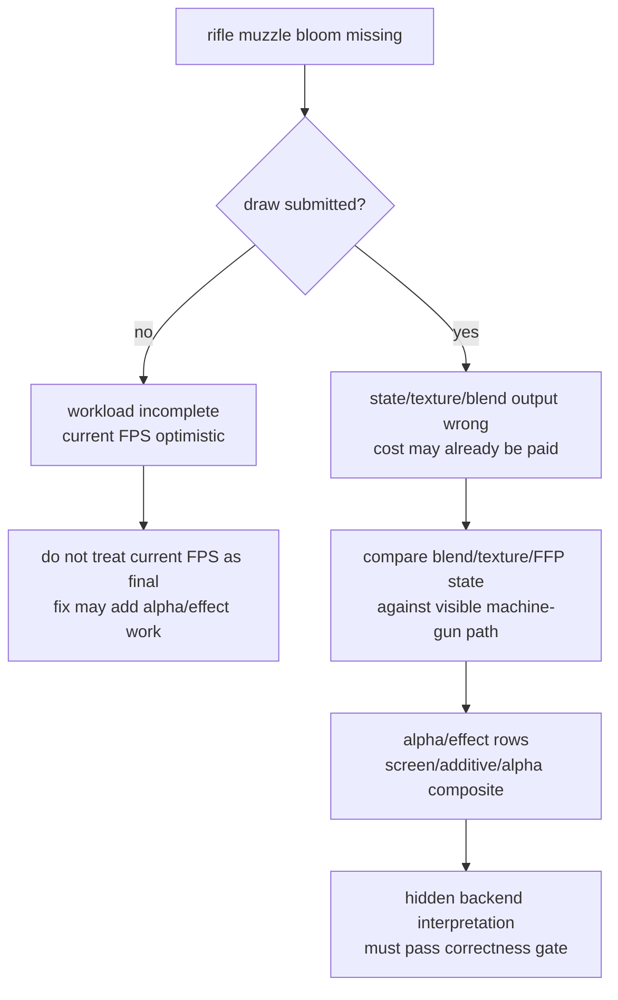
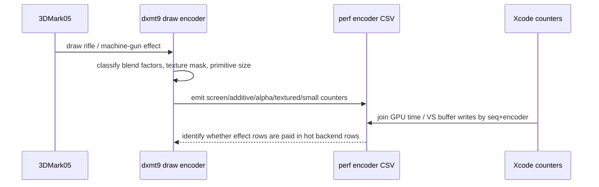
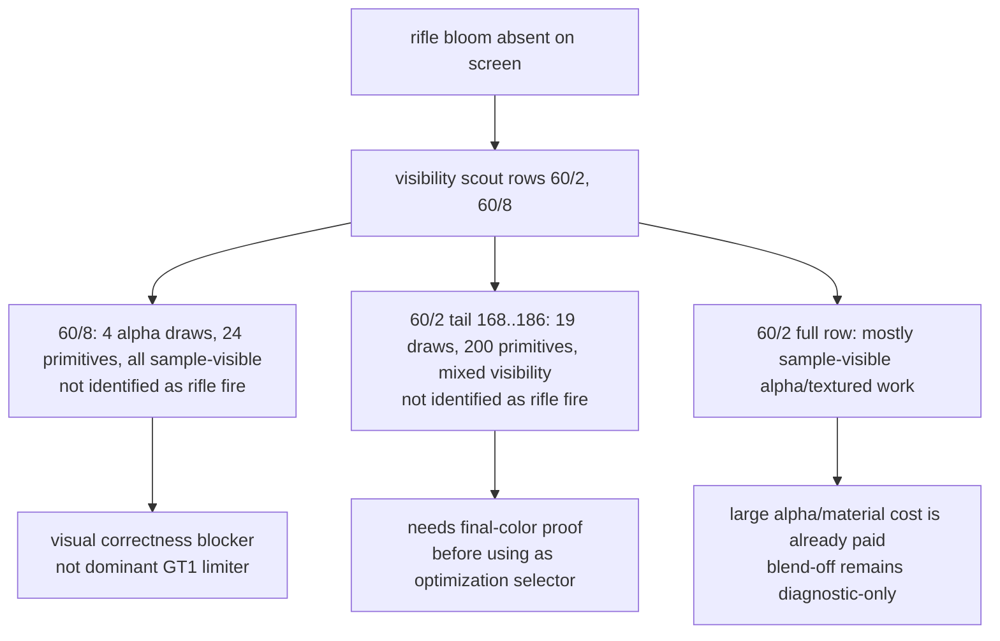

# Rifle Muzzle Bloom Correctness Gate for Alpha/Effect Rows

**Observation.** The machine-gun bloom / muzzle flash path is visible, but the
rifle muzzle bloom has never been implemented correctly in dxmt9. This is a
correctness issue, but it also affects how GT1 performance baselines should be
interpreted.

**Current visual status.** The rifle muzzle fire/bloom is still absent on screen.
The telemetry below only identifies alpha/effect *candidate* rows. It does not
prove that any listed draw is the missing rifle muzzle effect, and it does not
fix the visual bug.

**Priority policy.** Visual parity is the next gate. Historical large white
bloom mistakes were large enough to move performance, so GT1 FPS should stay a
diagnostic number until the rifle muzzle effect is either rendered correctly or
proved to be a tiny, already-submitted row. Do not spend the next paired Xcode
capture on this branch before isolating the final-color writer for the rifle
shot.

**Performance meaning.**

- If the rifle effect draw/pass is **not submitted**, current FPS is optimistic:
  the measured workload is lighter than a correct D3D9 frame. This would not
  explain why GT1 is slow; it means a fixed renderer may become slightly more
  expensive.
- If the draw is submitted but the final pixels are wrong, the GPU may already
  be paying the vertex/tiler/blend cost. In that case the issue is primarily
  semantic, but it still matters because the affected state class overlaps the
  alpha/screen-blend rows used for backend-shape experiments.
- Because screen-blend and large alpha classes have already moved the hidden
  backend bucket in correctness-invalid probes, alpha/effect correctness is not
  separable from the performance gate.

## Added telemetry

Encoder breakdown now exposes alpha/effect classifiers so the next GT1 run can
separate "effect missing from workload" from "effect submitted but rendered
wrong":

| Field | Meaning |
|---|---|
| `blend_screen_draws` | `ALPHABLENDENABLE && SRC=InvDestColor && DEST=One && OP=Add` |
| `blend_additive_draws` | `ALPHABLENDENABLE && SRC=One && DEST=One && OP=Add` |
| `blend_alpha_composite_draws` | `ALPHABLENDENABLE && SRC=SrcAlpha && DEST=InvSrcAlpha && OP=Add` |
| `alpha_blend_textured_{draws,primitives,vertices}` | alpha-blended draws that bind at least one texture |
| `alpha_blend_small_{draws,primitives,vertices}` | alpha-blended draws with `primitive_count <= 63`, a sprite/effect candidate bucket |

These fields are emitted in `[dxmt9-perf-encoder ...]`, preserved by
`scripts/tools/summarize_3dmark05_perf.py`, and joined into Xcode counter reports
as `dxmt_*` columns.

## Current candidate rows

`app-d3d9-3dmark05-rifle-alpha-telemetry-r1` was run as a no-gputrace
instrumentation smoke with `--frame 60 --no-gputrace --encoder-breakdown-seq 60
--timeout 180`. It timed out at the wrapper watchdog (`225s`) and produced
`partial-log` artifacts, so it is not a final performance run. It is enough to
prove the telemetry is populated. Run-level `draw_skipped_no_pipeline=0` was
present in the log, so this run does not show a pipeline-build failure as the
reason for a missing effect draw.

The frame60 encoder breakdown splits the alpha/effect candidates as:

- `60/2`: large alpha/textured row, `145` alpha-blended draws and `292,082`
  alpha-blended indexed-triangle primitives. The new classifier splits this into
  `103` screen-blend draws, `0` additive draws, `42` alpha-composite draws,
  `145` alpha-blended textured draws, and `22` small alpha-blended draws
  (`236` small primitives). This is performance-relevant even if the rifle
  effect itself is not isolated there.
- `60/8`: small alpha/textured row, `4` alpha-blended draws and `24` primitives,
  all alpha-composite and all small/textured, with `2` X8 RT texture-binding
  samples. This is a plausible sprite/post-effect class and should be checked
  when the rifle shot is visible.

An exploratory, unpaired join against the existing
`post-visualfix-frame60-baseline-r1` Xcode counter CSV was written to
`traces/app-d3d9-3dmark05-rifle-alpha-telemetry-r1/analysis/`. Because the Xcode
counters are from an earlier paired capture while the alpha/effect CSV is from a
current no-gputrace smoke, this is a **candidate-selection join**, not proof.
Still, the row labels line up with the known hot frame shape:

| Row | Xcode GPU share | Xcode VS buffer write | New alpha/effect attribution | Interpretation |
|---|---:|---:|---|---|
| `60/2` | `57.07%` | `981.159 MiB` | `103` screen, `42` alpha-composite, `145` textured, `22` small | If rifle bloom is in this row/class, correctness is also a performance gate. |
| `60/8` | `0.44%` | `0.000 MiB` | `4` alpha-composite, `4` textured, `4` small, `2` X8 RT texture samples | If rifle bloom is only here, it is likely a visual blocker, not the primary GT1 limiter. |

## Draw-level alpha probe

`app-d3d9-3dmark05-rifle-alpha-draw-probe-r1` was run with
`--frame 60 --no-gputrace --encoder-breakdown-seq 60 --measure-index-reuse`.
This is a mutation-free per-draw probe and finished with `status=pass`.
It produced `395` indexed probe rows:

- `60/2`: `187` draw rows, `145` alpha-blended rows.
- `60/8`: `5` draw rows, `4` alpha-blended rows.

The analysis artifacts live under
`traces/app-d3d9-3dmark05-rifle-alpha-draw-probe-r1/analysis/`:

- `frame60-60-2-alpha-draws.csv`
- `frame60-60-2-alpha-shader-with-msl-summary.csv`
- `frame60-60-8-alpha-draws.csv`
- `frame60-60-8-alpha-shader-with-msl-summary.csv`

The shader evidence uses the existing frame60 shader dump at
`traces/app-d3d9-3dmark05-frame60-trim-varyings-smoke-r1/analysis/shaders/msl`.

**`60/2` split.** The hot alpha row is not one effect. It is a sequence of
large screen-blend and standard-alpha material groups:

| Group | Draw indices | Draws | Primitives | Shader alpha evidence | Meaning |
|---|---:|---:|---:|---|---|
| screen, scissor on, PS `0xe2e1407f3be7deb` | `42..74` | `33` | `55,509` | dynamic expression, texture samples | Performance-relevant; not blend-off equivalent. |
| screen, scissor off, PS `0x503d342c94267c4e` | `84..125` with gaps | `33` | `55,509` | dynamic expression, texture samples | Performance-relevant; not blend-off equivalent. |
| standard alpha, PS `0x11cc89f85cc54054` | `126..167` with gaps | `38 + 4` | `97,294` | varying alpha | Performance-relevant; not blend-off equivalent. |
| small screen, PS `0xd3bae24e6d632f2d` | `168..186` | `19` | `200` | constant-one alpha, texture samples | Small effect-like tail inside the hot row, but still screen blend. |

All `60/2` rows remain correctness-sensitive. The large backend clue from
alpha-blend-off stays useful as a diagnostic, but the draw-level evidence
confirms it is not a production fix.

**`60/8` split.** The tiny row is a plausible sprite/post-effect candidate:

| Group | Draw indices | Draws | Primitives | Shader alpha evidence | Meaning |
|---|---:|---:|---:|---|---|
| standard alpha, PS `0x687cbac939b25a92` | `1` | `1` | `2` | constant-one alpha, texture sample | Tiny visual candidate; not a primary GPU limiter. |
| standard alpha, PS `0x32290b454906af4e` | `2..4` | `3` | `22` | constant-one alpha, texture samples | Tiny visual candidate; Xcode row is only `0.44%` GPU. |

If the rifle muzzle bloom belongs only to `60/8`, fixing it should not explain
the current low FPS. If it belongs to the `60/2` alpha material sequence, the
correction is also part of the hot backend row and must be included in the next
paired Xcode/gputrace proof.

## Visibility scout

`app-d3d9-3dmark05-rifle-alpha-visibility-r1` was run with
`--frame 60 --no-gputrace --encoder-breakdown-seq 60 --measure-index-reuse
--visibility-scout-rows 60/2,60/8`. This is still not final-color proof: the
visibility scout only reports whether samples survive at that draw point. It is
useful for separating obviously absent/no-sample work from submitted,
sample-visible work.

Artifacts:

- `traces/app-d3d9-3dmark05-rifle-alpha-visibility-r1/analysis/frame60-visibility-scout-summary.md`
- `traces/app-d3d9-3dmark05-rifle-alpha-visibility-r1/analysis/frame60-60-2-tail-visibility-summary.md`
- `traces/app-d3d9-3dmark05-rifle-alpha-visibility-r1/analysis/frame60-60-8-visibility-summary.md`

| Window | Draws | No-sample | Sample-visible | Visible samples | Miss32 delta | Interpretation |
|---|---:|---:|---:|---:|---:|---|
| `60/8` draws `1..4` | `4` | `0` | `4` | `67,370` | `-48` | Tiny submitted/sampled effect-class candidate; not proven to be rifle muzzle fire and not a primary limiter. |
| `60/2` draws `168..186` | `19` | `9` | `10` | `39,654` | `-209` | Small screen-blend tail inside the hot row; possible visual/effect tail, not proven rifle muzzle fire, and tiny locality denominator. |
| full `60/2` row | `187` | `25` | `162` | n/a | n/a | The hot row is mostly sample-visible alpha/textured material work, so any correctness-preserving optimization still needs final-color proof. |

The rifle bloom observation therefore narrows only the performance
interpretation, not the visual bug itself. If the missing rifle effect is only a
`60/8`-style sprite/post-effect row, a fix should not explain the current low
FPS. If it is a missing draw outside the captured candidates, the current FPS is
slightly optimistic because the frame is incomplete. If it is part of `60/2`,
the measured workload is already dominated by submitted sample-visible
alpha/textured material, and the next proof must be final-color/final-writer
aware rather than visibility-only.

## Verification gate

The next correctness/performance pass should compare a visible machine-gun bloom
frame and a visible rifle firing frame:

1. Capture or probe the visible machine-gun bloom and the rifle firing moment
   before treating any FPS number as final.
2. Identify the final-color writer for the rifle muzzle pixels. Visibility-only
   scout rows are not enough, because submitted draws can still be overwritten,
   masked, or blended incorrectly.
3. Run the standard 3DMark05 perf wrapper with `DXMT9_PERF_ENCODER_BREAKDOWN=1`
   and a positive timeout.
4. Confirm `draw_skipped_no_pipeline=0`. If skipped draws appear near the effect
   frame, treat current performance as workload-incomplete.
5. Compare `blend_screen_draws`, `blend_additive_draws`,
   `blend_alpha_composite_draws`, `alpha_blend_textured_draws`, and
   `alpha_blend_small_draws` between the visible machine-gun and rifle frames.
6. For any candidate row, join Xcode counters and check GPU time / VS buffer
   writes. If the missing rifle effect lives in a hot row, alpha correctness is a
   performance gate. If it lives only in a tiny row, it is a visual blocker but
   not the dominant GT1 limiter.

**Verdict.** Visual bug still open; visual parity comes before the next
performance proof. The correctness issue does not currently explain low FPS, but
the observed small effect candidates are only submitted/sample-visible and are
not proven to be the missing rifle muzzle fire. The dominant `60/2` row remains
a correctness-sensitive alpha/material row whose optimization needs final-color
proof. A future rifle bloom fix may slightly increase complete-frame work if it
adds a truly missing draw, and past large-bloom regressions show that the visual
gate can change performance interpretation.

**Related.** [[backend-shape-classifiers]] · [[backend-shape-classifiers-alpha.03]] ·
[[index-cache-locality-screenblend.02]] · [[overview-3dmark05-gt1]]
