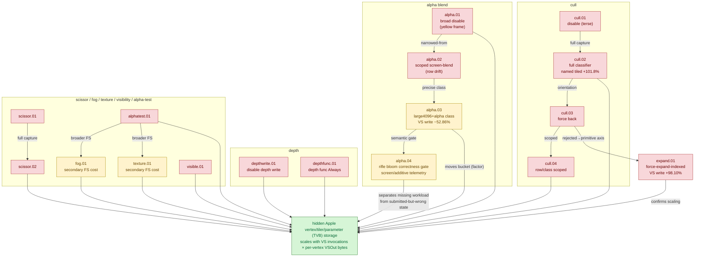

# Backend Shape Classifiers — correctness-invalid state toggles that test ownership of the hidden VS-write bucket - Historical Log

> Full historical detail moved from the former top-level `backend-shape-classifiers.md` overview.
> Keep [overview](overview.md) current and compact; append long-running chronology,
> rejected paths, and detailed synthesis here only when it is not already captured in
> one-experiment leaf documents.

---

# Backend Shape Classifiers — correctness-invalid state toggles that test ownership of the hidden VS-write bucket

> Part of the 3DMark05 GT1 GPU-bottleneck investigation. Root map: [overview-3dmark05-gt1](../overview-3dmark05-gt1.md).

## Scope & question

This domain owns the family of **correctness-invalid diagnostic probes** that
toggle a single render / raster *state* (alpha blend, depth write, depth compare,
cull, scissor, fog, texture sampling, fragment visibility, indexed expansion,
alpha-test discard) to ask one question: does that state own the dominant Xcode
"VS Buffer Device Memory Bytes Written" bucket (~1.6 GiB across the top-3 GT1
frame60 encoders)? These probes deliberately render the wrong image — they are
classifiers gated on Xcode VS-write / VS-invocation deltas, **never optimizations**.
Almost every state was rejected: it moves GPU timing and sometimes the small
*named* tiled counters, but not the hidden bucket. Two state axes are notable
exceptions: a scoped **alpha-blend**-off on the large4096+alpha class moved the
bucket substantially, and forced **indexed expansion** nearly doubled it
(confirming indexed-submission pressure is real and must be kept).

## Hypotheses & verdicts

| # | Hypothesis | Verdict | Evidence |
|---|-----------|---------|----------|
| H1 | Broad alpha-blend state owns the VS-write bucket | rejected (GPU +1.72%, VS write +0.00%; yellow frame) | backend-shape-classifiers-alpha.01 |
| H2 | Scoped screen-blend alpha-off proves blend ownership | rejected as proof (hot-row set drifts) | backend-shape-classifiers-alpha.02 |
| H3 | Scoped large4096+alpha blend-off moves the bucket | **significant factor** (top VS write −52.86%); not a fix (correctness-invalid) | backend-shape-classifiers-alpha.03 |
| H4 | Depth-write state owns the bucket | rejected (depth write −68.87%, VS write +0.01%, GPU +8.34%) | backend-shape-classifiers-depthwrite.01 |
| H5 | Depth-compare (func Always) owns the bucket | rejected (VS write +0.041 MiB, GPU +5.03%) | backend-shape-classifiers-depthfunc.01 |
| H6 | Cull state bit owns the bucket | rejected (VS write −0.00%, GPU +1.84%) | backend-shape-classifiers-cull.01 |
| H7 | Cull moves the hidden bucket (full capture) | rejected; named tiled +101.8% but VS write flat → named tiler ≠ hidden bucket | backend-shape-classifiers-cull.02 |
| H8 | Cull *orientation* (force back) owns the bucket | rejected (VS write +0.01%, GPU +1.50%) | backend-shape-classifiers-cull.03 |
| H9 | Row/class-scoped cull owns one row's share | rejected (VS write −0.02%, named tiled +33.3%, GPU +1.58%) | backend-shape-classifiers-cull.04 |
| H10 | Scissor state owns the bucket | rejected (VS write +0.06%, GPU +4.19%) | backend-shape-classifiers-scissor.01 / backend-shape-classifiers-scissor.02 |
| H11 | Fog source/blend owns the bucket | secondary (GPU −2.68%, FS write −10.3%, VS write +0.00%) | backend-shape-classifiers-fog.01 |
| H12 | Fragment texture sampling owns the bucket | secondary (GPU −3.72%, top-3 VS write −3.24%, enc2-specific) | backend-shape-classifiers-texture.01 |
| H13 | Hidden writes are coupled to fragment visibility | rejected (VS write +0.042 MiB, GPU +5.13%) | backend-shape-classifiers-visible.01 |
| H14 | Indexed-submission pressure drives the bucket | confirmed (expand: GPU +87.74%, VS write +98.10%) — keep indexed path | backend-shape-classifiers-expand.01 |
| H15 | Alpha-test discard owns the bucket / force-frag delta | rejected (GPU +1.72%, VS write +0.00%) | backend-shape-classifiers-alphatest.01 |
| H16 | Rifle muzzle fire correctness changes perf interpretation | visual-positive/perf-coupled. The public `01:05` oracle shows several rifle shots as compact barrel-attached round white/yellow bloom discs. Current split-payload artifacts reproduce that shape; same-run geometry promotes `0x80`, and after-draw color history confirms the two-triangle `0x80` sprite as the local writer (`seq=1094`, post-split `enc=3/draw=0/cmd=320`, `bright=706`, `white=196`, `warm=909` in the candidate ROI). `0x7f/0x75` remain broad/non-local for that target. This resolves the visual writer for the wide infantry scene, but not the main FPS owner: skipped/error/hazard/map-wait counters stay zero, while RT/depth/clear/present pass churn and Xcode GPU-counter proof remain open | [backend-shape-classifiers-alpha.04](backend-shape-classifiers-alpha.04.md), baselines-frame60.03 |

## Verification methods

- **`DXMT9_PROBE_DISABLE_ALPHA_BLEND`** (+ `_ROW/_ROWS/_CLASS/_CLASSES`) — disable
  Metal blending while preserving color-write masks; broad form yields a yellow
  frame, scoped class form (`large4096,alpha-blend`) is verifiable via
  `probe_disable_alpha_blend_draws`. Proves alpha blend is a significant factor in
  the hidden backend shape for the alpha class.
- **`DXMT9_PROBE_DISABLE_DEPTH_WRITE`** — keep depth test, suppress writes; isolates
  depth attachment traffic from the bucket.
- **`DXMT9_PROBE_DEPTH_FUNC_ALWAYS`** (`--probe-depth-func-always`) — keep depth
  enable/write, force compare `Always`; isolates depth-compare shape from writes.
- **`DXMT_DISABLE_CULL`** (`--disable-cull`) and **`DXMT_DEBUG_FORCE_CULL_MODE`**
  (`--force-cull-mode none|front|back`) — broad cull removal / forced orientation;
  move named tiler/cull/clip counters but not the hidden bucket.
- **`DXMT9_PROBE_FORCE_CULL_MODE`** (+ `_ROW/_ROWS/_CLASS/_CLASSES`) — row/class-scoped
  cull override; verified per-row via the encoder breakdown's effective cull bucket.
- **`DXMT_DISABLE_SCISSOR`** (`--disable-scissor`) — drop scissor; GPU-time only.
- **`--disable-fog`** — strip fog-factor reads / fog blend path; secondary fragment cost.
- **`--force-texture-white`** — replace fragment texture samples with `float4(1.0)`;
  secondary, pass-specific (enc2) cost.
- **`DXMT_DEBUG_FORCE_VISIBLE`** (`DXMT9_DEBUG_FORCE_VISIBLE_DRAW`) — force visibility /
  blend / write-mask; tests fragment-visibility coupling.
- **`DXMT_FORCE_EXPAND_INDEXED`** (`--force-expand-indexed`) — flatten indexed draws to
  transient vertices; the decisive primitive-pressure classifier (doubles the bucket).
- **`DXMT_DISABLE_ALPHA_TEST`** (`--disable-alpha-test`) — strip generated alpha-test
  `discard_fragment()`; isolates the discard branch.
- **Finalizer gates** — every probe is finalized with `--require-xcode-counter-coverage
  --require-dxmt-join-coverage --require-top-pso-attribution` and, where shaders are
  dumped, `--require-shader-dump-matches`. These probes are **correctness-invalid**;
  they are judged only by Xcode VS-write / VS-invocation / hidden-estimate deltas, not
  by image fidelity.

## Experiment dependency graph



## Results synthesis

The settled result across this domain is consistent: **toggling a render/raster
state changes GPU timing and can move the small *named* tiled/cull/clip counters
(~30 MiB scale), but it does not move the ~1.6 GiB hidden VS-write bucket.** Depth
write, depth compare, cull (broad, orientation, and row/class-scoped), scissor,
fragment visibility, and alpha-test discard are all rejected as the first-order
owner — each leaves top-3 VS write within ±0.06% while GPU time drifts within
backend noise. The cull classifier is especially clarifying: it doubles the named
tiled counter while the hidden bucket stays flat, proving the named tiler counters
are ~55x too small to be the owner. Fog and texture sampling are amber
**secondary** fragment costs (≈ −2.7% / −3.7% GPU), real but not first-order, and
the texture effect is pass-specific (`60/2`).

Only two state axes move the bucket materially. **Alpha blend**, scoped to the
large4096+alpha class, cut top VS write `−52.86%` and bytes/invocation `−43.56%`
(amber: a confirmed *significant factor* in the hidden backend shape, but
correctness-invalid and not a fix). **Forced indexed expansion** nearly doubled the
bucket (`+98.10%`) while CPU bind churn *decreased*, proving the owner is GPU-side
vertex/primitive backend behavior tied to submitted primitive pressure — and that
the indexed submission path must stay mandatory. Both point at the same place: the
hidden bucket is owned by Apple GPU vertex-stage / tiler / parameter (TVB) backend
storage that scales with VS invocations × per-vertex VSOut bytes, and the only
correctness-preserving lever found is reducing VS invocations via index-cache
locality. Nothing here is open as a primary fix; the residual work is on the
locality / primitive axes, not state toggles.

The rifle muzzle fire observation adds a separate semantic gate. It is no
longer best described as globally absent: the `01:05` external oracle shows
compact barrel-attached discs, the split-payload path reproduces that public
round rifle-bloom shape in the wide infantry window, and a current same-run
capture/effect-geometry pass ties the cleanest local component to `0x80`;
same-run after-draw color history then confirms the adjacent two-triangle
`0x80` sprite as the local writer after the diagnostic split moves it to
`seq=1094/enc=3/draw=0/cmd=320`. The older `0x7f/0x75` fire-atlas/tracer
hypothesis remains useful only when it survives a local bbox gate; for the
current positive component it does not. The direct
`1094/2/cmd319` force-white replay missed the selector and drifted to the
machine-gun close-up, while the color-history run shows why `enc` gates are
fragile: after-draw dump itself splits the encoder before the adjacent bloom
draw. This still does not explain low FPS by itself. The confirmed writer is a
small two-triangle local sprite; skipped draw, Metal command-buffer error,
hazard-split, and map-buffer wait counters are quiet, while RT/depth/clear/
present pass churn and completion/present pacing remain open.
Current FPS may still be slightly optimistic if a future correctness fix adds
missing work; it may also be pessimistic if wrong pass/blend/order/load-store
paths are doing extra overwrite or preservation work. The alpha/effect counters,
visibility scout, same-run geometry gate, and eventual Xcode final-color/counter
proof in [backend-shape-classifiers-alpha.04](backend-shape-classifiers-alpha.04.md) must be used before treating GT1
FPS as a final visual-correct workload. This gate has priority over more Xcode
performance proof on this branch because previous large white bloom mistakes
were performance-significant.

## How to run
Every experiment here is a 3DMark05 GT1 run via the standard wrapper. These are
correctness-invalid state classifiers, so always capture a paired `.gputrace` and
judge by Xcode VS-write / VS-invocation deltas, not image fidelity:

```sh
# Pick the state bit to neutralize, e.g. cull / alpha-blend / depth-compare /
# indexed expansion (scoped class forms keep the rest of the frame intact):
bash scripts/tools/run_3dmark05_perf_probe.sh --suffix cull-off --frame 60 \
  --disable-cull --timeout 420
# other classifiers: --force-cull-mode none|front|back, --disable-alpha-test,
#   --probe-disable-alpha-blend-classes large4096,alpha-blend,
#   --probe-depth-func-always, --force-expand-indexed, --disable-scissor

bash scripts/tools/finalize_3dmark05_perf_probe.sh --suffix cull-off --frame 60 \
  --require-xcode-counter-coverage --require-dxmt-join-coverage --require-top-pso-attribution
```

The exact per-experiment flags live in each leaf's `**Method.**` field. See
`agents/rules/environment_variables.rules.md` for env-var meanings and
`agents/rules/metal_debugging.rules.md` for the full workflow.

## Cross-references
- [hidden-backend-storage](../hidden-backend-storage/index.md) — the surviving owner every rejection in this domain points to (hidden TVB/parameter storage, VS-write density, scaling).
- [vsout-layout](../vsout-layout/index.md) — sibling axis: fog/texture/visibility classifiers also refute visible per-vertex width as the owner.
- [index-cache-locality](../index-cache-locality/index.md) — the accepted production win; the expand and scoped-alpha findings here motivate reducing VS invocations within a mandatory indexed path.
- [index-reuse-measurement](../index-reuse-measurement/index.md) — quantifies the indexed reuse / cache-miss shape that the force-expand classifier confirms is load-bearing.
- [overview-3dmark05-gt1](../overview-3dmark05-gt1.md) — root map, priority DAG, and synthesis.

## Root 3DMark05 Map Detail Migration - 2026-07-08

Detail migrated from the former long-form root [3DMark05 overview](../overview-3dmark05-gt1.md) so that `backend-shape-classifiers` owns its detailed synthesis while the root overview stays cross-domain only.

### From Central finding (read this first)

The strongest historical measured path combines that production-shaped subset
with screen-blend locality (top GPU -11.89%), but screen-blend is only an
explicit exact/`lsb1` policy artifact, not a broad depth-read rule. The current
screen-blend proof attempt now has semantic input and target-row Xcode movement,
but it still does not promote: `60/2` improves while the aggregate top-GPU gate
fails. Follow-up row telemetry shows the path only applies to `60/2`; the
`60/0+60/1` regression is GPU-time-only replay variance rather than
reordered-cache mutation on non-target rows.
Rifle muzzle fire is no longer best described as "not submitted" or "globally
absent." The public `01:05` oracle shows the expected effect as simple
weapon-attached circular white/yellow bloom discs; the user-captured reference
frame has several infantry rifle shots rendered as compact round bloom discs
rather than long tracer strips, impact sparks, or broad haze. Current local
artifacts now have matching positive samples in the wide infantry window, so the
remaining bug should be scoped as frame/timing/ROI-specific final-writer loss
rather than global rifle-fire absence. The latest local reruns reclassify the
old absence as a dynamic-buffer
backing correctness issue: when a
queued draw kept only the logical `BufferHandle`, a later dynamic
`D3DLOCK_DISCARD` rename could make encode bind a newer active backing. The
current implementation records the concrete Metal backing in a separate
per-draw `DrawBindingSnapshot` payload and lets DEFAULT+DYNAMIC DISCARD rotate
again, while snapshot-bearing draws bind the recorded Metal buffer instead of
resolving the mutable active handle at encode time. `DrawBindingOverride`
remains a compact logical stream/IB delta; snapshot storage is separate so the
old draw-run coalescing path does not pay snapshot bytes on every override-only
draw. This remains a correctness/performance gate, not a cosmetic side issue:
visual parity now needs to be rechecked under the optimized snapshot path, and
FPS should be interpreted only with the visual-coupling counters for skipped
draws, Metal errors, fallback/overflow, render-pass churn, and completion
waits.
Because previous large white bloom mistakes moved performance materially, and
recent glow/bloom correctness fixes appear to bring small timing gains, the next
proof gate is visual parity / final-color writer isolation before more paired
Xcode performance budget. Treat a visual-fix timing gain as actionable only
after the perf summary's `Correctness / Visual-Coupling Counters` shows whether
the change also reduced skipped draws, Metal errors, hazard/probe churn,
fallback/overflow counters, render-pass churn, or completion waits. See
[backend-shape-classifiers-alpha.04](backend-shape-classifiers-alpha.04.md). The current visual-coupling frame60
smoke narrows the obvious wrong-path branch: skipped draws, Metal command-buffer
errors, tracked frame60 overflows, map-buffer GPU waits, and queue-sequence waits
are zero. All bloom hazards are false positives and `render_split_hazard=0`, so
the bloom prefilter is noisy but not a false render-split owner. Render-pass
preservation remains high, and the actual split reasons are RT/depth changes,
clears, and presents, so the correctness/perf coupling is not closed. A follow-up
ROI final-color comparison on the close-up captures shows `0x80`/`0x82`
force-white candidates affect broad overlay/tint/beam color, but still do not
create a local rifle muzzle sprite in that older close-up branch. The follow-up
ROI geometry join makes the shape clearer:
`0x80`/`0x82` are screen-space/fullscreen glow quads that cover the muzzle ROI by
construction, while `0x7f` fire-atlas projected bboxes overlap comparable ROIs
only in the later rifle-window probe and remain bbox-level evidence, not
final-color proof for the close-up missing muzzle flash. A regenerated close-up
`0x77` geometry run (`seq 477..560`) with command-index logging found only `9`
muzzle ROI overlaps with max coverage `5.586%`, plus a draw-local force-white
queue. The rank-1 command-index force-white replay still reported
`encode_draw_pso_prefetch_bypass_probe=0`, so independent-run ordinal/command
slot selectors are not yet a final-writer oracle. A follow-up replay without
the command-index gate but with an ROI scissor did apply
`encode_draw_pso_prefetch_bypass_probe=11`, proving the row/texture/draw
selector can hit; its image deltas were still dominated by independent-run
frame drift, not a clean local muzzle delta. This further classifies `0x77` as
thin tracer/impact geometry rather than the missing radial rifle muzzle bloom,
and moves the next proof toward same-run final-writer instrumentation or direct
gputrace draw inspection. A later `0x80` component-local force-white attempt
(`app-d3d9-3dmark05-rifle-frame1033-tex80-local-r03-frame1036-component1-tex80-s1036-e2-d1-ci337`)
must be treated as invalid evidence: the component/geometry gate promoted
`frame1036-component1` (`0x80`, bbox coverage `96.133%`) as a plausible
round-bloom candidate, but the replay summary reports
`probe_force_texture_white_draws=0` and only `21` draws in `seq=1036/enc=2`,
so the scoped selector did not actually hit the intended command. The resulting
image sequence drifted into a different close-up/bloom moment and cannot be
used as an A/B proof. The follow-up same-run payload/mini-replay gate
refines that again: six `517/2` `0x77` payload draws render `577` nonzero
orange/white pixels in standalone Metal with the real texture sidecar, the
force-fragment-color replay has the same footprint, and `depth_clear=0.0`
rejects all pixels. Therefore `0x77` is not a blank or globally skipped draw
class. A same-run depth sidecar for `517/2` then narrows the depth branch:
captured depth preserves `542 / 577` pixels and the force-color replay has the
same captured-depth footprint, so depth is relevant but not the full reason this
candidate disappears from the final close-up frame. A same-run pass-end color
sidecar for a regenerated `517/2` payload run then captured the same `0x77`
draw window (`11` `0x77` probe rows, payload draws `267..272`) and found no
bright final-color trace: the mini-replay bbox max was `[206,199,174]`, the
muzzle ROI max was `[170,164,140]`, and the full `X8R8G8B8` color attachment
had `0` pixels with any channel above `220`. So `0x77` is submitted and
renderable in isolation, but it is not currently proven to be the pass-end
final writer for the missing rifle muzzle bloom. The first draw-boundary color
history probe strengthens that: when gated by `seq=517/enc=2` and
`texture0=0x200000100000077`, the selected draw writes bright pixels immediately
after draw (`bbox` max `[255,255,252]`, `27` bright pixels, `7` white pixels),
but the prior pass-end sidecar has no channel above `220`. A current-build
follow-up made the split effect explicit: a texture-list after-draw history
requested `0x77` and `0x80`, matched only `0x77`, and wrote `10` bright
after-draw sidecars at command index `306`; the last sidecar still had
`[255,255,250]` in the mini bbox and `273` pixels with any channel above `220`.
A split-free current-build pass-end dump for `seq=517/enc=2` stayed dark
(`mini bbox max [207,199,175]`, full attachment bright pixels `0`). So the
stronger statement is not just "a later draw overwrites it": the after-draw
diagnostic split can materialize bright intermediate pixels, while the normal
render pass final store does not preserve the expected local muzzle contribution.
A command-attributed rerun then found `0x77` split sidecars at commands
`319/320` with only non-local full-frame bright pixels, and `0x80` at command
`322` with cyan/white full-frame glow pixels but still zero bright pixels in the
mini/muzzle ROIs. A non-mutating `0x80` geometry census confirms why ROI overlap
alone was misleading: the `0x80` class is a fullscreen screen-space post/glow
quad in the close-up window, not a local muzzle sprite. Draw/blend/depth order,
tile load/store/preservation behavior, the diagnostic split changing pass shape,
animation-time mismatch, run-local selector drift, or a separate unidentified
muzzle draw are now stronger suspects than "not submitted" or "depth alone
rejects it."
