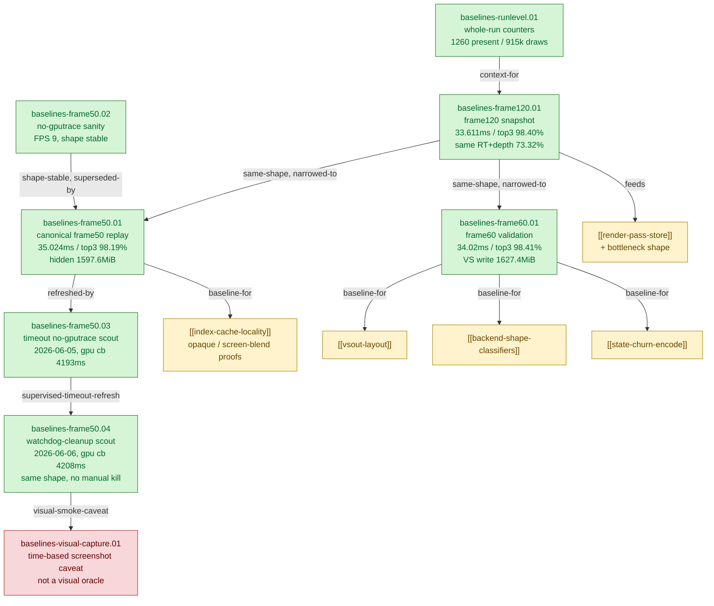

# Baselines — the reference captures every other experiment compares against

> Part of the 3DMark05 GT1 GPU-bottleneck investigation. Root map: [[overview-3dmark05-gt1]].

## Scope & question

This domain owns the reference 3DMark05 GT1 captures that define the bottleneck
shape and serve as the A/B denominators for every other domain. It holds three
capture regimes: the historical **frame120** Xcode snapshot that first showed
the shape, the current canonical **frame50** normal-source gputrace/Xcode
replay plus its no-gputrace sanity/timeout/watchdog-cleanup scouts, and the mid-investigation
**frame60** validation capture with full finalizer attribution gates. It also
keeps the whole-run counter shape that contextualizes the single-frame
captures. Almost every A/B delta elsewhere is measured against
[[baselines-frame50.01]] or [[baselines-frame60.01]].

## Hypotheses & verdicts

| # | Hypothesis | Verdict | Evidence |
|---|-----------|---------|----------|
| H1 | The captured GT1 frame is GPU-bound and the cost is concentrated in a few render encoders | accepted | [[baselines-frame120.01]] |
| H2 | The dominant counters are LLC/MMU/buffer-write, not ALU or texture | accepted | [[baselines-frame120.01]], [[baselines-frame60.01]] |
| H3 | The big VS-buffer-write bucket is not explained by dxmt CPU writers (~0.4 MiB) or visible VSOut width (184 B) | accepted | [[baselines-frame50.01]], [[baselines-frame60.01]] |
| H4 | The frame50 runtime shape is stable across code changes (usable as a fixed A/B denominator) | accepted | [[baselines-frame50.02]], [[baselines-frame50.03]] |
| H5 | A no-gputrace timeout-finalized run is a valid counter sample (not a wall-clock FPS sample) | accepted | [[baselines-frame50.03]] |
| H6 | The new top-level watchdog + Wine cleanup path preserves baseline counter shape | accepted | [[baselines-frame50.04]] |
| H7 | A time-based GT1 `actual.png` alone can prove visual correctness after optimization changes | rejected | [[baselines-visual-capture.01]] |

## Verification methods

- **`scripts/tools/run_3dmark05_perf_probe.sh`** — the standard wrapper for
  every capture; `--frame N` scopes encoder breakdown / capture to a frame,
  `--encoder-breakdown-seq N` bounds the breakdown log, `--top N` limits rows.
- **`--no-gputrace`** — scout mode: emits `result.json` + perf counters without
  the expensive `.gputrace`/Xcode export; proves runtime-shape stability cheaply
  ([[baselines-frame50.02]], [[baselines-frame50.03]]).
- **Timeout policy** — `--timeout` is mandatory and positive (180s no-gputrace,
  420s gputrace); 3DMark05 hangs on the final frame, so the wrapper
  timeout-finalizes (`timed_out=true`, `returncode=143`/`-15`). A
  timeout-finalized run with expected artifacts is a valid counter sample;
  `process_elapsed_sec` is NOT an FPS metric.
- **`scripts/tools/finalize_3dmark05_perf_probe.sh`** — after Xcode exports
  encoder counters, joins them with dxmt per-encoder attribution into
  `frame<N>-xcode-dxmt-joined-summary.csv` + bottleneck report; gates
  `--require-xcode-counter-coverage`, `--require-dxmt-join-coverage`,
  `--require-top-pso-attribution`, `--require-shader-dump-matches` certify the
  baseline ([[baselines-frame60.01]]).

## Experiment dependency graph



## Headline numbers

| Baseline | Date | Total GPU | Top-3 share | Key write/owner figure |
|---|---|---:|---:|---|
| [[baselines-frame120.01]] | 2026-05-31 | `33.611ms` | `33.075ms` / `98.40%` | LLC/MMU/buffer-write dominate; same RT/depth pair twice `24.643ms` / `73.32%` |
| [[baselines-runlevel.01]] | undated | — | — | `present_encoded=1260`, `draw_calls=915070`, tile preservation `167.74GB`, stream/IB deltas `796k`/`753k` |
| [[baselines-frame50.01]] | 2026-06-04 | `35.024ms` | `34.390ms` / `98.19%` | VS write `1627.372MiB`; hidden backend `1597.615MiB` (`98.2%`); dxmt CPU `0.444MiB`; `7.9x`/`33.1x` |
| [[baselines-frame50.02]] | 2026-06-04 | — (HUD FPS 9) | — | no-gputrace; rows `50/0..3` match prior samples; `gpu_command_buffer_time_ms=4151.436` |
| [[baselines-frame50.03]] | 2026-06-05 | — | — | no-gputrace timeout scout; `present_encoded=1440`, `gpu_command_buffer_time_ms=4193.474` |
| [[baselines-frame50.04]] | 2026-06-06 | — | — | watchdog-cleanup no-gputrace scout; `present_encoded=1440`, `gpu_command_buffer_time_ms=4207.759`, `completion_wait_ms=31071.820`; shape flat vs baseline |
| [[baselines-frame60.01]] | 2026-06-01 | `34.02ms` | `33.481ms` / `98.41%` | VS write `1627.414MiB`; dxmt CPU `0.444MiB`; unexplained `1627.642MiB`; `7.9x` |

## Results synthesis

The investigation has **three capture regimes**: the **frame120 historical
shape** that first revealed a GPU-bound frame whose cost concentrates in three
render encoders dominated by LLC/MMU/buffer-write counters (with two passes
re-entering the same RT/depth pair for `73.32%`); the **frame50 current
canonical** replay (`35.024ms`, hidden backend estimate `1597.6MiB` = `98.2%`
of VS write); and the **frame60 mid-investigation validation** (`34.02ms`, VS
write `1627.4MiB`, fully gated dxmt + shader attribution). All three show the
**same top-3-encoder / hidden-VS-write shape**: top-3 ≈ total buffer write, dxmt
CPU writers explain ≈ `0.4 MiB`, and the visible `184B` MSL VSOut width is
`7.9x` too small to account for the bucket — the recurring fingerprint of
[[hidden-backend-storage]]. The no-gputrace [[baselines-frame50.02]] /
[[baselines-frame50.03]] / [[baselines-frame50.04]] scouts prove the runtime shape is stable enough to
treat frame50/frame60 as fixed A/B denominators.

What is settled: the baseline numbers and the capture/finalize methodology
(wrapper, `--frame`, `--no-gputrace`, timeout policy, finalizer join + gates).
What stays open lives in the consuming domains, not here — almost every A/B
delta elsewhere is measured against [[baselines-frame50.01]] (frame50 locality
proofs) or [[baselines-frame60.01]] (VSOut / backend-shape / state-churn
probes).

## How to run
Every experiment here is a 3DMark05 GT1 run via the standard wrapper. A baseline
is a plain frame capture with no behavior-changing flags. Use `--no-gputrace` for
a cheap runtime-shape scout, or capture a `.gputrace` and finalize for the
authoritative Xcode/dxmt joined baseline:

```sh
# Cheap scout: result.json + perf counters, no Xcode export
bash scripts/tools/run_3dmark05_perf_probe.sh --suffix baseline --frame 50 \
  --no-gputrace --timeout 180

# Authoritative baseline: capture .gputrace, then after Xcode export
bash scripts/tools/run_3dmark05_perf_probe.sh --suffix baseline --frame 50 --timeout 420
bash scripts/tools/finalize_3dmark05_perf_probe.sh --suffix baseline --frame 50 \
  --require-xcode-counter-coverage --require-dxmt-join-coverage --require-top-pso-attribution
```

The exact per-experiment flags (frame ids, `--encoder-breakdown-seq`, `--top`)
live in each leaf's `**Method.**` field. See
`agents/rules/environment_variables.rules.md` for env-var meanings and
`agents/rules/metal_debugging.rules.md` for the full workflow.

## Cross-references

- [[overview-3dmark05-gt1]] — root map, priority DAG, and where these baselines sit in it.
- [[hidden-backend-storage]] — the recurring hidden-VS-write fingerprint every
  baseline exhibits.
- [[render-pass-store]] — fed by frame120's same-RT/depth re-entry and the
  run-level tile-preservation counters.
- [[index-cache-locality]] — opaque-depth and screen-blend frame50 A/B proofs
  measured against [[baselines-frame50.01]].
