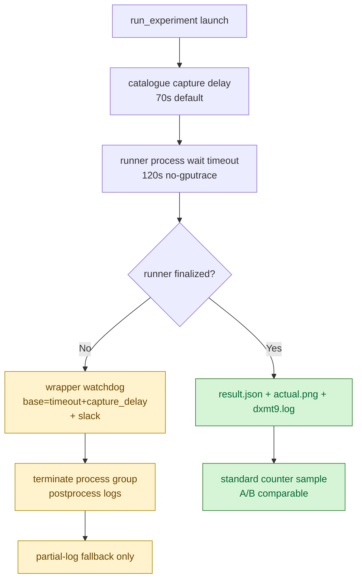

# Capture-Delay-Aware 120s Watchdog Scout

> **Outdated — every artifact this leaf cites in `source:` is gone from disk.** The numbers below cannot be re-derived or re-checked. Kept as history; do not cite it as current evidence.

**Question / hypothesis.** After switching no-gputrace scouts to `--timeout
120`, the first post-uniform-refresh scout proved the wrapper watchdog fired too
early: `run_experiment.py` applies its timeout after the catalogue
`capture_delay_sec=70` screenshot phase, while the wrapper used only
`timeout+slack` (`120+45=165s`). That produced a usable `partial-log` summary
but no `result.json`. The wrapper watchdog must include the effective capture
delay so `run_experiment.py` can timeout-finalize first.

**Implementation.** `run_3dmark05_perf_probe.sh` now computes the top-level
watchdog as:

```text
runner timeout + effective capture delay + DXMT_3DMARK05_PROBE_TIMEOUT_SLACK
```

For the default no-gputrace GT1 scout this is `120+70+45 = 235s`. A
`--capture-delay-sec` override changes only the middle term.

**Run.**

```bash
bash scripts/tools/run_3dmark05_perf_probe.sh \
  --suffix current-post-uniform-120-result-20260612 \
  --frame 50 \
  --no-gputrace \
  --no-encoder-breakdown \
  --frame-sampling \
  --timeout 120
```

Status: pass. `run_experiment.py` exited before the top-level watchdog,
`result.json` was written, `timed_out=true`, `returncode=143`, failures are
empty, and `actual.png` is a normal GT1 machinegun bloom frame.

**Result vs [snapshot-cache-snapshot.10](../snapshot-cache/snapshot-cache-snapshot.10.md) scout.**

Both runs encoded `1,680` presents. The current 120s run preserves the same
counter shape:

| Counter | Uniform-refresh scout | 120s watchdog scout | Delta |
|---|---:|---:|---:|
| `present_encoded` | `1,680` | `1,680` | `0.00%` |
| `draw_calls` | `1,236,546` | `1,236,327` | `-0.02%` |
| `gpu_command_buffer_time_ms` | `5164.292` | `5190.021` | `+0.50%` |
| `completion_wait_ms` | `39290.753` | `40226.532` | `+2.38%` |
| `encode_draw_cpu_ms` | `16520.675` | `16521.072` | `+0.00%` |
| `d3d9_snapshot_draw_submission_cpu_ms` | `6495.069` | `6487.666` | `-0.11%` |
| `commit_chunk_replay_cpu_ms` | `21550.024` | `21352.888` | `-0.91%` |
| `commit_chunk_queue_draw_submission_cpu_ms` | `8760.989` | `8713.272` | `-0.54%` |
| `submit_draw_run_batch_append_cpu_ms` | `2403.727` | `2369.063` | `-1.44%` |
| `render_pass_begin` | `19,753` | `19,760` | `+0.04%` |
| `render_pass_tile_preservation_bytes` | `211,411,550,208` | `211,492,851,712` | `+0.04%` |
| `draw_skipped_no_pipeline` | `0` | `0` | flat |
| `gpu_command_buffer_errors` | `0` | `0` | flat |

Frame sampling is also consistent with the current visual/perf shape. The whole
run averages `17.884fps`, while the final `120` samples average `23.340fps`
with `completion_wait_ms` around `25.621ms/frame`, `encode_draw_cpu_ms` around
`7.833ms/frame`, and `gpu_command_buffer_time_ms` around `2.192ms/frame`.



**Verdict.** Accepted. The no-gputrace default remains `120s`, but the wrapper
watchdog must account for the catalogue capture delay. With that fix, the 120s
policy produces a standard `result.json` counter sample instead of the weaker
partial-log artifact, and it preserves the current post-uniform-refresh
performance shape.

**Current residual owners.** This run does not change the bottleneck ranking:
completion wait is still the largest wallclock bucket (`40226.532ms`), backend
encode remains `16521.072ms`, commit replay remains `21352.888ms`, snapshot
submission remains `6487.666ms`, and submit batch append remains
`2369.063ms`. These are CPU/pacing owners and do not justify a new Xcode
gputrace by themselves.

**Related.** [baselines](index.md) · [snapshot-cache-snapshot.10](../snapshot-cache/snapshot-cache-snapshot.10.md) ·
[state-churn-encode](../state-churn-encode/index.md) · [present-pacing](../present-pacing/index.md).
