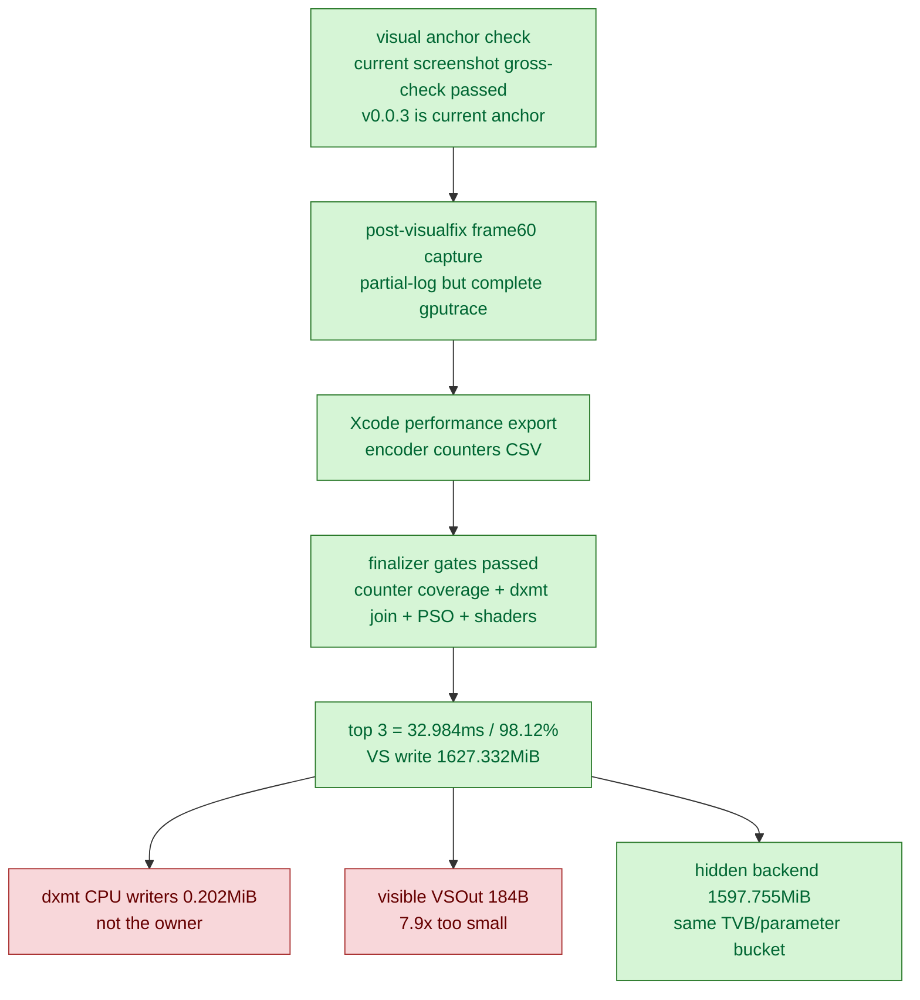

# Post-Visualfix Frame60 Baseline Refresh

**Question / hypothesis.** After the cbuf/binding identity visual fixes and the
then-current visual-anchor check, does current HEAD still show the same
authoritative frame60 GPU bottleneck shape, or did the recent correctness/perf
work move the owner? The operational visual-safe anchor has since moved to
`v0.0.3`.

**Method.** Captured `app-d3d9-3dmark05-post-visualfix-frame60-baseline-r1` with
the standard perf probe at frame60. The app reached the final-frame hang path,
so `result.json` was missing and the summary was synthesized from `dxmt9.log`
(`partial-log`); the `.gputrace`, embedded Xcode performance export, and encoder
counter CSV were complete. Finalized with:

```sh
scripts/tools/finalize_3dmark05_perf_probe.sh \
  --suffix post-visualfix-frame60-baseline-r1 \
  --frame 60 \
  --top 3 \
  --hot-gpu-share 95.0 \
  --require-xcode-counter-coverage \
  --require-dxmt-join-coverage \
  --require-top-pso-attribution \
  --require-shader-dump-matches
```

All gates passed, so the Xcode counters, dxmt per-encoder attribution, top-PSO
samples, and shader dumps are joined for the hot rows.

**Result.**

| Metric | Value |
|---|---:|
| Total GPU | `33.614ms` |
| Top-3 GPU / share | `32.984ms` / `98.12%` |
| Top-3 buffer write | `1627.993MiB` |
| Top-3 VS buffer write | `1627.332MiB` |
| Hidden backend estimate | `1597.755MiB` |
| Hidden / VS buffer write | `0.982x` |
| VS buffer / expected VSOut | `7.9x` |
| VS buffer bytes / VS invocation | `1447.8B` |
| VS buffer / stream0 input | `33.1x` |
| Weighted vertex-stage time | `96.08%` |
| Weighted VS ALU limiter | `2.36%` |
| Weighted VS buffer-write limiter | `21.46%` |
| dxmt CPU writer bytes | `0.202MiB` |
| dxmt stream handle changes | `437` |
| dxmt IB handle changes | `326` |
| argbuf cbuf bytes | `0.187MiB` |
| transient vertex/index bytes | `0.000MiB` |

Top encoders:

| Row | GPU | VS buffer write | Draws | Shape |
|---|---:|---:|---:|---|
| `60/2` | `19.184ms` / `57.07%` | `981.159MiB` | `187` | depth-read + alpha/scissor/textured |
| `60/1` | `8.283ms` / `24.64%` | `421.226MiB` | `156` | opaque depth-write |
| `60/0` | `5.517ms` / `16.41%` | `224.947MiB` | `42` | opaque depth-write + textured |

Run-level counters from the partial log remain in the same runtime family:
`present_encoded=1680`, `draw_calls=1235916`, `render_pass_begin=19758`,
`render_pass_tile_preservation_bytes=213288603648`,
`gpu_command_buffer_time_ms=5064.984`, `completion_wait_ms=34138.444`,
`encode_draw_cpu_ms=23081.470`, and
`d3d9_snapshot_draw_submission_cpu_ms=7675.695`.

Shader-dump attribution matched `9/9` nonzero top rows. Hot programmable VS
rows still emit a visible `184B` `VSOut`; Xcode reports `1151`-`1603`
VS bytes/invocation, and paired FS rows read only a subset of that `VSOut`.
That preserves the prior distinction between visible varying width and hidden
vertex/backend traffic.



**Verdict.** Accepted as the current post-visualfix frame60 baseline refresh.
The visual-fix path did not change the GPU bottleneck owner: top-three encoder
cost is still almost entirely `VS Buffer Device Memory Bytes Written`, dxmt CPU
writers remain negligible, visible `VSOut` remains too small, and the next GPU
budget still belongs to hidden vertex/tiler/parameter storage mechanisms or
semantic-safe VS-invocation reduction. The run is a valid counter/gputrace
sample, not a wallclock FPS sample, because it was finalized from the supervised
timeout/final-frame hang path.

**Related.** [[baselines]] · [[baselines-frame60.01]] ·
[[baselines-visual-capture.02]] · [[hidden-backend-storage]] ·
[[vsout-layout]] · [[state-churn-encode]] · [[present-pacing]].
