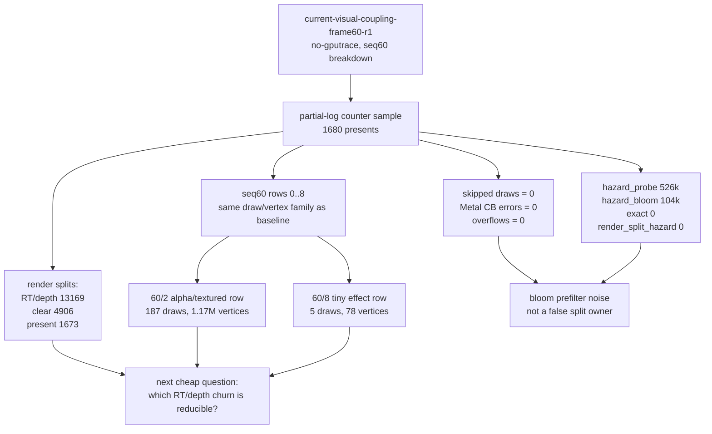

# Current Visual-Coupling Frame60 No-Gputrace Scout

**Question / hypothesis.** After recent visual correctness changes around
ship-engine glow / bloom-like lighting appeared to bring a small heuristic timing
gain, do the new correctness/performance counters show an obvious wrong-path
owner for current frame60? In particular: skipped draws, Metal command-buffer
errors, counter overflows, texture/alpha fallback, map-buffer waits, or
queue-sequence waits.

**Method.**

```bash
scripts/tools/run_3dmark05_perf_probe.sh \
  --suffix current-visual-coupling-frame60-r1 \
  --frame 60 \
  --no-gputrace \
  --encoder-breakdown-seq 60 \
  --timeout 180 \
  --top 5 \
  --min-free-mb 256
```

The wrapper watchdog fired at `timeout + slack = 225s`; `result.json` was not
written, so the summary was synthesized from the final `[dxmt9-perf]` line. This
is a valid no-gputrace counter sample and a frame60 encoder-attribution smoke,
not a wall-clock FPS sample and not an Xcode bottleneck proof.

**Run result.**

| Metric | Value |
|---|---:|
| Status | `partial-log` |
| `present_encoded` | `1680` |
| `draw_calls` | `1,234,689` |
| `draw_skipped_no_pipeline` | `0` |
| `gpu_command_buffer_errors` | `0` |
| `gpu_command_buffer_time_ms` | `5124.390` |
| `completion_wait_ms` | `39491.204` |
| `map_buffer_total_ms` | `1009.001` |
| `map_buffer_mutex_wait_ms` | `592.732` |
| `map_buffer_wait_ms` | `0.000` |
| `queue_sequence_wait_ms` | `0.000` |
| `render_pass_begin` | `19,748` |
| `render_pass_tile_preservation_bytes` | `211,567,075,328` |
| `render_pass_same_key_reentry_preservation_bytes` | `85,047,902,208` |
| `render_split_rt_change` | `13,169` |
| `render_split_hazard` | `0` |
| `render_split_clear` | `4,906` |
| `render_split_present` | `1,673` |
| `hazard_probe` | `526,085` |
| `hazard_bloom` | `104,004` |
| `hazard_exact` | `0` |
| `hazard_bloom_false_positive` | `104,004` |

Derived per-present shape:

| Metric | Value |
|---|---:|
| Draws / present | `734.934` |
| GPU command-buffer ms / present | `3.050` |
| Completion wait ms / present | `23.507` |
| Map-buffer total ms / present | `0.601` |
| Map-buffer mutex ms / present | `0.353` |
| Tile preservation / present | `120.10 MiB` |
| Same-key reentry preservation / present | `48.28 MiB` |
| Hazard bloom false positives / present | `61.907` |

**Frame60 encoder result.**

| Row | Draws | Vertices | Triangles | Alpha/effect shape | Fallback shape |
|---|---:|---:|---:|---|---|
| `60/0` | `42` | `291,882` | `97,294` | none | `42` unsupported-state Tile-FFP fallback |
| `60/1` | `156` | `686,175` | `228,725` | none | `156` not-FFP Tile-FFP fallback |
| `60/2` | `187` | `1,168,128` | `389,376` | `103` screen, `42` alpha-composite, `145` textured, `22` small | `187` not-FFP Tile-FFP fallback |
| `60/8` | `5` | `78` | `26` | `4` alpha-composite, `4` textured, `4` small, `2` X8 RT samples | `1` not-FFP + `4` unsupported-state Tile-FFP fallback |

Frame60 aggregate: `395` draws, `2,146,293` vertices, `715,431` triangles,
`103` screen-blend draws, `46` alpha-composite draws, `149` alpha-textured
draws, and `26` small alpha draws. All tracked frame60 overflow counters are
zero: blend-state, X8 RT texture handles, draw-geometry signatures, stream
handles, IB handles, PSO handles, shader variants, and VSOut layout. Transient
vertex-decl and index-shadow fallback bytes are also zero.



**Interpretation.**

- The current no-gputrace frame60 shape still matches the post-visualfix
  baseline family: `60/2` is the large alpha/textured row, `60/1` and `60/0`
  are the opaque depth rows, and the tiny effect row remains tiny.
- The obvious wrong-path counters are quiet for this frame60 smoke:
  `draw_skipped_no_pipeline=0`, `gpu_command_buffer_errors=0`, all tracked
  frame60 overflows are `0`, `map_buffer_wait_ms=0`, and
  `queue_sequence_wait_ms=0`.
- This does **not** close the rifle muzzle-fire visual bug. It only says the
  current frame60 smoke does not show skipped/error/overflow work as the primary
  explanation. A missing/wrong effect can still be a final-color writer,
  blend/depth placement, overwrite, or frame-window issue.
- The bloom hazard branch is now mostly ruled out as a split owner:
  `hazard_bloom_false_positive` equals all `hazard_bloom`, but
  `render_split_hazard=0`. The bloom filter is noisy, yet the exact handle check
  prevents false render splits.
- The remaining pass-churn branch is concrete: all `19,748` render-pass begins
  are explained by RT/depth changes (`13,169`), clears (`4,906`), and presents
  (`1,673`). Render-pass preservation remains high (`120.10 MiB/present`,
  `48.28 MiB/present` from same-key reentry). If a visual fix changes timing,
  compare these split/preservation counters before attributing the gain to GPU
  backend work.

## Current Refresh After `01:05` Rifle Oracle

After the public `01:05` oracle and same-run `0x80` after-draw writer proof,
`app-d3d9-3dmark05-current-residual-perf-after-oracle-r1` reran the current
no-gputrace frame60 visual/perf scout:

```bash
bash scripts/tools/run_3dmark05_perf_probe.sh \
  --suffix current-residual-perf-after-oracle-r1 \
  --frame 60 \
  --no-gputrace \
  --encoder-breakdown-seq 60 \
  --frame-sampling \
  --timeout 180
```

The run timeout-finalized through the wrapper watchdog (`180s + 45s`) and is a
partial-log counter sample. `actual.png` is a normal machine-gun bloom frame
(`Time 0:55.92`, HUD `FPS 16`, `Frame 998`), not a black/yellow/corrupt run and
not the rifle-oracle frame.

Compared with `current-visual-coupling-frame60-r1`, the residual shape is flat:

| Metric | Old visual-coupling | Current refresh | Delta |
|---|---:|---:|---:|
| `present_encoded` | `1680` | `1680` | `0` |
| `draw_calls` | `1,234,689` | `1,234,479` | `-0.02%` |
| `gpu_command_buffer_errors` | `0` | `0` | `0` |
| `draw_skipped_no_pipeline` | `0` | `0` | `0` |
| `map_buffer_wait_ms` | `0.000` | `0.000` | `0` |
| `queue_sequence_wait_ms` | `0.000` | `0.000` | `0` |
| `render_pass_begin` | `19,748` | `19,731` | `-0.09%` |
| `render_split_rt_change` | `13,169` | `13,163` | `-0.05%` |
| `render_split_clear` | `4,906` | `4,895` | `-0.22%` |
| `render_split_present` | `1,673` | `1,673` | `0` |
| `render_pass_tile_preservation_bytes` | `211,567,075,328` | `211,630,956,544` | `+0.03%` |
| `render_pass_same_key_reentry_preservation_bytes` | `85,047,902,208` | `84,703,969,280` | `-0.40%` |
| `gpu_command_buffer_time_ms` | `5124.390` | `5110.872` | `-0.26%` |
| `completion_wait_ms` | `39491.204` | `38529.145` | `-2.44%` |

The frame sampler records `1722` sampled presents, `sampled_avg_fps=15.753`.
The late steady frames are around `42..43ms` per present (`~23fps`), while the
slowest windows are still ordinary completion/GPU-CB/pass-shape spikes with
`errors=0`.

**Refresh interpretation.** The `0x80` writer proof changes the visual-owner
story, not the run-level residual perf owner. Skipped/error/hazard/map-wait
branches remain quiet, and RT/depth/clear/present split plus same-key
preservation are still present at the same scale. Therefore the next performance
work should not chase "missing rifle source draw" as the main FPS explanation.
Use the rifle oracle as a visual parity gate, then spend perf budget on the P0
hidden TVB/PB path, the P1 RT/depth re-entry/coalescing path, or the P4
completion/present pacing path.

**Verdict.** Accepted as a current visual-coupling counter sample. It narrows
the error/fallback/overflow branch of the visual-correctness hypothesis. After
the later `0x80` writer proof, the wide-scene rifle muzzle source is no longer
the open owner question; the open performance branches are RT/depth/clear/
present pass churn, hidden TVB/PB backend writes, and completion/present pacing.
This scout does not replace [baselines-frame60.02](baselines-frame60.02.md) for Xcode GPU bottleneck
ownership.

**Related.** [baselines](../baselines.md) · [baselines-frame60.02](baselines-frame60.02.md) ·
[backend-shape-classifiers-alpha.04](../backend-shape-classifiers/backend-shape-classifiers-alpha.04.md) · [present-pacing](../present-pacing.md) ·
[render-pass-store](../render-pass-store.md).
