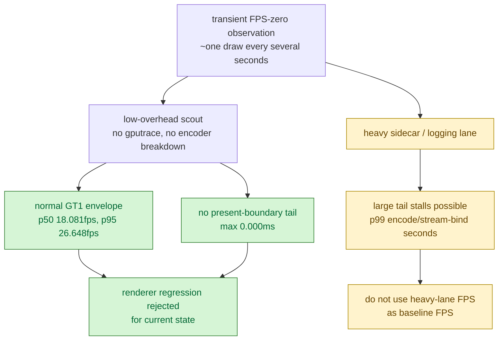

# Low-Overhead Recovery Scout After FPS-Zero Observation

**Question / hypothesis.** After a transient observation of roughly one draw
every several seconds, did the current renderer regress to an FPS-zero state, or
was that a heavy instrumentation / sidecar / transient-stall artifact?

**Method.**

```bash
bash scripts/tools/run_3dmark05_perf_probe.sh \
  --suffix current-lowoverhead-20260613 \
  --frame 60 \
  --no-gputrace \
  --no-encoder-breakdown \
  --frame-sampling \
  --timeout 120 \
  --top 5
```

This path intentionally disables encoder breakdown and indexed per-draw logging.
It is a low-overhead runtime scout, not a route-attributed System Trace sidecar
and not an Xcode replay-counter sample.

**Result.**

| Metric | Value |
|---|---:|
| Status | `pass` |
| Frame-sampling rows | `1,807` |
| Encoder rows | `0` |
| Indexed probe rows | `0` |
| FPS p50 / p95 / max | `18.081` / `26.648` / `30.351` |
| Last sampled FPS | `24.798` |
| `encode_chunk_cpu_ms` p50 / p95 / max | `9.992` / `18.504` / `26.310` |
| `encode_draw_cpu_ms` p50 / p95 / max | `8.231` / `15.592` / `22.499` |
| `encode_draw_stream_bind_cpu_ms` p50 / p95 / max | `1.442` / `2.640` / `3.469` |
| `present_boundary_wait_ms` p50 / p95 / max | `0.000` / `0.000` / `0.000` |
| `completion_wait_ms` p50 / p95 / max | `25.006` / `38.240` / `45.617` |
| `gpu_command_buffer_time_ms` p50 / p95 / max | `1.089` / `13.339` / `21.451` |

Compared with the accepted seq-range System Trace sidecar
([hidden-backend-storage-shape.28](../hidden-backend-storage/hidden-backend-storage-shape.28.md)), this low-overhead run preserves the same
normal FPS envelope but removes the sidecar's extreme tail stalls:

| Metric | Low-overhead scout | Seq-range sidecar |
|---|---:|---:|
| FPS p50 | `18.081` | `18.691` |
| FPS p95 | `26.648` | `26.179` |
| `encode_chunk_cpu_ms` p99 | `22.569` | `1615.033` |
| `encode_draw_stream_bind_cpu_ms` p99 | `3.340` | `1071.565` |
| `present_boundary_wait_ms` max | `0.000` | `2070.169` |
| `dxmt9.log` size | `~3.3 MiB` | `~96.8 MiB` |

The visual state also recovered: the current run was observed as visually
normal, with no black-screen, yellow-frame, texture-corruption, or missing
obvious GT1 effect regression.



**Verdict.** Accepted as a current counter sample. The FPS-zero observation is
not reproduced by the normal low-overhead path and should not be treated as a
current renderer regression. For baseline FPS and visual parity, use this
no-encoder-breakdown scout or another low-overhead `--no-gputrace` run. Use
System Trace sidecars for attribution only, and read their FPS tail with the
known logging/sidecar overhead caveat.

**Residual performance owner.** This does not change the bottleneck model. The
normal path is still in the `8..22fps` practical envelope, with completion wait,
hidden vertex/backend storage, render-pass preservation, and encode CPU
remaining open. The next GPU-facing work still needs route/counter evidence for
programmable color/textured rows rather than only a depth-only shortcut.

**Related.** [baselines](index.md) · [baselines-frame60.03](baselines-frame60.03.md) ·
[hidden-backend-storage-shape.28](../hidden-backend-storage/hidden-backend-storage-shape.28.md) · [present-pacing](../present-pacing/index.md).
