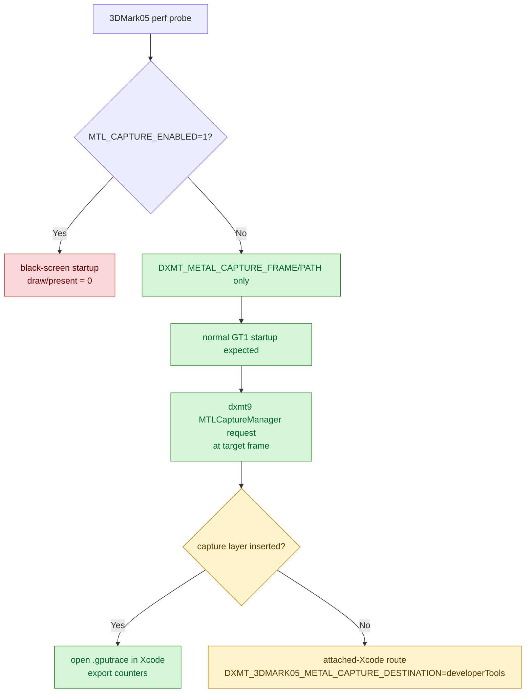

# 3DMark05 gputrace Capture Must Avoid `MTL_CAPTURE_ENABLED`

**Question / hypothesis.** The standard gputrace path used to add
`MTL_CAPTURE_ENABLED=1` together with `DXMT_METAL_CAPTURE_FRAME/PATH`. Does
that env help 3DMark05 capture, or can it perturb startup?

Apple's programmatic-capture contract requires Metal capture to be enabled for
the process via `MetalCaptureEnabled` in `Info.plist` or, on macOS 14+, via
`MTL_CAPTURE_ENABLED=1`. File output additionally requires
`MTLCaptureDestination.gpuTraceDocument` plus an `.gputrace` `outputURL`.

**Method.**

1. Run fragmentless `60/0` with gputrace enabled:

```sh
DXMT_3DMARK05_ENTER_DELAY_SEC=35 \
DXMT_3DMARK05_ENTER_COUNT=6 \
DXMT_3DMARK05_ENTER_INTERVAL_SEC=3 \
scripts/tools/run_3dmark05_perf_probe.sh \
  --suffix fragmentless-depth-only-60-0-xcode-r2 \
  --frame 60 --timeout 420 \
  --probe-fragmentless-depth-only-row 60/0
```

2. Run the same launcher without gputrace but with only the Apple capture-layer
   env injected externally:

```sh
MTL_CAPTURE_ENABLED=1 \
DXMT_3DMARK05_ENTER_DELAY_SEC=35 \
DXMT_3DMARK05_ENTER_COUNT=6 \
DXMT_3DMARK05_ENTER_INTERVAL_SEC=3 \
scripts/tools/run_3dmark05_perf_probe.sh \
  --suffix capture-env-only-sanity-r1 \
  --frame 60 --no-gputrace --encoder-breakdown-seq 60 \
  --timeout 180 \
  --probe-fragmentless-depth-only-row 60/0
```

The second run was manually terminated after showing only a black screen, so it
is not a perf sample.

3. Remove `MTL_CAPTURE_ENABLED=1` from the wrapper default and rerun the same
   gputrace request:

```sh
DXMT_3DMARK05_ENTER_DELAY_SEC=35 \
DXMT_3DMARK05_ENTER_COUNT=6 \
DXMT_3DMARK05_ENTER_INTERVAL_SEC=3 \
scripts/tools/run_3dmark05_perf_probe.sh \
  --suffix fragmentless-depth-only-60-0-xcode-r3 \
  --frame 60 --timeout 420 \
  --probe-fragmentless-depth-only-row 60/0
```

**Result.**

Both runs failed before GT1 rendering:

| Run | Capture env | Result |
|---|---|---|
| `fragmentless-depth-only-60-0-xcode-r2` | wrapper gputrace env with `MTL_CAPTURE_ENABLED=1` | `missing_capture`; no `.gputrace`; no draw/present rows |
| `capture-env-only-sanity-r1` | only `MTL_CAPTURE_ENABLED=1` added externally | black screen; manually terminated; bridge counters show draw/present `0` |
| `fragmentless-depth-only-60-0-xcode-r3` | `DXMT_METAL_CAPTURE_FRAME/PATH`, no `MTL_CAPTURE_ENABLED=1` | normal GT1 execution; file capture failed with `Capture layer is not inserted` |

The `capture-env-only-sanity-r1` log is the isolating evidence: it did not set
`DXMT_METAL_CAPTURE_FRAME/PATH`, yet it still reached only factory bridge calls
and never entered D3D9 draw/present:

| Counter class | Observation |
|---|---:|
| `bridge_factory` | nonzero |
| `bridge_draw` | `0` |
| `bridge_present` | `0` |
| `bridge_draw_indexed_primitive` | `0` |

The adjacent no-gputrace sanity run without `MTL_CAPTURE_ENABLED=1` reached
normal GT1 execution and applied the fragmentless route to all `60/0` draws, so
the black screen is a capture-startup condition, not evidence against the
fragmentless route itself.

The r3 rerun confirms the split: removing `MTL_CAPTURE_ENABLED=1` restores
normal rendering and counters (`present_encoded=1680`, `draw_calls=1236462`).
The target row still routes all `60/0` draws through the diagnostic
fragmentless PSO (`42` draws, `97,294` primitives, `291,882` vertices,
`vsout_layout_last=0x0`). However, the file capture request fails immediately:

```text
startCapture failed destination=2 destination_supported=0 ... error=Capture layer is not inserted.
```



**Verdict.** Accepted as a capture workflow fix. For 3DMark05 perf probes, do
not set `MTL_CAPTURE_ENABLED=1` by default. The standard wrapper now relies on
dxmt9's own `DXMT_METAL_CAPTURE_FRAME/PATH` trigger and only adds the Apple
capture-layer env when `DXMT_3DMARK05_SET_MTL_CAPTURE_ENABLED=1` is explicitly
set. Without the capture layer, normal rendering works but the file
`gpuTraceDocument` destination cannot produce a `.gputrace`; the next capture
workflow experiment is the attached-Xcode `developerTools` destination via
`DXMT_3DMARK05_METAL_CAPTURE_DESTINATION=developerTools`. The failed
black-screen runs are not valid performance or correctness samples.

Reference: Apple's
[Capturing a Metal workload programmatically](https://developer.apple.com/documentation/xcode/capturing-a-metal-workload-programmatically)
and
[MTLCaptureDescriptor.outputURL](https://developer.apple.com/documentation/metal/mtlcapturedescriptor/outputurl)
docs.

**Related.** [[baselines]] · [[hidden-backend-storage-shape.26]].
