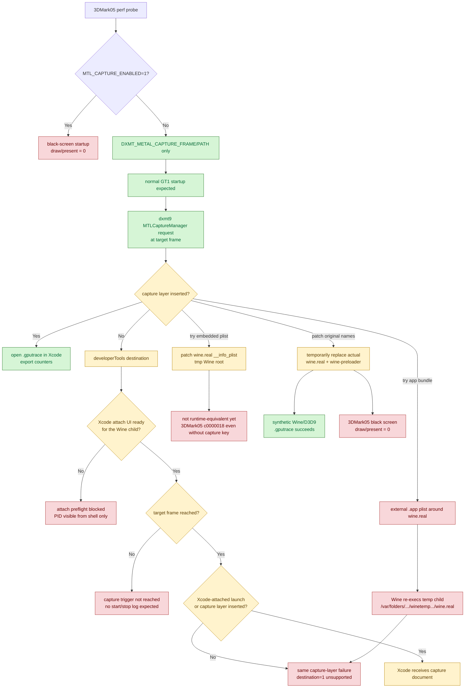

# 3DMark05 gputrace Capture Must Avoid `MTL_CAPTURE_ENABLED`

**Question / hypothesis.** The standard gputrace path used to add
`MTL_CAPTURE_ENABLED=1` together with `DXMT_METAL_CAPTURE_FRAME/PATH`. Does
that env help 3DMark05 capture, or can it perturb startup?

Apple's programmatic-capture contract requires Metal capture to be enabled for
the process via `MetalCaptureEnabled` in `Info.plist` or, on macOS 14+, via
`MTL_CAPTURE_ENABLED=1`. File output additionally requires
`MTLCaptureDestination.gpuTraceDocument` plus an `.gputrace` `outputURL`.

**Method.**

1. Run fragmentless `60/0` with gputrace enabled:

```sh
DXMT_3DMARK05_ENTER_DELAY_SEC=35 \
DXMT_3DMARK05_ENTER_COUNT=6 \
DXMT_3DMARK05_ENTER_INTERVAL_SEC=3 \
scripts/tools/run_3dmark05_perf_probe.sh \
  --suffix fragmentless-depth-only-60-0-xcode-r2 \
  --frame 60 --timeout 420 \
  --probe-fragmentless-depth-only-row 60/0
```

2. Run the same launcher without gputrace but with only the Apple capture-layer
   env injected externally:

```sh
MTL_CAPTURE_ENABLED=1 \
DXMT_3DMARK05_ENTER_DELAY_SEC=35 \
DXMT_3DMARK05_ENTER_COUNT=6 \
DXMT_3DMARK05_ENTER_INTERVAL_SEC=3 \
scripts/tools/run_3dmark05_perf_probe.sh \
  --suffix capture-env-only-sanity-r1 \
  --frame 60 --no-gputrace --encoder-breakdown-seq 60 \
  --timeout 180 \
  --probe-fragmentless-depth-only-row 60/0
```

The second run was manually terminated after showing only a black screen, so it
is not a perf sample.

3. Remove `MTL_CAPTURE_ENABLED=1` from the wrapper default and rerun the same
   gputrace request:

```sh
DXMT_3DMARK05_ENTER_DELAY_SEC=35 \
DXMT_3DMARK05_ENTER_COUNT=6 \
DXMT_3DMARK05_ENTER_INTERVAL_SEC=3 \
scripts/tools/run_3dmark05_perf_probe.sh \
  --suffix fragmentless-depth-only-60-0-xcode-r3 \
  --frame 60 --timeout 420 \
  --probe-fragmentless-depth-only-row 60/0
```

4. Recheck current head with the explicit capture-layer opt-in:

```sh
DXMT_3DMARK05_SET_MTL_CAPTURE_ENABLED=1 \
scripts/tools/run_3dmark05_perf_probe.sh \
  --suffix current-frame60-gputrace-capturelayer-r1 \
  --frame 60 --timeout 420 --min-free-mb 2048
```

This run was stopped early after the invalid condition was already proven:
`actual.png` was fully black, no `.gputrace` was written, and bridge counters
again showed draw/present `0`. It is not a perf sample.

5. Recheck the suggested `developerTools` route with Xcode open and an existing
   `.gputrace` document visible:

```sh
DXMT_3DMARK05_METAL_CAPTURE_DESTINATION=developerTools \
scripts/tools/run_3dmark05_perf_probe.sh \
  --suffix current-frame60-gputrace-devtools-r1 \
  --frame 60 --timeout 300 --min-free-mb 2048
```

This was also not a successful capture. The app rendered normally and reached
`present_encoded=1680`, then the wrapper's `300s + 45s` watchdog cleaned up the
final-frame hang and generated partial-log summaries. However, the capture
request still failed:

```text
startCapture failed destination=1 destination_supported=0 ... error=Capture layer is not inserted.
```

Xcode did not receive a new capture document; the previously opened
`frame60.gputrace` remained the active Xcode window.

   Later harness cleanup turned this into an explicit wrapper route:
   `--xcode-developer-tools-capture` /
   `--metal-capture-destination developerTools`. Unlike
   `gpuTraceDocument`, this path should not create `frame<N>.gputrace`
   directly; the wrapper now requires `destination=1` start/stop log lines and
   expects the useful capture/performance artifacts to be exported from Xcode
   into `traces/<run>/analysis`.

6. Test whether a `MetalCaptureEnabled=true` app-bundle wrapper can avoid the
   env black screen. A native Metal probe proved that both direct and symlinked
   `.app/Contents/MacOS/*` executables get file capture support without
   `MTL_CAPTURE_ENABLED=1`. The same trick does **not** currently solve Wine:

| Attempt | Result |
|---|---|
| `WineMetalCapture.app/Contents/MacOS/wine` symlink to `wine.real` | loader fails with `.../bin/wine: could not load binary` |
| `WineRealMetalCapture.app/Contents/MacOS/wine.real` symlink to `wine.real` | GT1 renders, but the real Metal child runs from `/var/folders/.../winetemp.../wine.real`; `startCapture` still reports `Capture layer is not inserted` |

7. Test a tmp Wine root with `MetalCaptureEnabled=true` patched into the
   embedded Mach-O `__TEXT,__info_plist` section and ad-hoc re-signed. This is
   not a valid capture path yet: after making `ntdll.so` resolve under the tmp
   root, both the patched-capture root and a plain no-capture tmp root fail to
   create the 3DMark05 main module with `status c0000018`. That means the tmp
   Wine-root experiment is not runtime-equivalent to the normal launcher and
   cannot be used as evidence that embedded `MetalCaptureEnabled` itself is safe
   or unsafe for 3DMark05.

8. Test normal Wine root execution with in-place copied Mach-O launcher names:
   `wine.capture.real` and `wine.capture.real-preloader` both had
   `MetalCaptureEnabled=true` patched into their existing
   `__TEXT,__info_plist` sections, were ad-hoc re-signed, and were launched via
   `DXMT_3DMARK05_WINE_BIN` without `MTL_CAPTURE_ENABLED=1`. This is a cleaner
   result than the tmp-root attempt: GT1 rendered normally and produced counters,
   but frame60 file capture still failed with `Capture layer is not inserted`.
   The run was terminated after the capture failure had been observed, so its
   status is `fail` by SIGTERM even though the rendering/counter path was live.

9. Test temporary in-place replacement of the actual Wine launcher names with
   `scripts/tools/run_with_wine_metal_capture_layer.sh`. This wrapper backs up
   `bin/wine.real` and `bin/wine-preloader`, replaces those exact names with
   the capture-enabled copies, runs a command, then restores the originals. It
   succeeded for a synthetic Wine/D3D9 app:
   `traces/capture-layer-present-loop-script-r1/frame2.gputrace` was written,
   and hash checks confirmed that the original Wine binaries were restored.
   The reason this works where copied names failed is that Wine's temp
   executable is copied from the original `wine-preloader` / `wine.real` names.

   The same mechanism is **not** a valid 3DMark05 path. During
   `app-d3d9-3dmark05-capture-layer-inplace-frame60-r1`, the live
   `/var/folders/.../winetemp.../wine.real` had `MetalCaptureEnabled` and
   `Info.plist entries=13`, proving the capture layer precondition reached the
   real launcher. 3DMark05 still black-screened before D3D9 draw/present:
   `bridge_draw=0`, `bridge_present=0`, `actual.png` was fully black, and no
   `frame60.gputrace` was written. The wrapper restored `wine.real` and
   `wine-preloader` to the backup hashes.

10. Test the explicit wrapper `developerTools` route as an
    attach-after-normal-start diagnostic:

```sh
bash scripts/tools/run_3dmark05_perf_probe.sh \
  --suffix xcode-devtools-attach-r1-20260615 \
  --frame 1500 \
  --xcode-developer-tools-capture \
  --timeout 420
```

This run found the real 3DMark05 child from the shell (`3DMark05.exe`, with a
`wine.real` parent), but Xcode 26.5 in a folder-workspace state could not attach:
`Debug > Attach to Process by PID or Name...` was disabled, and
`Debug > Attach to Process` stayed at `Getting Process List...` instead of
listing the Wine child. The run later failed with `missing_capture`, but it only
encoded `657` presents while the requested target was frame `1500`, so dxmt9
never emitted a capture start/stop log. Classify this as an attach-preflight
block plus target-frame miss, not as a capture-layer verdict.

The follow-up wrapper preflight reproduces the same blocked state without
launching 3DMark05:

```sh
bash scripts/tools/run_3dmark05_perf_probe.sh --xcode-attach-preflight-only
# xcode_attach_preflight: status=fail reason=developer-mode-disabled ...
```

The lower-level Xcode menu probe still reports attach-by-PID disabled and the
process list stuck at `Getting Process List...`, but
`/usr/sbin/DevToolsSecurity -status` is the earlier root precondition on this
machine: `Developer mode is currently disabled.`

**Result.**

The capture attempts split as:

| Run | Capture env | Result |
|---|---|---|
| `fragmentless-depth-only-60-0-xcode-r2` | wrapper gputrace env with `MTL_CAPTURE_ENABLED=1` | `missing_capture`; no `.gputrace`; no draw/present rows |
| `capture-env-only-sanity-r1` | only `MTL_CAPTURE_ENABLED=1` added externally | black screen; manually terminated; bridge counters show draw/present `0` |
| `fragmentless-depth-only-60-0-xcode-r3` | `DXMT_METAL_CAPTURE_FRAME/PATH`, no `MTL_CAPTURE_ENABLED=1` | normal GT1 execution; file capture failed with `Capture layer is not inserted` |
| `current-frame60-gputrace-capturelayer-r1` | explicit `DXMT_3DMARK05_SET_MTL_CAPTURE_ENABLED=1` current-head retry | black screen; no `.gputrace`; bridge counters show draw/present `0` |
| `current-frame60-gputrace-devtools-r1` | `DXMT_METAL_CAPTURE_DESTINATION=developerTools`, Xcode open | normal GT1 execution; `developerTools` capture also failed with `Capture layer is not inserted`; no Xcode document appeared |
| `current-frame60-gputrace-appbundle-real-r1` | `MetalCaptureEnabled` external `.app` wrapper around `wine.real` | normal GT1 execution, but Wine's `/var/folders/.../winetemp.../wine.real` child did not inherit the external app-bundle plist; file capture failed with `Capture layer is not inserted` |
| `current-frame60-gputrace-embeddedplist-r2` | tmp Wine root with embedded `MetalCaptureEnabled` patched into `wine.real` | invalid runtime smoke; 3DMark05 failed before rendering with `status c0000018` |
| `current-tmpwine-plain-smoke-r1` | same tmp Wine-root structure without `MetalCaptureEnabled`, no gputrace | same `status c0000018`, proving the tmp root is not runtime-equivalent yet |
| `captureplist-frame60-gputrace-r1` | normal Wine root, copied `wine.capture.real` + `wine.capture.real-preloader` with embedded `MetalCaptureEnabled`, no `MTL_CAPTURE_ENABLED=1` | normal GT1 rendering and counters (`present_encoded=1680`, `draw_skipped_no_pipeline=0`, `gpu_command_buffer_errors=0`), but file capture still failed with `Capture layer is not inserted`; no `.gputrace` |
| `capture-layer-present-loop-script-r1` | temporary replacement of actual `wine.real`/`wine-preloader` names using `run_with_wine_metal_capture_layer.sh` | valid synthetic proof; `frame2.gputrace` was written for `perf-d3d9-present-loop`; originals restored by hash |
| `capture-layer-inplace-frame60-r1` | same temporary replacement applied to 3DMark05 | invalid 3DMark05 sample; temp `wine.real` had `MetalCaptureEnabled`, but startup black-screened before draw/present (`bridge_draw=0`, `bridge_present=0`); no `.gputrace` |
| `xcode-devtools-attach-r1-20260615` | wrapper `--xcode-developer-tools-capture`, Xcode 26.5 folder workspace | invalid attach diagnostic; Xcode attach-by-PID was disabled and the process submenu did not populate; frame `1500` was not reached (`present_encoded=657`), so no `destination=1` start/stop log could exist |

The `capture-env-only-sanity-r1` log is the isolating evidence: it did not set
`DXMT_METAL_CAPTURE_FRAME/PATH`, yet it still reached only factory bridge calls
and never entered D3D9 draw/present:

| Counter class | Observation |
|---|---:|
| `bridge_factory` | nonzero |
| `bridge_draw` | `0` |
| `bridge_present` | `0` |
| `bridge_draw_indexed_primitive` | `0` |

The adjacent no-gputrace sanity run without `MTL_CAPTURE_ENABLED=1` reached
normal GT1 execution and applied the fragmentless route to all `60/0` draws, so
the black screen is a capture-startup condition, not evidence against the
fragmentless route itself.

The r3 rerun confirms the split: removing `MTL_CAPTURE_ENABLED=1` restores
normal rendering and counters (`present_encoded=1680`, `draw_calls=1236462`).
The target row still routes all `60/0` draws through the diagnostic
fragmentless PSO (`42` draws, `97,294` primitives, `291,882` vertices,
`vsout_layout_last=0x0`). However, the file capture request fails immediately:

```text
startCapture failed destination=2 destination_supported=0 ... error=Capture layer is not inserted.
```



**Verdict.** Accepted as a capture workflow fix. For 3DMark05 perf probes, do
not set `MTL_CAPTURE_ENABLED=1` by default. The standard wrapper now relies on
dxmt9's own `DXMT_METAL_CAPTURE_FRAME/PATH` trigger and only adds the Apple
capture-layer env when `DXMT_3DMARK05_SET_MTL_CAPTURE_ENABLED=1` is explicitly
set. Without the capture layer, normal rendering works but neither the file
`gpuTraceDocument` destination nor a simple Xcode-open `developerTools`
destination can produce a capture. The failed black-screen runs are not valid
performance or correctness samples. The 2026-06-07 current-head retries confirm
this is still true after the later instrumentation and visual-fix work, and
show that the remaining capture route must be stronger than merely opening
Xcode: launch/attach under Xcode with the capture layer inserted, or a Wine
loader/Info.plist route that remains runtime-equivalent. The wrapper's
`developerTools` path now treats this as an Xcode-export workflow rather than a
file-output workflow, so a future successful attach-after-normal-start run is
not rejected just because `frame<N>.gputrace` was not written by dxmt9. A simple
external
`.app` wrapper is insufficient because Wine re-execs a temp child, and the tmp
embedded-plist Wine root is not valid until the `c0000018` main-module failure
is solved even without capture enabled. Temporary replacement of the actual
`wine.real`/`wine-preloader` names is now proven for synthetic Wine/D3D9
captures, but it is rejected for 3DMark05 because inserting the capture layer
itself reproduces the black-screen/no-draw startup failure.

The latest explicit Xcode route also adds a separate preflight requirement:
before spending another long `developerTools` run, verify that Xcode can attach
to the real Wine child and pick a target frame that the run is known to reach.
Developer Mode disabled, attach-by-PID disabled, or a process submenu stuck at
`Getting Process List...` are not valid attach routes. Use wrapper
`--xcode-attach-preflight-only` to check this without launching 3DMark05, and
`--require-xcode-attach-preflight` to fail before launch on a `developerTools`
run when Xcode is still in that state.

Reference: Apple's
[Capturing a Metal workload programmatically](https://developer.apple.com/documentation/xcode/capturing-a-metal-workload-programmatically)
and
[MTLCaptureDescriptor.outputURL](https://developer.apple.com/documentation/metal/mtlcapturedescriptor/outputurl)
docs.

**Related.** [baselines](../baselines.md) · [hidden-backend-storage-shape.26](../hidden-backend-storage/hidden-backend-storage-shape.26.md).
