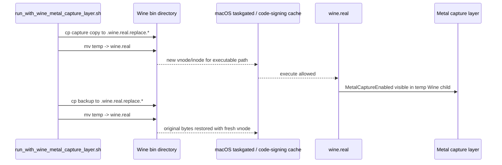
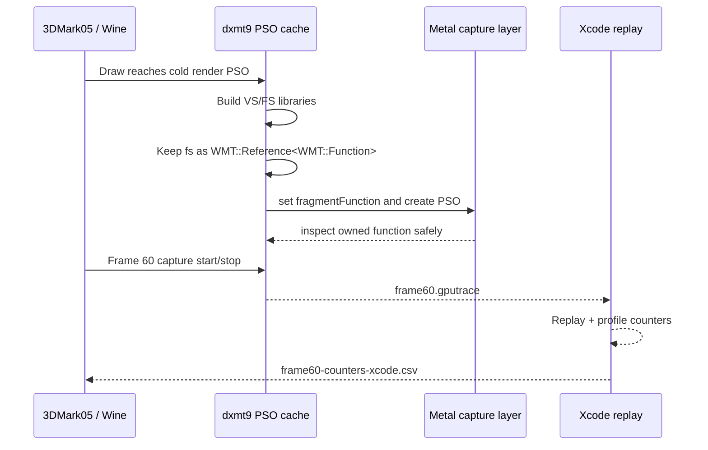
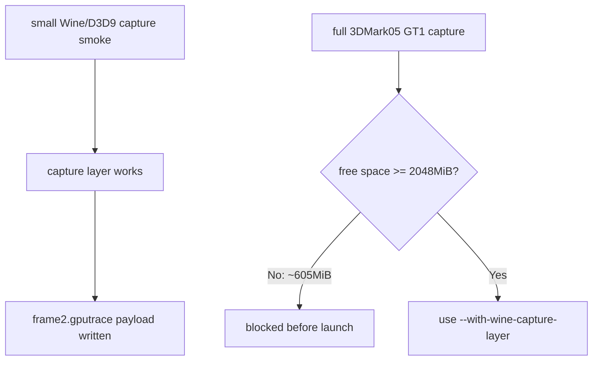

# Capture Layer File Route Recovers After Fragment Function Lifetime Fix

**Question / hypothesis.** The previous capture workflow state was that
3DMark05 could render normally without a capture layer, but file `.gputrace`
failed with `Capture layer is not inserted`, while capture-layer insertion
attempts tended to black-screen before draw/present. After the capture-layer
hang was localized to draw PSO construction, can file capture now produce a
usable Xcode replay/counter artifact?

**Root cause.** The draw PSO path built the fragment function through a
temporary `WMT::Reference<WMT::Function>`, then assigned it into a non-owning
`WMT::Function` before the render pipeline descriptor consumed it. The returned
temporary could release immediately, leaving a stale fragment function handle
when the Metal capture layer inspected `fragmentFunction`.

The fix is to keep the fragment function as an owning reference through
descriptor setup:

```cpp
auto vs = vsLib.newFunction("dxmt9_vs");
WMT::Reference<WMT::Function> fs{};
if (!sourceKey.fragmentlessDepthOnly) {
  fs = fsLib.newFunction("dxmt9_fs");
}
```

**Method.**

```sh
env DXMT_LOG_LEVEL=Info DXMT_3DMARK05_SET_MTL_CAPTURE_ENABLED=1 \
  bash scripts/tools/run_3dmark05_perf_probe.sh \
    --suffix capture-layer-file-r18-20260615 \
    --frame 60 \
    --timeout 180 \
    --capture-delay-sec 20 \
    --wait-unlocked-sec 1 \
    --wait-unlocked-interval-sec 1 \
    --min-free-mb 2048
```

Then open `frame60.gputrace` in Xcode, replay/profile it, export with
**Embed Performance Data**, switch to **Counters**, wait until
`Profiling Draw Counters...` disappears, and export encoder counters.

**Capture result.**

| Field | Value |
|---|---:|
| Run id | `app-d3d9-3dmark05-capture-layer-file-r18-20260615` |
| Probe status | `pass` |
| `timed_out` | `true` |
| Return code | `143` |
| `present_encoded` | `1740` |
| Run draw calls | `1,298,292` |
| Frame60 draw calls | `395` in dxmt summary, `396` in Xcode including present |
| `draw_skipped_no_pipeline` | `0` |
| `gpu_command_buffer_errors` | `0` |
| `map_buffer_wait_ms` | `0.000` |
| `queue_sequence_wait_ms` | `0.000` |
| File capture | `traces/app-d3d9-3dmark05-capture-layer-file-r18-20260615/frame60.gputrace` |
| Xcode performance export | `analysis/frame60-performance.gputrace` |
| Encoder counter export | `analysis/frame60-counters-xcode.csv` |

The timeout is the expected final-frame 3DMark05 lifetime behavior after the
useful capture artifacts have already been written. It is not an FPS sample.

## 2026-06-16 Wrapper Recovery Addendum

A later regression made the capture-layer wrapper fail before D3D9 even for
`wine --version`: the Wine child exited as return code `137`, and the matching
DiagnosticReports entries showed `SIGKILL (Code Signature Invalid)` with
`Taskgated Invalid Signature`. `codesign --verify` still passed. The smoking
gun was path/inode-specific: copying the same binary to `wine.probe.real`
executed, while the original `wine.real` path kept dying. The old wrapper used
`cp -p` to overwrite the existing target path, which can leave stale macOS
code-signing vnode/cache state behind.

The wrapper now patches and restores via same-directory temp files followed by
`mv`, giving `wine.real` and `wine-preloader` fresh inodes each time. The
regression test records the patched inode/content while the wrapper is active
and verifies that the originals are restored afterward.



`capture-layer-atomic-r9` validated the fix on 3DMark05 GT1: frame60 rendered,
the wrapper wrote `traces/app-d3d9-3dmark05-capture-layer-atomic-r9/frame60.gputrace`
(`195 MiB`), and the restored Wine loader no longer contained
`MetalCaptureEnabled` while `wine --version` succeeded. This run confirms the
file capture route. Xcode replay then produced an embedded-performance
`.gputrace` and encoder-counter CSV that passed the dxmt join/coverage gates,
but the run is still a capture-layer diagnostic rather than a wall-clock FPS
sample.

The later `capture-layer-redebug-r1` run reconfirmed the full file route after
the wrapper/preflight edits. It produced
`traces/app-d3d9-3dmark05-capture-layer-redebug-r1/frame60.gputrace`
(`195 MiB`, `543` entries, `228` buffers, `300` textures), `status=pass`,
`capture_error=None`, `draw_skipped_no_pipeline=0`, and
`gpu_command_buffer_errors=0`. Its `actual.png` is a nonblank normal GT1 frame.
Xcode replay then produced
`analysis/frame60-performance.gputrace`, `analysis/frame60-counters-xcode.csv`,
and a joined `analysis/frame60-xcode-dxmt-bottleneck-report.md`. This supersedes
the smoke-only redebug state while keeping the same caveat: it is a
capture-layer diagnostic/counter path, not a normal wall-clock FPS sample.

`capture-layer-redebug-current-r1` reconfirmed the same path from the current
worktree. The supervised run is `status=pass`, `capture_error=None`,
`timed_out=true`, `returncode=143`, and writes
`traces/app-d3d9-3dmark05-capture-layer-redebug-current-r1/frame60.gputrace`.
Xcode export produced `analysis/frame60-performance.gputrace`,
`analysis/frame60-counters-xcode.csv`, and the joined bottleneck report. The
exported counter CSV has `10` encoder rows (`11` lines including the header).
The result changes measurement availability, not the performance owner.

**Xcode summary.**

| Metric | Value |
|---|---:|
| GPU time | `37.21 ms` |
| Vertices | `2,146,296` |
| Draw calls | `396` |
| Render encoders | `10` |
| Command buffers | `4` |
| Total Xcode buffer write | `1779.932 MiB` |
| Total Xcode device write | `1839.221 MiB` |
| Performance state | `Medium` |

Latest current-r1 replay:

| Metric | Value |
|---|---:|
| GPU time | `38.092 ms` |
| Draw calls | `396` |
| Render encoders | `10` |
| Command buffers | `4` |
| Total Xcode buffer write | `1779.947 MiB` |
| Total Xcode device write | `1838.963 MiB` |
| Top-three GPU share | `98.33%` |
| Top-three VS buffer write | `1779.275 MiB` |
| Hidden backend write estimate | `1749.973 MiB` |

The exported counter CSV is usable and was reduced into
`frame60-counters-summary.csv` plus
`frame60-xcode-dxmt-bottleneck-report.md` for quick scans.

`capture-layer-redbg-r1` reran the same wrapper route after the current
capture-layer debugging pass. The wrapper patched both Wine launch binaries,
the probe preflight passed via `wine-binaries-metal-capture-enabled`, the run
restored the originals afterward, and the file capture contains real payload
(`227` `MTLBuffer-*` files, `300` `MTLTexture-*` files, `Capture error: None`).
Xcode replay/export completed again:

| Metric | Value |
|---|---:|
| GPU time | `37.709 ms` |
| Draw calls | `396` |
| Render encoders | `10` |
| Command buffers | `4` |
| Total Xcode buffer write | `1779.894 MiB` |
| Total Xcode device write | `1839.108 MiB` |
| Top-three GPU share | `98.42%` |
| Top-three VS buffer write | `1779.160 MiB` |
| Hidden backend write estimate | `1749.858 MiB` |

This is a recovery/reproducibility refresh, not a new owner change.

`capture-layer-wrapper-live-r1` validates the integrated top-level wrapper flag:

```sh
DXMT_LOG_LEVEL=Info bash scripts/tools/run_3dmark05_perf_probe.sh \
  --suffix capture-layer-wrapper-live-r1 \
  --with-wine-capture-layer \
  --frame 60 \
  --timeout 120 \
  --capture-delay-sec 20 \
  --wait-unlocked-sec 5 \
  --wait-unlocked-interval-sec 1 \
  --min-free-mb 2048
```

The run is `status=pass`, `timed_out=false`, `returncode=0`, and
`capture_error=None`. It writes
`traces/app-d3d9-3dmark05-capture-layer-wrapper-live-r1/frame60.gputrace`
(`191 MiB`), restores the normal Wine loader afterward, and `wine --version`
continues to report `wine-9.0 (SikarugirCX 24.0.7)`. Xcode replay/export then
produces `analysis/frame60-performance.gputrace` (`127 MiB`) and
`analysis/frame60-counters-xcode.csv`. The finalizer joins those counters with
dxmt encoder attribution and writes
`analysis/frame60-xcode-dxmt-bottleneck-report.md`.

| Metric | Value |
|---|---:|
| GPU time | `37.492 ms` |
| Draw calls | `396` |
| Render encoders | `10` |
| Command buffers | `4` |
| Total Xcode buffer write | `1779.942 MiB` |
| Total Xcode device write | `1838.633 MiB` |
| Top-three GPU share | `98.40%` |
| Top-three VS buffer write | `1779.246 MiB` |
| Hidden backend write estimate | `1750.007 MiB` |

`capture-layer-current-r2-20260619` repeats the same integrated file route on
the current worktree after the `v0.0.3` visual-anchor correction. The probe
writes `traces/app-d3d9-3dmark05-capture-layer-current-r2-20260619/frame60.gputrace`
(`191 MiB`) with `status=pass`, `capture_error=None`, and
`gpu_command_buffer_errors=0`. Xcode replay/export produced
`analysis/frame60-performance.gputrace`, `analysis/frame60-counters-xcode.csv`,
and the finalizer wrote the joined bottleneck report. During export, Xcode's
save panel kept an older `analysis` destination; the exported files were
verified on disk and moved into the current run's `analysis/` directory before
finalization.

| Metric | Value |
|---|---:|
| GPU time | `36.183 ms` |
| Draw calls | `396` |
| Render encoders | `10` |
| Command buffers | `4` |
| Total Xcode buffer write | `1779.916 MiB` |
| Total Xcode device write | `1838.890 MiB` |
| Top-three GPU share | `98.33%` |
| Top-three VS buffer write | `1779.229 MiB` |
| Hidden backend write estimate | `1749.865 MiB` |

This makes the preferred file-capture command explicit:
`run_3dmark05_perf_probe.sh --with-wine-capture-layer ...`. Lower-level manual
use of `run_with_wine_metal_capture_layer.sh` remains a diagnostic escape hatch.

**Latest top encoder result.**

| Rank | Encoder | GPU ms | Share | VS invocations | VS buffer written | Device written | Partial renders |
|---:|---|---:|---:|---:|---:|---:|---:|
| 1 | `seq=60,enc=2` | `18.832` | `52.05%` | `642,211` | `981.158 MiB` | `1001.079 MiB` | `0` |
| 2 | `seq=60,enc=1` | `11.241` | `31.07%` | `383,688` | `573.090 MiB` | `595.637 MiB` | `0` |
| 3 | `seq=60,enc=0` | `5.505` | `15.21%` | `152,895` | `224.981 MiB` | `231.151 MiB` | `0` |

Top-three GPU share is `98.33%`. The top-three VS buffer device write total is
`1779.229 MiB`; total device writes for those three encoders are
`1827.867 MiB`.

## 2026-06-19 Current Post-Compact Wrapper Refresh

`capture-layer-current-post-compact-r1` reran the integrated
`--with-wine-capture-layer` file route from the current worktree after the
direct compact-submission cleanup. It confirms that the capture layer still
works without Xcode attach: the wrapper wrote
`traces/app-d3d9-3dmark05-capture-layer-current-post-compact-r1/frame60.gputrace`,
Xcode replay/profile completed, `frame60-performance.gputrace` was exported
under the same run's `analysis/` directory, and `Editor > Export GPU Counters`
produced `frame60-counters-xcode.csv`.

The save-panel path cache still matters operationally: Xcode may show only
`Where: analysis` while remembering another run's `analysis` directory. Verify
the real path after every export and normalize misplaced files before running
the finalizer.

| Metric | Value |
|---|---:|
| GPU time | `35.919 ms` |
| Draw calls | `396` |
| Render encoders | `10` |
| Command buffers | `4` |
| Total Xcode buffer write | `1779.922 MiB` |
| Total Xcode device write | `1838.868 MiB` |
| Top-three GPU share | `98.26%` |
| Top-three VS buffer write | `1779.230 MiB` |
| Hidden backend write estimate | `1749.866 MiB` |
| `draw_skipped_no_pipeline` | `0` |
| `gpu_command_buffer_errors` | `0` |

Top encoders from the joined Xcode/dxmt report:

| Rank | Encoder | GPU ms | Share | VS invocations | VS buffer written | Device written | Partial renders |
|---:|---|---:|---:|---:|---:|---:|---:|
| 1 | `seq=60,enc=2` | `18.988` | `52.86%` | `642,211` | `981.191 MiB` | `1001.103 MiB` | `0` |
| 2 | `seq=60,enc=1` | `11.002` | `30.63%` | `383,688` | `573.084 MiB` | `595.593 MiB` | `0` |
| 3 | `seq=60,enc=0` | `5.306` | `14.77%` | `152,895` | `224.955 MiB` | `231.149 MiB` | `0` |

The runtime side of the same run preserves the average-FPS owner split rather
than changing it: `completion_wait_ms_per_present=25.530`,
`completion_wait_without_enqueue_ms_per_present=25.317`,
`completion_wait_no_enqueue_share=99.166%`, `commit_chunk_replay=8.333ms/present`,
`commit_chunk_queue_draw_submission=3.912ms/present`, and
`encode_chunk=15.700ms/present`. Its `actual.png` is an effects-heavy normal
GT1 frame with muzzle/bloom/sparks visible, so it is suitable as capture health
evidence. It is still not a normal wall-clock FPS sample.



**Interpretation.**

- The capture-layer route is no longer globally blocked for 3DMark05.
- The previous `Capture layer is not inserted` and black-screen history remains
  valid workflow evidence for earlier routes. This recovered route supersedes the
  blanket "no 3DMark05 file capture available" conclusion, not the warning that
  capture-layer envs can perturb startup and should be treated as diagnostics.
- The current Xcode export again shows the accepted baseline shape: top-three
  encoders dominate GPU time, and the dominant write bucket is
  `VS Buffer Device Memory Bytes Written`, not texture store, depth store, or
  partial-render count.
- The joined dxmt attribution explains only `0.302 MiB` of top-three Xcode
  buffer writes as CPU-side writer bytes. The latest report leaves
  `1779.641 MiB` unexplained by dxmt CPU writers and estimates `1750.007 MiB`
  after subtracting named tiled-buffer counters. This keeps the next probe
  focused on primitive backend/state-shape pressure rather than argbuf or
  transient upload bytes.
- This run is a counter/capture proof, not a normal wall-clock FPS sample. Use
  no-gputrace low-overhead runs for pacing/FPS claims.

## 2026-06-16 Small Capture-Layer Smoke

When the repository volume had only about `605MiB` free, a full 3DMark05
`.gputrace` dry-run correctly stopped on the `2048MiB` guard, but the capture
layer itself was rechecked with the small `perf-d3d9-present-loop` catalogue
app:

```sh
repo_root=$(pwd)
DXMT_EXPERIMENT_PROFILE=perf DXMT_LOG_LEVEL=Info \
DXMT_METAL_CAPTURE_FRAME=2 \
DXMT_METAL_CAPTURE_PATH="$repo_root/traces/capture-layer-present-loop-smoke-default-current/frame2.gputrace" \
bash scripts/tools/run_with_wine_metal_capture_layer.sh \
  --wine-root experiments/wine/sikarugir-cx-24.0.7 -- \
  python3 scripts/run_apps/run_experiment.py run perf-d3d9-present-loop \
    --output-suffix capture-layer-present-loop-smoke-default-current \
    --timeout 60 \
    --wine-root experiments/wine/sikarugir-cx-24.0.7
```

The run reports `status=pass`, `present_encoded=1000`,
`gpu_command_buffer_errors=0`, and writes
`traces/capture-layer-present-loop-smoke-default-current/frame2.gputrace`
(`608KiB`). The run's `capture_error` is a screenshot/window-title mismatch,
not a Metal capture failure: dxmt logs show capture
`started` and `stopped` for `frame=2 seq=2 destination=2`, and the `.gputrace`
contains real capture/texture payload files. The wrapper restore check keeps
normal `wine.real` / `wine-preloader` without `MetalCaptureEnabled` while the
capture copies retain it.

A repeat smoke with an absolute path confirmed the path convention:
`capture-layer-present-loop-redbg-abs-20260616` wrote
`traces/capture-layer-present-loop-redbg-abs-20260616/frame2.gputrace`
(`608KiB`), reported `present_encoded=1000` and
`gpu_command_buffer_errors=0`, and logged `started` / `stopped` for
`frame=2 seq=2 destination=2`. When manually wrapping `run_experiment.py`, keep
`DXMT_METAL_CAPTURE_PATH` absolute: the catalogue launcher changes cwd to the
app directory before starting Wine, so a relative `traces/...` path lands under
`experiments/apps/<app>/traces/...` instead of the repository trace root. The
3DMark05 probe wrapper already passes an absolute
`$repo_root/traces/<run-id>/frame<N>.gputrace` path.

This smoke separates the current operational state:



The 2026-06-16 re-debug found one non-capture regression in the same path:
after a unix provider relink, `build-x86_64-builtin/src/winemetal/unix/winemetal.so`
could retain bare `winemac.so` / `ntdll.so` load commands when the Meson
`winemetal_unix_install_name_fixup` target had not run before staging. The
symptom was an early
`[winemetal-abi] error: abi-hash unix-call failed status=0xc0000003` and
`present_encoded=0`, before `MTLCaptureManager` could start. Running the fixup
target restored `@rpath/winemac.so` / `@rpath/ntdll.so`; the follow-up
`capture-layer-present-loop-current-r2` smoke passed with `present_encoded=1000`,
`gpu_command_buffer_errors=0`, and capture `started` / `stopped` for
`frame=2 seq=2 destination=2`. `install_heroic_wine.sh` now explicitly runs the
unix fixup target and audits the `.so` before copying it into the Wine runtime.

**Verdict.** Accepted. File `.gputrace` capture and Xcode encoder-counter
export are usable again for 3DMark05 GT1 when the capture-layer diagnostic route
is deliberately enabled and the fragment function lifetime fix is present.
Future Xcode spends can use this route, but every result must still be paired
with a normal no-gputrace visual/perf scout before making average-FPS claims.

**Related.** [baselines-gputrace-capture.01](baselines-gputrace-capture.01.md) ·
[baselines-gputrace-preflight.02](baselines-gputrace-preflight.02.md) · [hidden-backend-storage-shape.32](../hidden-backend-storage/hidden-backend-storage-shape.32.md) ·
[baselines](../baselines.md).
