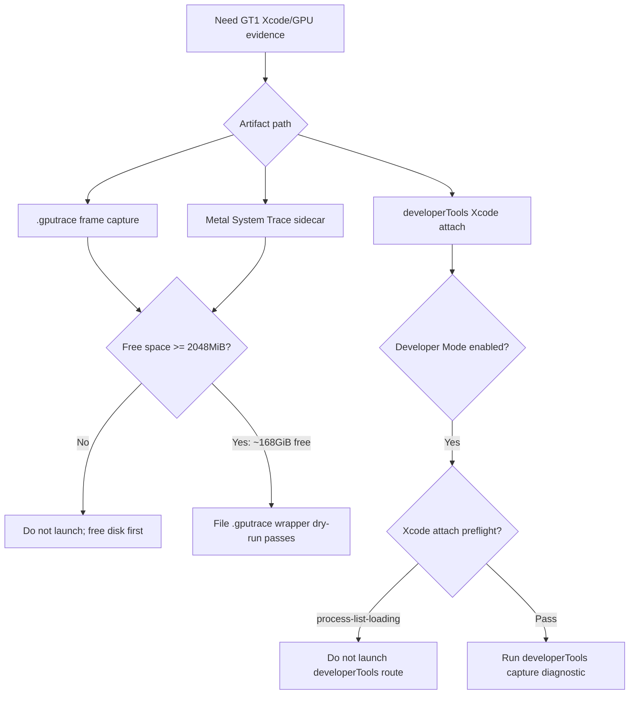

# gputrace/System Trace Preflight

**Question.** Can the current machine start another 3DMark05 GT1 `.gputrace`
or Metal System Trace sidecar immediately after cleaning `tmp`,
`experiments/output`, and `traces`?

**Current verdict.** The file `.gputrace` route and Metal System Trace sidecar
can be launched again. The repository volume now has about `168GiB` free,
Developer Mode is enabled, the file route dry-run passes through the Wine
capture-layer wrapper, and the System Trace sidecar dry-run passes the `4096MiB`
guard. A real file-route refresh,
`capture-layer-current-r2-20260619`, also produced `frame60.gputrace`, an Xcode
Embed Performance Data export, encoder counters, and a finalized joined
bottleneck report. The Xcode `developerTools` attach route remains blocked:
even after opening Xcode, `run_3dmark05_perf_probe.sh
--xcode-attach-preflight-only` reports `process-list-loading` with
`Attach to Process` stuck at `Getting Process List...`. Do not spend a long
`developerTools` capture run until that preflight passes.

**Historical note.** On 2026-06-15 this same preflight was blocked by disk: the
repository volume had only about `605MiB` free, below the old `2048MiB` launch
guard. That condition is no longer true.



## Evidence

Disk and Xcode toolchain checks:

```sh
df -h .
xcode-select -p
xcrun xctrace version
/usr/sbin/DevToolsSecurity -status
bash scripts/tools/run_3dmark05_perf_probe.sh --xcode-attach-preflight-only
```

Observed state:

| Check | Result |
|---|---:|
| Repository free space | `~168GiB` |
| Full Xcode path | `/Applications/Xcode.app/Contents/Developer` |
| `xctrace` | `xctrace version 16.0 (17F42)` |
| Developer Mode | `Developer mode is currently enabled.` |
| file capture-layer preflight | `status=pass reason=wine-capture-layer-wrapper` |
| real file capture/export refresh | `capture-layer-current-r2-20260619`: `frame60.gputrace`, `frame60-performance.gputrace`, `frame60-counters-xcode.csv`, joined report |
| Xcode attach preflight before Xcode launch | `status=fail reason=xcode-not-running` |
| Xcode attach preflight after Xcode launch | `status=fail reason=process-list-loading ... attach_process_first_item=Getting Process List...` |

The standard file `.gputrace` dry-run resolves a valid run id and capture path
and passes the launch guard through the Wine capture-layer wrapper:

```sh
bash scripts/tools/run_3dmark05_perf_probe.sh \
  --suffix gputrace-preflight-current-20260619 \
  --frame 60 \
  --timeout 420 \
  --dry-run \
  --wait-unlocked-sec 1 \
  --wait-unlocked-interval-sec 1 \
  --with-wine-capture-layer
```

Key dry-run rows:

| Row | Value |
|---|---:|
| `run_id` | `app-d3d9-3dmark05-gputrace-preflight-current-20260619` |
| `free_space_mb` | `168640` |
| `min_free_space_mb` | `2048` |
| `wine_capture_layer_wrapper` | `enabled` |
| `gputrace` | `traces/app-d3d9-3dmark05-gputrace-preflight-current-20260619/frame60.gputrace` |
| `file_capture_layer_preflight` | `status=pass reason=wine-capture-layer-wrapper` |

The System Trace sidecar dry-run also passes the current free-space guard:

```sh
bash scripts/tools/run_3dmark05_system_trace_sidecar.sh \
  --dry-run \
  --export-cpu-summary \
  --wait-unlocked-sec 1 \
  --wait-unlocked-interval-sec 1 \
  -- \
  --suffix systemtrace-preflight-current-20260619 \
  --frame 60 \
  --no-gputrace \
  --timeout 120
```

Key sidecar rows:

| Row | Value |
|---|---:|
| `run_id` | `app-d3d9-3dmark05-systemtrace-preflight-current-20260619` |
| `system_trace_free_space_mb` | `168641` |
| `system_trace_min_free_space_mb` | `4096` |
| `system_trace_record_cmd` | `xcrun xctrace record --template Metal System Trace --all-processes --time-limit 25s ...` |
| `system_trace_cpu_summary` | `enabled` |

## Interpretation

The capture infrastructure is behaving correctly, but the usable route depends
on the capture target:

- Use `--with-wine-capture-layer` for deliberate file `.gputrace` diagnostics;
  it is the current preflight-passing route.
- Use the System Trace sidecar when a lower-overhead route/cadence sample is
  enough; the current `4096MiB` guard passes.
- Do not use the Xcode `developerTools` attach route until
  `--xcode-attach-preflight-only` stops reporting `process-list-loading`.
- Do not confuse a dry-run preflight pass with a performance result. A real
  `.gputrace` still needs frame capture, Xcode **Embed Performance Data**, a
  completed counters profile, and exported encoder counters under
  `traces/<run>/analysis`.
- Xcode's save panel can retain an older `analysis` destination while showing
  only the abbreviated folder name. Verify the exported file paths on disk and
  normalize them into the current run's `traces/<run>/analysis` directory
  before running the finalizer.

For H88 specifically, no Xcode replay was needed because the same-day
no-gputrace P4 gates already reject the candidate as an average-FPS fix.

**Related.** [baselines-gputrace-capture.01](baselines-gputrace-capture.01.md) - [baselines](../baselines.md).
