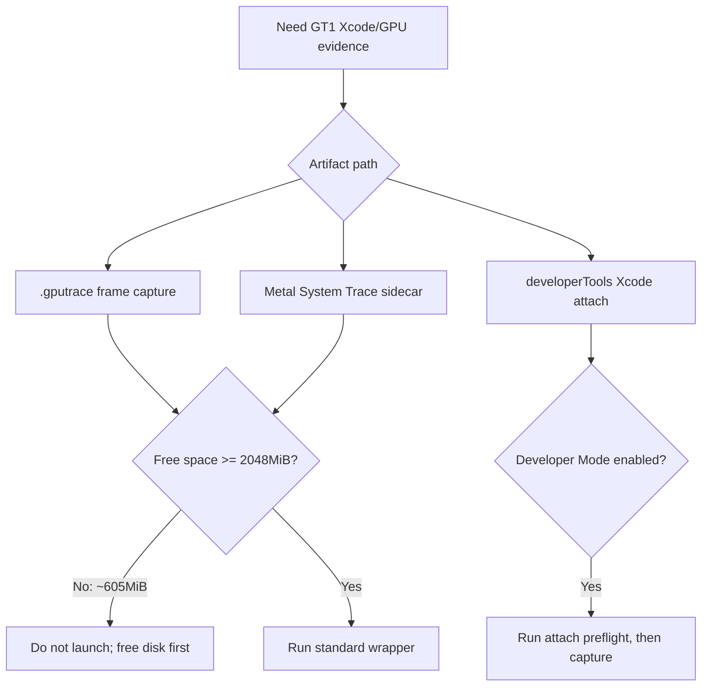

# gputrace/System Trace Preflight Blocked By Disk

**Question.** Can the current machine start another 3DMark05 GT1 `.gputrace`
or Metal System Trace sidecar immediately after cleaning `tmp`,
`experiments/output`, and `traces`?

**Verdict.** No for full 3DMark05 `.gputrace` / System Trace capture. This is
a preflight block, not a renderer or performance result. The repository volume
has only about `605MiB` free, while both `.gputrace` and System Trace paths use
the standard `2048MiB` launch guard. Developer Mode is now enabled, so the old
Developer Mode blocker is cleared; disk space is the remaining hard blocker for
full GT1 captures.



## Evidence

Disk and Xcode toolchain checks:

```sh
df -h .
xcode-select -p
xcrun xctrace version
/usr/sbin/DevToolsSecurity -status
bash scripts/tools/run_3dmark05_perf_probe.sh --xcode-attach-preflight-only
```

Observed state:

| Check | Result |
|---|---:|
| Repository free space | `~605MiB` |
| Full Xcode path | `/Applications/Xcode.app/Contents/Developer` |
| `xctrace` | `xctrace version 16.0 (17F42)` |
| Developer Mode | `Developer mode is currently enabled.` |
| file capture-layer preflight | `status=pass reason=wine-capture-layer-wrapper` |

The standard `.gputrace` dry-run resolves a valid run id and capture path, then
correctly refuses to proceed because free space is below the guard:

```sh
bash scripts/tools/run_3dmark05_perf_probe.sh \
  --suffix gputrace-preflight-refresh-20260615 \
  --frame 60 \
  --timeout 420 \
  --dry-run \
  --wait-unlocked-sec 1 \
  --wait-unlocked-interval-sec 1
```

Key dry-run rows:

| Row | Value |
|---|---:|
| `run_id` | `app-d3d9-3dmark05-gputrace-preflight-refresh-20260615` |
| `free_space_mb` | `~605` |
| `min_free_space_mb` | `2048` |
| `gputrace` | `traces/app-d3d9-3dmark05-gputrace-preflight-refresh-20260615/frame60.gputrace` |
| guard verdict | `dry-run: free space is below the launch guard` |

The System Trace sidecar dry-run reaches the same free-space verdict:

```sh
bash scripts/tools/run_3dmark05_system_trace_sidecar.sh \
  --dry-run \
  --export-cpu-summary \
  --wait-unlocked-sec 1 \
  --wait-unlocked-interval-sec 1 \
  -- \
  --suffix systemtrace-preflight-refresh-20260615 \
  --frame 60 \
  --no-gputrace \
  --timeout 120 \
  --frame-sampling
```

Key sidecar rows:

| Row | Value |
|---|---:|
| `run_id` | `app-d3d9-3dmark05-systemtrace-preflight-refresh-20260615` |
| `system_trace_free_space_mb` | `~605` |
| `system_trace_min_free_space_mb` | `2048` |
| guard verdict | `dry-run: free space is below the system-trace launch guard` |

## Interpretation

The capture infrastructure is behaving correctly. The next GPU/Xcode evidence
step is operational, not analytical:

- Free at least `2048MiB` on the repository volume before launching `.gputrace`
  or System Trace.
- For `developerTools` capture, Developer Mode is no longer the blocker, but
  rerun the explicit Xcode attach preflight before spending a long 3DMark05 run.
- Do not delete active prefixes such as the 3DMark05 Wine prefix merely to
  satisfy the guard; the wrapper's ignored/manual-review list is advisory.

Until those conditions change, continue with no-gputrace CPU/P4 work or small
native tests instead of starting a capture that cannot produce authoritative
Xcode counter evidence.

**Related.** [[baselines-gputrace-capture.01]] - [[baselines]].
