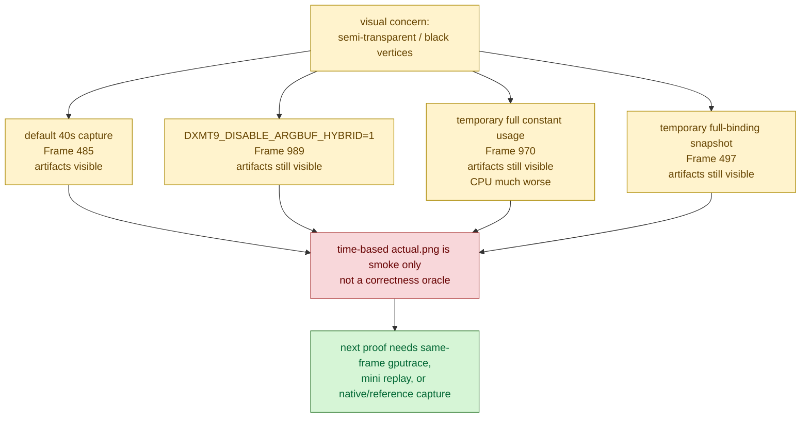

# Baselines / Visual Capture 01 — GT1 time-based screenshots are not a stable correctness oracle

> **Outdated — every artifact this leaf cites in `source:` is gone from disk.** The numbers below cannot be re-derived or re-checked. Kept as history; do not cite it as current evidence.

**Date.** 2026-06-06.

**Question.** After cbuf residual instrumentation, the live GT1 image appeared
to contain semi-transparent or black vertices. Is that a regression from the
latest cbuf/argbuf/snapshot optimizations?

**Method.**

- Compared recent `actual.png` outputs with a contact sheet:
  `/tmp/dxmt9-recent-actual-contact-96.png`.
- Ran a no-argbuf comparison:
  `DXMT9_DISABLE_ARGBUF_HYBRID=1 scripts/tools/run_3dmark05_perf_probe.sh --suffix visual-no-argbuf-r1 --frame 50 --no-gputrace --no-encoder-breakdown --timeout 180`.
- Added two temporary local A/B gates, then removed them after the test:
  force full shader-constant usage, and force full-binding snapshot instead of
  binding-agnostic snapshot.
- Captured a 40s default run and a 40s full-binding snapshot run directly with
  `run_experiment.py --capture-delay-sec 40` because the wrapper's 70s
  screenshot can miss early-finished comparison runs.

**Artifacts.**

- `experiments/output/app-d3d9-3dmark05-visual-no-argbuf-r1/actual.png`
  (`Frame: 989`).
- `experiments/output/app-d3d9-3dmark05-visual-full-const-usage-r1/actual.png`
  (`Frame: 970`; timeout-finalized, status `partial-log`).
- `experiments/output/app-d3d9-3dmark05-visual-default-capture40-r1/actual.png`
  (`Frame: 485`).
- `experiments/output/app-d3d9-3dmark05-visual-full-binding-capture40-r1/actual.png`
  (`Frame: 497`).

**Observation.**

The semi-transparent trails and black foreground silhouettes appear in the
default 40s capture, in the no-argbuf run, in the full-constant-usage run, and
in the full-binding snapshot run. Disabling any one of those paths did not
remove the visible shape. The full-constant-usage run also slowed the CPU path
substantially (`d3d9_snapshot_uniform_build_hash_cpu_ms=9996.320`,
`encode_draw_argbuf_cbuf_update_cpu_ms=5252.437`), but did not turn the image
into an obvious clean baseline.

**Verdict.** Rejected as proof of a single latest-regression owner. The current
time-based `actual.png` is useful as a smoke image, but not as a correctness
oracle for GT1 because the captured animation frame can land inside heavy
post-process / motion-blur / alpha-composition sections. `v0.0.3` is the last
known visual-safe code point and current visual correctness / alignment anchor
for GT1 regression triage; the older `v0.0.1` capture remains an early
screenshot-diff reference
([baselines-visual-capture.02](baselines-visual-capture.02.md), [snapshot-cache-visual.01](../snapshot-cache/snapshot-cache-visual.01.md)),
but a future pixel-level visual regression claim still needs either a
same-frame Metal capture, a same-input mini replay, or a native/WineD3D
reference for the same animation point.

