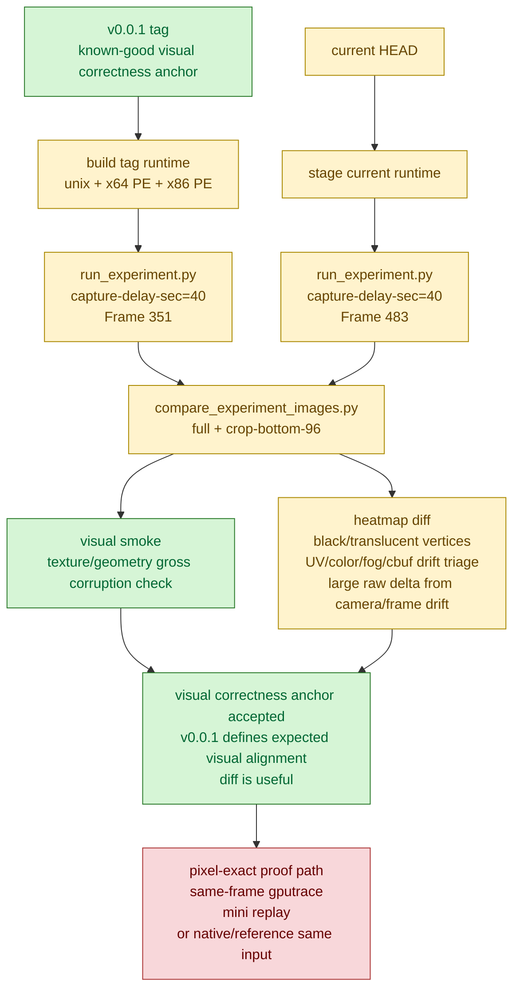

# Baselines / Visual Capture 02 - `v0.0.1` is the visual correctness anchor

**Date.** 2026-06-06.

**Question.** Can the `v0.0.1` tag be used as the known-good visual correctness
and alignment reference when current GT1 changes look suspicious, and how should
diff images be interpreted?

**Method.**

- Added a detached worktree at `/Users/dididi/workspaces/dxmt9-v0.0.1` from
  tag `v0.0.1` (`297997a`).
- Built the tag runtime with the current build lanes:
  `build-x86_64-builtin`, `build-win32-x64-builtin`, and
  `build-win32-x86-builtin`. The unix provider was configured with
  `-Dbuild_tests=false` because the old test manifest blocks configure, but
  the runtime target builds cleanly.
- Ran GT1 through the current `run_experiment.py` harness so timeout,
  screenshot, prefix staging, and Wine selection stayed identical:
  `DXMT_EXPERIMENT_PROFILE=perf ... run app-d3d9-3dmark05 --timeout 180 --capture-delay-sec 40 --output-suffix visual-v001-capture40-r1`.
- Re-staged current HEAD and ran the same capture:
  `--output-suffix visual-current-capture40-r2`.
- Compared the two screenshots with:
  `python3 scripts/tools/compare_experiment_images.py --crop-bottom 96 --active-threshold 5`.

**Artifacts.**

- `experiments/output/app-d3d9-3dmark05-visual-v001-capture40-r1/actual.png`
  (`v0.0.1`; overlay: `FPS 7`, `Time 0:25.11`, `Frame 351`).
- `experiments/output/app-d3d9-3dmark05-visual-current-capture40-r2/actual.png`
  (current HEAD; overlay: `FPS 11`, `Time 0:25.63`, `Frame 483`).
- `experiments/output/app-d3d9-3dmark05-visual-current-capture40-r2/image-comparison-vs-v001-capture40.md`.
- `experiments/output/app-d3d9-3dmark05-visual-current-capture40-r2/image-diff-vs-v001-capture40.png`.

**Observation.**

The `v0.0.1` tag is the valid known-good visual correctness anchor for GT1. Its
textures, foreground silhouettes, floor/wall mapping, and lighting composition
are coherent, so the tag should be treated as the actual visual-alignment
reference when checking whether current changes broke texture/color/geometry
semantics. In other words, `v0.0.1` is not just a historical performance
baseline; it is the repository's current GT1 visual-correctness reference. The
current capture also looks coherent and does not show the recent
texture-coordinate/cbuf-identity corruption class.

The screenshot diff is useful because it makes broad texture, color, and
geometry drift visible against that known-good anchor. Use the diff image as a
triage tool for obvious classes such as black/translucent vertices, broken UVs,
missing textures, wrong fog/color, and cbuf-identity artifacts. The numeric diff
from a time-based screenshot is intentionally not a standalone pass/fail gate:
same `capture-delay-sec=40` does not mean same animation frame. `v0.0.1`
captured frame `351`, current captured frame `483`, and the camera/foreground
geometry moved. The comparison therefore reports large expected changes:
`changed_pct=95.123545%`, cropped `changed_pct=98.417155%`, full-frame
`SSIM=0.549463`, cropped `SSIM=0.283971`.

**Verdict.** Accepted as the GT1 visual correctness / alignment anchor. Use
`v0.0.1` screenshots and generated heatmap diffs to triage visual corruption;
the diff is useful precisely because it highlights broad texture, color, and
geometry drift against a known-good image. A candidate that changes resource
identity, constant uploads, vertex layout, primitive order, or batching should
at least survive qualitative inspection against this anchor before being treated
as visually safe. Require same-frame replay, same-input mini replay, or a
draw/window-level proof only before treating raw pixel-difference percentages
from time-based screenshots as exact semantic failures.

