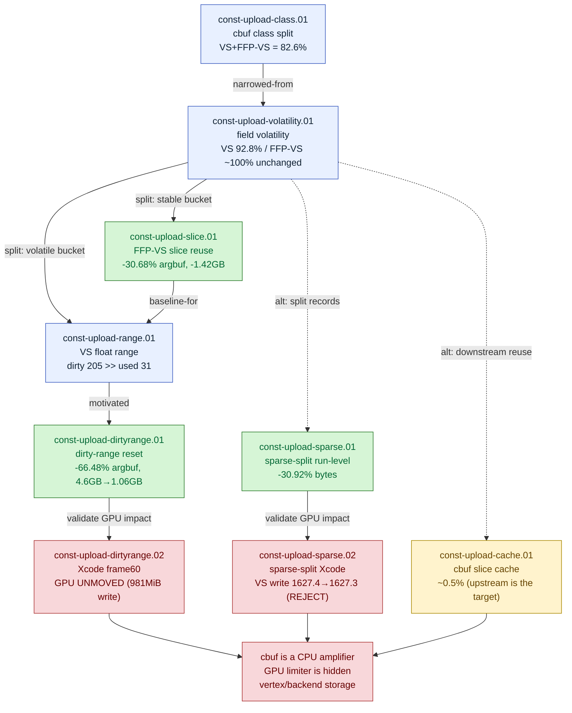

# Const-Upload — CPU-side constant-buffer (cbuf/argbuf) upload traffic

> Part of the 3DMark05 GT1 GPU-bottleneck investigation. Root map: [[overview-3dmark05-gt1]].

## Scope & question

This domain owns the multi-GB CPU-side constant-buffer write traffic dxmt9
emitted per GT1 frame — the argbuf/transient cbuf (VS / FFP-VS / PS / FFP-PS)
uploads. It asks: where do those bytes go, which fields are actually volatile,
and can the traffic be cut? The answer is a sequence of attributions and
reductions that cut cbuf/transient CPU bytes massively (FFP-VS slice reuse,
dirty-range reset, sparse-record split) but did **not** move the GPU frame
bottleneck — proving cbuf upload is a **CPU amplifier**, not the GPU limiter.

## Hypotheses & verdicts

| # | Hypothesis | Verdict | Evidence |
|---|-----------|---------|----------|
| H1 | The cbuf bucket is dominated by pixel constants | rejected (it is `82.6%` vertex-side) | [[const-upload-class.01]] |
| H2 | Repeated cbuf rewrites are mostly genuinely changed bytes | rejected (VS `92.8%` unchanged; FFP-VS ~`100%` unchanged) | [[const-upload-volatility.01]] |
| H3 | Caching/repointing the stable FFP-VS slice removes its cbuf bytes | accepted as CPU win (`-30.68%` argbuf, removes ~`1.42GB`); GPU unmoved | [[const-upload-slice.01]] |
| H4 | The residual VS cbuf width is driven by shader float usage | rejected (dirty high-water ~`205` regs dominates vs ~`31` used) | [[const-upload-range.01]] |
| H5 | Resetting dirty-range counters with the dirty bit cuts VS cbuf | accepted as CPU win (`-66.48%` argbuf, `4.6GB`→~`1.06GB`); GPU unmoved | [[const-upload-dirtyrange.01]] |
| H6 | The post-fix top-pass GPU cost is still cbuf upload | rejected (cbuf down to `163KiB`/encoder; cost is memory-write/store) | [[const-upload-dirtyrange.02]] |
| H7 | Splitting sparse const records cuts payload without inflating count | accepted as CPU mechanism (`-30.92%` bytes, `+0.13%` count) | [[const-upload-sparse.01]] |
| H8 | Sparse-const split moves the Xcode GPU bottleneck | rejected (VS write `1627.4→1627.3MiB` unchanged) | [[const-upload-sparse.02]] |
| H9 | Hash-based downstream cbuf slice reuse cuts the bucket | inconclusive (~`0.5%`; target is upstream record coalescing) | [[const-upload-cache.01]] |

## Verification methods

- **`DXMT9_PERF_ENCODER_BREAKDOWN=1`** — cbuf class attribution (VS/FFP-VS/PS/FFP-PS
  bytes), then field-volatility (first / rewrite-changed / rewrite-unchanged) and
  VS upload-plan fields (`argbuf_cbuf_vs_plan/dirty/usage_float_regs_*`,
  `full_struct_uploads`). The whole attribution chain runs on this flag.
- **FFP-VS stable-slice cache** — defer FFP-VS out of the generic argbuf dirty
  mirror, byte-compare an encoder-local host copy, repoint argbuf `id(1)` when
  unchanged. Proves the FFP-VS bucket is pure write amplification.
- **Dirty-range reset** — `DirtyState` consumption clears the range high-water
  with the dirty bit. Proves the stale dirty high-water (not shader usage) sized
  the VS upload prefix.
- **`DXMT9_SPLIT_SPARSE_CONST_RECORDS=1`** (`--split-sparse-const-records`) —
  split one merged min/max const record into changed-register runs.
- **Run-level gates** — `compare_3dmark05_perf_counters.py`
  `--require-const-upload-break-bytes-decrease`,
  `--max-const-upload-break-count-ratio`, `--require-const-upload-passthrough-present`
  prove the CPU mechanism before any GPU claim.
- **Xcode frame capture / gates** — `.gputrace` + exported encoder counters +
  `--baseline-joined` `--require-top-vs-buffer-write-decrease` decide GPU impact.
  Every accepted CPU win was checked against the GPU frame and found inert.

## Experiment dependency graph

## Results synthesis

The attribution chain is settled and consistent. The cbuf bucket is `82.6%`
vertex-side (VS + FFP-VS), and almost all of its rewrite bytes are *unchanged*
between consecutive uploads — FFP-VS is ~100% stable inside an encoder, and the
VS bucket's width is set by a stale dirty high-water (~`205` registers) that sits
far above the ~`31` float registers any shader actually uses. Two targeted CPU
fixes followed directly from that: **FFP-VS stable-slice reuse** (`-30.68%`
argbuf, removing ~`1.42GB`) and the **dirty-range reset** (`-66.48%` argbuf,
`-49.95%` transient). Together they took total cbuf traffic from ~`4.6GB` down to
~`1GB`. The sparse-record split adds a further `~31%` payload-byte reduction as a
standalone, accepted CPU mechanism.

But every accepted CPU win is GPU-inert. `gpu_command_buffer_time_ms` stayed in
the same class through the slice-reuse, range, and dirty-range runs, and the
Xcode frame60 capture confirmed the top three encoders are bound by ~`1.64GiB` of
device-memory writes / render-pass store pressure while their dxmt-attributed
cbuf writes are only hundreds of KiB. The sparse-split Xcode validation made the
same point with the dominant counter: VS buffer write `1627.4→1627.3MiB`,
unchanged. The cbuf slice cache (~`0.5%`) showed the residual is upstream —
const-upload records are created at nearly draw frequency, so downstream reuse
can't help. **Verdict for the domain: dirty-range reset + FFP-VS slice reuse
removed the bulk of cbuf CPU traffic (4.6GB → ~1GB), but the GPU bottleneck is
unchanged. Cbuf upload is a CPU amplifier; the GPU limiter is hidden
vertex/backend storage.** What remains open is purely upstream record coalescing
/ letting the draw-run scanner cross safe const records — a batching concern, not
a cbuf-byte concern.

## Cross-references
- [[hidden-backend-storage]] — the surviving GPU owner every cbuf reduction points at (hidden TVB/parameter storage scaling with VS invocations × VSOut bytes).
- [[state-churn-encode]] — stream/IB handle churn and draw-run barriers measured alongside cbuf; const-upload records are the draw-run scanner barrier the sparse split did not cross.
- [[snapshot-cache]] — the D3D9 draw-state snapshot cache / argbuf table side of the same upload path.
- [[render-pass-store]] — the RT/depth re-entry and store traffic the dirty-range Xcode capture handed the bottleneck to.
- [[overview-3dmark05-gt1]] — root map, priority DAG, ceiling, synthesis.
