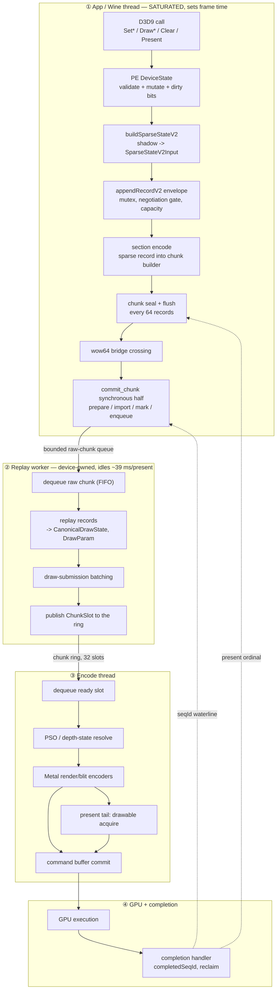

# One Frame, End To End — Stages, State, Concurrency, and Measured Cost

Four things about a frame lived in four places: the stage sequence in
[`specs/archicture/spec.md`](../../specs/archicture/spec.md) §3-§6, the queue and
chunk state machine in [`specs/backend/spec.md`](../../specs/backend/spec.md)
§2, the concurrency agents in the architecture spec's §6.1 table, and the costs
scattered across `docs/perfomance/` leaves. This file joins them for one
workload so the shape and the price can be read together.

**Structure is normative in the specs, not here.** Where this file and a spec
disagree about behaviour, the spec wins and this file is stale. What this file
owns is the *joined* view and the measured numbers.

> **Frame time moved 2026-08-01.** The SWVP hoist (`83a0b085`) took the GT2
> frame from `54.05` to `41.90 ms` and scene fps from `18.50` to `23.87`
> (**`+29%`**, [.11](state-churn-encode/state-churn-encode-append-decomposition.11.md)).
> Every per-stage share below is against the old `~53 ms` frame. Absolute ms
> figures are **not** all unaffected: any wait or idle complement moved too —
> from these runs' counters `offload_worker_idle_wait` is `39.3 -> 26.0` and the
> drain fence `2.69 -> 1.43 ms/present`. It also measured the CPU-to-wall-clock
> conversion ratio at **`c = 1.01`** for producer-thread work on this
> producer-bound workload — the first time that ratio has been measured rather
> than assumed. Do not carry `c ≈ 1` to the encode worker (which idles
> `~26 ms/present` post-hoist) or to GPU work; and it is `~1.0 ± 0.1-0.15`, not
> `1.01`.

**All figures are 3DMark05 GT2 at `890d78b1`-`8364aff2`**, `perf` profile, on a
16 GB M1 MacBook Air under the Sikarugir-CX 24.0.7 Wine runtime. GT2 is the
CPU-heaviest of the four tracked workloads; GT1, GT3, and SFIV have different
mixes and none of the per-stage numbers transfer. Frame `53.4 ms` **median**
(the `17.085` sampled *average* in [overview](overview.md) implies a `58.5 ms`
mean; shares below use the median denominator throughout, and are ~9% smaller
against the mean).

> ## Corrected 2026-07-31, same day as first written
>
> An adversarial review found the measurements reproduce but several
> conclusions built on them did not. Corrected in place, with what was wrong
> stated rather than quietly edited:
>
> 1. **"Only the app thread is on the critical path" overstated its evidence.**
>    The producer *does* block, `~3 ms/present`. §3.
> 2. **The §4.1 frame table was incoherent accounting** — it summed App + PE +
>    GPU to 100% while §3 says GPU overlaps, making the "66% app" a residual of
>    an inconsistent equation rather than a measurement. §4.1.
> 3. **`15.1%` is a floor for four scopes, not dxmt9's share.** A `~1.9%`-of-frame
>    item was found in the hot path the same day, half of it structurally
>    outside those scopes. §4.2.
> 4. **"Everything on the flush side totals 1-2%" was arithmetically false** by
>    this document's own numbers. §5.
> 5. **The "3x Rosetta discount" is not established** and was applied to things
>    it cannot apply to, including a lock wait. §5.

---

## 1. The stages

One `Present`-to-`Present` interval, following the work rather than the clock.
A D3D9 call does not travel this pipeline alone: it is recorded into a chunk,
and the chunk is the unit that crosses every boundary after the recorder.



Stage ① is the whole app thread: the game's own code plus dxmt9's PE recorder,
on the same thread, because the recorder runs inside the D3D9 call. That is why
it sets frame time and why the split inside it matters so much.

---

## 2. The state that moves between stages

Each boundary changes both the representation and the owner. Getting these
confused is the most common source of wrong reasoning about this pipeline.

| Boundary | Representation before | after | Ownership rule |
|---|---|---|---|
| D3D9 call -> recorder | COM args + PE `DeviceState` | `SparseStateV2Input` spans | Producer-local; spans borrowed, never stored |
| recorder -> chunk | `SparseStateV2Input` | V2 wire records in the chunk builder | Chunk builder owns the bytes |
| PE -> unix | sealed wire blob + handle table | same bytes, unix-owned copy | `prepareV2OffloadChunk` copies and addrefs every wrapper |
| unix -> worker | `RawCommandChunk` | queued FIFO entry | Worker owns until replayed and released |
| worker -> encode | replayed records | `ChunkSlot` SoA arrays + payload arena | Queue owns; producer must not touch |
| encode -> GPU | `MetalCommandView`, `FlatDrawStateView` | `MTLCommandBuffer` | Metal owns until completion |
| GPU -> reclaim | `completedSeqId` | resources with `lastUsedSeqId <= completed` | Release only at or below the waterline |

Two invariants are load-bearing and worth stating separately, because both were
touched this month:

- **Chunk seal cadence is a behavioural contract, not a size.**
  `appendRecordV2`'s `sizeHint` decides where chunks seal, therefore which draws
  share a chunk, therefore what a single flush retains. The hints are frozen at
  the sizes of the deleted legacy records so cadence stayed bit-identical across
  the removal (`specs/backend/spec.md` §2.4).
- **`lastUsedSeqId` gates release.** The pool asserts
  `record.lastUsedSeqId <= completedSeqId` before freeing, so over-pinning a
  resource is safe and only under-pinning is a hazard. This is why the bulk mark
  can take a conservative sequence snapshot.

---

## 3. Concurrency — who runs beside whom

**One application thread sets frame time and everything else has slack.** That
much is solid. What was overstated is *how completely* it is CPU rather than
waiting.

The two xctrace windows behind the original claim **disagree with each other**
on the central quantity: `94.9%` of one core in
[attribution.01](present-pacing/present-pacing-post-defselect-cpu-attribution.01.md)
against `24,935/24,936` Running samples (`99.7%`) in
[attribution.02](present-pacing/present-pacing-post-defselect-cpu-attribution.02.md).
This document originally quoted the second and concluded "there is no
producer-side wait for dxmt9 to shorten." `time-profile` samples *running*
stacks, so it is structurally blind to exactly what was being ruled out —
attribution.02's own footnote says so.

**The counters, present in every GT2 run, contradict it:**

| Producer-side wait | ms/present | mechanism |
|---|---:|---|
| `offload_drain_fence_wait_ms` | `2.09-2.34` | `condition_variable::wait` in `ReplayOffloadQueue::waitDrained` |
| queue-mutex acquire in the bulk mark | `0.66-0.68` | `unique_lock` on the CommandQueue mutex |
| `waitPresentOrdinalBoundary` | `0.21-0.27` | blocking |

`~3 ms/present` ≈ **`5.5%` of the frame**, all of it dxmt9-side coupling. A
thread blocked 5.5% of a 25 s window should show ~1,300 blocked samples at
~1 kHz, not one — and `94.9%` on-CPU is `~2.7 ms/present` off-CPU, which
*matches the counters*. The headline rested on the outlier window.

| Thread | Busy per present | Serial with the frame? |
|---|---:|---|
| App / Wine producer | `~53 ms` (saturated) | **Yes — this is the frame** |
| Encode thread | `20.28 ms` `encode_chunk_cpu` | No — overlaps |
| Replay worker | idles `39.67 ms` waiting for input | No — starved by the producer |
| GPU | `1.94 ms` per-CB time, `9.7 ms` frame GPU | No — overlaps |
| Completion / finish | `3.78 ms` `completion_wait` | No |

The consequence for optimisation is blunt: **only stage ① is on the critical
path.** A 20 ms encode thread and a 40 ms-idle worker are not costs to remove,
and shortening them buys nothing until the producer stops being the wall.

Back-pressure still couples them. The producer blocks in three places, and only
these three:

| Coupling | Cost | Mechanism |
|---|---:|---|
| Drain fence before direct calls | `2.17 ms/present` | Direct (non-chunk) device calls must observe replayed state (`R-BACK-2.51(d)`) |
| Present-ordinal boundary | `~0.10 ms/present` | Frame-latency pacing on present-bearing commits |
| Queue mutex in the bulk mark | `0.67 ms/present` | Contending with the encode thread (§4) |

The drain fence is the largest, and its size is set by chunk granularity: each
wait is one chunk's worth of replay, so it scales linearly with chunk size —
measured at `2.91x` for a `2.9x` chunk
([.05](state-churn-encode/state-churn-encode-append-decomposition.05.md)).

---

## 4. Cost, by stage

Everything below is **per present on the producer thread** unless marked
otherwise, calibrated against the instrument's own cost where the instrument was
decimated sampling
([.03](state-churn-encode/state-churn-encode-append-decomposition.03.md),
[.06](state-churn-encode/state-churn-encode-append-decomposition.06.md)).

### 4.1 The frame at the top level

**The table that stood here summed App + PE + GPU to 100% of the frame while §3
says the GPU overlaps and is not serial.** Both cannot be true. What follows
separates the critical thread from what runs beside it.

**On the critical thread (this is the frame):**

| | ms | share of `53.4 ms` |
|---|---:|---:|
| dxmt9 PE recording (four decimated scopes — a **floor**, see §4.2) | `8.07` | `15.1%` |
| dxmt9-side producer waits (§3), **less the `~0.58` already inside the row above** | `~2.4` | `~4.5%` |
| everything else — app code, Wine thunking, and dxmt9 code not in those scopes | `~43` | `~80%` |

> **These rows are not cleanly disjoint.** The decimated append scope spans
> `flushPendingCommandChunk`, which is the synchronous bridge call into
> `commit_chunk` and therefore into `markResolvedV2Resources` and its mutex
> acquire. With `41.4` of `47.4` commits/present coming from capacity flushes,
> `~0.58` of the `0.67 ms` queue-mutex wait sits **inside** the `8.07`. The
> waits row above already subtracts it. The drain fence and the present-ordinal
> wait are genuinely outside (buffer-lock path; Present flush issued outside the
> append envelope), so those do not double-count. A first version of this table
> presented all three rows as a clean split.

**Beside it, not additive with the above:** GPU `9.7 ms`, encode thread
`20.28 ms`, replay worker idling `39.67 ms`.

**On "the game's own code".** The `~79%` residual is *not* a measurement, and
the original text's `66%` was the same residual computed from an equation that
double-counted GPU. The attribution it cited (H212: guest blob `73.5%`, wow64
`19.8%`) is real but was borrowed across two gaps: it is **GT1**, three weeks
and one order-of-magnitude GT2 change (`d63f7a65`) earlier, and H212's own text
says the guest blob is "game x86 code **plus our 32-bit PE d3d9.dll recording
path**". Quoting it as "the game's own translated code, not addressable from
here" inverted the source. No GT2 equivalent exists.

### 4.2 Inside dxmt9's `8.07 ms`

| Scope | events/present | corrected ns | ms/present |
|---|---:|---:|---:|
| `appendRecordDirect` | `2,707` | `2,579` | **`6.98`** |
| `buildSparseStateV2` | `1,695` | `360` | `0.61` |
| `touchConstShadow` | `21,588` | `18` | `0.39` |
| `flushConstShadow` | `10,211` | `9` | `0.09` |

The constant path is `0.48 ms` total — `0.9%` of the frame — across `31,799`
calls. It looks like a target and is not one; `touchConstShadow` already
compares each register against the shadow and skips unchanged ones.

**`8.07 ms` is a floor, not dxmt9's PE cost.** It is the sum of four
instrumented scopes, and the same day this was written a `~1.9%`-of-frame item
was found *in the same function* — two ungated `steady_clock::now()` calls per
append, of which the entry-side read sits **outside** the decimated scope and so
never entered this number at all
([.07](state-churn-encode/state-churn-encode-append-decomposition.07.md)). The
PE `DeviceState` validate/mutate layer (stage A2 in §1), COM dispatch, and the
buffer lock/shadow path (`~1.4 ms/present` from `result.json` counters) are
dxmt9 code measured by none of these scopes. Treat any "dxmt9 is only X%" claim
built on this table as a lower bound.

> **Superseded 2026-08-01: the floor was ~2.6x low.**
> [append-decomposition.08](state-churn-encode/state-churn-encode-append-decomposition.08.md)
> instrumented the D3D9 entry points themselves. Time inside dxmt9's entry
> points is **`~21.4 ms/present`, `~41%` of the frame** — the four scopes behind
> `8.07` captured `5.9-6.8` of it, leaving `~15.4 ms/present` of PE layer that no
> scope had ever measured. Three de-phased runs confirm it
> directly at `40.7-41.6%` once their own phase-timer echo is removed
> ([.10](state-churn-encode/state-churn-encode-append-decomposition.10.md)) —
> two independent methods inside `1 pp`.
> `41%` is time inside our entry points, not `41%` of removable overhead —
> validation and state bookkeeping are work any D3D9 implementation does; of
> that, [.09](state-churn-encode/state-churn-encode-append-decomposition.09.md)
> identifies `~12 ms/present` as an SWVP probe that cannot apply. The tables
> below still read `15.1%`; treat that as the old floor until they are rebuilt
> on the entry measurement.
>
> That leaf first published `68%` / `4.5x`. Its const-setter entry scope was
> inflated `8.9x` by a nested instrument sampling the same calls, an artifact
> of *deterministic* every-Nth decimation that no amount of `N`-variation can
> expose. The draw and state figures were never affected. See
> [.08 §The const-setter number was mostly clock](state-churn-encode/state-churn-encode-append-decomposition.08.md#the-const-setter-number-was-mostly-clock)
> — the instrument now carries a per-scope phase offset so lockstep scopes
> cannot coincide.

**And the bound cannot be tightened by profiling.**
[attribution.05](present-pacing/present-pacing-post-defselect-cpu-attribution.05.md)
tried: xctrace names 564 images and neither `d3d9.dll` nor the game is among
them, because both run as translated x86 PE code with no image attribution. Only
the Wine *unix* objects symbolicate. H212's inability to split the guest blob is
the instrument's ceiling, not a shortcut. The floor moves only by instrumenting
more PE scopes from the inside.

### 4.3 Inside `appendRecordDirect`

| Component | ms/present | share of append |
|---|---:|---:|
| chunk `flush` (`41.4` capacity flushes at `65.5 us`) | `2.71` | `38.8%` |
| section `encode` | `2.41` | `34.5%` |
| envelope (mutex, negotiation gate, capacity, telemetry) | `1.86` | `26.7%` |

### 4.4 Inside one flush — `65.5 us`

```
flush 65.5 us
├─ PE side          ~32 us   seal() + wire struct + wow64 bridge crossing
└─ unix side        ~33 us   dxmt9c_device_commit_chunk synchronous half
   ├─ markResolvedV2Resources   19.3   fixed per commit
   │   ├─ queue-mutex acquire   13.9   (72%) — contention
   │   └─ marking work           5.4
   ├─ prepareV2OffloadChunk      8.7   1.6 fixed + 200 ns/record
   ├─ waitPresentOrdinalBoundary ~5.0  blocking, amortised
   ├─ queue push + notify        2.3
   └─ import view parse          0.1   free
```

Two independent methods agree on the fixed term: a two-point fit on the parent
counter gives `22.3 us`, and the per-phase timers sum to `22.25 us`.

**The largest single identified item in a flush is a lock acquisition**, at
`0.67 ms/present` (`1.25%` of the frame). It is not an oversight: `R-BACK-2.51(a)`
requires handle-marking to stay synchronous on the app thread before any record
is handed off, so this is the measured price of that clause. The per-resource
operation itself (`lastUsedSeqId = max(...)`) needs no lock; see
[.06](state-churn-encode/state-churn-encode-append-decomposition.06.md) for what
is forced and what is a choice before touching it.

### 4.5 Beside the producer, for reference

| | per present |
|---|---:|
| `encode_chunk_cpu` | `20.28 ms` |
| `chunk_admit` (commits) | `47.4` |
| `submit_draw` | `1,681` |
| `command_buffers` | `4.00` |
| `render_pass_begin` | `15.76` |
| `gpu_command_buffer_time` | `1.94 ms` |
| `offload_worker_idle_wait` | `39.67 ms` |

---

## 5. What the numbers say to do

- **The producer thread is the frame.** This survives. The encode thread and
  replay worker have slack, and no single identified dxmt9 item is worth more
  than ~5% alone.
- **Identified, plausibly-addressable dxmt9-side cost, at face value:**

  | item | ms/present | % of `53.4 ms` |
  |---|---:|---:|
  | drain-fence wait | `2.17` | `4.1%` |
  | section encode | `2.41` | `4.5%` |
  | append envelope | `1.86` | `3.5%` |
  | queue-mutex contention | `0.67` | `1.3%` |
  | buffer lock path (`d3d9_buffer_lock_ms`) | `0.95` | `1.8%` |
  | **sum** | **`8.1`** | **`~15%`** |

  Not all of it is removable, and some overlaps. But it is not `1-2%`.

**Two claims that stood here were wrong and are withdrawn:**

**"Everything identified on the flush side totals 1-2%."** False by this
document's own numbers — flush alone is `5.1%`, section encode `4.5%`, envelope
`3.5%`. The `1-2%` was reached by applying the discount below *and* silently
excluding the drain fence.

**"Rosetta discounts CPU wins by roughly 3x."** Not established. Of the three
cited instances: H193 divided an unmeasured removal by a noise-band result;
H214's numerator was measured with the **uncalibrated** instrument, so ~`0.9 ms`
of its "2.4-2.8 ms removed" was the instrument's own `186 ns`/sample bias,
discovered three weeks later and never back-applied; and the `.02` instance
compared the realized gain against a **design upper bound** the design itself
said would not be fully realized — against the *measured* removal (`8.59 ->
8.07 ms`) the ratio exceeds 1, the opposite direction. The `.05` cap experiment
closes its accounting only *because* producer time converts at ~1:1. The
discount was also applied to a **lock wait**, which is not translated CPU at all
and has no mechanism by which such a discount would act.

The attempt to settle this properly — gate a known ~1 ms of pure producer CPU
and measure the wall response — was **underpowered** and settled nothing
([.07](state-churn-encode/state-churn-encode-append-decomposition.07.md)): the
mechanism landed (`-12%` per append) but within-side spread was twice the
predicted effect. Until a properly powered run exists, **estimate at 1:1 and say
so**, rather than discounting by an unestablished factor.

- **Two obvious-looking levers are already closed.** Raising the chunk cap
  ([.04](state-churn-encode/state-churn-encode-append-decomposition.04.md),
  `-4.0%` FPS) and the constant path (`0.9%` of frame) both look larger than
  they are.

**Honest summary.** GT2 is producer-thread-limited and the majority of that
thread is very likely the game plus Wine emulation — but "very likely" is a
residual, not a measurement, and dxmt9's measured share is a floor. The
identified remainder is mid-to-high single digits at 1:1 conversion, several
times the `+2.1%` the legacy-record removal delivered. This is **not** "at the
ceiling"; it is "the next several levers are each small, and their sum has only
now been priced honestly." The largest unexplored one is the drain fence
(`4.1%`), which no leaf has attributed by call site.

---

## Related

- [Root performance model](overview.md) — bottleneck taxonomy and the
  multi-workload baseline table
- [`specs/archicture/spec.md`](../../specs/archicture/spec.md) §3-§6 — normative
  stage sequence, concurrency agents, ownership rules
- [`specs/backend/spec.md`](../../specs/backend/spec.md) §2 — chunk lifecycle,
  wire ABI, commit-replay offload contract
- [append-decomposition.03](state-churn-encode/state-churn-encode-append-decomposition.03.md)
  ·
  [.05](state-churn-encode/state-churn-encode-append-decomposition.05.md)
  ·
  [.06](state-churn-encode/state-churn-encode-append-decomposition.06.md)
  — the flush decomposition
- [attribution.01](present-pacing/present-pacing-post-defselect-cpu-attribution.01.md)
  ·
  [.02](present-pacing/present-pacing-post-defselect-cpu-attribution.02.md)
  ·
  [.04](present-pacing/present-pacing-post-defselect-cpu-attribution.04.md)
  — thread attribution and the calibrated instrument
