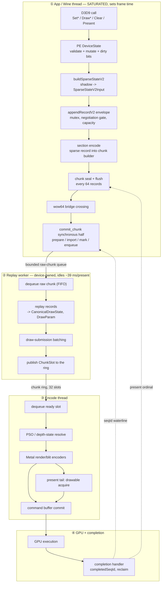

# One Frame, End To End — Stages, State, Concurrency, and Measured Cost

Four things about a frame lived in four places: the stage sequence in
[`specs/archicture/spec.md`](../../specs/archicture/spec.md) §3-§6, the queue and
chunk state machine in [`specs/backend/spec.md`](../../specs/backend/spec.md)
§2, the concurrency agents in the architecture spec's §6.1 table, and the costs
scattered across `docs/perfomance/` leaves. This file joins them for one
workload so the shape and the price can be read together.

**Structure is normative in the specs, not here.** Where this file and a spec
disagree about behaviour, the spec wins and this file is stale. What this file
owns is the *joined* view and the measured numbers.

**All figures are 3DMark05 GT2 at `890d78b1`-`8364aff2`**, `perf` profile, on a
16 GB M1 MacBook Air under the Sikarugir-CX 24.0.7 Wine runtime. GT2 is the
CPU-heaviest of the four tracked workloads; GT1, GT3, and SFIV have different
mixes and none of the per-stage numbers transfer. Frame `53.4 ms`
(`17.085` sampled avg FPS, [overview](overview.md)).

---

## 1. The stages

One `Present`-to-`Present` interval, following the work rather than the clock.
A D3D9 call does not travel this pipeline alone: it is recorded into a chunk,
and the chunk is the unit that crosses every boundary after the recorder.



Stage ① is the whole app thread: the game's own code plus dxmt9's PE recorder,
on the same thread, because the recorder runs inside the D3D9 call. That is why
it sets frame time and why the split inside it matters so much.

---

## 2. The state that moves between stages

Each boundary changes both the representation and the owner. Getting these
confused is the most common source of wrong reasoning about this pipeline.

| Boundary | Representation before | after | Ownership rule |
|---|---|---|---|
| D3D9 call -> recorder | COM args + PE `DeviceState` | `SparseStateV2Input` spans | Producer-local; spans borrowed, never stored |
| recorder -> chunk | `SparseStateV2Input` | V2 wire records in the chunk builder | Chunk builder owns the bytes |
| PE -> unix | sealed wire blob + handle table | same bytes, unix-owned copy | `prepareV2OffloadChunk` copies and addrefs every wrapper |
| unix -> worker | `RawCommandChunk` | queued FIFO entry | Worker owns until replayed and released |
| worker -> encode | replayed records | `ChunkSlot` SoA arrays + payload arena | Queue owns; producer must not touch |
| encode -> GPU | `MetalCommandView`, `FlatDrawStateView` | `MTLCommandBuffer` | Metal owns until completion |
| GPU -> reclaim | `completedSeqId` | resources with `lastUsedSeqId <= completed` | Release only at or below the waterline |

Two invariants are load-bearing and worth stating separately, because both were
touched this month:

- **Chunk seal cadence is a behavioural contract, not a size.**
  `appendRecordV2`'s `sizeHint` decides where chunks seal, therefore which draws
  share a chunk, therefore what a single flush retains. The hints are frozen at
  the sizes of the deleted legacy records so cadence stayed bit-identical across
  the removal (`specs/backend/spec.md` §2.4).
- **`lastUsedSeqId` gates release.** The pool asserts
  `record.lastUsedSeqId <= completedSeqId` before freeing, so over-pinning a
  resource is safe and only under-pinning is a hazard. This is why the bulk mark
  can take a conservative sequence snapshot.

---

## 3. Concurrency — who runs beside whom

**One application thread is saturated and everything else has slack.** This is
the single most important fact about the current shape, and it is measured, not
assumed: the producer thread runs at `94.9%` of one core across a 25 s window
([attribution.01](present-pacing/present-pacing-post-defselect-cpu-attribution.01.md))
and is *Running* in `24,935` of `24,936` sampled stacks, with one blocked sample
and zero wait-keyword hits
([attribution.02](present-pacing/present-pacing-post-defselect-cpu-attribution.02.md)).
GT2's residual is producer CPU, not a serialization stall.

| Thread | Busy per present | Serial with the frame? |
|---|---:|---|
| App / Wine producer | `~53 ms` (saturated) | **Yes — this is the frame** |
| Encode thread | `20.28 ms` `encode_chunk_cpu` | No — overlaps |
| Replay worker | idles `39.67 ms` waiting for input | No — starved by the producer |
| GPU | `1.94 ms` per-CB time, `9.7 ms` frame GPU | No — overlaps |
| Completion / finish | `3.78 ms` `completion_wait` | No |

The consequence for optimisation is blunt: **only stage ① is on the critical
path.** A 20 ms encode thread and a 40 ms-idle worker are not costs to remove,
and shortening them buys nothing until the producer stops being the wall.

Back-pressure still couples them. The producer blocks in three places, and only
these three:

| Coupling | Cost | Mechanism |
|---|---:|---|
| Drain fence before direct calls | `2.17 ms/present` | Direct (non-chunk) device calls must observe replayed state (`R-BACK-2.51(d)`) |
| Present-ordinal boundary | `~0.10 ms/present` | Frame-latency pacing on present-bearing commits |
| Queue mutex in the bulk mark | `0.67 ms/present` | Contending with the encode thread (§4) |

The drain fence is the largest, and its size is set by chunk granularity: each
wait is one chunk's worth of replay, so it scales linearly with chunk size —
measured at `2.91x` for a `2.9x` chunk
([.05](state-churn-encode/state-churn-encode-append-decomposition.05.md)).

---

## 4. Cost, by stage

Everything below is **per present on the producer thread** unless marked
otherwise, calibrated against the instrument's own cost where the instrument was
decimated sampling
([.03](state-churn-encode/state-churn-encode-append-decomposition.03.md),
[.06](state-churn-encode/state-churn-encode-append-decomposition.06.md)).

### 4.1 The frame at the top level

| | ms | share |
|---|---:|---:|
| App's own CPU (Rosetta guest + Wine thunking) | `~35` | `~66%` |
| **dxmt9 PE recording** | **`8.07`** | **`15.1%`** |
| GPU | `9.7` | `18.2%` |

The `~66%` is the game's own translated code. H212 attributed it directly:
guest blob `73.5%`, wow64 layer `19.8%`, winemetal unix `1.4%` of the producer
wall. It is not addressable from here.

### 4.2 Inside dxmt9's `8.07 ms`

| Scope | events/present | corrected ns | ms/present |
|---|---:|---:|---:|
| `appendRecordDirect` | `2,707` | `2,579` | **`6.98`** |
| `buildSparseStateV2` | `1,695` | `360` | `0.61` |
| `touchConstShadow` | `21,588` | `18` | `0.39` |
| `flushConstShadow` | `10,211` | `9` | `0.09` |

The constant path is `0.48 ms` total — `0.9%` of the frame — across `31,799`
calls. It looks like a target and is not one; `touchConstShadow` already
compares each register against the shadow and skips unchanged ones.

### 4.3 Inside `appendRecordDirect`

| Component | ms/present | share of append |
|---|---:|---:|
| chunk `flush` (`41.4` capacity flushes at `65.5 us`) | `2.71` | `38.8%` |
| section `encode` | `2.41` | `34.5%` |
| envelope (mutex, negotiation gate, capacity, telemetry) | `1.86` | `26.7%` |

### 4.4 Inside one flush — `65.5 us`

```
flush 65.5 us
├─ PE side          ~32 us   seal() + wire struct + wow64 bridge crossing
└─ unix side        ~33 us   dxmt9c_device_commit_chunk synchronous half
   ├─ markResolvedV2Resources   19.3   fixed per commit
   │   ├─ queue-mutex acquire   13.9   (72%) — contention
   │   └─ marking work           5.4
   ├─ prepareV2OffloadChunk      8.7   1.6 fixed + 200 ns/record
   ├─ waitPresentOrdinalBoundary ~5.0  blocking, amortised
   ├─ queue push + notify        2.3
   └─ import view parse          0.1   free
```

Two independent methods agree on the fixed term: a two-point fit on the parent
counter gives `22.3 us`, and the per-phase timers sum to `22.25 us`.

**The largest single identified item in a flush is a lock acquisition**, at
`0.67 ms/present` (`1.25%` of the frame). It is not an oversight: `R-BACK-2.51(a)`
requires handle-marking to stay synchronous on the app thread before any record
is handed off, so this is the measured price of that clause. The per-resource
operation itself (`lastUsedSeqId = max(...)`) needs no lock; see
[.06](state-churn-encode/state-churn-encode-append-decomposition.06.md) for what
is forced and what is a choice before touching it.

### 4.5 Beside the producer, for reference

| | per present |
|---|---:|
| `encode_chunk_cpu` | `20.28 ms` |
| `chunk_admit` (commits) | `47.4` |
| `submit_draw` | `1,681` |
| `command_buffers` | `4.00` |
| `render_pass_begin` | `15.76` |
| `gpu_command_buffer_time` | `1.94 ms` |
| `offload_worker_idle_wait` | `39.67 ms` |

---

## 5. What the numbers say to do

Read together, the model bounds the remaining dxmt9-side opportunity rather
than pointing at a lever:

- **The producer thread is the frame**, and two-thirds of it is the game's own
  Rosetta-translated code. dxmt9's whole share is `15.1%`.
- **Everything identified on the flush side totals `1-2%` of the frame.** The
  contention, the fixed per-commit cost, the section encode — all of it is in
  that band.
- **Rosetta discounts CPU wins by roughly `3x` on the way to wall clock.** Three
  independent instances now: H193, H214, and the legacy-record removal itself
  ([.02](state-churn-encode/state-churn-encode-append-decomposition.02.md), a
  `3.62 ms` design bound that delivered `1.14 ms`). Apply the discount when
  estimating, not after measuring.
- **Two obvious-looking levers are already closed.** Raising the chunk cap
  ([.04](state-churn-encode/state-churn-encode-append-decomposition.04.md),
  `-4.0%` FPS) and the constant path (`0.9%` of frame) both look larger than
  they are.

The honest summary is that the current shape is not a ceiling, but what remains
on dxmt9's side of the line is worth single-digit percentages, and it is now
priced item by item rather than estimated.

---

## Related

- [Root performance model](overview.md) — bottleneck taxonomy and the
  multi-workload baseline table
- [`specs/archicture/spec.md`](../../specs/archicture/spec.md) §3-§6 — normative
  stage sequence, concurrency agents, ownership rules
- [`specs/backend/spec.md`](../../specs/backend/spec.md) §2 — chunk lifecycle,
  wire ABI, commit-replay offload contract
- [append-decomposition.03](state-churn-encode/state-churn-encode-append-decomposition.03.md)
  ·
  [.05](state-churn-encode/state-churn-encode-append-decomposition.05.md)
  ·
  [.06](state-churn-encode/state-churn-encode-append-decomposition.06.md)
  — the flush decomposition
- [attribution.01](present-pacing/present-pacing-post-defselect-cpu-attribution.01.md)
  ·
  [.02](present-pacing/present-pacing-post-defselect-cpu-attribution.02.md)
  ·
  [.04](present-pacing/present-pacing-post-defselect-cpu-attribution.04.md)
  — thread attribution and the calibrated instrument
