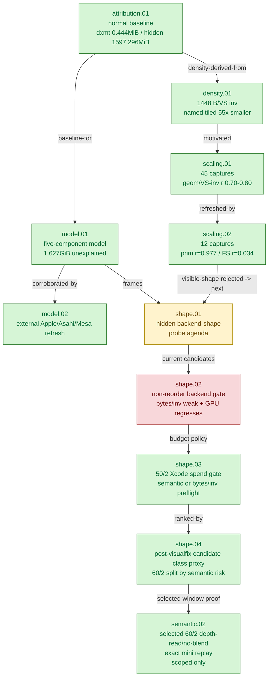

# Hidden Backend Storage — the central GPU explanation

> Part of the 3DMark05 GT1 GPU-bottleneck investigation. Root map: [[overview-3dmark05-gt1]].

## Scope & question

This domain owns the central finding of the whole investigation: the top-three
render encoders write a large `VS Buffer Device Memory Bytes Written` bucket
(~`1.627 GiB` at frame60) that is **not** explained by dxmt's explicit CPU-side
writers (~`0.444 MiB`), the source-visible MSL `VSOut` width (`184 B`), or
frontend Metal IR / AIR scratch (`128 B`). The domain defines a five-component
attribution model for that hidden traffic, validates it against external Apple /
Asahi / Mesa architecture sources, and proves through density and multi-capture
correlation that the bucket scales with **VS invocation count × per-vertex
backend bytes**, not with visible shader shape, CPU upload bytes, or fragment
volume. It does not own any specific fix — it explains *what* costs, and points
every other domain at the lever that actually moves the bucket.

## Hypotheses & verdicts

| # | Hypothesis | Verdict | Evidence |
|---|-----------|---------|----------|
| H1 | The big VS-write bucket is dxmt's own CPU-side writers (argbuf/cbuf/transient) | rejected | [[hidden-backend-storage-attribution.01]] (`0.444 MiB`, ratio `0.0003x`, r `0.188`) |
| H2 | It is the source-visible MSL `VSOut` width | rejected | [[hidden-backend-storage-density.01]], [[hidden-backend-storage-scaling.02]] (`184 B`→`88.4x` gap; position-only still `1548 MiB`) |
| H3 | It is Xcode's named tiled-buffer counters | rejected | [[hidden-backend-storage-density.01]] (`29.5 MiB`, ~`55x` smaller) |
| H4 | It is fragment-stage volume / varyings-per-fragment | rejected | [[hidden-backend-storage-density.01]] (`enc=0` `0` varyings, `225 MiB`), [[hidden-backend-storage-scaling.02]] (FS r `0.034`) |
| H5 | It is hidden Apple vertex/tiler/parameter backend storage scaling with geometry/VS invocations | accepted | [[hidden-backend-storage-model.01]], [[hidden-backend-storage-scaling.01]] (r `0.70-0.80`), [[hidden-backend-storage-scaling.02]] (r `0.971-0.977`) |
| H6 | External GPU architecture literature supports the model | accepted | [[hidden-backend-storage-model.02]] (Asahi TVB, Mesa UVS/PPP/ISP, Apple TBDR) |
| H7 | Which sub-component (stage-out vs primitive/binning vs spill) dominates | open | [[hidden-backend-storage-shape.01]] (probe agenda → reorder / cache-locality) |
| H8 | Current non-reorder backend-shape probes materially reduce bytes/invocation | rejected | [[hidden-backend-storage-shape.02]] (best bytes/inv `-1.94%`, GPU regresses) |
| H9 | Which candidates still deserve Xcode/gputrace spend for residual `50/2` | accepted (gate) | [[hidden-backend-storage-shape.03]] (CPU-only index-cache probes rejected; semantic or bytes/inv preflight required) |
| H10 | Post-visualfix frame60 candidate class proxy can rank residual `60/2` state classes before another Xcode capture | accepted (attribution) | [[hidden-backend-storage-shape.04]] (`60/2` split into depth-read/screen/alpha classes, each ~`111-128 MiB` proxy hidden and `~25-28%` candidate LRU32 reduction) |
| H11 | A selected `60/2 depth-read + no-alpha-blend` locality window has same-input exact replay output | accepted (scoped) | [[mini-replay-bisection-semantic.02]] (`0` changed pixels with clear and D24X8 depth input, LRU32 `-14,593`; white-texture/selector scope) |

## Verification methods

- **`DXMT9_PERF_ENCODER_BREAKDOWN=1`** — per-encoder PSO/shader/`vsout_layout`,
  geometry shape, and CPU-writer attribution; joined to Xcode by
  `RenderPass[seq=...,enc=...]`. Proves the dxmt-writer side is tiny.
- **Xcode `frame<N>.gputrace` counter export + `finalize_3dmark05_perf_probe.sh`**
  — authoritative `VS Buffer Device Memory Bytes Written`, VS invocations,
  named tiled counters, VS L1/LLC write, and the derived hidden-backend
  classifier in `frame<N>-xcode-dxmt-bottleneck-report.md`.
- **`analyze_vs_buffer_scaling.py`** — cross-capture Pearson correlation of the
  bucket vs geometry / VS invocations / dxmt writers / FS invocations; proves
  the scaling dimension.
- **External literature survey** — Asahi AGX, Mesa Asahi glossary, Apple TBDR,
  MoltenVK — validates the UVS/PPP/parameter-storage framing.
- **Correctness-invalid classifier toggles** (`DXMT9_PROBE_DISABLE_ALPHA_BLEND`,
  `DXMT_DISABLE_CULL`, `DXMT_DISABLE_SCISSOR`, `--probe-depth-func-always`) —
  used only to reject individual state bits as the owner.

## Experiment dependency graph



## Results synthesis

What is settled: the dominant GT1 GPU cost is a hidden Apple vertex-stage /
tiler / parameter backend-storage bucket. The normal-source baseline
([[hidden-backend-storage-attribution.01]]) pins it at `1627.240 MiB` top-three
VS buffer write against `0.444 MiB` of dxmt CPU writers and `184 B` of visible
`VSOut`, leaving an unexplained ratio of `1.000`. Density
([[hidden-backend-storage-density.01]]) shows ~`1448 B` per VS invocation —
~`55x` the named tiled counters and ~`8x` the visible `VSOut` — and a
vertex-stage that is memory-dominated (`96.13%` weighted vertex-stage time,
only `2.39%` VS-ALU limiter). Two correlation passes
([[hidden-backend-storage-scaling.01]], [[hidden-backend-storage-scaling.02]])
independently show the bucket tracks post-clipped primitives / VS invocations
(r up to `0.977`/`0.971`) and not dxmt writers (`0.188`) or fragment
invocations (`0.034`). The five-component model
([[hidden-backend-storage-model.01]]) is corroborated by external AGX/UVS/PPP
literature ([[hidden-backend-storage-model.02]]). The model's core claim is
therefore **ACCEPTED**.

What is still open: *which* sub-component of the model dominates — VS stage-out,
primitive/binning/tiler parameter storage, or compiler/backend spill. Visible
shape is rejected, so [[hidden-backend-storage-shape.01]] hands off to backend-
shape classifiers, primitive-reorder diagnostics, and the row-local
[[tvb-mechanism-proof]]. The current non-reorder backend-shape gate
([[hidden-backend-storage-shape.02]]) is negative: half-VSOut is the best
bytes/invocation mover so far (`-1.94%`) but regresses GPU time, so it does not
justify another Xcode capture by itself. The only production lever that has so
far moved the bucket legally is reducing VS invocations through opaque-depth
[[index-cache-locality]] (post-transform cache locality); every visible-shape
and broad-state attempt was rejected as "not the first-order owner."
[[hidden-backend-storage-shape.03]] is the current budget gate: CPU-only
index-cache changes no longer justify Xcode replay by themselves, and residual
`50/2` GPU work must either carry a semantic locality proof or a non-reorder
bytes-per-invocation mechanism before another expensive capture. The
post-visualfix candidate class proxy ([[hidden-backend-storage-shape.04]]) adds a current
frame60 ranking without another gputrace export: `60/2` is split across
depth-read / screen-blend / standard-alpha classes with roughly `111-128 MiB`
proxy hidden backend each and `~25-28%` candidate LRU32 reduction, while the
remaining low-risk opaque-depth work is already covered by the accepted opt-in
index-cache mechanism. [[mini-replay-bisection-semantic.02]] then proves one
selected `60/2 depth-read + no-alpha-blend` two-draw candidate is same-input
exact while reducing replay LRU32 misses by `-14,593` (`-27.6%`). This is enough
to justify continued scoped selector work, but not enough to generalize broad
depth-read reorder: the replay still uses white dummy textures and lacks a
runtime-visible production selector, even though a real D24X8 depth-input replay
for this selected window also stayed exact.

## How to run
Every experiment here is a 3DMark05 GT1 run via the standard wrapper. This domain
is characterization, not a single lever: capture a `.gputrace` with per-encoder
attribution enabled, then read the hidden-backend classifier out of the joined
Xcode/dxmt report:

```sh
DXMT9_PERF_ENCODER_BREAKDOWN=1 \
bash scripts/tools/run_3dmark05_perf_probe.sh --suffix hidden-backend --frame 60 \
  --timeout 420

# After Xcode exports encoder counters, the finalizer writes the joined summary
# and frame60-xcode-dxmt-bottleneck-report.md (VS-write / VS-invocation / TVB):
bash scripts/tools/finalize_3dmark05_perf_probe.sh --suffix hidden-backend --frame 60 \
  --require-xcode-counter-coverage --require-dxmt-join-coverage --require-top-pso-attribution
```

Cross-capture scaling correlation uses `analyze_vs_buffer_scaling.py`. The exact
per-experiment flags live in each leaf's `**Method.**` field; see
`agents/rules/environment_variables.rules.md` for env-var meanings and
`agents/rules/metal_debugging.rules.md` for the full workflow.

## Cross-references

- [[tvb-mechanism-proof]] — the accepted row-local TVB mechanism proof that
  certifies a reduction of this exact bucket.
- [[hidden-backend-storage-shape.02]] — current non-reorder backend-shape gate;
  bytes/inv movement is too small and GPU regresses.
- [[hidden-backend-storage-shape.04]] — post-visualfix candidate class proxy
  that ranks residual `60/2` semantic-risk classes before another Xcode replay.
- [[mini-replay-bisection-semantic.02]] — scoped `60/2` depth-read/no-blend
  exact replay candidate selected from the class proxy.
- [[vsout-layout]] — visible varying-width attempts this domain rejected as the
  first-order owner (trim / point-size / position-only / half-VSOut).
- [[index-cache-locality]] — the one accepted production win: reduces VS
  invocations (and thus this bucket) via post-transform cache locality.
- [[overview-3dmark05-gt1]] — root map, priority DAG, and ceiling synthesis.
