# Hidden Backend Storage — the central GPU explanation

> Part of the 3DMark05 GT1 GPU-bottleneck investigation. Root map: [[overview-3dmark05-gt1]].

## Scope & question

This domain owns the central finding of the whole investigation: the top-three
render encoders write a large `VS Buffer Device Memory Bytes Written` bucket
(~`1.627 GiB` at frame60) that is **not** explained by dxmt's explicit CPU-side
writers (~`0.444 MiB`), the source-visible MSL `VSOut` width (`184 B`), or
frontend Metal IR / AIR scratch (`128 B`). The domain defines a five-component
attribution model for that hidden traffic, validates it against external Apple /
Asahi / Mesa architecture sources, and proves through density and multi-capture
correlation that the bucket scales with **VS invocation count × per-vertex
backend bytes**, not with visible shader shape, CPU upload bytes, or fragment
volume. It does not own any specific fix — it explains *what* costs, and points
every other domain at the lever that actually moves the bucket.

## Hypotheses & verdicts

| # | Hypothesis | Verdict | Evidence |
|---|-----------|---------|----------|
| H1 | The big VS-write bucket is dxmt's own CPU-side writers (argbuf/cbuf/transient) | rejected | [[hidden-backend-storage-attribution.01]] (`0.444 MiB`, ratio `0.0003x`, r `0.188`) |
| H2 | It is the source-visible MSL `VSOut` width | rejected | [[hidden-backend-storage-density.01]], [[hidden-backend-storage-scaling.02]] (`184 B`→`88.4x` gap; position-only still `1548 MiB`) |
| H3 | It is Xcode's named tiled-buffer counters | rejected | [[hidden-backend-storage-density.01]] (`29.5 MiB`, ~`55x` smaller) |
| H4 | It is fragment-stage volume / varyings-per-fragment | rejected | [[hidden-backend-storage-density.01]] (`enc=0` `0` varyings, `225 MiB`), [[hidden-backend-storage-scaling.02]] (FS r `0.034`) |
| H5 | It is hidden Apple vertex/tiler/parameter backend storage scaling with geometry/VS invocations | accepted | [[hidden-backend-storage-model.01]], [[hidden-backend-storage-scaling.01]] (r `0.70-0.80`), [[hidden-backend-storage-scaling.02]] (r `0.971-0.977`) |
| H6 | External GPU architecture literature supports the model | accepted | [[hidden-backend-storage-model.02]] (Asahi TVB, Mesa UVS/PPP/ISP, Apple TBDR) |
| H7 | Which sub-component (stage-out vs primitive/binning vs spill) dominates | open | [[hidden-backend-storage-shape.01]] (probe agenda → reorder / cache-locality) |
| H8 | Current non-reorder backend-shape probes materially reduce bytes/invocation | rejected | [[hidden-backend-storage-shape.02]] (best bytes/inv `-1.94%`, GPU regresses) |
| H9 | Which candidates still deserve Xcode/gputrace spend for residual `50/2` | accepted (gate) | [[hidden-backend-storage-shape.03]] (CPU-only index-cache probes rejected; semantic or bytes/inv preflight required) |
| H10 | Post-visualfix frame60 candidate class proxy can rank residual `60/2` state classes before another Xcode capture | accepted (attribution) | [[hidden-backend-storage-shape.04]] (`60/2` split into depth-read/screen/alpha classes, each ~`111-128 MiB` proxy hidden and `~25-28%` candidate LRU32 reduction) |
| H11 | A selected `60/2 depth-read + no-alpha-blend` locality window has same-input exact replay output | accepted (scoped) | [[mini-replay-bisection-semantic.02]] (`0` changed pixels with clear and D24X8 depth input, LRU32 `-14,593`; white-texture/selector scope) |
| H12 | Post-rank4 semantic evidence changes the next Xcode spend gate | accepted (gate) | [[hidden-backend-storage-shape.05]] (depth-read reorder blocked; non-reorder backend-shape candidate missing; final-color oracle or bytes/inv preflight required) |
| H13 | Offline Metal shader variants can prioritize the next primitive-order-preserving backend-shape smoke | accepted (preflight) | [[hidden-backend-storage-shape.06]] (`60/2` and `60/1` live-vsout shrink IR return but not scratch; `60/0` live-vsout also removes `128 B` scratch) |
| H14 | Hash-scoped `60/0` live-vsout can be isolated at runtime | accepted (runtime smoke) | [[hidden-backend-storage-shape.07]] (`60/0` layout moves to `0x701`; `60/1`/`60/2` stay `0xfff` after rebuilding the actual runtime binary) |
| H15 | Hash-scoped `60/0` live-vsout reduces Xcode VS-write bytes/invocation | rejected | [[hidden-backend-storage-shape.08]] (`60/0` expected VSOut `184 B -> 68 B`, but VS buffer `224.947 MiB -> 224.990 MiB`, bytes/inv `1542.722 -> 1543.013`) |
| H16 | After live-vsout rejection, the next Xcode budget should target below-AIR state/parameter shape or a semantic-safe invocation reducer | accepted (gate) | [[hidden-backend-storage-shape.09]], [[mini-replay-bisection-texture.10]] (visible-width closed; strongest non-reorder clue is `large4096+alpha` B/inv `-43.56%` but correctness-invalid; current no-sample rows are not hot, so sample-visible locality needs final-writer proof) |
| H17 | `large4096+alpha` blend-off can be promoted to a legal optimization | rejected (gate) | [[hidden-backend-storage-shape.10]] (`15` `60/2` large alpha draws split into screen/standard-alpha; screen is `InvDestColor+One`, standard-alpha uses varying alpha; no static blend-off equivalence) |
| H18 | Existing query/visibility plumbing can unblock final-writer or Metal-visibility-backed no-sample locality | rejected for production feedback; diagnostic scout implemented | [[mini-replay-bisection-texture.08]], [[mini-replay-bisection-texture.09]], [[mini-replay-bisection-texture.10]] (D3D9 query is primitive-count compatible; diagnostic Metal visibility now exports per-draw sample counts, but positive samples are not final-color proof; the old rank-1 `36..37` window and all `60/2` `large4096` buckets are sample-visible; zero rows account for only `-2,016` LRU32 delta) |
| H19 | Current PSO/state churn is isolated enough to justify a backend-spill Xcode replay | rejected-current; isolated A/B still open | [[hidden-backend-storage-shape.11]] (`60/2` has `47` PSO changes, but `271` stream-handle and `160` IB-handle changes; hot rows are `stream-ib-dominant`) |
| H20 | Current stream/IB handle churn must be isolated before a GPU-owner conclusion | accepted (gate completed) | [[state-churn-encode-stream.04]], [[state-churn-encode-stream.08]] (`60/2` binding tuple changes `160/187`; staged A/B keeps draw/geometry/PSO/argbuf/cbuf stable while handle churn drops) |
| H21 | Stream/IB handle identity is the first-order hidden backend owner | rejected | [[state-churn-encode-stream.09]], [[hidden-backend-storage-shape.12]] (`60/2` stream/IB handles `271/160 -> 0/0`, but VS write `981.159 -> 981.166 MiB`, GPU `19.184 -> 19.278 ms`) |
| H22 | Current automated perf gate still queues stale visible-width shader smoke after Xcode rejection | rejected by refreshed gate | [[hidden-backend-storage-shape.13]] (`shader-variant-backend-smoke=closed-by-xcode-gate`; next queue is final-color/final-writer proof or a new below-visible backend mechanism) |
| H23 | Remaining backend escape candidates are equally ready for the next GT1 experiment | rejected by feasibility triage | [[hidden-backend-storage-shape.14]] (Tile-FFP is implemented but narrow/default-off; mesh/object is lower API only for current D3D9 GT1; visibility is sample-count only; position-only VSOut is not a real binning path) |
| H24 | Tile-FFP has enough current GT1 hot-row coverage to justify an Xcode spend | rejected-current | [[hidden-backend-storage-shape.15]] (frame60 `60/0..2` eligible primitives `0`; partial-run eligible primitive share only `0.005%`) |
| H25 | The current perf gate can keep final-color proof blocked even when the selector-sweep artifact is absent | accepted (gate) | [[hidden-backend-storage-shape.16]] (`final-color-proof-gap=blocked-proof-gap`; `final-color-occlusion-predicate=blocked-semantic-proof-gap`) |
| H26 | The current perf gate can keep positive Metal visibility from being reused as a final-color oracle | accepted (gate) | [[hidden-backend-storage-shape.17]] (`visibility-positive-oracle=reject-positive-oracle`; `4` sample-positive rows, `58,014` samples, but no-final-color/fail/exact split) |
| H27 | Current per-draw PSO movement is isolated enough to justify a backend-spill Xcode replay | rejected-current | [[hidden-backend-storage-shape.18]] (`60/2` PSO changes `47`, handle tuple changes `160`, max stable tuple run `6`, PSO-isolated runs `0`) |
| H28 | The current perf gate can keep unisolated PSO movement out of the Xcode queue | accepted (gate) | [[hidden-backend-storage-shape.19]] (`pso-backend-isolation=reject-current`; queue rows now say current PSO per-draw motion is not isolated) |
| H29 | The current perf gate can keep too-small semantic locality out of the Xcode queue | accepted (cross-domain gate) | [[index-cache-locality-screenblend.10]] (`locality-semantic-ceiling=oracle-required`; color-exact/zero-sample locality is too small, sample-visible locality needs final-color/final-writer proof) |
| H30 | The current perf gate can attach real-texture final-writer replay summaries before Xcode spend | accepted (gate) | [[hidden-backend-storage-shape.20]] (`final-writer-replay-oracle=blocked-final-writer-hazard`; fail LRU32 `-14,593`, masked LRU32 `-9,113`, owner-safe LRU32 `0`) |
| H31 | Mesh/object and position/binning backend escapes are ready current-GT1 Xcode candidates | rejected-current; reduced A/B required | [[hidden-backend-storage-shape.21]] (mesh/object bridge present but dxmt9 route/emitter missing; position/binning is visible `VSOut` only; Tile-FFP coverage rejected) |
| H32 | The current perf gate can keep backend escape surface results attached to the next Xcode queue | accepted (gate) | [[hidden-backend-storage-shape.22]] (`backend-escape-surface=reduced-ab-required`; queue rows now require reduced A/B or a new route before GT1 Xcode) |
| H33 | The reduced A/B requirement can be turned into concrete route/equality/counter gates | accepted (gate) | [[hidden-backend-storage-shape.23]] (`blocked-before-reduced-ab`; mesh/object blocked by missing dxmt9 route/emitter, position/binning by visible-probe-only route, Tile-FFP by rejected hot-row coverage) |
| H34 | Tile-FFP hot-row coverage can be recovered by widening the current FFP selector | rejected; programmable/textured route required | [[hidden-backend-storage-shape.24]] (`60/2` and `60/1` are `100%` not-FFP fallback; `60/0` is `100%` unsupported-state; full gate carries `tile-ffp=blocked-hot-row-coverage/needs-programmable-tile-route`) |
| H35 | Programmable route work is one uniform textured backend problem | rejected; split into depth-only, color, and textured routes | [[hidden-backend-storage-shape.25]] (`60/0` is `candidate-depth-only-route`; `60/1` needs programmable color; `60/2` needs programmable textured route) |
| H36 | The `60/0` depth-only route can be reached by a fragmentless Metal PSO | accepted (runtime smoke), rejected for Xcode promotion | [[hidden-backend-storage-shape.26]] (`60/0` probe covers all `42` draws / `97,294` primitives / `291,882` vertices, reports position-only VSOut key `0x0`, and logs `2` accepted / `0` rejected fragmentless PSO variants; same-input gate then fails depth equality: `D24X8` depth changes `1,252,096 / 3,145,728` bytes, while `60/0` color is exact and the final frame still changes `21.658325%`; Xcode counter spend is blocked until depth semantics are fixed) |
| H37 | System Trace can provide route-attributed timing while `.gputrace` is blocked | accepted (sidecar evidence) | [[hidden-backend-storage-shape.28]] (`215/215` xctrace rows joined, `1005..1024` captured seq, indexed probe rows `1000..1035` with `0` out-of-range rows; vertex share `88.86%`; route split: programmable color `45.65%`, programmable textured `40.49%`, mixed `12.02%`, depth-only `1.85%`) |
| H38 | Route-attributed System Trace sidecars must require indexed per-draw logging | rejected-current | [[hidden-backend-storage-shape.29]] (encoder breakdown emits `route_*` primitive counters; no-indexed sidecar now verifies `route_source=encoder-summary` on `1633/1633` joined rows, while indexed rows remain optional override detail) |
| H39 | "GPU floor" and "average FPS owner" are the same question | rejected | [[hidden-backend-storage-shape.30]] (`replay.03` proves `3.86x` hidden-write density headroom at the same VS invocation count; no-gputrace counters show average wall-clock is completion/present paced) |
| H40 | Current head changes the capture/timing route status | accepted refresh | [[hidden-backend-storage-shape.31]] (`frame120.gputrace` file capture still fails with `Capture layer is not inserted` after normal rendering, while the System Trace sidecar joins `5263/5263` rows over `seq=1213..1591`; vertex share `90.39%`; route split remains programmable color `46.22%`, programmable textured `39.15%`, mixed `14.63%`) |
| H41 | Recovered capture-layer file route changes measurement availability, not the GPU owner | accepted refresh | [[hidden-backend-storage-shape.32]] (`frame60.gputrace` and Xcode counters exported; first recovered proof GPU `37.475ms`, top-three `98.32%`, top-three VS buffer device write `1779.231 MiB`, partial render count `0`) |
| H42 | Current joined Xcode/dxmt attribution narrows the next GPU gate | accepted next gate | [[hidden-backend-storage-shape.33]] (top-three Xcode rows join to dxmt encoder sidecars; latest integrated capture-layer wrapper refresh reports GPU `37.492ms`, top-three `98.40%`, top-three VS write `1779.246 MiB`; `60/2`, `60/1`, and `60/0` cover different state classes but share the same hidden-density band, dxmt CPU writer bytes negligible) |
| H43 | The `60/0` fragmentless depth-only equality failure was caused by fragmentless routing itself | rejected; keep-VSOut route is equality-safe | [[hidden-backend-storage-shape.34]] (new diagnostic sub-mode keeps the pair-local `VSOut` layout at `0xfff` while omitting the fragment function; route coverage remains `42/42` draws and `97,294/97,294` primitives; pass-end `D24X8` depth and `X8R8G8B8` color both compare with `0` changed bytes) |
| H44 | Removing the `60/0` fragment function while keeping `VSOut=0xfff` reduces hidden VS writes | rejected | [[hidden-backend-storage-shape.34]] (capture-layer route is usable again and exports Xcode counters, but target `60/0` VS buffer write stays flat: `224.918 -> 224.944 MiB`, VS invocations `152,895 -> 152,895`, top-three hidden estimate `1749.858 -> 1749.694 MiB`) |

## Verification methods

- **`DXMT9_PERF_ENCODER_BREAKDOWN=1`** — per-encoder PSO/shader/`vsout_layout`,
  geometry shape, and CPU-writer attribution; joined to Xcode by
  `RenderPass[seq=...,enc=...]`. Proves the dxmt-writer side is tiny.
- **Xcode `frame<N>.gputrace` counter export + `finalize_3dmark05_perf_probe.sh`**
  — authoritative `VS Buffer Device Memory Bytes Written`, VS invocations,
  named tiled counters, VS L1/LLC write, and the derived hidden-backend
  classifier in `frame<N>-xcode-dxmt-bottleneck-report.md`.
- **Instruments Metal System Trace sidecar** —
  `xcrun xctrace record --template 'Metal System Trace' --all-processes` plus
  `summarize_xctrace_metal_intervals.py` can join `metal-gpu-intervals` timing
  back to dxmt encoder labels when `.gputrace` capture is blocked. This is
  useful for vertex-vs-fragment timing attribution, but it is not a replacement
  for Xcode replay counters because it does not expose `VS Buffer Device Memory
  Bytes Written`.
- **`analyze_vs_buffer_scaling.py`** — cross-capture Pearson correlation of the
  bucket vs geometry / VS invocations / dxmt writers / FS invocations; proves
  the scaling dimension.
- **External literature survey** — Asahi AGX, Mesa Asahi glossary, Apple TBDR,
  MoltenVK — validates the UVS/PPP/parameter-storage framing.
- **Correctness-invalid classifier toggles** (`DXMT9_PROBE_DISABLE_ALPHA_BLEND`,
  `DXMT_DISABLE_CULL`, `DXMT_DISABLE_SCISSOR`, `--probe-depth-func-always`) —
  used only to reject individual state bits as the owner.

## Experiment dependency graph

```mermaid
flowchart TD
  classDef accepted fill:#d6f5d6,stroke:#2b7a2b,color:#063
  classDef rejected fill:#f8d7da,stroke:#a33,color:#600
  classDef open fill:#fff3cd,stroke:#a80,color:#640

  Model["model.01\nfive-component model\n1.627GiB unexplained"]:::accepted
  Ext["model.02\nexternal Apple/Asahi/Mesa refresh"]:::accepted
  Attr["attribution.01\nnormal baseline\ndxmt 0.444MiB / hidden 1597.296MiB"]:::accepted
  Density["density.01\n1448 B/VS inv\nnamed tiled 55x smaller"]:::accepted
  Scale1["scaling.01\n45 captures\ngeom/VS-inv r 0.70-0.80"]:::accepted
  Scale2["scaling.02\n12 captures\nprim r=0.977 / FS r=0.034"]:::accepted
  Shape["shape.01\nhidden backend-shape\nprobe agenda"]:::open
  ShapeGate["shape.02\nnon-reorder backend gate\nbytes/inv weak + GPU regresses"]:::rejected
  SpendGate["shape.03\n50/2 Xcode spend gate\nsemantic or bytes/inv preflight"]:::accepted
  ClassProxy["shape.04\npost-visualfix candidate class proxy\n60/2 split by semantic risk"]:::accepted
  CurrentGate["shape.05\npost-rank4 current gate\nreorder blocked; preflight required"]:::accepted
  OfflinePreflight["shape.06\noffline shader variant preflight\n60/0 plausible; 60/2 below-AIR"]:::open
  RuntimeSmoke["shape.07\nscoped 60/0 runtime smoke\nisolated"]:::accepted
  XcodeGate["shape.08\nscoped 60/0 Xcode gate\nVS write unchanged"]:::rejected
  NextTriage["shape.09\nbelow-AIR next probe triage\nalpha/state or oracle"]:::accepted
  AlphaGate["shape.10\nlarge alpha static-equivalence gate\nblend-off not a fix"]:::rejected
  PsoGate["shape.11\nPSO backend churn preflight\nstream/IB dominates"]:::rejected
  StreamIbGate["stream.04\nstream/IB backend preflight\nhandle-stable A/B required"]:::accepted
  StreamIbXcode["stream.09\nstream/IB Xcode gate\nVS write unchanged"]:::rejected
  PostStreamTriage["shape.12\npost stream/IB triage\nnext budget gate"]:::accepted
  GateRefresh["shape.13\ncurrent perf gate refresh\nstale live-vsout queue closed"]:::accepted
  BackendFeasibility["shape.14\nbackend escape feasibility\ntile narrow; mesh high-risk"]:::accepted
  TileFfpCoverage["shape.15\nTile-FFP coverage gate\nGT1 hot rows zero coverage"]:::rejected
  FinalColorGap["shape.16\nfinal-color proof gap gate\nselector artifact not required"]:::accepted
  VisibilityPositiveGate["shape.17\nvisibility-positive gate\npositive samples are not final color"]:::accepted
  PsoPerDraw["shape.18\nper-draw PSO isolation gate\nno stable-tuple PSO runs"]:::rejected
  PsoGateAuto["shape.19\nPSO isolation automated gate\nblocks current PSO queue"]:::accepted
  LocalityCeilingGate["screenblend.10\nsemantic ceiling gate\noracle required"]:::accepted
  FinalWriterReplayGate["shape.20\nfinal-writer replay gate\ncurrent replay blocks locality Xcode"]:::accepted
  BackendEscapeAudit["shape.21\nbackend escape surface audit\nbridge-only/reduced A-B required"]:::accepted
  BackendEscapeGate["shape.22\nbackend escape full gate\nblocks direct GT1 Xcode"]:::accepted
  BackendEscapePlan["shape.23\nbackend escape reduced A/B plan\nroute/equality/counter gates"]:::accepted
  TileFfpExpansion["shape.24\nTile-FFP expansion analysis\nprogrammable route required"]:::rejected
  ProgrammableRoute["shape.25\nprogrammable route feasibility\n60/0 depth-only candidate"]:::accepted
  FragmentlessRoute["shape.26\nfragmentless depth-only route\nreachability pass, equality fail"]:::rejected
  FragmentlessKeepVsout["shape.34\nfragmentless keep-VSOut route\nequality pass"]:::accepted
  FragmentlessKeepVsoutXcode["shape.34\nfragmentless keep-VSOut Xcode gate\nVS write unchanged"]:::rejected
  SystemTraceRoute["shape.28\nseq-range System Trace sidecar\nroute timing joined"]:::accepted
  EncoderRouteSummary["shape.29\nencoder-summary route counters\nno indexed rows required"]:::accepted
  FloorVsWall["shape.30\nGPU floor != wall-clock owner\n3.86x order density headroom"]:::accepted
  SystemTraceRefresh["shape.31\ncurrent System Trace refresh\n5263/5263 joined\n90.39% vertex"]:::accepted
  CaptureRecovered["shape.32\nrecovered gputrace\nframe60 Xcode counters\n1779MiB top3 VS write"]:::accepted
  JoinedGate["shape.33\ncurrent Xcode+dxmt join\nsame density across hot classes\nnext gate narrowed"]:::accepted
  OcclusionGate["texture.08\nocclusion oracle feasibility\nexisting query not enough"]:::rejected
  ScopedSemantic["semantic.02\nselected 60/2 depth-read/no-blend\nexact mini replay\nscoped only"]:::accepted

  Attr -->|"baseline-for"| Model
  Model -->|"corroborated-by"| Ext
  Attr -->|"density-derived-from"| Density
  Density -->|"motivated"| Scale1
  Scale1 -->|"refreshed-by"| Scale2
  Scale2 -->|"visible-shape rejected -> next"| Shape
  Shape -->|"current candidates"| ShapeGate
  ShapeGate -->|"budget policy"| SpendGate
  SpendGate -->|"ranked-by"| ClassProxy
  ClassProxy -->|"selected window proof"| ScopedSemantic
  ClassProxy -->|"post-rank4 gate"| CurrentGate
  CurrentGate -->|"backend-shape preflight"| OfflinePreflight
  OfflinePreflight -->|"hash-scoped smoke"| RuntimeSmoke
  RuntimeSmoke -->|"Xcode counters"| XcodeGate
  XcodeGate -->|"next budget policy"| NextTriage
  NextTriage -->|"alpha legal preflight"| AlphaGate
  NextTriage -->|"PSO isolation preflight"| PsoGate
  PsoGate -->|"names next state-motion target"| StreamIbGate
  StreamIbGate -->|"handle-stable A/B"| StreamIbXcode
  StreamIbXcode -->|"budget policy update"| PostStreamTriage
  PostStreamTriage -->|"automated queue refresh"| GateRefresh
  GateRefresh -->|"remaining backend candidates"| BackendFeasibility
  BackendFeasibility -->|"Tile-FFP no-gputrace coverage"| TileFfpCoverage
  TileFfpCoverage -->|"remaining sample-visible locality"| FinalColorGap
  GateRefresh -->|"semantic bucket gate"| FinalColorGap
  FinalColorGap -->|"visibility-positive semantic join"| VisibilityPositiveGate
  StreamIbXcode -->|"PSO residual isolation"| PsoPerDraw
  PsoPerDraw -->|"automated queue guard"| PsoGateAuto
  PsoGateAuto -->|"keeps Xcode budget on oracle/new backend"| VisibilityPositiveGate
  VisibilityPositiveGate -->|"semantic locality budget"| LocalityCeilingGate
  LocalityCeilingGate -->|"attach real-texture replay summaries"| FinalWriterReplayGate
  FinalWriterReplayGate -->|"blocked-final-writer-replay"| NextTriage
  FinalWriterReplayGate -->|"non-reorder escape audit"| BackendEscapeAudit
  BackendEscapeAudit -->|"full gate attachment"| BackendEscapeGate
  BackendEscapeGate -->|"reduced A/B required"| NextTriage
  BackendEscapeGate -->|"concrete reduced A/B preconditions"| BackendEscapePlan
  BackendEscapePlan -->|"blocked before reduced A/B"| NextTriage
  TileFfpCoverage -->|"coverage blocker split"| TileFfpExpansion
  TileFfpExpansion -->|"feeds expansion status"| BackendEscapePlan
  TileFfpExpansion -->|"route class split"| ProgrammableRoute
  ProgrammableRoute -->|"reduced runtime smoke"| FragmentlessRoute
  FragmentlessRoute -->|"blocked by depth equality fail"| NextTriage
  FragmentlessRoute -->|"isolate position-only variable"| FragmentlessKeepVsout
  FragmentlessKeepVsout -->|"baseline/treatment Xcode counters"| FragmentlessKeepVsoutXcode
  FragmentlessKeepVsoutXcode -->|"fragmentless bit not owner"| NextTriage
  ProgrammableRoute -->|"route verdict follow-up"| SystemTraceRoute
  SystemTraceRoute -->|"programmable color/textured dominate current sidecar"| NextTriage
  SystemTraceRoute -->|"measurement overhead reduced by"| EncoderRouteSummary
  EncoderRouteSummary -->|"next sidecar without per-draw index logs"| NextTriage
  EncoderRouteSummary -->|"current-head sidecar refresh"| SystemTraceRefresh
  SystemTraceRefresh -->|"old state: timing-only while gputrace blocked"| NextTriage
  SystemTraceRefresh -->|"capture-layer lifetime fix unlocks"| CaptureRecovered
  CaptureRecovered -->|"same hidden-write owner"| NextTriage
  CaptureRecovered -->|"joined attribution sharpens"| JoinedGate
  JoinedGate -->|"rejects one-off state-toggle spend"| NextTriage
  Scale2 -->|"separate hot-frame GPU from average FPS"| FloorVsWall
  FloorVsWall -->|"GPU locality gate and pacing gate stay separate"| NextTriage
  ProgrammableRoute -->|"next reduced route candidate"| NextTriage
  NextTriage -->|"oracle feasibility"| OcclusionGate
  Model -->|"frames"| Shape
```



## Results synthesis

What is settled: the dominant GT1 GPU cost is a hidden Apple vertex-stage /
tiler / parameter backend-storage bucket. The normal-source baseline
([[hidden-backend-storage-attribution.01]]) pins it at `1627.240 MiB` top-three
VS buffer write against `0.444 MiB` of dxmt CPU writers and `184 B` of visible
`VSOut`, leaving an unexplained ratio of `1.000`. Density
([[hidden-backend-storage-density.01]]) shows ~`1448 B` per VS invocation —
~`55x` the named tiled counters and ~`8x` the visible `VSOut` — and a
vertex-stage that is memory-dominated (`96.13%` weighted vertex-stage time,
only `2.39%` VS-ALU limiter). Two correlation passes
([[hidden-backend-storage-scaling.01]], [[hidden-backend-storage-scaling.02]])
independently show the bucket tracks post-clipped primitives / VS invocations
(r up to `0.977`/`0.971`) and not dxmt writers (`0.188`) or fragment
invocations (`0.034`). The five-component model
([[hidden-backend-storage-model.01]]) is corroborated by external AGX/UVS/PPP
literature ([[hidden-backend-storage-model.02]]). The model's core claim is
therefore **ACCEPTED**.

A current-head `xctrace` sidecar
(`app-d3d9-3dmark05-phase43-xctrace-system-r1-20260613`) does not add the
missing replay-counter denominator, but it validates the capture-layer-free
timing path: `metal-gpu-intervals` joined `3590/3590` dxmt encoder labels across
`200` seq ids, with `9303.143ms` captured stage time split `91.32%` vertex /
`8.68%` fragment. The top rows are the same large-geometry `/11` shape
(`1.5M..1.86M` vertices per encoder), so this is consistent with the accepted
vertex/tiler backend-storage model while remaining timing-only evidence.
The seq-range sidecar follow-up ([[hidden-backend-storage-shape.28]]) makes
that path more usable: after ensuring the active Wine unix provider is rebuilt,
`metal-gpu-intervals` joined `215/215` rows with indexed draw telemetry in the
same seq window (`1000..1035`, out-of-range rows `0`). The captured window is
still vertex dominated (`88.86%` vertex share), but the route split is now
known: programmable color (`45.65%`) and programmable textured (`40.49%`) rows
own most of the stage time, while depth-only rows are only `1.85%`. The
encoder-summary route follow-up ([[hidden-backend-storage-shape.29]]) then
removes the indexed per-draw requirement for that timing lane: a no-indexed
sidecar joined `1633/1633` rows from `route_source=encoder-summary`, with
`91.90%` vertex-stage share and route split dominated by programmable color
(`57.04%`) plus programmable textured (`29.22%`). This is route-attributed
timing evidence, not a substitute for Xcode replay counters.
The current-head sidecar refresh ([[hidden-backend-storage-shape.31]]) preserved
that split after the latest CPU/profile cleanup work while file `.gputrace`
capture was still layer-blocked. That measurement-route status is now updated by
[[hidden-backend-storage-shape.32]]: after the fragment `WMT::Function` lifetime
fix, the explicit capture-layer file route writes `frame60.gputrace`, Xcode
performance data, and encoder counters. The current joined refresh
([[hidden-backend-storage-shape.33]]) does not change the owner: the integrated
`--with-wine-capture-layer` wrapper run reports GPU time `37.492ms`, top-three
encoder share `98.40%`, top-three `VS Buffer Device Memory Bytes Written`
`1779.246 MiB`, and hidden backend estimate `1750.007 MiB`. System Trace remains
useful for route-attributed timing and low-overhead runs, but Xcode replay
counters are available again for TVB/PB byte proof when the diagnostic capture
route is deliberately selected.

What is still open: *which* sub-component of the model dominates — VS stage-out,
primitive/binning/tiler parameter storage, or compiler/backend spill. Visible
shape is rejected, so [[hidden-backend-storage-shape.01]] hands off to backend-
shape classifiers, primitive-reorder diagnostics, and the row-local
[[tvb-mechanism-proof]]. [[hidden-backend-storage-shape.30]] pins the
interpretation of that handoff: the mini-replay sorted-row control rejects a
hardware-floor reading (`1710.0 -> 442.6 B/VS invocation` with nearly unchanged
VS invocations), while current no-gputrace runs show average wall-clock FPS is
completion/present paced. GPU hot-frame locality and average-FPS pacing are
therefore separate gates. The current non-reorder backend-shape gate
([[hidden-backend-storage-shape.02]]) is negative: half-VSOut is the best
bytes/invocation mover so far (`-1.94%`) but regresses GPU time, so it does not
justify another Xcode capture by itself. The only production lever that has so
far moved the bucket legally is reducing VS invocations through opaque-depth
[[index-cache-locality]] (post-transform cache locality); every visible-shape
and broad-state attempt was rejected as "not the first-order owner."
[[hidden-backend-storage-shape.03]] is the current budget gate: CPU-only
index-cache changes no longer justify Xcode replay by themselves, and residual
`50/2` GPU work must either carry a semantic locality proof or a non-reorder
bytes-per-invocation mechanism before another expensive capture. The
post-visualfix candidate class proxy ([[hidden-backend-storage-shape.04]]) adds a current
frame60 ranking without another gputrace export: `60/2` is split across
depth-read / screen-blend / standard-alpha classes with roughly `111-128 MiB`
proxy hidden backend each and `~25-28%` candidate LRU32 reduction, while the
remaining low-risk opaque-depth work is already covered by the accepted opt-in
index-cache mechanism. [[mini-replay-bisection-semantic.02]] then proves one
selected `60/2 depth-read + no-alpha-blend` two-draw candidate is same-input
exact while reducing replay LRU32 misses by `-14,593` (`-27.6%`). This is enough
to justify continued scoped selector work, but not enough to generalize broad
depth-read reorder: the replay still uses white dummy textures and lacks a
runtime-visible production selector, even though a real D24X8 depth-input replay
for this selected window also stayed exact. The post-rank4 gate
([[hidden-backend-storage-shape.05]]) closes that ambiguity for current Xcode
budgeting: real textures make rank 1 a visible failure, ranks 2-4 are
color-exact but owner-masked, and the primitive-conflict selector scout rejects
owner/depth/UV thresholds. The next expensive capture should therefore be a
real final-color/final-writer proof or a primitive-order-preserving
backend-shape preflight that moves bytes per invocation. The current
visibility/cache join rejects no-sample rows as the hot owner. The first cheap
shader-side preflight ([[hidden-backend-storage-shape.06]]) narrows that path:
`60/2` and `60/1` `live-vsout` shrink source-visible return bytes
(`184 B -> 36 B`) but leave Metal-visible scratch at `128 B`, so they look like
below-AIR/backend-denominator rows rather than a simple VSOut-width retry.
`60/0` is the only hot row where `live-vsout` also removes the visible
`128 B` scratch estimate (`184 B -> 52 B`, scratch `128 B -> 0 B`), making it
the cheapest primitive-order-preserving runtime smoke candidate before another
Xcode export. [[hidden-backend-storage-shape.07]] cleared that cheap runtime
precondition: after rebuilding the actual `build-x86_64-builtin`
`winemetal.so`, the hash-scoped run changes only `60/0` (`0xfff -> 0x701`) and
leaves `60/1`/`60/2` at the full `0xfff` layout. The follow-up Xcode gate
([[hidden-backend-storage-shape.08]]) rejects the mechanism as a bottleneck fix:
`60/0` expected stage-out bytes fall from `184 B` to `68 B`, but Xcode VS buffer
write stays effectively flat (`224.947 MiB -> 224.990 MiB`,
`1542.722 -> 1543.013 B/VS invocation`). This closes scoped `live-vsout` as a
visible-shape path. The remaining hidden-denominator work must target a real
position/binning/tiler-parameter, backend-spill/layout, mesh/object, or
PSO/state-shape mechanism rather than source-visible varying width.
[[hidden-backend-storage-shape.09]] turns that into the current budget policy:
no more Xcode for visible-width variants; the next expensive run must either
carry a legal `large4096+alpha`/backend-state denominator hypothesis,
final-color/final-writer proof for sample-visible depth-read locality, or a real
backend escape path such as position/binning, mesh/object, or an isolated
PSO/spill A/B.
[[hidden-backend-storage-shape.10]] now rejects the naive legal alpha shortcut:
current `60/2` large alpha work is `15` draws / `154,761` primitives split into
screen blend (`InvDestColor + One + Add`) and standard alpha
(`SrcAlpha + InvSrcAlpha + Add`) classes. The screen PS outputs are dynamic
expressions, and the standard-alpha PS writes varying alpha, so blend-disable
has no static color-equivalence proof. The alpha result remains a backend-state
sensitivity clue, not a correctness-preserving fix.
[[mini-replay-bisection-texture.08]] also closes the obvious current oracle
reuse path: existing D3D9 occlusion query resolution is a primitive-count
compatibility counter. The follow-up diagnostic scout
([[mini-replay-bisection-texture.09]]) now integrates Metal visibility into
dxmt9 draw encoding and delayed CSV feedback, but only as a no-sample triage
signal. Its first `60/2` pass reports the old rank-1 `36..37` window as
sample-visible, so it does not supply the missing final-color/final-writer
production gate. The visibility/cache join
([[mini-replay-bisection-texture.10]]) confirms the zero-sample rows seen so far
are small `596`-primitive draws and only `-2,016` of `-182,856` LRU32 delta, so
they are not the dominant hidden-backend storage owners.
The PSO/state-shape preflight ([[hidden-backend-storage-shape.11]]) also rejects
the current rows as an Xcode spend target: the hot rows do have PSO changes, but
stream/IB handle churn dominates them (`60/2`: `47` PSO changes vs `271` stream
handle and `160` IB handle changes). PSO/backend coupling therefore remains an
open mechanism only for a future isolated A/B, not for the current frame60
counter budget.
The follow-up stream/IB preflight ([[state-churn-encode-stream.04]]) confirms
that this is real handle churn rather than offset/stride noise: `60/2` has
combined stream+IB handle changes/draw `2.305` and offset+stride/draw `0.053`,
with explicit dxmt writers only `0.089 B/vertex`; the draw-level join already
shows `160` stream0 and `160` IB changes. The fresh `stream_extra_bindings`
run also confirms stream1 as row-local (`111` extra-stream changes, `25` unique
extra bindings) and shows the full binding tuple changes `160` times over
`187` draws with only `58` unique tuples. The tuple-structure pass
([[state-churn-encode-stream.05]]) then shows this is bounded geometry-object
alternation: `60/2` has `168/187` stream0/IB `+2` pairs and `132/187`
stream0/stream1/IB `+1/+2` triplets, while `60/1` and `60/0` are entirely
stream0/IB `+2` pairs. That makes stream/IB the next state-motion A/B target,
but still not a direct Xcode replay or a simple bind-cache fix. The feasibility
gate ([[state-churn-encode-stream.06]]) rejects forced indexed expansion and
per-draw transient copies as evidence because they change the denominator or add
explicit writer traffic. Geometry, index order, VS invocations, render state,
and visible shader layout must remain stable while the Metal buffer identities
are reduced or stabilized. The staging-cost preflight
([[state-churn-encode-stream.07]]) keeps row-stable staging alive as a
no-gputrace diagnostic (`60/2` estimated copy `8.2 MiB`) but blocks direct Xcode
promotion because it adds explicit writer traffic (`~78.7x` current row writers)
and turns handle churn into offset churn.

The row-scoped staged A/B ([[state-churn-encode-stream.08]]) then satisfies the
missing isolation precondition: it keeps `60/2` draw count, geometry, PSO shape,
argbuf bytes, cbuf bytes, and visible VSOut layout stable while dropping stream
and IB handle changes to zero. The Xcode counter gate
([[state-churn-encode-stream.09]]) rejects the actual GPU-owner hypothesis:
target-row VS invocations remain `642,001`, VS buffer write stays
`981.159 -> 981.166 MiB`, and GPU time moves only `19.184 -> 19.278 ms`. This
does not make stream/IB work useless; it moves stream/IB back to the CPU
encode/draw-run lane and prevents further GPU-counter budget from being spent
on handle identity alone. [[hidden-backend-storage-shape.12]] is the resulting
budget gate: the next expensive capture must change VS invocations, prove a
correctness-safe locality selector, exercise a real Apple position/binning or
mesh/object backend path, or isolate PSO/spill coupling with all geometry and
stream/IB variables held stable.
The automated gate refresh ([[hidden-backend-storage-shape.13]]) makes that
policy executable: the scoped `60/0 live-vsout` Xcode reject now closes the
stale shader-variant smoke queue (`shader-variant-backend-smoke =
closed-by-xcode-gate`) instead of re-queuing a visible-output family that
already stayed flat. The current queue is therefore final-color/final-writer
proof for sample-visible locality, or a genuinely new below-visible backend
mechanism.
The backend-escape feasibility pass ([[hidden-backend-storage-shape.14]]) then
separates those mechanisms by readiness. Position-only `VSOut` remains only a
visible-output diagnostic, not a real Apple binning/depth path. Tile-FFP is the
nearest implemented backend escape because the selector, base-colour PSO, tile
PSO, and per-draw tile post-pass exist, but it is intentionally default-off and
limited to eligible untextured FFP draws; it needs a hot-row eligibility/routing
gate before another Xcode replay. Mesh/object is lower-API plumbing without a
current D3D9 GT1 draw route. Visibility scout is useful sample-count feedback,
but not final-color/final-writer proof.
The Tile-FFP coverage gate ([[hidden-backend-storage-shape.15]]) closes the
nearest implemented backend escape for current GT1 hot rows: frame60
`60/0..2` have `0` eligible primitives, and the partial run's eligible
primitive share is only `0.005%`. Tile-FFP remains a correctness/architecture
lever, but it should not receive another GT1 Xcode/gputrace performance spend
until eligibility expands into the programmable/textured hot rows.
The automated final-color proof-gap gate
([[hidden-backend-storage-shape.16]]) keeps the semantic blocker visible even
when a selector-sweep CSV is not attached to the current gate run. The current
post-stream/IB report now emits `final-color-proof-gap=blocked-proof-gap` and
`final-color-occlusion-predicate=blocked-semantic-proof-gap` directly from the
semantic buckets: visible-fail LRU32 `-14593`, visible exact `-2452`, and
sparse/no-final-color `-6661`. That preserves the budget rule after Tile-FFP
rejection: do not schedule another sample-visible depth-read reorder Xcode run
unless a real final-color/final-writer proof exists, or the candidate is a
primitive-order-preserving backend mechanism.
The visibility-positive gate ([[hidden-backend-storage-shape.17]]) then closes
the other visibility shortcut in the automated queue. With the joined semantic
payload CSV, the gate emits
`visibility-positive-oracle=reject-positive-oracle`: all four ranked windows are
sample-positive (`58,014` samples total), but rank2 has no final color and
rank1/rank3 split visible fail versus visible exact-pass. The next experiment
queue now says positive Metal visibility is not enough for `60/2` depth-read or
standard-alpha reorder candidates; they need final-color/final-writer proof or
a new primitive-order-preserving backend mechanism before another Xcode spend.
The per-draw PSO isolation gate ([[hidden-backend-storage-shape.18]]) closes the
current PSO/backend-spill residual in the same way: post-stream/IB hot rows
still show PSO changes, but the same-run probe rows show no stream/IB handle
tuple-stable run where PSO changes independently. `60/2` has `47` PSO changes
and `160` handle-tuple changes over `187` draws, the longest stable tuple run is
only `6` draws, and PSO-isolated runs are `0`. PSO or backend spill remains a
valid Apple GPU mechanism only for a future synthetic/stable A/B; it is not a
current GT1 Xcode counter target.
The automated PSO gate ([[hidden-backend-storage-shape.19]]) attaches that
negative result to the current full gate. The report now emits
`pso-backend-isolation=reject-current` and adds a `pso-backend-spill =
blocked-current-telemetry` implementation track. The next experiment queue now
keeps the `60/2` depth-read and standard-alpha rows blocked until they get a
final-color/final-writer proof or a genuinely new non-reorder backend
mechanism; current PSO per-draw motion is explicitly not isolated.
The cross-domain locality semantic ceiling gate
([[index-cache-locality-screenblend.10]]) adds the final budget constraint for
primitive-order locality: `locality-semantic-ceiling=oracle-required`. The
current color-exact and zero-sample rows are too small to justify another Xcode
capture, while the only large bucket is sample-visible and still lacks
final-color/final-writer proof. The automated final-writer replay gate
([[hidden-backend-storage-shape.20]]) now attaches the real-texture
`semantic-gate-summary.json` files to that decision and emits
`final-writer-replay-oracle=blocked-final-writer-hazard`: rank1 contributes the
actual fail (`-14,593` LRU32, `2` color pixels, `7` owner pixels), rank2-4 are
color-exact but owner-masked (`-9,113` LRU32, `878` owner pixels), and
owner-safe LRU32 is `0`. This leaves the same two real next paths, but with a
stronger negative gate: prove a different final-color/final-writer oracle that
keeps enough sample-visible gain, or define a new primitive-order-preserving
backend denominator.
The backend escape surface audit ([[hidden-backend-storage-shape.21]]) then
keeps that second path honest. Mesh/object is currently bridge-only: winemetal
has descriptor and replay command support, but dxmt9 has no mesh shader emitter
or GT1 draw-route producer. Position/binning is still only the source-visible
position-only `VSOut` probe, not a real Apple binning path. Tile-FFP remains
the only complete dxmt9 backend escape, and its current GT1 hot-row coverage is
rejected. Therefore the next non-reorder backend experiment must be a reduced
synthetic/replay A/B or a real new route, not a direct GT1 Xcode replay.
The full perf gate now consumes that audit through
[[hidden-backend-storage-shape.22]] and emits
`backend-escape-surface=reduced-ab-required`. The blocked `60/2` queue rows now
carry all three blockers together: the current final-writer replay fails,
current PSO motion is not isolated, and the current backend escape surface
requires a reduced A/B or new route before GT1 Xcode.
[[hidden-backend-storage-shape.23]] makes that requirement concrete:
the current reduced-A/B plan is `blocked-before-reduced-ab`, with mesh/object
blocked by missing dxmt9 route/emitter, position/binning blocked by the lack of
a real route below visible `VSOut`, and Tile-FFP blocked by rejected hot-row
coverage. Future backend work must first clear route/coverage, same-input
equality, and reduced counter movement before another GT1 Xcode capture.
[[hidden-backend-storage-shape.24]] refines the Tile-FFP branch: `60/2` and
`60/1` are `100%` not-FFP fallback, `60/0` is `100%` unsupported-state fallback,
and the run-top expansion rows all point at `needs-programmable-tile-route`.
So Tile-FFP coverage is not a small selector widening problem; GT1 needs a
programmable/textured tile or mesh-style route before reduced A/B.
[[hidden-backend-storage-shape.25]] splits that route work by actual frame60
draw telemetry: `60/0` is a `candidate-depth-only-route` (`97,294` primitives,
color write off, depth write on, no alpha blend/test), `60/1` needs a
programmable color route, and `60/2` needs the full programmable textured
route. This makes `60/0` the smallest credible reduced backend-route A/B before
attempting the harder textured path.
[[hidden-backend-storage-shape.26]] then clears the first implementation
precondition for that reduced A/B: the scoped fragmentless-depth-only runtime
smoke reaches all `42` `60/0` draws (`97,294` primitives, `291,882` vertices),
uses the route-aware position-only VSOut key `0x0`, and logs `2` accepted /
`0` rejected fragmentless PSO variants with no no-pipeline errors. This is only
route reachability. The same-input gate then rejects the route for promotion:
`60/0` pass-end color is exact, but the `D24X8` depth sidecar changes
`1,252,096 / 3,145,728` bytes (`39.803060%`, max delta `255`) and the final
frame changes `21.658325%`. The route is now a depth-semantic debug target, not
an Xcode counter target.
[[hidden-backend-storage-shape.34]] isolates that failure by keeping the
pair-local `VSOut` layout (`0xfff`) while still omitting the fragment function.
The route remains fully covered (`42` draws / `97,294` primitives /
`291,882` vertices) and the same-input pass-end equality now passes for both
attachments: `D24X8` depth and `X8R8G8B8` color each have `0` changed bytes.
That rejects "fragmentless itself broke depth" as the current explanation and
makes the keep-VSOut variant a valid reduced `60/0` Xcode counter candidate.
The counter gate is now complete and negative: the capture-layer route again
produces `frame60.gputrace`, embedded performance data, and encoder counters,
but target `60/0` VS buffer write stays flat (`224.918 -> 224.944 MiB`) with
unchanged VS invocations (`152,895 -> 152,895`). The useful conclusion is
therefore narrower: the fragment-function-presence bit is not the hidden-write
owner for `60/0`; further backend-route work needs a different below-visible
mechanism or an invocation/locality reducer.

## How to run
Every experiment here is a 3DMark05 GT1 run via the standard wrapper. This domain
is characterization, not a single lever: capture a `.gputrace` with per-encoder
attribution enabled, then read the hidden-backend classifier out of the joined
Xcode/dxmt report:

```sh
DXMT9_PERF_ENCODER_BREAKDOWN=1 \
bash scripts/tools/run_3dmark05_perf_probe.sh --suffix hidden-backend --frame 60 \
  --timeout 420

# After Xcode exports encoder counters, the finalizer writes the joined summary
# and frame60-xcode-dxmt-bottleneck-report.md (VS-write / VS-invocation / TVB):
bash scripts/tools/finalize_3dmark05_perf_probe.sh --suffix hidden-backend --frame 60 \
  --require-xcode-counter-coverage --require-dxmt-join-coverage --require-top-pso-attribution
```

Cross-capture scaling correlation uses `analyze_vs_buffer_scaling.py`. The exact
per-experiment flags live in each leaf's `**Method.**` field; see
`agents/rules/environment_variables.rules.md` for env-var meanings and
`agents/rules/metal_debugging.rules.md` for the full workflow.

## Cross-references

- [[tvb-mechanism-proof]] — the accepted row-local TVB mechanism proof that
  certifies a reduction of this exact bucket.
- [[hidden-backend-storage-shape.02]] — current non-reorder backend-shape gate;
  bytes/inv movement is too small and GPU regresses.
- [[hidden-backend-storage-shape.04]] — post-visualfix candidate class proxy
  that ranks residual `60/2` semantic-risk classes before another Xcode replay.
- [[hidden-backend-storage-shape.05]] — current post-rank4 perf gate; depth-read
  reorder needs an oracle, non-reorder backend-shape needs a preflight.
- [[hidden-backend-storage-shape.06]] — offline Metal shader variant preflight;
  top-two rows remain below-AIR candidates, rank3 `60/0` is the narrow runtime
  smoke candidate.
- [[hidden-backend-storage-shape.07]] — scoped `60/0` live-VSOut runtime smoke;
  isolates the offline candidate.
- [[hidden-backend-storage-shape.08]] — scoped `60/0` live-VSOut Xcode counter
  gate; rejects visible `VSOut` width as the denominator lever.
- [[hidden-backend-storage-shape.09]] — below-AIR next-probe triage after the
  live-VSOut rejection.
- [[hidden-backend-storage-shape.10]] — large alpha static-equivalence gate;
  rejects blend-off as a legal fix and keeps it diagnostic-only.
- [[hidden-backend-storage-shape.11]] — PSO/backend churn preflight; rejects
  current hot rows as an isolated Xcode candidate because stream/IB churn
  dominates PSO changes.
- [[hidden-backend-storage-shape.12]] — post stream/IB Xcode triage; rejects
  stream/IB handle identity as first-order GPU owner and names the next valid
  Xcode budget gates.
- [[hidden-backend-storage-shape.13]] — refreshed automated perf gate; closes
  the stale `live-vsout` smoke queue after the matching Xcode rejection.
- [[hidden-backend-storage-shape.14]] — feasibility triage for the remaining
  backend escape routes after the current gate.
- [[hidden-backend-storage-shape.15]] — Tile-FFP coverage gate; rejects the
  current tile path as a GT1 hot-row FPS lever.
- [[hidden-backend-storage-shape.16]] — final-color proof-gap gate; keeps
  depth-read reorder blocked even without a selector-sweep artifact.
- [[hidden-backend-storage-shape.17]] — visibility-positive gate; rejects
  positive Metal visibility as the final-color oracle in the automated queue.
- [[hidden-backend-storage-shape.18]] — per-draw PSO isolation gate; rejects
  current hot-row PSO movement as an independent Xcode counter target.
- [[hidden-backend-storage-shape.19]] — automated PSO isolation gate; keeps
  unisolated PSO movement out of the current next-experiment queue.
- [[index-cache-locality-screenblend.10]] — automated semantic ceiling gate;
  blocks another locality Xcode spend until enough sample-visible gain is
  final-color/final-writer safe.
- [[hidden-backend-storage-shape.20]] — automated final-writer replay gate;
  attaches same-input real-texture replay summaries and blocks the current
  sample-visible locality set from becoming an Xcode candidate.
- [[hidden-backend-storage-shape.21]] — backend escape surface audit; keeps
  mesh/object and position/binning in the reduced-A/B lane instead of current
  GT1 Xcode spend.
- [[hidden-backend-storage-shape.22]] — full perf gate attachment for backend
  escape surface results.
- [[hidden-backend-storage-shape.23]] — reduced A/B plan for backend escape
  candidates; converts "reduced A/B required" into route, equality, counter,
  and GT1 promotion gates.
- [[hidden-backend-storage-shape.24]] — Tile-FFP expansion analysis; shows the
  current Tile-FFP route cannot reach GT1 hot rows without a
  programmable/textured route.
- [[hidden-backend-storage-shape.25]] — programmable route feasibility split;
  identifies `60/0` as a depth-only reduced A/B candidate and separates it from
  the harder `60/2` textured route.
- [[hidden-backend-storage-shape.26]] — fragmentless depth-only runtime smoke;
  proves the `60/0` route is reachable and fully covers the row, but same-input
  depth equality fails, so Xcode counter promotion is blocked until depth
  semantics are fixed.
- [[hidden-backend-storage-shape.34]] — fragmentless depth-only keep-VSOut
  equality plus Xcode gate; isolates the position-only variable, passes
  pass-end depth and color equality, and then rejects the fragmentless
  keep-VSOut route as a hidden-write performance lever.
- [[hidden-backend-storage-shape.27]] — Metal System Trace sidecar after
  compact draw-state work; confirms the residual top rows remain vertex-stage
  dominated large indexed encoders while `.gputrace` replay remains blocked by
  capture-layer startup mutation.
- [[hidden-backend-storage-shape.32]] — recovered capture-layer file route;
  frame60 Xcode replay counters are available again and reconfirm top-three VS
  buffer device write dominance with zero partial renders.
- [[hidden-backend-storage-shape.33]] — current Xcode/dxmt joined attribution;
  same hidden-density band across `60/2`, `60/1`, and `60/0` narrows the next
  GPU capture gate to invocation/locality, final-color/final-writer proof, or a
  real backend-route denominator A/B.
- [[state-churn-encode-stream.04]] — stream/IB backend preflight; confirms
  handle-dominant hot rows but requires a handle-stable A/B before Xcode.
- [[state-churn-encode-stream.09]] — Xcode handle-stable gate; shows `60/2`
  stream/IB handles can drop to zero while VS write and GPU time stay flat.
- [[mini-replay-bisection-semantic.02]] — scoped `60/2` depth-read/no-blend
  exact replay candidate selected from the class proxy.
- [[vsout-layout]] — visible varying-width attempts this domain rejected as the
  first-order owner (trim / point-size / position-only / half-VSOut).
- [[index-cache-locality]] — the one accepted production win: reduces VS
  invocations (and thus this bucket) via post-transform cache locality.
- [[overview-3dmark05-gt1]] — root map, priority DAG, and ceiling synthesis.
