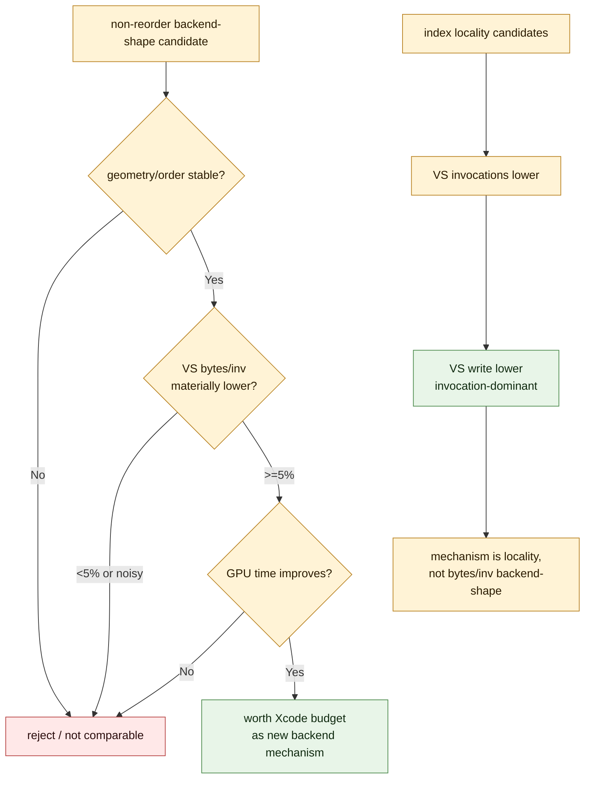

# Non-Reorder Backend Gate

**Question / hypothesis.** Is there a primitive-order-preserving backend-shape
lever, distinct from index locality, that materially reduces hidden
`VS Buffer Device Memory Bytes Written` bytes per invocation?

**Method.** Compared the current frame50 baseline against selected Xcode-backed
locality wins and non-reorder source/backend-shape probes. The scaling report
decomposes each VS-write delta into invocation-count effect and bytes-per-
invocation effect, then applies a preflight gate: a non-reorder candidate must
keep geometry stable, improve GPU time, and move bytes/invocation enough to
justify another Xcode replay budget.

**Result.** Current wins are locality/invocation wins, not backend bytes-per-
invocation wins. Combined opaque + screen-blend locality improves top GPU
`-11.89%`, VS write `-13.20%`, and VS invocations `-12.29%`; its `-214.760MiB`
VS-write delta is mostly invocation effect (`-198.917MiB`) with only
`-15.843MiB` from bytes/invocation. Opaque-depth production locality and the
row `50/2` diagnostic locality proof show the same pattern.

The best non-reorder bytes/invocation probe so far is half VSOut: VS write
`-2.44%`, bytes/invocation `-1.94%`, but top GPU regresses `+3.40%`.
Texture-white is weaker (`-1.07%` VS write, `-0.35%` bytes/invocation, GPU
`+4.18%`).
Force-expand is a negative proof: it destroys indexed reuse and regresses both
GPU and VS write.

**Verdict.** Rejected for the current backend-shape family. The hidden backend
model remains accepted, but no primitive-order-preserving source/backend-shape
axis has yet moved hidden bytes materially. A future non-reorder candidate must
first clear the bytes/invocation preflight before spending Xcode capture time;
otherwise the practical GPU path remains semantic-safe post-transform locality.

**Related.** [hidden-backend-storage](index.md) · prev: hidden-backend-storage-shape.01
· [vsout-layout](../vsout-layout/index.md) · [index-cache-locality](../index-cache-locality/index.md) ·
[index-cache-locality-screenblend.04](../index-cache-locality/index-cache-locality-screenblend.04.md) · [tvb-mechanism-proof](../tvb-mechanism-proof/index.md).
