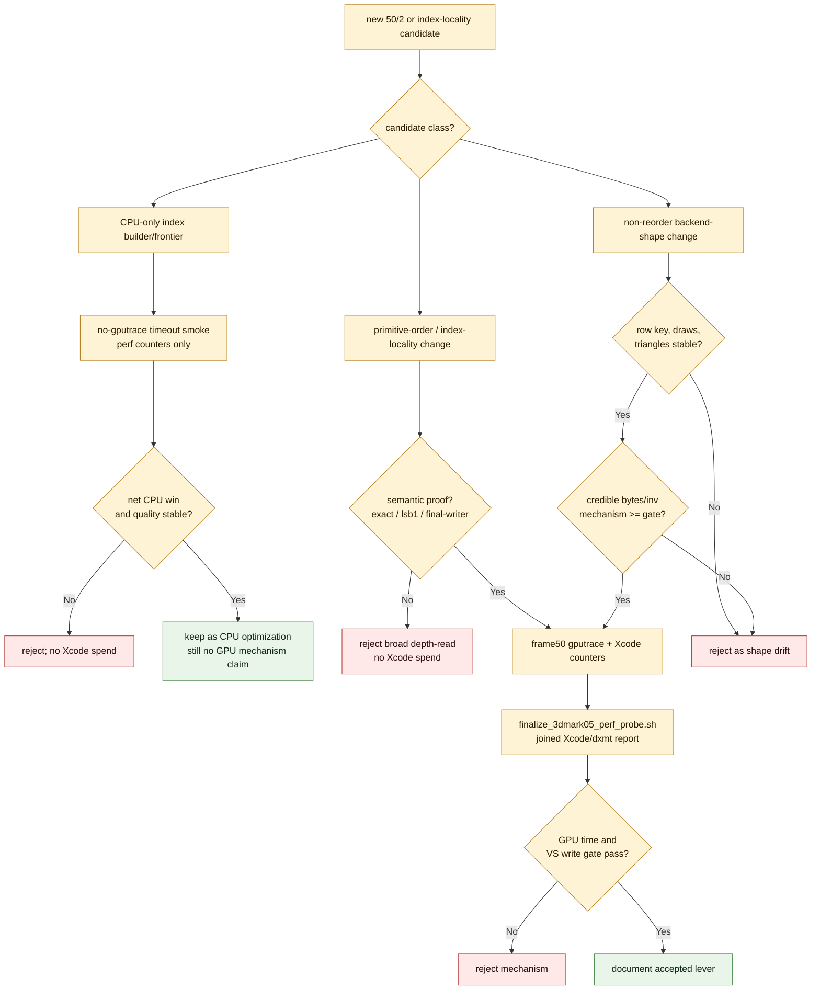

# 50/2 Next Xcode Spend Gate

**Question / hypothesis.** After the accepted opaque-depth locality win and the
rejected CPU-only index-cache probes, which candidates still justify an expensive
frame50 `.gputrace` / Xcode encoder-counter export for the residual `50/2`
hidden-backend owner?

**Method.** Treat Xcode capture budget as a scarce GPU-mechanism proof. A
candidate must first identify which class it belongs to, then pass the cheapest
available preflight. CPU-only frontier changes are no-gputrace experiments until
they prove a net CPU win. Primitive-order changes in depth-read rows need a
semantic oracle. Non-reorder backend-shape changes need a clear bytes-per-
invocation rationale before replay.

**Current decisions.**

| Candidate family | Current status | Xcode policy |
|---|---|---|
| Opaque-depth index-cache locality | accepted GPU mechanism; still opt-in because CPU side-effect remains | Xcode only for regression/proof refresh |
| Screen-blend `50/2` locality | useful only with explicit exact/`lsb1` image policy | Xcode allowed only when the run carries that semantic policy |
| Broad depth-read reorder | blocked by runtime-indistinguishable final-color hazard | no Xcode until final-color/final-writer proof exists |
| Fixed frontier cap | rejected: slots fall, select CPU rises | no Xcode |
| Generic heap-backed lazy frontier | rejected: scored work falls, CPU and miss32 regress | no Xcode |
| Cached-vertex-count bucketed selector | rejected: scored work falls, bucket maintenance regresses CPU | no Xcode |
| Unique upper-bound candidate pre-gate | rejected: rejects 76 candidates but candidate CPU regresses | no Xcode |
| Half VSOut / visible width | rejected: bytes/inv moves weakly, GPU regresses | no Xcode repeat |
| Texture-white / fragment material | rejected as first-order owner for `50/2` | no Xcode repeat |
| New non-reorder backend-shape idea | open | must pass stable-row and bytes/inv preflight before Xcode |

**Verdict.** Accepted as the current spend gate. The next high-value GPU work is
not another generic candidate-selector experiment. It is either:

- a semantic proof that legally expands the `50/2` locality set, or
- a primitive-order-preserving backend-shape mechanism with a credible
  bytes-per-invocation preflight.

Everything else should stay in no-gputrace counter runs until it changes CPU
wall time, quality counters, or a row-local semantic oracle.

**Related.** [hidden-backend-storage](index.md) · prev:
[hidden-backend-storage-shape.02](hidden-backend-storage-shape.02.md) · [index-cache-locality](../index-cache-locality/index.md) ·
[index-cache-locality-screenblend.04](../index-cache-locality/index-cache-locality-screenblend.04.md) · [mini-replay-bisection-semantic.01](../mini-replay-bisection/mini-replay-bisection-semantic.01.md).
