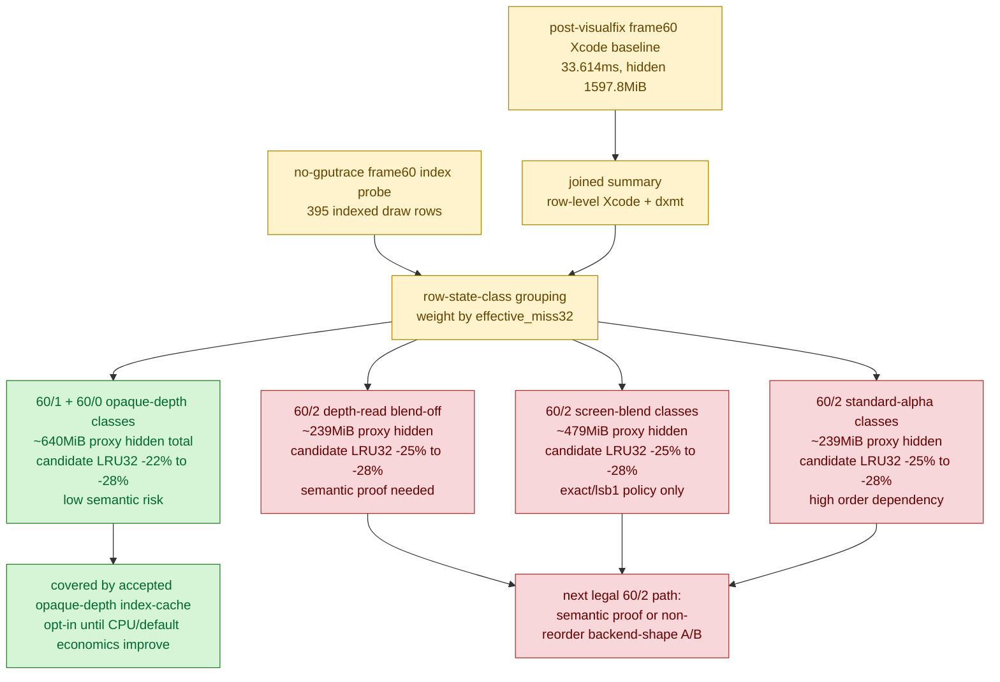

# Post-Visualfix Frame60 Candidate Class Proxy

**Question / hypothesis.** After the post-visualfix frame60 baseline refreshed
the hidden backend owner, can we rank the hot indexed state classes without
spending another `.gputrace` export? In particular, does residual `60/2` look
like one broad class, or several similarly sized semantic-risk classes, and do
those classes have a real cache-locality ceiling?

**Method.**

1. Extended the indexed probe draw log to emit per-draw
   `candidate_*` locality fields (`candidate_index_available`,
   `candidate_cache_miss32`, `candidate_gate_passed`, etc.). Before this, the
   class proxy could rank hidden backend size but could not show per-class
   no-mutate candidate payoff unless a reordered index buffer was actually
   applied.
2. Reused the authoritative post-visualfix frame60 Xcode/dxmt joined baseline:
   `traces/app-d3d9-3dmark05-post-visualfix-frame60-baseline-r1/analysis/frame60-xcode-dxmt-joined-summary.csv`.
3. Ran a no-gputrace no-mutate index probe at the same frame:

   ```sh
   bash scripts/tools/run_3dmark05_perf_probe.sh \
     --suffix post-visualfix-frame60-index-candidate-proxy-r1 \
     --frame 60 --encoder-breakdown-seq 60 \
     --no-gputrace --timeout 120 --top 5 \
     --measure-index-reuse --measure-index-cache-opt-candidate
   ```

4. Joined the probe rows to the Xcode baseline with:

   ```sh
   python3 scripts/tools/analyze_indexed_probe_classes.py \
     experiments/output/app-d3d9-3dmark05-post-visualfix-frame60-index-candidate-proxy-r1/3dmark05-perf-indexed-probe-draws.csv \
     --group row-state-class \
     --joined-summary traces/app-d3d9-3dmark05-post-visualfix-frame60-baseline-r1/analysis/frame60-xcode-dxmt-joined-summary.csv \
     --top 20 \
     --output traces/app-d3d9-3dmark05-post-visualfix-frame60-index-candidate-proxy-r1/analysis/frame60-indexed-state-class-candidate-xcode-proxy.md \
     --csv-output traces/app-d3d9-3dmark05-post-visualfix-frame60-index-candidate-proxy-r1/analysis/frame60-indexed-state-class-candidate-xcode-proxy.csv
   ```

The run timeout-finalized through the wrapper watchdog and still emitted the
required artifacts. It reached `present_encoded=1680`, `draw_calls=1,241,118`,
and the probe CSV contains `395` frame60 indexed triangle rows:
`60/2=187`, `60/1=156`, `60/0=42`, and small post-process rows. Of those,
`337` rows have candidate locality fields and `234` pass the no-mutate
candidate gate.

**Result.** The probe does not replace a class-scoped gputrace, but it provides
a useful ranking signal by allocating row-level Xcode counters by
`effective_miss32`, while `candidate Δ` shows the per-class LRU32 ceiling.

Top proxy hidden-backend classes:

| Group | draws | primitives | candidate LRU32 Δ | proxy GPU ms | proxy hidden MiB | risk |
|---|---:|---:|---:|---:|---:|---|
| `60/1 depth=write blend=off textured=no large4096=no` | `147` | `156,420` | `-65,855` (`-22.34%`) | `5.767` | `290.800` | low opaque-depth |
| `60/2 depth=read blend=off textured=yes large4096=yes` | `5` | `51,587` | `-23,502` (`-25.62%`) | `2.574` | `128.371` | medium depth-read |
| `60/2 depth=read blend=screen scissor=on textured=yes large4096=yes` | `5` | `51,587` | `-23,502` (`-25.62%`) | `2.574` | `128.371` | screen-blend tolerance |
| `60/2 depth=read blend=screen scissor=off textured=yes large4096=yes` | `5` | `51,587` | `-23,502` (`-25.62%`) | `2.574` | `128.371` | screen-blend tolerance |
| `60/2 depth=read blend=standard-alpha textured=yes large4096=yes` | `5` | `51,587` | `-23,502` (`-25.62%`) | `2.574` | `128.371` | high alpha-order |
| `60/1 depth=write blend=off textured=no large4096=yes` | `9` | `72,305` | `-31,930` (`-24.83%`) | `2.516` | `126.850` | low opaque-depth |
| `60/0 depth=write blend=off textured=yes large4096=yes color_write=0x0` | `5` | `51,587` | `-23,502` (`-25.62%`) | `2.962` | `119.954` | low opaque-depth |
| `60/2 depth=read blend=screen textured=yes large4096=no` | `56` | `45,907` | `-22,242` (`-28.04%`) | `2.226` | `111.019` | screen-blend tolerance |
| `60/2 depth=read blend=off textured=yes large4096=no` | `37` | `45,707` | `-22,202` (`-28.06%`) | `2.220` | `110.727` | medium depth-read |
| `60/2 depth=read blend=standard-alpha textured=yes large4096=no` | `37` | `45,707` | `-22,202` (`-28.06%`) | `2.220` | `110.727` | high alpha-order |

Two constraints follow:

- `60/1` and `60/0` still contain large low-risk opaque-depth classes. They
  are already covered by the accepted production index-cache locality mechanism,
  whose remaining blocker is CPU payoff / default-policy economics, not GPU
  mechanism proof.
- `60/2` is not a single easy class. It splits into several similarly sized
  depth-read / screen-blend / alpha classes, and those classes all have real
  locality ceilings (`~25-28%` candidate LRU32 reduction). Primitive-order
  changes here remain blocked by semantics, not by lack of a GPU mechanism,
  unless they carry a same-input exact/`lsb1` semantic policy or a final-color /
  final-writer proof.



**Verdict.** Accepted as attribution. The proxy strengthens
[[hidden-backend-storage-shape.03]]: another broad `60/2` reorder is not a
production path. The first follow-up, [[mini-replay-bisection-semantic.02]],
selected the `60/2 depth-read + no-alpha-blend` rank-1 two-draw window and
proved `cache-opt-lru32` exact under the standalone same-input replay
(`0` changed pixels, replay LRU32 `-14,593`). That is useful, but scoped: it
uses white dummy textures. A real D24X8 depth-input replay for the same selected
window also stayed exact, so it does not replace a full-scene texture proof or a
runtime-visible production selector. The
next high-value GPU work is either:

- more same-input semantic proof that makes selected `60/2` depth-read /
  screen-blend ordering legal under real depth/texture or a runtime-visible
  selector; or
- a primitive-order-preserving backend-shape A/B that moves VS
  invocations/write without changing draw/triangle/vertex shape.

The result also reinforces that Xcode's named tiler counters are not the owner:
the same baseline reports top-3 `VS buffer write=1627.332 MiB`, named tiled
buffer total `29.375 MiB`, weighted primitive-block tile intersections
`0.25%`, and hidden estimate `1597.755 MiB`.

**Related.** [[hidden-backend-storage]] · prev:
[[hidden-backend-storage-shape.03]] · [[index-cache-locality]] ·
[[index-cache-locality-cpucost.15]] · [[baselines-frame60.02]] ·
[[mini-replay-bisection-semantic.02]].
