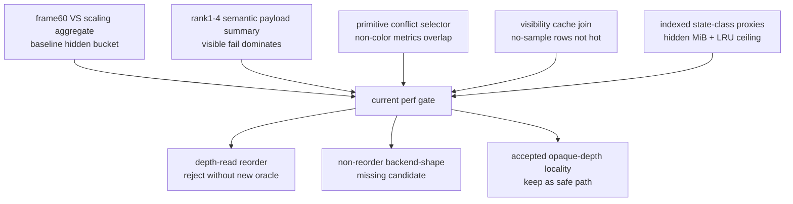
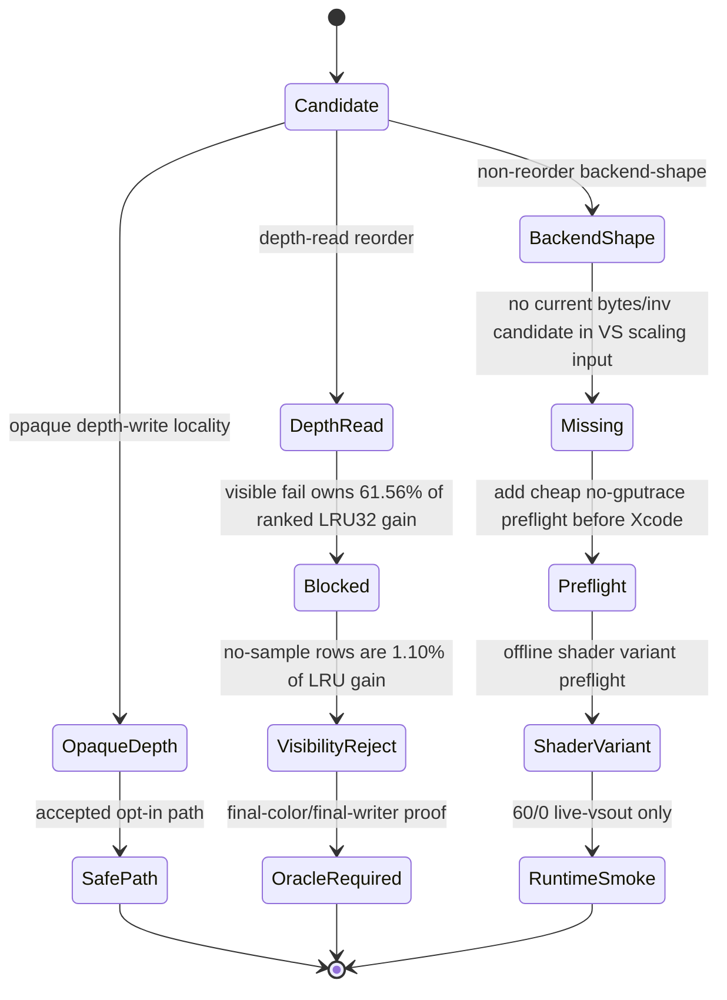

# Post-Rank4 Current Perf Gate

**Question / hypothesis.** After rank1-4 real-texture semantic gates and the
primitive-conflict selector scout, which candidate family deserves the next
3DMark05 GT1 `.gputrace` / Xcode counter export?

**Method.**

1. Converted the post-visualfix frame60 joined Xcode/dxmt baseline into a VS
   scaling aggregate with `analyze_vs_buffer_scaling.py`.
2. Summarized rank1-4 real-depth/real-texture outcomes with
   `summarize_semantic_payload_candidates.py`.
3. Fed the semantic payload summary, primitive-conflict selector summary,
   visibility scout cache-join summary, and current indexed state-class proxies
   into `summarize_3dmark05_perf_gates.py`.
4. Wrote the gate report under
   `traces/app-d3d9-3dmark05-post-visualfix-frame60-gate-r1/analysis/`.

**Result.** The current gate report is conservative and input-scoped:

| Gate | Verdict | Evidence | Next action |
|---|---|---|---|
| Non-reorder backend-shape | `missing` | no non-reorder backend-shape candidates in the current VS scaling CSV | add a cheap no-gputrace preflight before Xcode |
| Shader variant preflight | `runtime-smoke-candidate` | `60/0` `live-vsout` changes VSOut `184 -> 52 B` and visible scratch `128 -> 0 B`; `60/2`/`60/1` remain visible-width-only | run a primitive-order-preserving runtime smoke for `60/0` before Xcode; see [[hidden-backend-storage-shape.06]] |
| Broad depth-read reorder | `reject` | visible-fail LRU32 `-14,593`; exact visible `-2,452`; sparse/no-final-color `-6,661` | require final-color/final-writer proof before promotion; current D3D9 occlusion query is primitive-count only |
| Primitive-conflict selector | `final-color-oracle-required` | only color/final-output metrics separate exact pass/fail rows | do not use owner-count/depth/UV thresholds |
| Visibility no-sample hotpath | `reject-hotpath` | zero rows are `25 / 187`, `1.89%` of primitives, and `1.10%` of absolute LRU32 gain | do not schedule Xcode for no-sample locality on this row |
| Overall | `semantic-safe-locality-only` | reorder is blocked; no-sample rows are not hot; backend-shape candidate missing | keep accepted opaque-depth locality; use final-color/final-writer proof or a non-reorder backend mechanism |

The implementation queue now carries a concrete no-gputrace backend-shape smoke
target from the class proxy:

| Track | Status | Evidence | Next action |
|---|---|---|---|
| Non-reorder backend smoke target | `queued-from-class-proxy` | `60/2 depth=read blend=off textured=yes large4096=yes`, proxy hidden `128.371 MiB`, candidate LRU32 `-23,502` | run a primitive-order-preserving no-gputrace backend-shape smoke for this class; promote to Xcode only if row shape stays stable and the candidate has a credible bytes/invocation mechanism |
| Shader variant backend smoke | `queued-runtime-smoke` | `60/0` rank3 `live-vsout` is the only hot offline variant that removes visible scratch | run the `60/0` runtime smoke before spending Xcode; do not retry `60/2`/`60/1` as visible-width-only variants |

The semantic payload summary gives the clearest budget signal:

| Bucket | LRU32 delta | Broad-gain share | Meaning |
|---|---:|---:|---|
| Visible fail | `-14,593` | `61.56%` | correctness blocker |
| Visible exact-pass | `-2,452` | `10.34%` | possible selector value only |
| Sparse exact-pass | `-724` | `3.05%` | positive control |
| No-final-color exact-pass | `-5,937` | `25.04%` | needs final-color/final-writer proof; current D3D9 query is not enough and current no-sample rows are not hot |

**Interpretation.** This gate answers why the rank experiments still move the
main bottleneck goal forward even though they do not directly improve FPS. They
prevent an unsafe primitive-reorder path from consuming more Xcode time: the
largest ranked LRU32 gain is the visible failure, and simple non-color
primitive-conflict metrics cannot split it from exact passes.

The next GPU work should therefore be one of two proof families:

- implement a real final-color/final-writer policy before touching depth-read
  reorder again; the current D3D9 occlusion query is primitive-count only, and
  the current Metal visibility no-sample rows are not the hotpath;
- or run a primitive-order-preserving backend-shape smoke that has a credible
  bytes-per-invocation mechanism before another `.gputrace`/Xcode export. The
  shader-side preflight in [[hidden-backend-storage-shape.06]] narrows that to
  `60/0 live-vsout` first; `60/2`/`60/1` visible-width-only retries are low
  priority.

**Related.** [[hidden-backend-storage]] ·
[[hidden-backend-storage-shape.03]] ·
[[hidden-backend-storage-shape.04]] · [[hidden-backend-storage-shape.06]] ·
[[mini-replay-bisection-texture.07]] · [[mini-replay-bisection-texture.08]] ·
[[index-cache-locality]].
