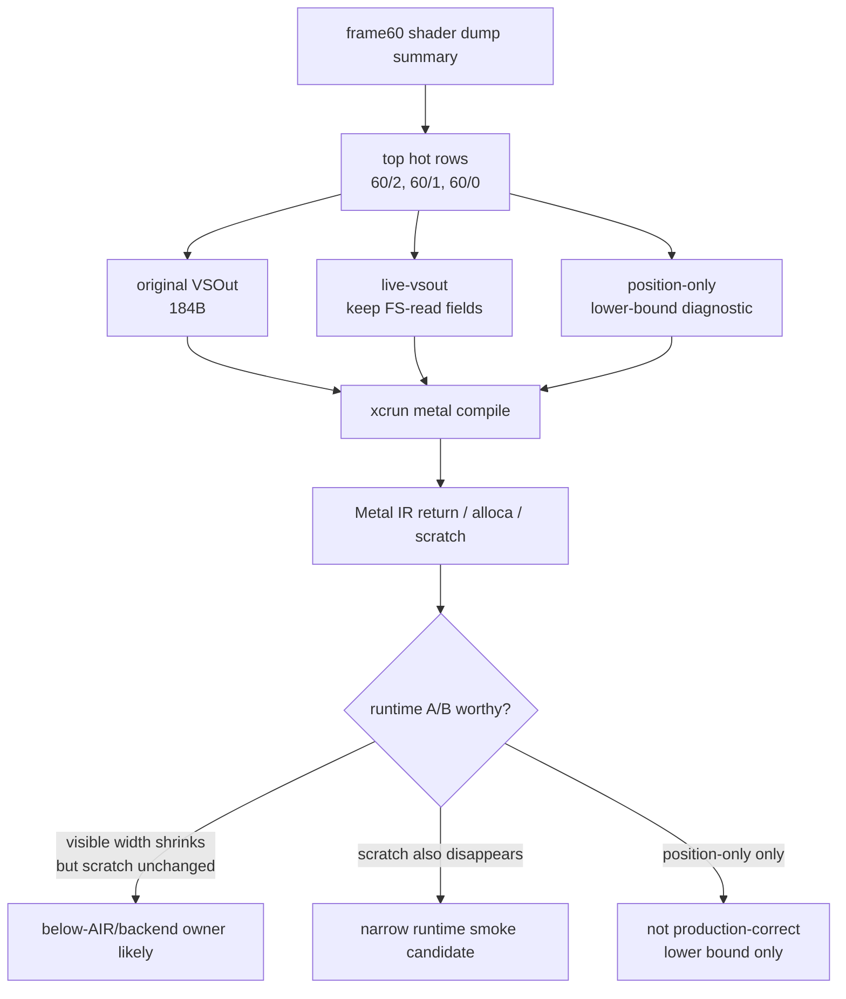
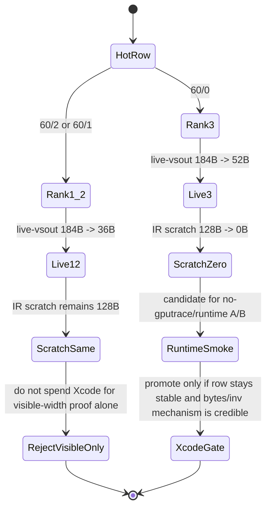
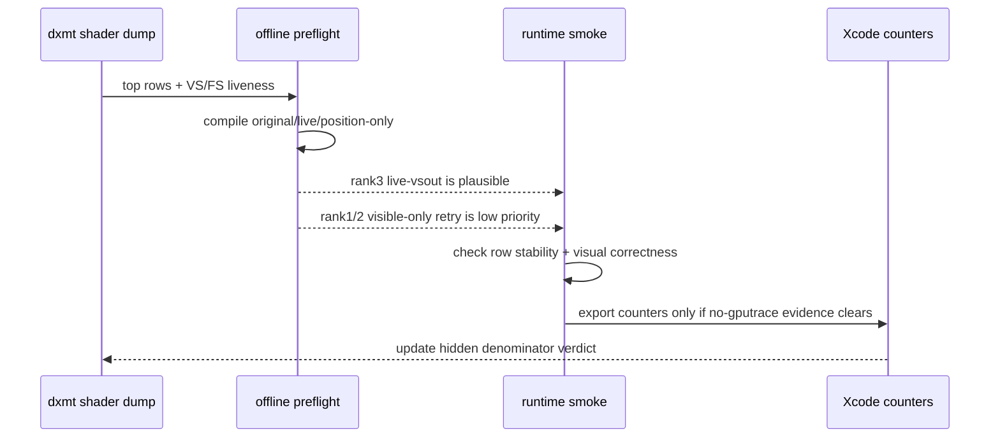

# Offline Metal Shader Variant Preflight

**Question / hypothesis.** The current post-rank4 gate queues a
primitive-order-preserving backend-shape smoke before spending another Xcode
`.gputrace` export. Does offline Metal compilation show that the hot
`60/2`, `60/1`, or `60/0` rows have a credible source-visible VSOut or
compiler-scratch mechanism?

**Method.**

1. Reused the post-visualfix frame60 shader dump summary:
   `traces/app-d3d9-3dmark05-post-visualfix-frame60-baseline-r1/analysis/frame60-shader-dump-summary.csv`.
2. Ran the structural variant compiler for the hot rows:

   ```sh
   mkdir -p traces/app-d3d9-3dmark05-post-visualfix-frame60-gate-r1/analysis/backend-shape-shader-variants
   python3 scripts/tools/analyze_metal_shader_variants.py \
     traces/app-d3d9-3dmark05-post-visualfix-frame60-baseline-r1/analysis/frame60-shader-dump-summary.csv \
     --shader-dir traces/app-d3d9-3dmark05-post-visualfix-frame60-baseline-r1/analysis/shaders/msl \
     --top 10 \
     --variants original,live-vsout,position-only \
     --output traces/app-d3d9-3dmark05-post-visualfix-frame60-gate-r1/analysis/backend-shape-shader-variants/frame60-metal-shader-variants.md \
     --csv-output traces/app-d3d9-3dmark05-post-visualfix-frame60-gate-r1/analysis/backend-shape-shader-variants/frame60-metal-shader-variants.csv \
     --variant-dir traces/app-d3d9-3dmark05-post-visualfix-frame60-gate-r1/analysis/backend-shape-shader-variants/msl \
     --work-dir traces/app-d3d9-3dmark05-post-visualfix-frame60-gate-r1/analysis/backend-shape-shader-variants/work \
     --keep-temps
   ```

3. Treated the result as an offline classifier only. It can prioritize runtime
   A/B work, but it cannot prove a performance fix without Xcode counters.
4. Fed the variant CSV into `summarize_3dmark05_perf_gates.py` with
   `--shader-variant-csv`, producing the `shader-variant-preflight` gate and
   `shader-variant-backend-smoke` implementation-track row in the current
   frame60 gate report.



**Result.**

| Row | Baseline Xcode VS write | Variant | VSOut | IR return | IR scratch | Interpretation |
|---|---:|---|---:|---:|---:|---|
| `60/2` rank1 | `981.159 MiB`, `1602.520 B/inv` | `live-vsout` | `184 -> 36 B` | `184 -> 36 B` | `128 -> 128 B` | visible fields shrink, compiler scratch does not |
| `60/1` rank2 | `421.226 MiB`, `1151.162 B/inv` | `live-vsout` | `184 -> 36 B` | `184 -> 36 B` | `128 -> 128 B` | same shape as rank1 |
| `60/0` rank3 | `224.947 MiB`, `1542.722 B/inv` | `live-vsout` | `184 -> 52 B` | `184 -> 52 B` | `128 -> 0 B` | only hot row where live-vsout also removes visible IR scratch |
| `60/2` rank1 | same | `position-only` | `184 -> 16 B` | `184 -> 16 B` | `128 -> 0 B` | lower-bound diagnostic, not a correct runtime variant |
| `60/1` rank2 | same | `position-only` | `184 -> 16 B` | `184 -> 16 B` | `128 -> 0 B` | lower-bound diagnostic |
| `60/0` rank3 | same | `position-only` | `184 -> 16 B` | `184 -> 16 B` | `128 -> 0 B` | lower-bound diagnostic |

The top-two rows are the important negative signal. `live-vsout` removes ten
fields and cuts the source-visible return from `184 B` to `36 B`, but the
Metal-visible scratch estimate remains `128 B`. That means a production
`live-vsout` A/B on `60/2` or `60/1` would mostly retest the already rejected
visible-VSOut family unless it can isolate a lower backend mechanism.

The rank3 `60/0` row is different: `live-vsout` keeps
`position,color,secondaryColor,fogFactor`, drops the texcoord payload, and the
compiler-visible scratch estimate falls to `0 B`. This does not prove that
Xcode's hidden `VS Buffer Device Memory Bytes Written` will move, but it gives
one narrow primitive-order-preserving smoke target that is more credible than a
generic half-VSOut retry.



**Verdict.** Accepted as preflight. The result narrows, rather than solves, the
backend-denominator question:

- `60/2` remains the largest hidden-backend row, but offline `live-vsout` does
  not show a source-visible compiler-scratch lever there. Treat it as a
  below-AIR / tiler-parameter / position-binning candidate until a runtime A/B
  says otherwise.
- `60/1` has the same negative preflight shape as `60/2`.
- `60/0` is the only current hot row where `live-vsout` changes both IR return
  and IR scratch, so it is the cheapest next primitive-order-preserving shader
  smoke. It still requires a runtime visual gate and Xcode counter export before
  it can be called a performance mechanism.

The regenerated current gate report records this as
`shader-variant-preflight=runtime-smoke-candidate`, while the overall gate stays
`semantic-safe-locality-only`: the shader result queues a cheap runtime smoke,
not a capture-ready optimization.



**Related.** [hidden-backend-storage](index.md) ·
[hidden-backend-storage-shape.05](hidden-backend-storage-shape.05.md) · [vsout-layout](../vsout-layout/index.md) · [shader-codegen](../shader-codegen/index.md) ·
[backend-shape-classifiers](../backend-shape-classifiers/index.md).
