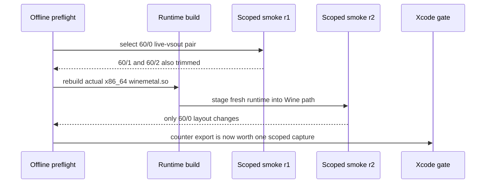
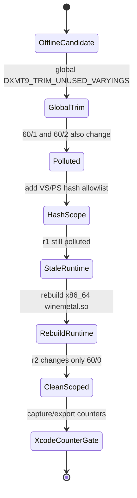
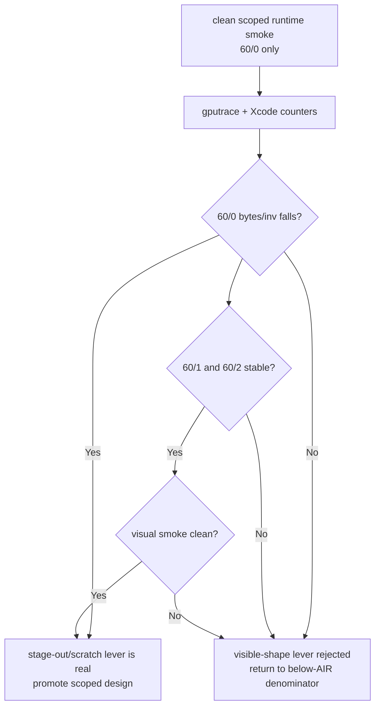

# Scoped 60/0 Live-VSOut Runtime Smoke

**Question / hypothesis.** [hidden-backend-storage-shape.06](hidden-backend-storage-shape.06.md) found one narrow
offline shader candidate: hot row `60/0` has a `live-vsout` variant where the
source-visible `VSOut` falls from `184 B` to `52 B` and the Metal IR scratch
estimate falls from `128 B` to `0 B`. Can that candidate be isolated at runtime
without also mutating the larger `60/1` and `60/2` rows?

**Method.**

1. Added hash-scoped VSOut trim controls:

   - `DXMT9_TRIM_UNUSED_VARYINGS=1`
   - `DXMT9_TRIM_UNUSED_VARYINGS_VS_HASHES=<list>`
   - `DXMT9_TRIM_UNUSED_VARYINGS_PS_HASHES=<list>`

   The hash lists are optional. Empty lists keep the existing global trim
   behavior; non-empty lists restrict pair-local liveness trimming to matching
   VS/PS hashes.

2. Extended `run_3dmark05_perf_probe.sh` with
   `--trim-unused-varyings-vs-hashes` and
   `--trim-unused-varyings-ps-hashes`. The wrapper rejects scoped hash flags
   unless `--trim-unused-varyings` is also enabled.

3. Rebuilt the actual 3DMark05 runtime path before interpreting the smoke:

   ```sh
   ninja -C build-x86_64-builtin src/winemetal/unix/winemetal.so
   ninja -C build-win32-x64-builtin src/winemetal/winemetal.dll
   ninja -C build-win32-x86-builtin src/winemetal/winemetal.dll
   ```

   This matters because the first scoped run (`r1`) used the new wrapper env but
   the previously staged Unix `winemetal.so`; it trimmed `60/1` and `60/2` too,
   contradicting the intended allowlist.

4. Reran the no-gputrace runtime smoke with the `60/0` VS/PS pair:

   ```sh
   bash scripts/tools/run_3dmark05_perf_probe.sh \
     --suffix frame60-trim-varyings-60-0-scoped-smoke-r2 \
     --frame 60 \
     --no-gputrace \
     --timeout 180 \
     --encoder-breakdown-seq 60 \
     --dump-shaders \
     --trim-unused-varyings \
     --trim-unused-varyings-vs-hashes 0x61be862718e1d00c \
     --trim-unused-varyings-ps-hashes 0xfbeb0f02c65a9526 \
     --top 5
   ```

   The wrapper exited with watchdog status `124` after writing postprocess
   artifacts. This is acceptable for this smoke: the summary is `partial-log`,
   but the encoder CSV and shader dump were written.



**Result.**

| Row | Geometry stability | Baseline layout | Scoped r1 layout | Scoped r2 layout | Interpretation |
|---|---:|---:|---:|---:|---|
| `60/0` | `42` draws, `97,294` prims, `291,882` verts in all runs | `0xfff`, unique `1`, changes `0` | `0x701`, unique `1`, changes `0` | `0x701`, unique `2`, changes `2` | scoped target moved |
| `60/1` | `156` draws, `228,725` prims, `686,175` verts in all runs | `0xfff`, unique `1`, changes `0` | `0x401`, unique `1`, changes `0` | `0xfff`, unique `1`, changes `0` | r1 was stale-runtime pollution; r2 is clean |
| `60/2` | `187` draws, `389,376` prims, `1,168,128` verts in all runs | `0xfff`, unique `1`, changes `0` | `0x401`, unique `13`, changes `23` | `0xfff`, unique `1`, changes `0` | r1 was stale-runtime pollution; r2 is clean |

`60/0` has `vsout_layout_unique=2` in the clean scoped run because the encoder
row contains multiple shader variants and only the allowlisted VS/PS pair is
trimmed. The row's geometry and shader-variant count stay stable; the smoke is
therefore good enough to isolate the target, but it is not yet a performance
proof.

The dumped allowlisted `60/0` source confirms the reduced runtime layout:

```metal
struct VSOut {
  float4 position /* MSL position attribute */;
  float4 color;
  float4 secondaryColor;
  float4 texcoord0;
  float fogFactor;
};
```

By contrast, the clean `60/1` and `60/2` rows stayed on the full `0xfff`
layout in the encoder CSV.



**Verdict.** Accepted as a runtime smoke, not as a bottleneck fix. The current
meaning is precise:

- The hash-scoped `live-vsout` mechanism can isolate the `60/0` candidate at
  runtime.
- The earlier `r1` pollution is invalid as scoped evidence because the actual
  runtime binary was stale.
- The smoke does not answer whether Xcode's hidden
  `VS Buffer Device Memory Bytes Written` bucket will move. It only clears the
  cheap precondition for one scoped `.gputrace` run.

**Next Xcode gate.** The next expensive capture should use the same scoped env,
with gputrace enabled, and should pass only if all of these are true:

1. `60/0` keeps the scoped layout change while `60/1` and `60/2` stay full.
2. `60/0` `VS Buffer Device Memory Bytes Written / VS invocations` falls by a
   meaningful amount.
3. The top-two rows do not acquire compensating GPU regressions.
4. A visual/frame smoke does not show the texture/color regressions seen in
   earlier broad experiments.

If the Xcode counter does not move, this line should be closed as another
visible-shape rejection and the hidden-denominator work should return to
position/binning/tiler parameter storage or a separate backend mechanism.

**Resolution.** [hidden-backend-storage-shape.08](hidden-backend-storage-shape.08.md) ran this Xcode counter gate
and rejected the mechanism: the scoped `60/0` expected VSOut width fell, but
`VS Buffer Device Memory Bytes Written / VS invocations` stayed flat.



**Related.** [hidden-backend-storage](index.md) ·
[hidden-backend-storage-shape.05](hidden-backend-storage-shape.05.md) · [hidden-backend-storage-shape.06](hidden-backend-storage-shape.06.md) ·
[vsout-layout](../vsout-layout/index.md) · [shader-codegen](../shader-codegen/index.md).
