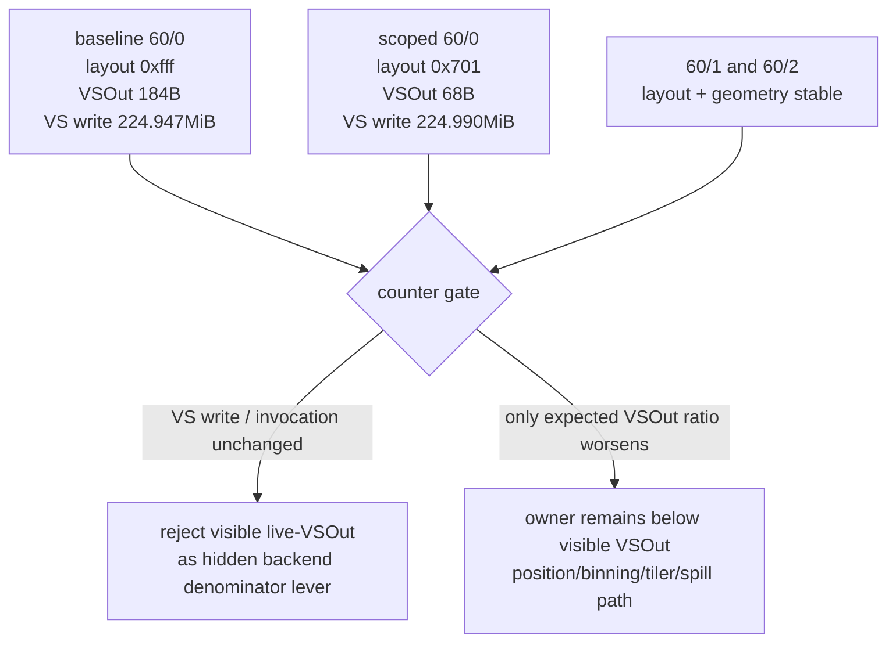
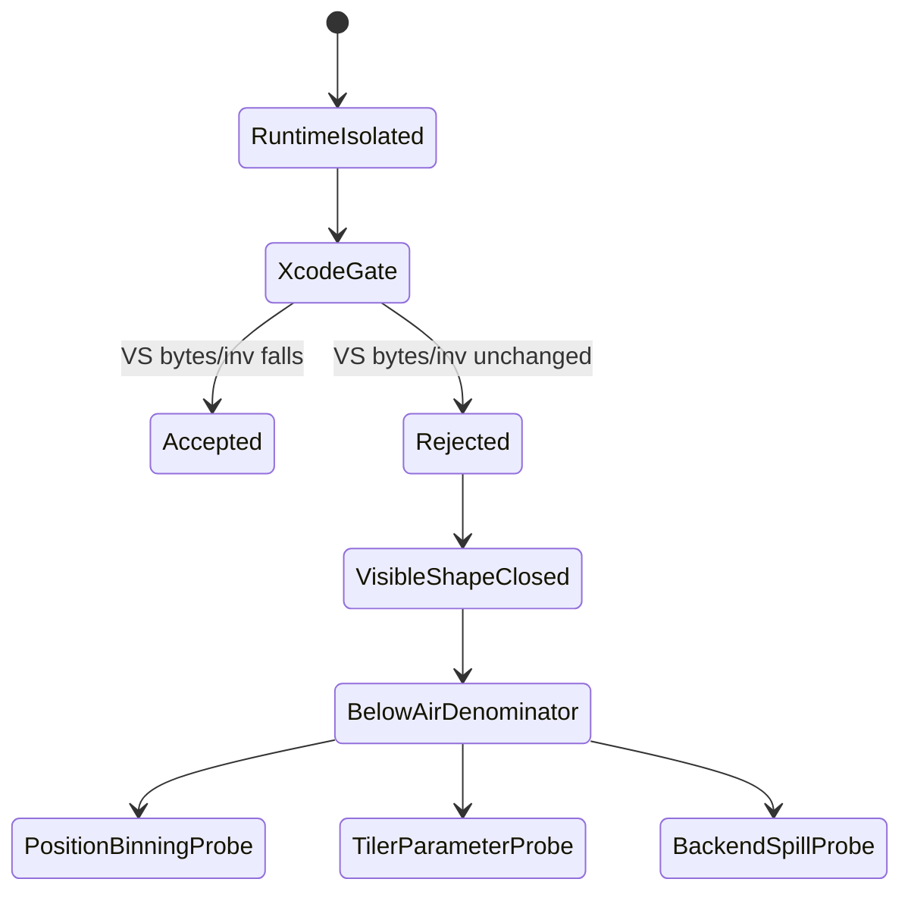

# Scoped 60/0 Live-VSOut Xcode Counter Gate

**Question / hypothesis.** [[hidden-backend-storage-shape.07]] proved that the
hash-scoped `DXMT9_TRIM_UNUSED_VARYINGS` path can isolate the `60/0` VS/PS pair
at runtime. Does that visible `VSOut` reduction reduce Xcode's hidden
`VS Buffer Device Memory Bytes Written / VS invocations` bucket?

**Method.**

1. Captured the same scoped `60/0` pair with gputrace enabled:

   ```sh
   bash scripts/tools/run_3dmark05_perf_probe.sh \
     --suffix frame60-trim-varyings-60-0-scoped-xcode-r1 \
     --frame 60 \
     --timeout 420 \
     --encoder-breakdown-seq 60 \
     --dump-shaders \
     --trim-unused-varyings \
     --trim-unused-varyings-vs-hashes 0x61be862718e1d00c \
     --trim-unused-varyings-ps-hashes 0xfbeb0f02c65a9526 \
     --top 5
   ```

   The wrapper exited with watchdog status `124` after writing artifacts. This
   is acceptable for this workload because the final-frame hang is known and
   the frame capture / per-encoder CSV were written.

2. Opened `frame60.gputrace` in Xcode, replay-profiled it, exported an embedded
   performance trace, waited for draw-counter profiling to finish, and exported
   encoder counters to:

   ```text
   traces/app-d3d9-3dmark05-frame60-trim-varyings-60-0-scoped-xcode-r1/analysis/frame60-counters-xcode.csv
   ```

3. Ran the standard finalizer:

   ```sh
   bash scripts/tools/finalize_3dmark05_perf_probe.sh \
     --suffix frame60-trim-varyings-60-0-scoped-xcode-r1 \
     --frame 60 \
     --top 5 \
     --hot-gpu-share 95.0
   ```

```mermaid
sequenceDiagram
  participant S as Scoped runtime smoke
  participant G as gputrace capture
  participant X as Xcode counter export
  participant F as finalizer
  participant B as baseline comparison

  S->>G: use 60/0 VS/PS hash allowlist
  G->>X: replay profile frame60
  X->>F: export encoder counters CSV
  F->>B: join Xcode counters with dxmt encoder CSV
  B-->>S: visible VSOut shrinks; VS buffer write does not
```

**Result.**

| Encoder | Metric | Baseline | Scoped live-VSOut | Delta |
|---:|---|---:|---:|---:|
| `60/0` | GPU ms | `5.516856` | `5.463746` | `-0.053110` |
| `60/0` | VS buffer MiB | `224.947449` | `224.989929` | `+0.042480` |
| `60/0` | VS B / VS invocation | `1542.722103` | `1543.013441` | `+0.291337` |
| `60/0` | Expected VSOut B / vertex | `184` | `68` | `-116` |
| `60/0` | VS buffer / expected VSOut | `8.384x` | `22.691x` | `+14.307x` |
| `60/0` | Layout | `0xfff` | `0x701` | target moved |
| `60/1` | VS buffer MiB | `421.225769` | `421.222717` | `-0.003052` |
| `60/1` | VS B / VS invocation | `1151.162486` | `1151.154146` | `-0.008340` |
| `60/1` | Layout | `0xfff` | `0xfff` | stable |
| `60/2` | VS buffer MiB | `981.158630` | `981.157288` | `-0.001343` |
| `60/2` | VS B / VS invocation | `1602.519921` | `1602.517728` | `-0.002193` |
| `60/2` | Layout | `0xfff` | `0xfff` | stable |

Geometry and shader identity stayed stable for the hot rows:

| Encoder | Baseline draw/prim/vert | Scoped draw/prim/vert | VS/PS hash |
|---:|---:|---:|---|
| `60/0` | `42 / 97,294 / 291,882` | `42 / 97,294 / 291,882` | `0x61be862718e1d00c / 0xfbeb0f02c65a9526` |
| `60/1` | `156 / 228,725 / 686,175` | `156 / 228,725 / 686,175` | `0xcf219872fdbbb398 / 0x6f39a816200d9efe` |
| `60/2` | `187 / 389,376 / 1,168,128` | `187 / 389,376 / 1,168,128` | `0x8046aaf9f26deff7 / 0xd3bae24e6d632f2d` |

Run-level counters also stayed effectively flat: total GPU moved
`33.614 ms -> 33.914 ms`, total VS buffer write moved
`1627.332 MiB -> 1627.370 MiB`, and top-three GPU share stayed above `98%`.
The regenerated VS scaling gate classifies the run as a
`non-reorder-backend-shape` candidate and rejects it directly:
`VSOut delta -8.18%`, `VS buffer delta +0.002%`, `VS B/inv delta +0.002%`,
`backend_shape_gate=reject`.

The scoped screenshot is not pixel-comparable to the baseline screenshot because
the wrapper captured a later visual moment (`frame 986` vs baseline `frame
958`). As a gross visual smoke, the scoped image does not show the prior yellow
frame, black/transparent large vertex corruption, or obvious texture collapse.
The performance gate fails independently of that visual limitation.



**Verdict.** Rejected as a bottleneck fix. The experiment is still useful
because it cleanly separates two facts:

- The runtime mechanism works: `60/0` can be isolated and trimmed without
  mutating the larger `60/1` and `60/2` rows.
- The GPU bottleneck does not follow visible `VSOut` width: `60/0` expected
  stage-out bytes fell by `63%`, while Xcode's VS buffer bytes per invocation
  rose by `0.02%`.

This closes the scoped `60/0` `live-vsout` line as another visible-shape
rejection. Future non-reorder work should target a different denominator:
Apple position/binning path, primitive/tiler parameter storage, backend
spill/layout behavior, or a PSO/state-shape coupling that changes hidden storage
without relying on source-visible varying width.



**Related.** [[hidden-backend-storage]] ·
[[hidden-backend-storage-shape.06]] · [[hidden-backend-storage-shape.07]] ·
[[vsout-layout]] · [[shader-codegen]].
