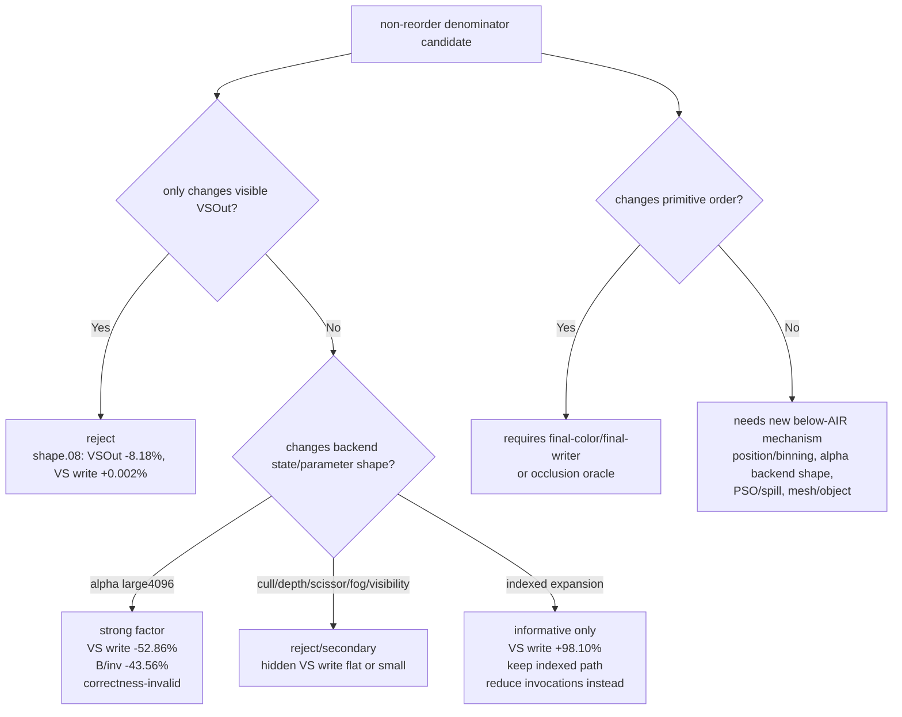
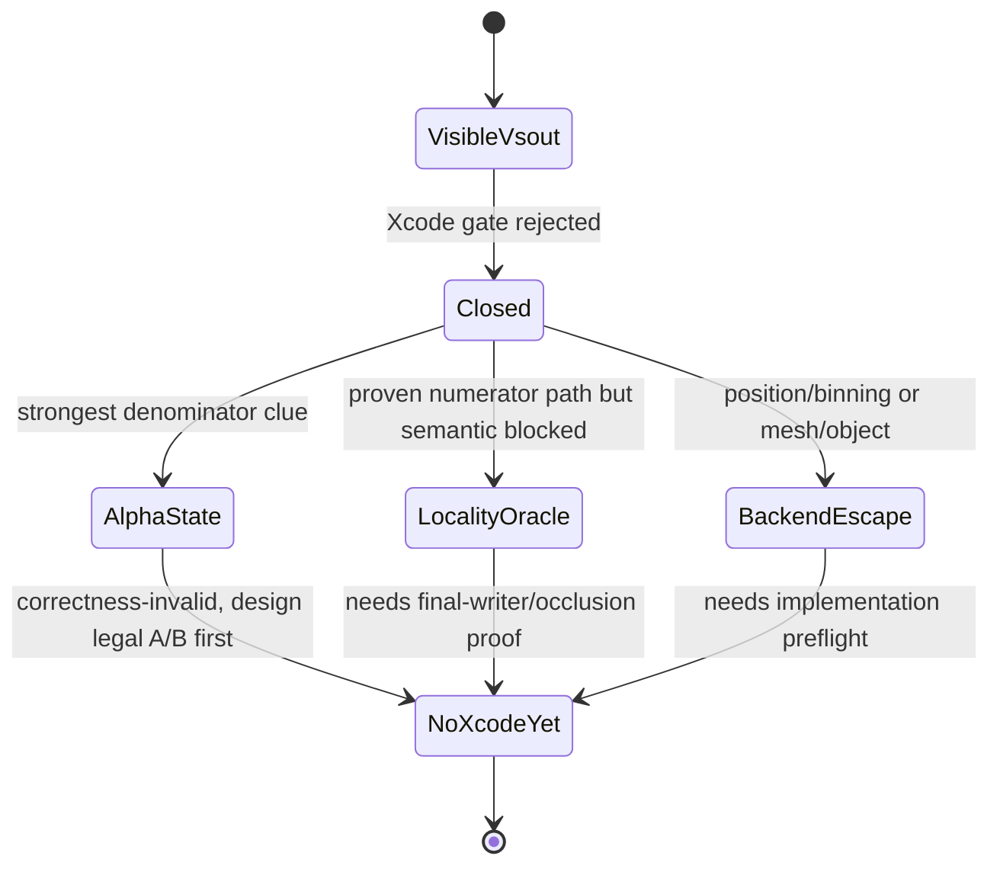

# Below-AIR Next Probe Triage After Live-VSOut Rejection

**Question / hypothesis.** After [hidden-backend-storage-shape.08](hidden-backend-storage-shape.08.md) rejects
source-visible `VSOut` width as the non-reorder denominator lever, which
below-AIR probe family should receive the next engineering and Xcode budget?

**Method.**

1. Regenerated `analyze_vs_buffer_scaling.py` with the post-visualfix baseline
   and scoped `60/0 live-vsout` Xcode run. The scoped run is now automatically
   classified as `non-reorder-backend-shape`.
2. Re-read the existing backend-shape classifiers, especially the only large
   non-invocation denominator mover: `large4096 + alpha-blend` blend-off.
3. Cross-checked the current post-rank4 gate and class proxy to separate
   primitive-order locality paths from non-reorder backend-state paths.

**Result.**

| Candidate family | Existing signal | Current decision |
|---|---|---|
| Visible `VSOut` / varying width | scoped `60/0`: expected VSOut `-8.18%` top aggregate, VS write `+0.002%`, gate reject | Closed. Do not spend more Xcode budget here. |
| Named tiled-buffer counters | cull doubles named tiled counters but hidden VS write stays flat; named tiled remains ~`55x` smaller than VS write | Not the whole owner. Useful as a side counter only. |
| Fragment texture / fog | secondary GPU movement, VS write flat or `~3%` class-specific | Not first-order; keep separate from hidden-denominator work. |
| Indexed expansion | forced expansion VS write `+98.10%` | Confirms primitive/indexed pressure. The fix is reducing VS invocations, not expanding. |
| Primitive-order locality | opaque-depth path proven; depth-read path blocked by visible fail / owner masking | Continue only with final-color/final-writer or occlusion oracle. |
| `large4096 + alpha-blend` backend state | blend-off class probe cuts top VS write `-52.86%`, B/inv `-43.56%`; correctness-invalid | Strongest non-reorder denominator clue. Needs a legal/semantic A/B design before another Xcode capture. |
| Position/binning or mesh/object path | not tested by visible position-only VSOut | Valid future backend escape hatch, but requires a real pipeline path, not another `VSOut` trim. |
| PSO/state-shape spill/layout coupling | CPU state churn is measured; GPU coupling unmeasured | Keep as an A/B only if geometry and visible render state can be isolated. |

**Interpretation.** The next meaningful work is not another shader-output
variant. The best remaining evidence says the hidden bucket is sensitive to
**backend parameter/state shape around large alpha-blended indexed primitives**
and to **VS invocation count**. The first is not yet a fix because disabling
blend is wrong; the second is already the accepted opaque-depth index-cache
path, with depth-read variants blocked by semantic proof requirements.

**Next experiment gate.**

- Do **not** queue Xcode for `trim-varyings`, `live-vsout`, half VSOut,
  point-size, or position-only `VSOut` variants unless they also change a real
  backend path.
- Queue Xcode only after a cheap preflight proves one of:
  1. a legal alpha/large-primitive backend-state A/B with stable row geometry;
  2. a final-color/final-writer or occlusion oracle that makes depth-read
     locality safe;
  3. a real position/binning, mesh/object, or PSO/spill experiment that changes
     `VS B / VS invocation`, not just visible MSL structure.

**Related.** [hidden-backend-storage](index.md) ·
[hidden-backend-storage-shape.08](hidden-backend-storage-shape.08.md) · [backend-shape-classifiers](../backend-shape-classifiers/index.md) ·
[index-cache-locality](../index-cache-locality/index.md) · [mini-replay-bisection](../mini-replay-bisection/index.md) · [vsout-layout](../vsout-layout/index.md).
