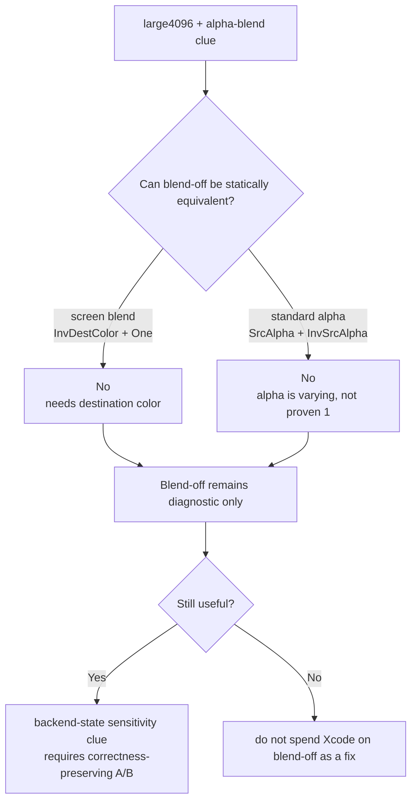
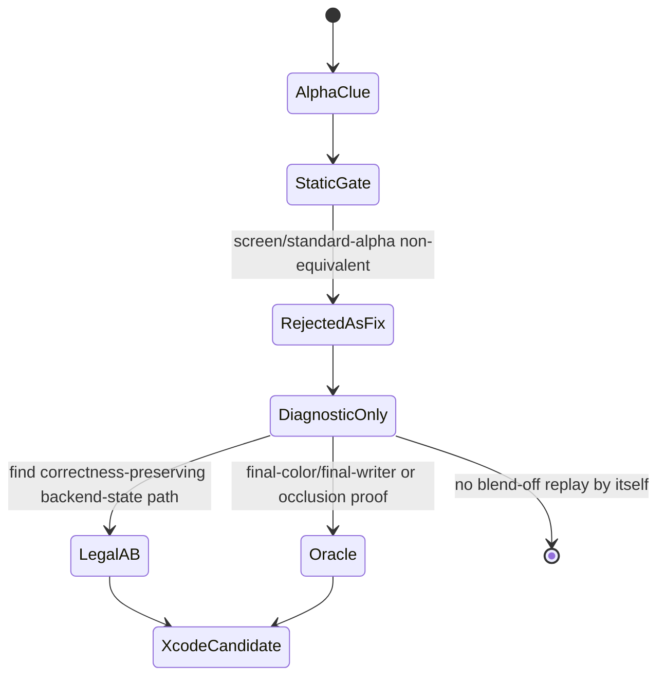

# Large Alpha Blend Static-Equivalence Gate

**Question / hypothesis.** [hidden-backend-storage-shape.09](hidden-backend-storage-shape.09.md) keeps the
correctness-invalid `large4096 + alpha-blend` blend-off result as the strongest
remaining non-reorder state-shape clue. Is there any static evidence that the
same class can legally disable blending, or should blend-off remain diagnostic
only?

**Method.** Added `scripts/tools/analyze_alpha_backend_candidates.py`, then ran
it on the current post-visualfix frame60 indexed proxy with the baseline MSL
shader dump:

```sh
python3 scripts/tools/analyze_alpha_backend_candidates.py \
  experiments/output/app-d3d9-3dmark05-post-visualfix-frame60-index-candidate-proxy-r1/3dmark05-perf-indexed-probe-draws.csv \
  --seq 60 --row 60/2 \
  --msl-dir traces/app-d3d9-3dmark05-post-visualfix-frame60-baseline-r1/analysis/shaders/msl \
  --output traces/app-d3d9-3dmark05-post-visualfix-frame60-index-candidate-proxy-r1/analysis/frame60-alpha-backend-candidates.md \
  --csv-output traces/app-d3d9-3dmark05-post-visualfix-frame60-index-candidate-proxy-r1/analysis/frame60-alpha-backend-candidates.csv
```

The script selects frame60 `60/2` alpha-blended indexed draws at or above
`4096` primitives, groups them by render state, maps PS hashes to dumped MSL,
and rejects blend-off as a fix unless the blend equation is statically
equivalent to replace.

**Result.**

| Group | draws | primitives | PS/VS/PSO/payload | blend | alpha evidence | verdict |
|---|---:|---:|---:|---|---|---|
| `60/2 depth=read blend=screen scissor=on textured=yes` | `5` | `51,587` | `3/3/3/4` | `InvDestColor + One + Add` | `dynamic-expression` | `reject-screen-non-noop` |
| `60/2 depth=read blend=screen scissor=off textured=yes` | `5` | `51,587` | `3/3/3/4` | `InvDestColor + One + Add` | `dynamic-expression` | `reject-screen-non-noop` |
| `60/2 depth=read blend=standard-alpha scissor=off textured=yes` | `5` | `51,587` | `1/2/3/4` | `SrcAlpha + InvSrcAlpha + Add` | `varying-alpha` | `reject-alpha-not-static-one` |

Total selected scope: `15` draws, `154,761` primitives, `464,283` vertices.
The screen-blend shaders write output through a dynamic expression such as
`outColor[0] = (r[0] * r[1] + r[2])`; the standard-alpha shader writes alpha
from a varying (`in.texcoord2.x`). Neither class has a static proof that
blend-disable is color-equivalent.



**Verdict.** Accepted as a gate. The old scoped blend-off result remains a
strong clue that Apple backend storage is state/parameter-shape sensitive for
large alpha indexed primitives, but it is **not** a legal optimization path.
Do not queue another Xcode replay for `--probe-disable-alpha-blend-classes
large4096,alpha-blend` as a fix. The only Xcode-worthy alpha follow-up would
need a new primitive-order-preserving, correctness-preserving backend-state A/B
or an explicit final-color/final-writer proof that turns a selected alpha
ordering change into a semantic-safe locality candidate.



**Related.** [hidden-backend-storage](index.md) ·
[hidden-backend-storage-shape.09](hidden-backend-storage-shape.09.md) ·
[backend-shape-classifiers-alpha.03](../backend-shape-classifiers/backend-shape-classifiers-alpha.03.md) · [index-cache-locality](../index-cache-locality/index.md).
