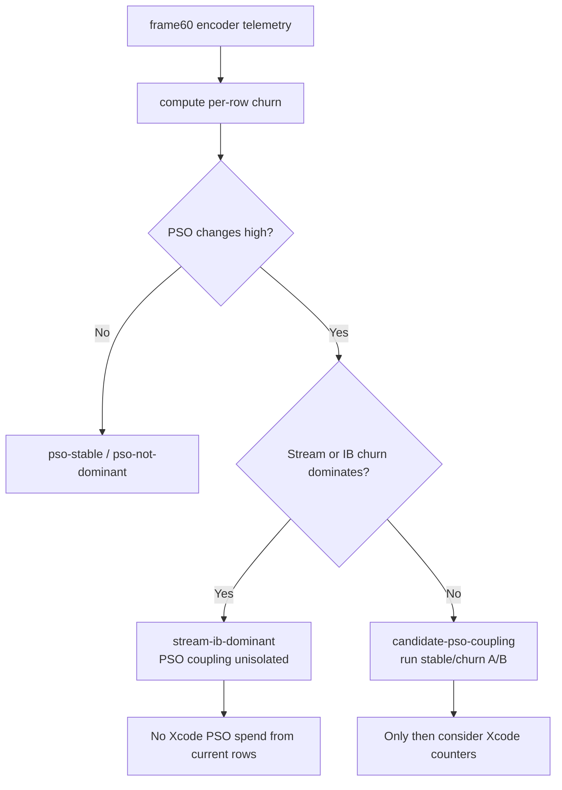
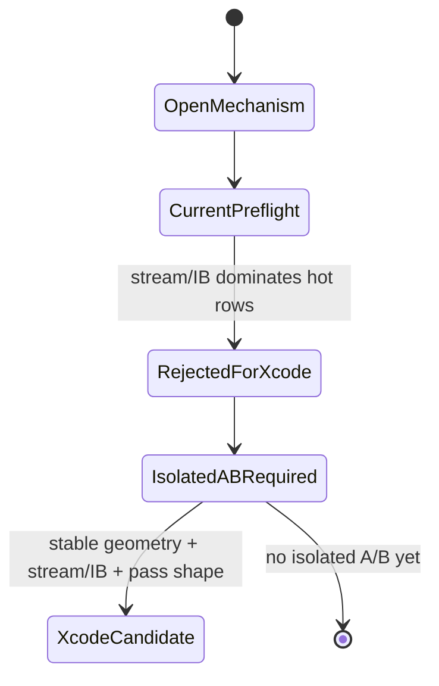

# PSO Backend Churn Preflight

**Question / hypothesis.** [hidden-backend-storage-shape.09](hidden-backend-storage-shape.09.md) keeps
PSO/state-shape spill or layout coupling as one possible below-AIR denominator
mechanism. Does the current frame60 `60/x` encoder telemetry isolate PSO churn
well enough to justify another Xcode `.gputrace` replay, or is the signal still
entangled with stream/IB binding churn and geometry locality?

**Method.** Added `scripts/tools/analyze_pso_backend_churn.py`, then ran it on
the current no-gputrace frame60 encoder telemetry produced by the visibility
scout/cache-join run:

```sh
python3 scripts/tools/analyze_pso_backend_churn.py \
  experiments/output/app-d3d9-3dmark05-visibility-scout-60-2-cachejoin-r1/3dmark05-perf-encoders.csv \
  --output traces/app-d3d9-3dmark05-visibility-scout-60-2-cachejoin-r1/analysis/frame60-pso-backend-churn.md \
  --csv-output traces/app-d3d9-3dmark05-visibility-scout-60-2-cachejoin-r1/analysis/frame60-pso-backend-churn.csv
```

The tool classifies rows as `candidate-pso-coupling` only when PSO changes are
high enough and not dominated by stream or index-buffer handle changes. This is
a cheap spend gate: it does **not** prove that PSO churn cannot affect Apple
backend storage, but it prevents a noisy Xcode run when the current evidence
cannot isolate PSO.

**Result.**

| Row | Verdict | Draws | Triangles | PSO changes | PSO unique | PSO/draw | Stream handle/draw | IB handle/draw | LRU32 delta |
|---|---|---:|---:|---:|---:|---:|---:|---:|---:|
| `60/2` | `stream-ib-dominant` | `187` | `389,376` | `47` | `20` | `0.251` | `1.449` | `0.856` | `-175,168` |
| `60/1` | `stream-ib-dominant` | `156` | `228,725` | `33` | `3` | `0.212` | `0.833` | `0.833` | `-88,059` |
| `60/0` | `stream-ib-dominant` | `42` | `97,294` | `8` | `3` | `0.190` | `0.857` | `0.857` | `-43,792` |
| `60/8` | `pso-not-dominant` | `5` | `26` | `2` | `3` | `0.400` | `0.000` | `0.200` | `0` |

The report's overall verdict is `no-pso-xcode-candidate`: the hot rows have
PSO changes, but stream and IB handle churn dominate the row-local state motion.
`60/2` is the most important example: `47` PSO changes over `187` draws is
non-zero, but the same row has `271` stream handle changes and `160` IB handle
changes, with the largest current LRU32 reduction signal (`-175,168`) still tied
to geometry/index locality rather than isolated PSO churn.



**Verdict.** Accepted as a gate. The current telemetry does **not** justify a
PSO/backend-spill Xcode replay by itself. A future PSO experiment remains valid
only if it constructs an isolated A/B where geometry, VS invocation count,
stream bindings, IB bindings, render pass shape, and visible shader layout are
stable while PSO churn changes. Until that exists, the active backend-storage
frontier should stay on stream/IB churn, index/cache locality, final-color /
final-writer proof for sample-visible locality, or a different below-AIR
denominator mechanism such as position/binning or mesh/object.



**Related.** [hidden-backend-storage](index.md) ·
[hidden-backend-storage-shape.09](hidden-backend-storage-shape.09.md) ·
[mini-replay-bisection-texture.10](../mini-replay-bisection/mini-replay-bisection-texture.10.md) · [state-churn-encode](../state-churn-encode/index.md) ·
[index-cache-locality](../index-cache-locality/index.md).
