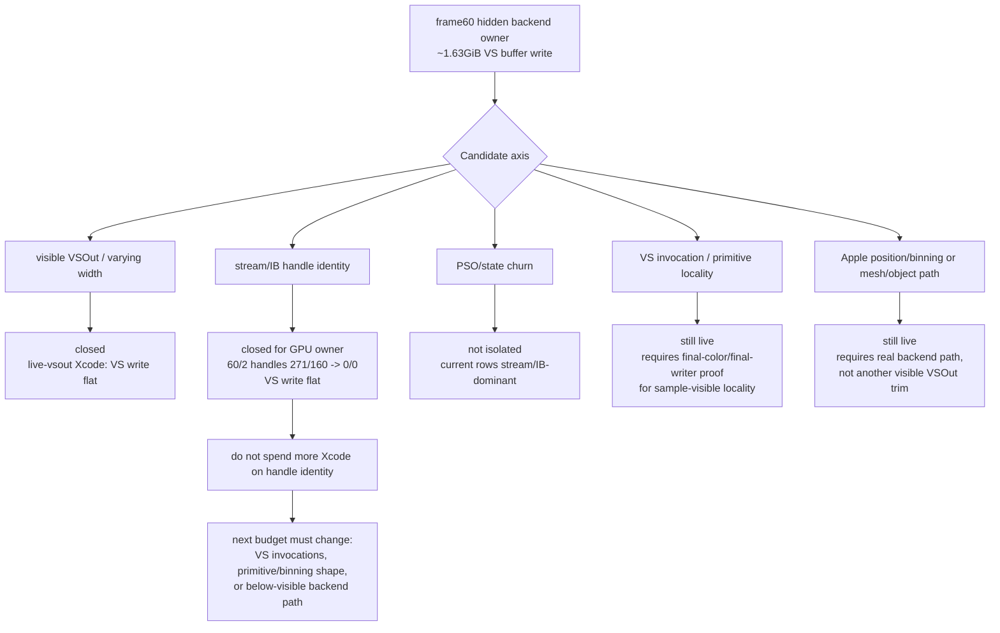
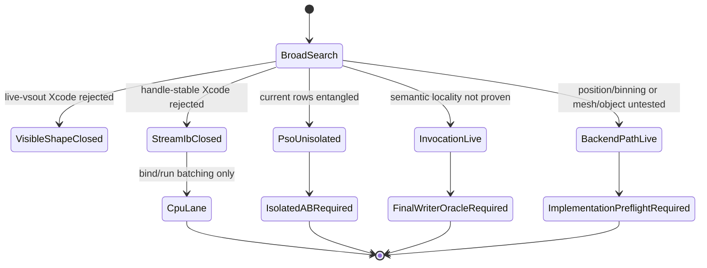

# Post Stream/IB Xcode Gate Triage

**Question / hypothesis.** What does the row-scoped stream/IB handle-stable
Xcode result mean for the hidden-backend-storage investigation, and where
should the next engineering/Xcode budget go?

**Method.** Treat state-churn-encode-stream.09 as the first complete
handle-identity A/B for `60/2`: same draw count, vertex count, triangle count,
VS invocations, PSO shape, argbuf/cbuf bytes, and visible VSOut key, but
stream/IB handle changes reduced to zero. Then reclassify the remaining open
hidden-backend branches from hidden-backend-storage-shape.09 and
hidden-backend-storage-shape.11.

**Result.**

| Branch | Latest evidence | Meaning |
|---|---|---|
| Stream/IB handle identity | `60/2` stream handles `271 -> 0`, IB handles `160 -> 0`, VS invocations unchanged, Xcode VS write `981.159 -> 981.166 MiB`, GPU `19.184 -> 19.278 ms` | Rejected as first-order GPU owner. Keep in CPU/draw-run lane. |
| Visible VSOut width | scoped `60/0` expected VSOut shrank while Xcode VS buffer write stayed flat | Closed as a denominator lever. |
| Current PSO/state churn rows | hot rows have PSO changes but are stream/IB-dominant | Do not replay current rows as PSO evidence. Build an isolated A/B first. |
| Depth-read/sample-visible locality | no-sample scout rows are small; sample-visible windows need final-color/final-writer proof | Still plausible only if the semantic oracle proves correctness. |
| Apple position/binning / mesh-object escape | not tested by visible position-only VSOut | Still plausible, but requires a real pipeline/backend-path experiment. |

**Interpretation.** The stream/IB experiment is valuable because it removes a
large-looking but wrong GPU hypothesis from the critical path. It does not show
that the investigation has reached a hardware/emulation ceiling. It shows that
handle identity and binding alternation are not the hidden Apple
vertex/tiler/parameter-storage denominator. The current low frame rate remains
unexplained by any accepted first-order fix except reducing VS invocations where
semantics allow.

The next Xcode capture should therefore be refused unless the candidate has one
of these preconditions:

1. A final-color/final-writer oracle that makes a sample-visible locality
   reducer correctness-safe.
2. A real Apple position/binning or mesh/object backend escape path that changes
   bytes per VS invocation below visible MSL structure.
3. A deliberately isolated PSO/spill A/B where geometry, stream/IB bindings,
   render pass shape, visible shader layout, and VS invocations stay stable.

**Verdict.** Accepted as the current hidden-backend budget gate. Stream/IB
handle identity is closed as a first-order GPU owner; the active frontier moves
back to VS-invocation reduction with semantic proof, real position/binning
backend experiments, mesh/object escape experiments, or isolated PSO/spill A/B.

**Related.** [hidden-backend-storage](index.md) ·
hidden-backend-storage-shape.09 · hidden-backend-storage-shape.11 ·
state-churn-encode-stream.08 · state-churn-encode-stream.09 ·
[mini-replay-bisection](../mini-replay-bisection/index.md) · [index-cache-locality](../index-cache-locality/index.md).
