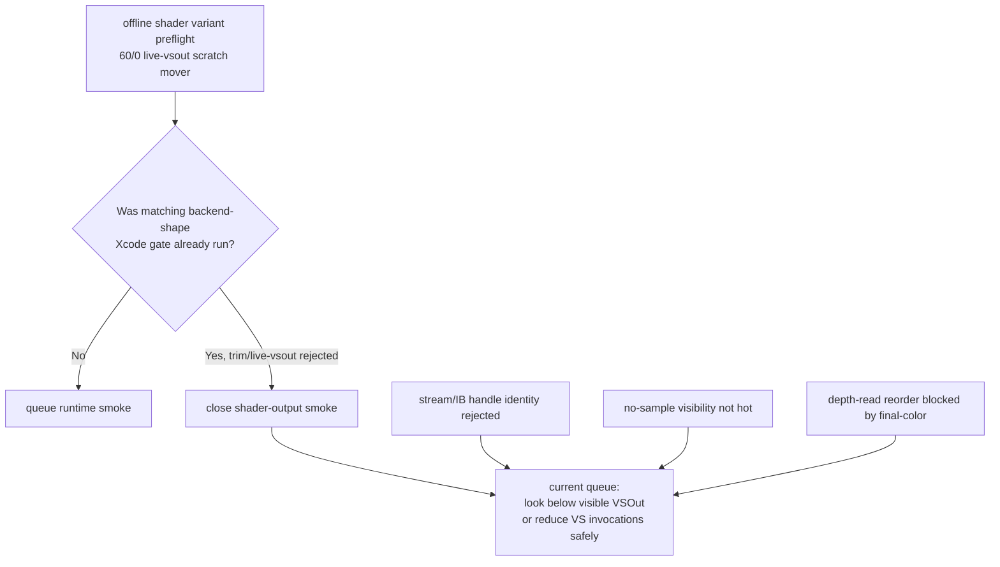
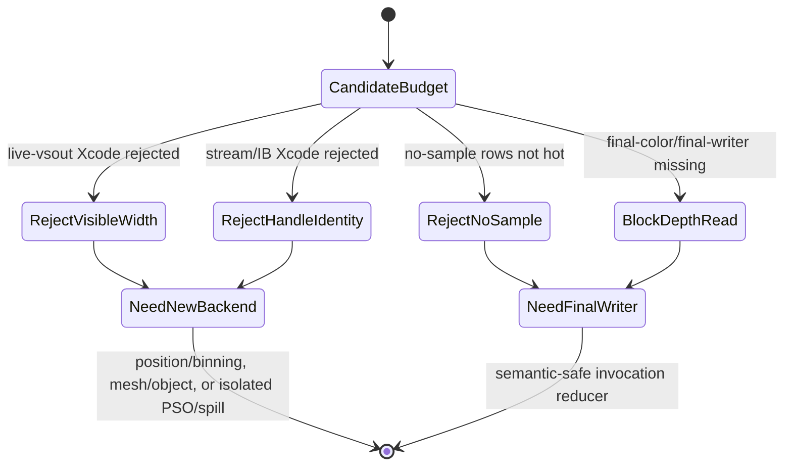

# Current Perf Gate Refresh After Stream/IB

**Question / hypothesis.** After stream/IB handle identity and scoped
`live-vsout` both fail their Xcode gates, what should the current automated perf
gate queue say?

**Method.**

1. Updated `summarize_3dmark05_perf_gates.py` so the backend-shape rejection
   evidence names the rejected run. If the rejected backend-shape run is a
   `trim-varyings` / `live-vsout` family member, the implementation queue now
   closes the stale offline shader-variant smoke instead of re-queuing it.
2. Added a regression test that feeds a `trim-varyings-live-vsout` Xcode reject
   plus a scratch-moving shader preflight and expects
   `shader-variant-backend-smoke=closed-by-xcode-gate`.
3. Rebuilt the current frame60 gate report with the scoped `60/0 live-vsout`
   Xcode delta, semantic payload summary, primitive selector summary,
   visibility scout cache join, and state-class proxies.

**Result.**

The refreshed gate report now says:

| Gate / track | Verdict | Evidence |
|---|---|---|
| Non-reorder backend-shape | `reject` | `frame60-trim-varyings-60-0-scoped-xcode-r1` GPU `+1.02%`, VS B/inv `+0.00%` |
| VS-write attribution | `backend-rejected` | bytes/inv effect only `0.038 MiB`, gate `reject` |
| Visibility no-sample hotpath | `reject-hotpath` | zero rows are `25/187`, `1.89%` primitives, `1.10%` of abs LRU32 gain |
| Shader-variant backend smoke | `closed-by-xcode-gate` | old offline `60/0 live-vsout` smoke is closed by the Xcode rejection |
| Overall | `semantic-safe-locality-only` | use final-color/final-writer proof or a non-reorder backend mechanism |

The semantic final-color queue is unchanged and still explains why depth-read
reorder cannot move to production:

| Bucket | LRU32 delta | Meaning |
|---|---:|---|
| `visible-fail` | `-14593` | correctness blocker |
| `visible-exact-pass` | `-2452` | possible selector value only |
| `no-final-color-exact-pass` | `-5937` | needs runtime proof; current D3D9 query is primitive-count only |
| `sparse-exact-pass` | `-724` | positive control only |

**Interpretation.** This refresh closes an important stale loop in the
automation. The old shader-variant preflight was useful before the scoped
Xcode run; after [hidden-backend-storage-shape.08](hidden-backend-storage-shape.08.md), re-queuing it would spend
time on a family already proven flat. With stream/IB handle identity also
closed in [state-churn-encode-stream.09](../state-churn-encode/state-churn-encode-stream.09.md), the current objective is no longer
"try another visible-output or bind-identity variant." The next useful work must
either:

1. prove a semantic-safe invocation reducer with final-color/final-writer
   evidence; or
2. build a genuinely new below-visible-backend experiment such as
   position/binning, mesh/object, or isolated PSO/spill.

**Verdict.** Accepted as the current automated budget gate. The next experiment
queue is intentionally narrower: no more visible `VSOut`/`live-vsout` or
stream/IB handle-identity Xcode spends without a new mechanism.

**Related.** [hidden-backend-storage](index.md) ·
[hidden-backend-storage-shape.08](hidden-backend-storage-shape.08.md) · [hidden-backend-storage-shape.12](hidden-backend-storage-shape.12.md) ·
[state-churn-encode-stream.09](../state-churn-encode/state-churn-encode-stream.09.md) · [mini-replay-bisection-texture.10](../mini-replay-bisection/mini-replay-bisection-texture.10.md).
