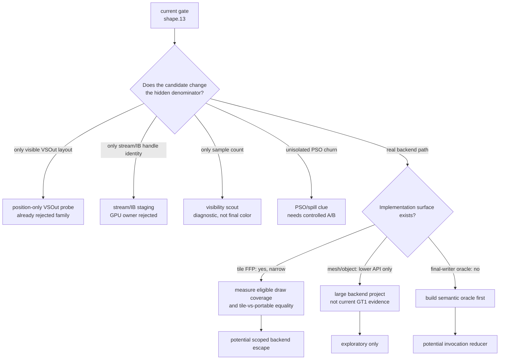
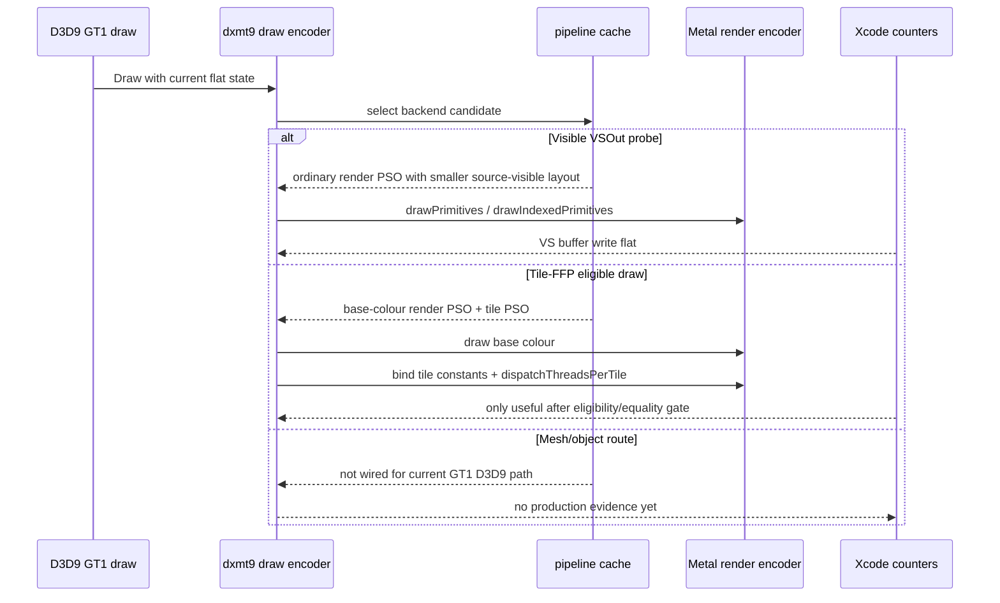

# Backend Escape Feasibility After Current Gate

**Question / hypothesis.** After visible `VSOut` width, stream/IB handle
identity, no-sample visibility, and unisolated PSO churn all fail as first-order
GPU-owner proofs, what does the remaining experiment set mean for the actual
GT1 objective?

**Method.** Audited the current implementation surfaces for the remaining
below-visible-backend candidates:

- `DXMT9_PROBE_POSITION_ONLY_VSOUT` in `dxmt9_shader_sources.cpp`.
- `DXMT9_TILE_FFP` selector, tile/base PSO build, and draw-encoder tile
  post-pass in `dxmt9_pipeline_cache.cpp` and `dxmt9_draw_encoder.mm`.
- winemetal mesh/object/tile command surface in `winemetal.h`, `Metal.hpp`,
  and `winemetal_private_api.mm`.
- Metal visibility scout plumbing in `dxmt9_draw_encoder.mm`.

**Result.**

| Candidate | Current implementation status | What it proves | What it does not prove |
|---|---|---|---|
| Position-only `VSOut` | Existing env probe rewrites the source-visible output layout to position-only | It is a useful correctness-invalid lower-bound diagnostic for visible stage-out fields | It does not create a separate Apple position/binning/depth path, and the visible-width family has already stayed flat in Xcode |
| Tile-FFP | Selector, tile PSO, base-colour PSO, tile-stage constant bind, and per-draw tile post-pass exist; default remains `off` | It is the most concrete existing backend escape surface, but only for eligible untextured FFP draws | It cannot explain or fix arbitrary textured / programmable GT1 hot rows without first measuring eligible coverage and equality |
| Metal 3 mesh/object | winemetal exposes mesh/object buffers, mesh PSO descriptors, and mesh draw replay commands | The lower Metal bridge can express mesh/object commands | The D3D9 GT1 draw path is not currently routed through this backend; using it would be a high-risk architecture project, not a cheap perf experiment |
| Visibility scout | Per-draw Metal visibility counts can be toggled and exported after command-buffer completion | It can reject no-sample rows or rank sample visibility | Positive samples are not final-color ownership, so this is not the missing final-writer oracle |
| PSO/backend spill | Current rows have state/PSO motion, but stream/IB dominated the preflight | A backend-spill mechanism remains plausible in principle | Current data does not isolate it; another Xcode spend needs geometry, stream/IB, visible shader, and invocation count held stable |

**Interpretation.** The current experiments are not an optimization ceiling;
they are a budget filter. They have removed several attractive but wrong
explanations: visible varying width, handle identity, no-sample rows, and
uncontrolled state churn. The remaining meaningful work must either reduce the
numerator (`VS invocations`) with a semantic proof, or change a real backend
path whose output is not just a source-visible `VSOut` layout.

Tile-FFP is the nearest implemented backend escape, but it is narrow by design:
`selectTileFfpForPass()` rejects non-FFP, textured, vertex-blended,
precision-unsafe, and A2C-incompatible draws. Therefore the next cheap Tile-FFP
step is not another full Xcode replay; it is an eligibility/routing counter
gate that tells whether frame60 hot encoders contain enough eligible work to
matter. If coverage is low, Tile-FFP is a correctness/architecture lever, not a
GT1 FPS lever.

Mesh/object shaders are the opposite: the winemetal API surface exists, but the
GT1 D3D9 path does not currently route through it. This remains a valid research
idea for Apple backend storage, but it is too large to treat as the next
bounded experiment unless we first define a reduced replay or synthetic draw
that can compare vertex vs mesh backend counters.

**Verdict.** Accepted as the current backend-escape triage gate. The next work
should be one of:

1. a no-gputrace Tile-FFP eligibility/routing summary for frame60 hot rows;
2. a final-color/final-writer proof for semantic-safe invocation reduction; or
3. a deliberately isolated PSO/spill or mesh/object A/B on a reduced workload.

Another visible `VSOut`, stream/IB identity, no-sample visibility, or
uncontrolled PSO/state Xcode capture would not move the objective.

**Related.** [hidden-backend-storage](index.md) · hidden-backend-storage-shape.13 ·
state-churn-encode-stream.09 · mini-replay-bisection-texture.10 ·
[overview-3dmark05-gt1](../overview-3dmark05-gt1.md).
