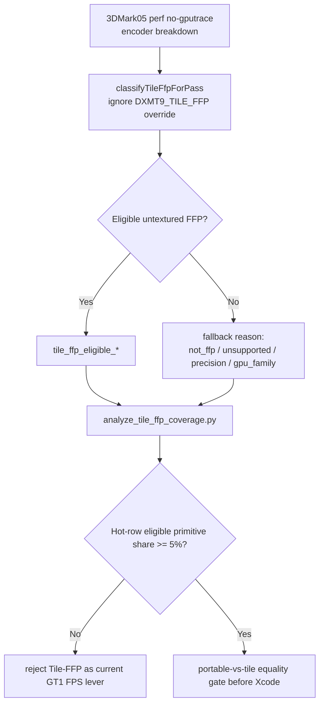
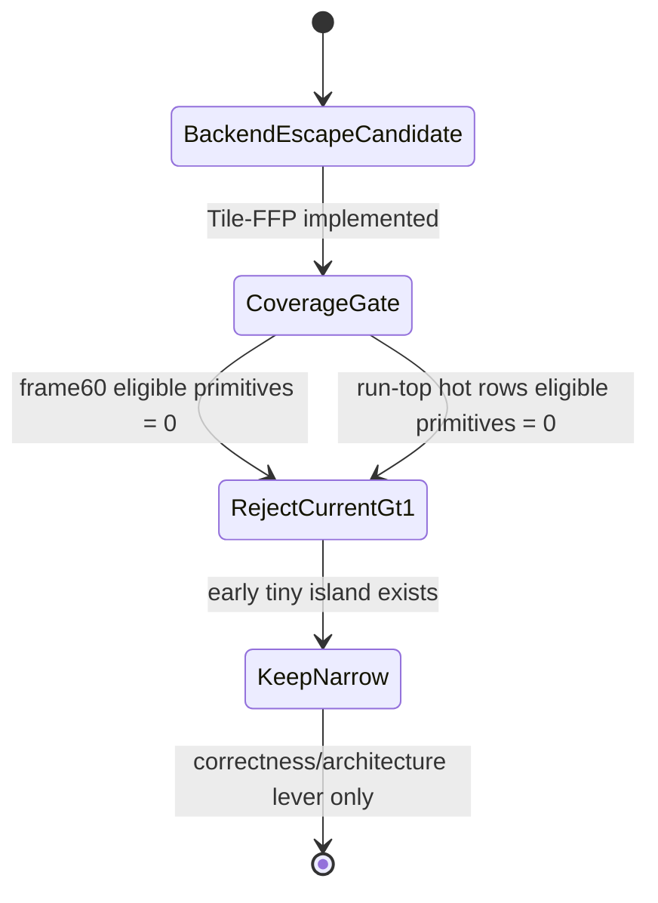

# Tile-FFP Coverage Gate

**Question / hypothesis.** Does the implemented but default-off Tile-FFP path
cover enough 3DMark05 GT1 hot-row work to be a plausible FPS lever before
another Xcode/gputrace spend?

**Method.**

1. Split Tile-FFP routing from hypothetical eligibility:
   `selectTileFfpForPass()` still honors `DXMT9_TILE_FFP=off|auto|force`, while
   `classifyTileFfpForPass()` ignores the override and reports whether the draw
   would be eligible.
2. Added per-encoder breakdown counters for actual route and hypothetical
   eligibility:
   `tile_ffp_routed_*`, `tile_ffp_eligible_*`, and fallback reason buckets.
3. Ran a no-gputrace perf probe with timeout:
   `app-d3d9-3dmark05-tile-ffp-coverage-r1`.
4. Summarized frame60 and run-top primitive rows with
   `analyze_tile_ffp_coverage.py`.

The run timed out after the wrapper's bounded `180s + 45s` window and wrote
partial-log artifacts. This is acceptable for the no-gputrace coverage gate
because encoder breakdown rows were emitted and parsed.

**Result.**

Frame60 hot rows have zero hypothetical Tile-FFP coverage:

| Row | Draws | Primitives | Eligible primitives | Eligible share | Main fallback |
|---|---:|---:|---:|---:|---|
| `60/0` | `42` | `97,294` | `0` | `0.000%` | unsupported state / textured FFP-style path |
| `60/1` | `156` | `228,725` | `0` | `0.000%` | not FFP |
| `60/2` | `187` | `389,376` | `0` | `0.000%` | not FFP |

The full partial run shows only a tiny early eligible island:

| Scope | Rows | Draws | Eligible draws | Primitives | Eligible primitives | Eligible share |
|---|---:|---:|---:|---:|---:|---:|
| `seq=60` | `9` | `395` | `0` | `715,431` | `0` | `0.000%` |
| partial run | `20,121` | `1,255,152` | `43` | `1,900,371,413` | `98,469` | `0.005%` |

The run-top primitive rows are also all no-coverage rows: the largest rows are
programmable/not-FFP rows such as `440/4`, `441/4`, and `442/4`
(`893,018` primitives each, `0` eligible).

**Interpretation.** Tile-FFP remains useful as a narrow correctness and backend
architecture experiment, but it is not a current GT1 FPS lever. The hot rows
that own the hidden backend storage are programmable or texture/state-ineligible
for the current tile kernel. A Tile-FFP Xcode capture would therefore spend
budget away from the measured GT1 limiter.

**Verdict.** Rejected as a current 3DMark05 GT1 hot-row backend escape. Do not
schedule Tile-FFP Xcode/gputrace work for GT1 performance unless a future
implementation expands eligibility to the programmable/textured hot rows or a
new run shows material hot-row eligible primitive share.

**Next.** The remaining backend work goes back to:

1. final-color/final-writer proof for semantic-safe invocation reduction;
2. a real Apple position/binning or mesh/object A/B on a reduced workload; or
3. a deliberately isolated PSO/spill A/B.

**Related.** [hidden-backend-storage](index.md) ·
[hidden-backend-storage-shape.14](hidden-backend-storage-shape.14.md) · [overview-3dmark05-gt1](../overview-3dmark05-gt1.md).
