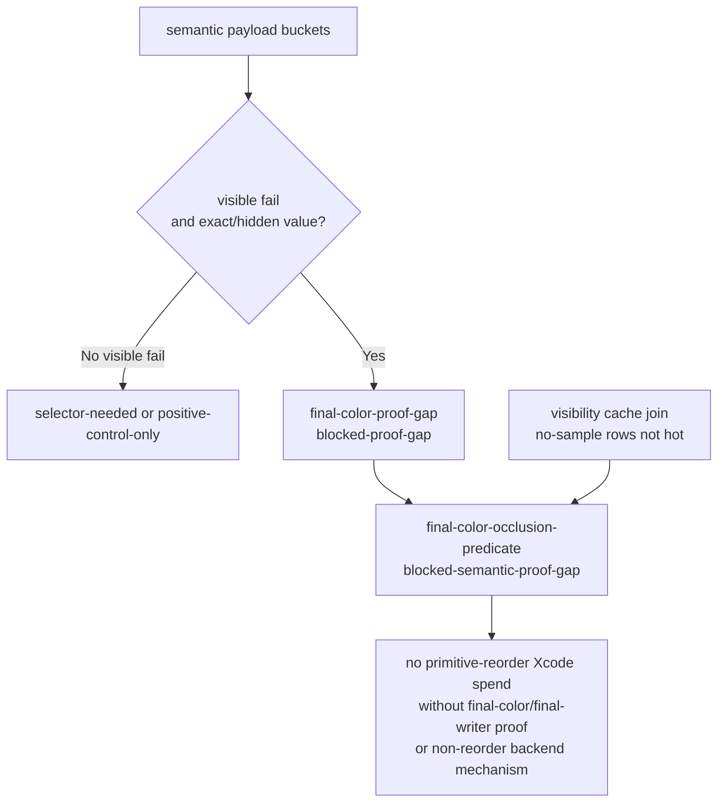
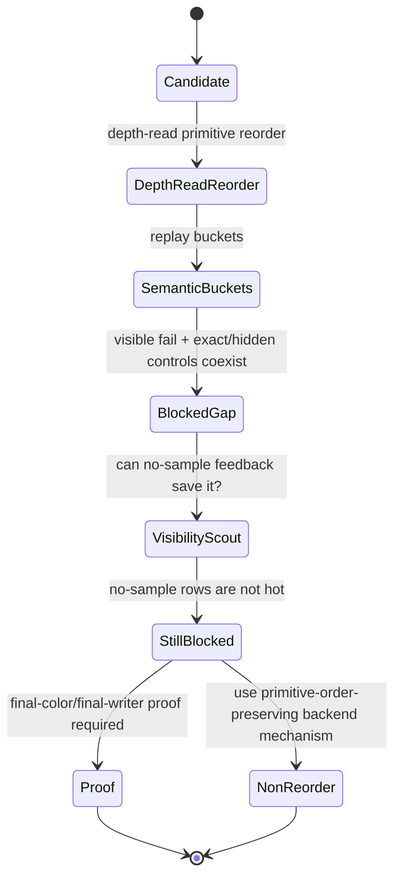

# Final-Color Proof Gap Is Now an Automated Gate

**Question / hypothesis.** After Tile-FFP coverage rejects the nearest
implemented backend escape for current GT1 hot rows, can the current perf gate
still lose the semantic reason why sample-visible depth-read primitive reorder
must not receive another Xcode run?

**Method.**

1. Added `final_color_proof_gap_gate()` to
   `summarize_3dmark05_perf_gates.py`.
2. The gate reads the semantic candidate buckets directly. It does not require
   a separate semantic selector sweep CSV.
3. If visible failures and exact/hidden positive controls coexist, it emits
   `final-color-proof-gap=blocked-proof-gap` and adds a
   `final-color-occlusion-predicate=blocked-semantic-proof-gap` implementation
   track unless a stronger selector gate is already attached.
4. Rebuilt the post-stream/IB frame60 gate report.

**Result.** The regenerated gate now carries the semantic proof gap even without
an attached selector-sweep CSV:

| Gate | Verdict | Evidence |
|---|---|---|
| `broad-depth-read-reorder` | `reject` | visible-fail LRU32 `-14593`; exact visible `-2452`; sparse/no-final-color `-6661` |
| `final-color-proof-gap` | `blocked-proof-gap` | visible-fail LRU32 `-14593`; visible exact `-2452`; sparse/no-final-color `-6661` |
| `visibility-no-sample-hotpath` | `reject-hotpath` | zero rows are `25/187`, `1.89%` of primitives, and `1.10%` of absolute LRU32 gain |
| `overall` | `semantic-safe-locality-only` | final-color proof remains blocked; no-sample rows are not the hotpath |

The implementation queue now includes:

| Track | Status | Next action |
|---|---|---|
| `final-color-occlusion-predicate` | `blocked-semantic-proof-gap` | do not schedule another primitive-reorder Xcode run from this queue; add final-color/final-writer proof or use a non-reorder backend mechanism |
| `non-reorder-backend-mechanism` | `needs-new-mechanism` | require a stronger bytes/invocation preflight before another non-reorder backend gputrace |
| `shader-variant-backend-smoke` | `closed-by-xcode-gate` | do not queue another shader-output runtime smoke for this family |

**Verdict.** Accepted as a gate/tooling improvement. This does not discover a
new FPS lever; it prevents the current evidence from being weakened when the
selector sweep artifact is absent. The meaning for the ongoing bottleneck work
is direct: sample-visible depth-read reorder remains blocked, so the next
meaningful GPU work is either a real final-color/final-writer oracle or a new
primitive-order-preserving backend mechanism.

**Related.** [[hidden-backend-storage-shape.13]] ·
[[hidden-backend-storage-shape.15]] · [[mini-replay-bisection-texture.10]] ·
[[overview-3dmark05-gt1]].
