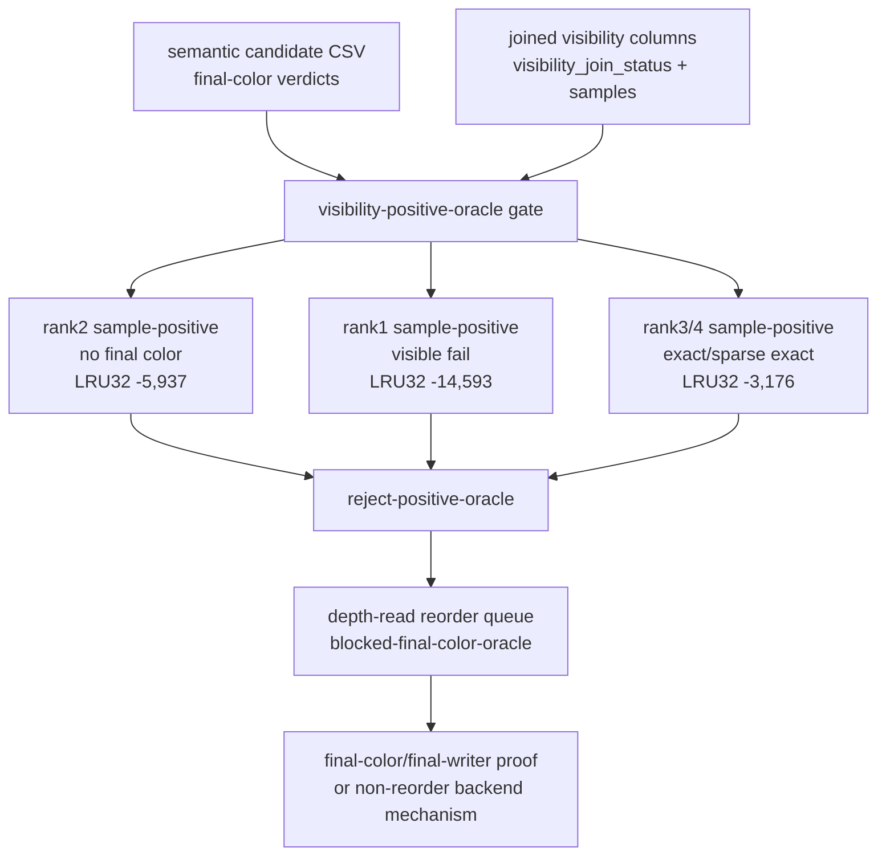
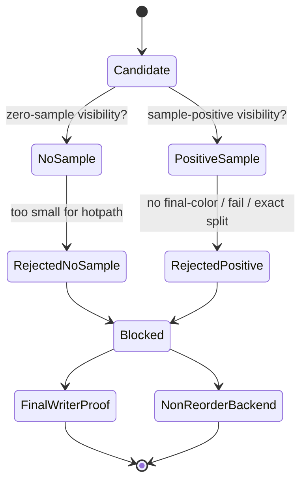

# Visibility Positive Is Now an Automated Gate

**Question / hypothesis.** After the semantic visibility join rejects positive
Metal visibility as a final-color oracle, can the perf gate keep that result
attached to the next experiment queue automatically?

**Method.**

1. Add `visibility_positive_oracle_gate()` to
   `summarize_3dmark05_perf_gates.py`.
2. Enable it only when the semantic candidate CSV contains joined visibility
   columns from `summarize_semantic_payload_candidates.py --visibility-csv`.
3. Reject positive visibility as a production selector when sample-positive rows
   include no-final-color work, sample-positive failure, or a fail/exact split.
4. Regenerate the post-stream/IB frame60 full gate with the visibility-joined
   semantic payload CSV, keeping the opaque proof and VS-delta attribution
   inputs attached.

**Result.**

| Gate | Verdict | Evidence |
|---|---|---|
| `visibility-positive-oracle` | `reject-positive-oracle` | `4` sample-positive semantic rows, `58,014` samples; no-final-color LRU32 `-5,937`; exact LRU32 `-3,176`; fail LRU32 `-14,593` |
| `visibility-no-sample-hotpath` | `reject-hotpath` | zero rows are `25/187`, `1.89%` of primitives, and `1.10%` of absolute LRU32 gain |
| `overall` | `semantic-safe-locality-only` | positive Metal visibility is not final-color proof; use final-color/final-writer proof or a non-reorder backend mechanism |

The queue entries for `60/2 depth-read` and `60/2 standard-alpha` now stay
`blocked-final-color-oracle` with the explicit action: positive Metal visibility
is not enough; the current backend-shape family is rejected, so define a new
non-reorder mechanism before Xcode.
The same full gate keeps the accepted opaque-depth path (`production-locality =
keep`) and the live-VSOut family remains closed at the implementation-track
level (`shader-variant-backend-smoke = closed-by-xcode-gate`).

**Verdict.** Accepted as a gate/tooling improvement. This does not add a new FPS
lever; it removes a false-positive selector from the automated budget path. The
current visibility evidence now blocks both visibility shortcuts:

- no-sample rows are not the hot locality owner; and
- positive samples are not final-color/final-writer proof.

The remaining aligned work is a real final-color/final-writer predicate or a
new primitive-order-preserving backend-denominator mechanism.

**Related.** [[mini-replay-bisection-texture.11]] ·
[[hidden-backend-storage-shape.16]] · [[hidden-backend-storage-shape.15]] ·
[[overview-3dmark05-gt1]].
