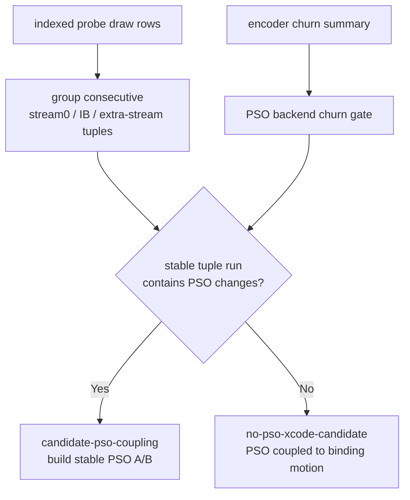
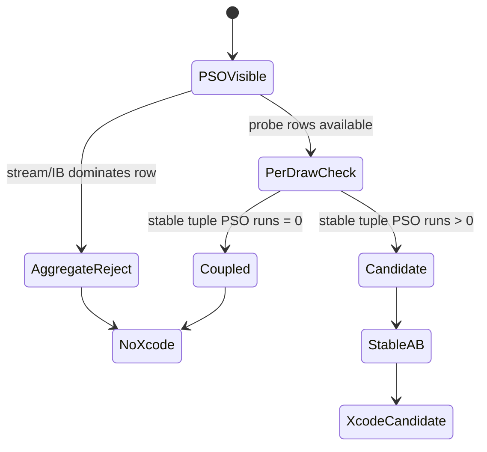

# Per-draw PSO Isolation Gate

**Question / hypothesis.** After stream/IB handle identity was rejected as the
first-order GPU owner, is there still a current `frame60` PSO/backend-spill
signal hidden inside the hot rows, or are the observed PSO changes still coupled
to draw-local binding tuple motion?

**Method.** Extended `scripts/tools/analyze_pso_backend_churn.py` so the
encoder-level preflight optionally joins the same-run
`3dmark05-perf-indexed-probe-draws.csv`. The new join counts draw-local PSO,
shader-variant, stream0, IB, and extra-stream changes, then scans consecutive
stream/IB-handle-stable runs. A row is not a PSO Xcode candidate unless a stable
handle tuple run still contains PSO changes.

```sh
python3 scripts/tools/analyze_pso_backend_churn.py \
  experiments/output/app-d3d9-3dmark05-post-streamib-frame60-opaque-proof-r1/3dmark05-perf-encoders.csv \
  --row 60/0 --row 60/1 --row 60/2 --row 60/8 \
  --output traces/app-d3d9-3dmark05-post-streamib-frame60-gate-r1/analysis/frame60-pso-backend-churn-perdraw.md \
  --csv-output traces/app-d3d9-3dmark05-post-streamib-frame60-gate-r1/analysis/frame60-pso-backend-churn-perdraw.csv
```



**Result.**

| Row | Verdict | Draws | PSO changes | Shader changes | Handle tuple changes | Unique tuples | Max tuple run | PSO-isolated runs |
|---|---|---:|---:|---:|---:|---:|---:|---:|
| `60/2` | `stream-ib-dominant` | `187` | `47` | `78` | `160` | `58` | `6` | `0` |
| `60/1` | `stream-ib-dominant` | `156` | `33` | `39` | `136` | `92` | `5` | `0` |
| `60/0` | `stream-ib-dominant` | `42` | `8` | `13` | `36` | `25` | `6` | `0` |
| `60/8` | `pso-not-dominant` | `5` | `2` | `2` | `1` | `2` | `3` | `0` |

The top three hot rows all have PSO changes, but none has a stream/IB-handle
stable draw run where PSO changes independently. `60/2` is the important case:
the row has `47` PSO changes, but the draw-local handle tuple also changes
`160` times, and the longest stable tuple run is only `6` draws with no PSO
change inside it.



**Verdict.** Rejected for the current GT1 hot rows. This does not prove PSO or
backend spill can never matter on Apple GPUs; it proves the present telemetry
does not isolate PSO as an independent backend denominator. Another PSO Xcode
replay should wait until a synthetic or row-local A/B holds geometry,
stream0/IB/extra-stream handles, render-pass shape, visible shader layout, and
VS invocations stable while changing only PSO/backend state.

The practical meaning for the active 3DMark05 target is that the current
non-reorder PSO path is not the missing 30fps lever. The remaining meaningful
budget stays on final-color/final-writer proof for semantic locality, or a new
primitive-order-preserving backend mechanism that changes the Apple
position/binning/parameter-storage denominator.

**Related.** [hidden-backend-storage](index.md) ·
[hidden-backend-storage-shape.11](hidden-backend-storage-shape.11.md) · [hidden-backend-storage-shape.12](hidden-backend-storage-shape.12.md) ·
[state-churn-encode-stream.09](../state-churn-encode/state-churn-encode-stream.09.md) · [overview-3dmark05-gt1](../overview-3dmark05-gt1.md).
