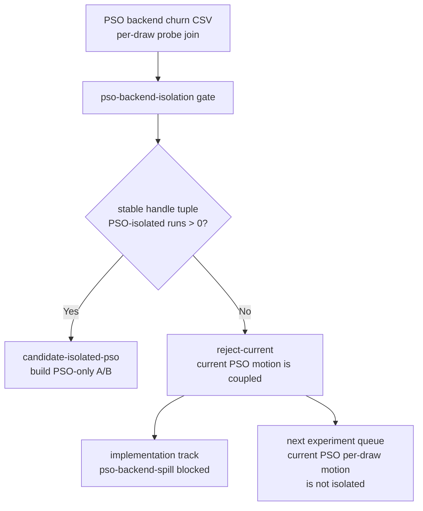
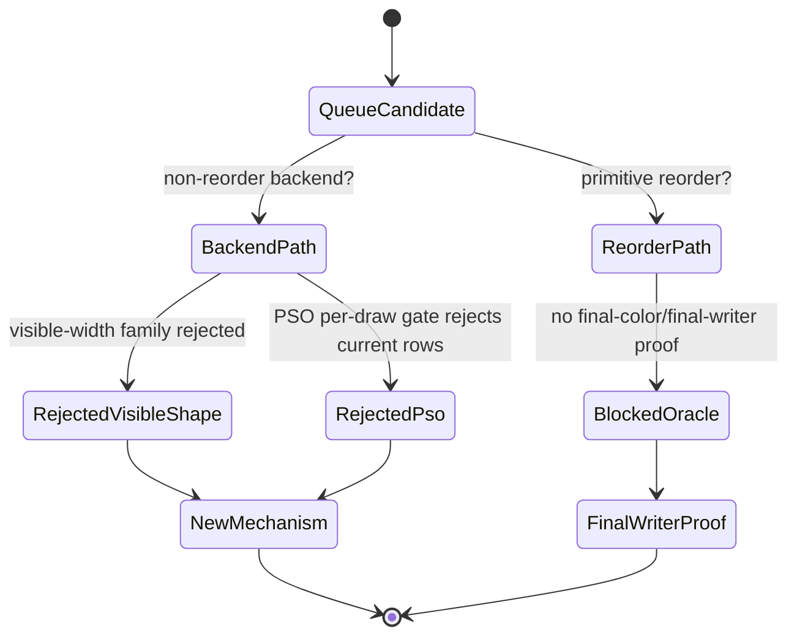

# PSO Isolation Is Now an Automated Gate

**Question / hypothesis.** After [[hidden-backend-storage-shape.18]] rejects
current per-draw PSO motion as an isolated backend-spill signal, can the current
perf gate keep that result attached to the next experiment queue automatically?

**Method.**

1. Add `--pso-backend-churn-csv` to
   `scripts/tools/summarize_3dmark05_perf_gates.py`.
2. Read the per-draw output from `analyze_pso_backend_churn.py`.
3. Emit `pso-backend-isolation=reject-current` when PSO changes exist but no
   stream/IB-handle-stable run contains independent PSO changes.
4. Add an implementation-track row so PSO/backend-spill guesses do not silently
   re-enter the Xcode queue.

**Result.**

| Gate | Verdict | Evidence |
|---|---|---|
| `pso-backend-isolation` | `reject-current` | `4` PSO-moving rows, PSO changes `90`, handle tuple changes `333`, max stable tuple run `6`, PSO-isolated runs `0`; top `60/2`: PSO `47`, tuple `160` |
| `pso-backend-spill` | `blocked-current-telemetry` | same gate evidence, surfaced in the implementation-track queue |
| `overall` | `semantic-safe-locality-only` | PSO gate joins the existing backend-shape reject, visibility-positive reject, and final-color proof gap |

The next experiment queue now carries the PSO result alongside the semantic
blockers. The hot `60/2` depth-read and standard-alpha rows remain
`blocked-final-color-oracle`, and their action now says that the current
backend-shape family is rejected **and** current PSO per-draw motion is not
isolated.

**Verdict.** Accepted as a gate/tooling improvement. This does not remove PSO
or backend spill from the Apple GPU model; it prevents the current, coupled
3DMark05 rows from being treated as a measured PSO/backend-spill candidate. A
future PSO experiment must first construct a stable A/B where geometry,
stream/IB/extra-stream bindings, render-pass shape, visible shader layout, and
VS invocation count stay fixed while PSO/backend state changes.

**Related.** [[hidden-backend-storage]] ·
[[hidden-backend-storage-shape.18]] · [[hidden-backend-storage-shape.17]] ·
[[hidden-backend-storage-shape.12]] · [[overview-3dmark05-gt1]].
