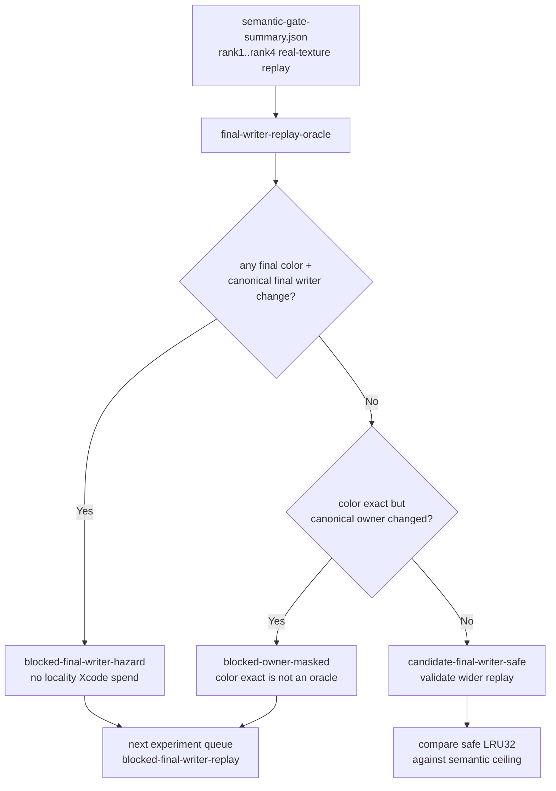
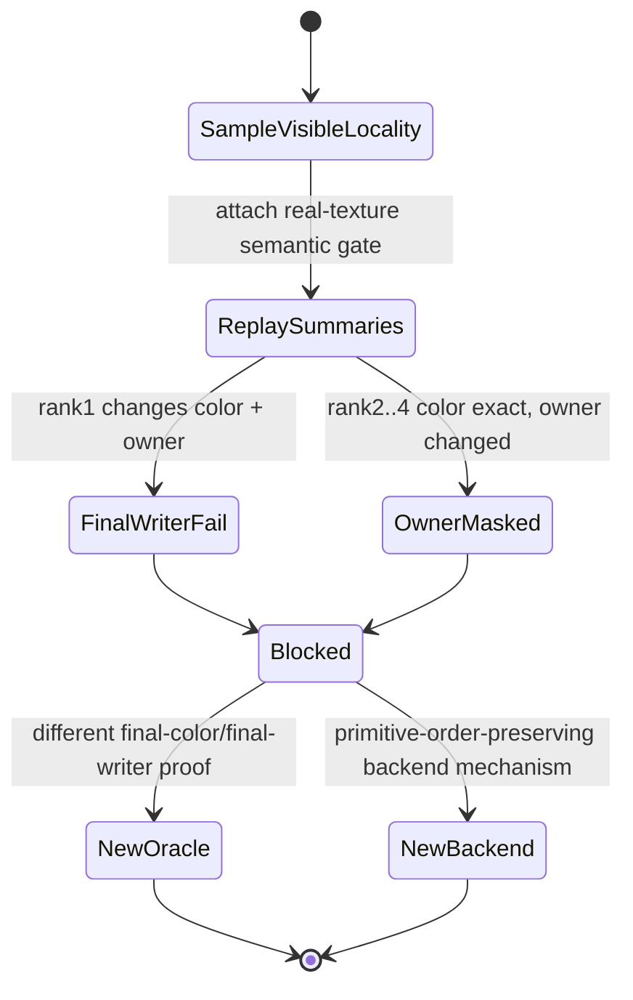

# Final-Writer Replay Oracle Is Now an Automated Gate

**Question / hypothesis.** [[index-cache-locality-screenblend.10]] says the
only remaining large locality bucket is sample-visible and needs a
final-color/final-writer oracle before another Xcode capture. Can the current
real-texture mini-replay summaries be attached to the full perf gate so that
sample-visible locality is blocked by measured final-writer evidence, not just
by a generic "oracle required" note?

**Method.**

1. Add `--semantic-replay-summary-json` to
   `scripts/tools/summarize_3dmark05_perf_gates.py`.
2. Accept multiple `run_3dmark05_semantic_replay_gate.py`
   `semantic-gate-summary.json` files.
3. Sum their LRU32 movement by replay verdict:
   `fail-final-writer-hazard`, `masked-final-writer-hazard`, and
   owner-safe exact pass.
4. Emit `final-writer-replay-oracle` and propagate it into the implementation
   track and next-experiment queue.

**Result.**

| Gate | Verdict | Evidence |
|---|---|---|
| `final-writer-replay-oracle` | `blocked-final-writer-hazard` | `4` replay summaries; fail LRU32 `-14,593`, color pixels `2`, owner pixels `7`, color+owner pixels `2`; masked LRU32 `-9,113`, owner pixels `878`; owner-safe LRU32 `0` |
| `overall` | `semantic-safe-locality-only` | keeps accepted opaque-depth locality, but the current same-input real-texture replay does not prove final-writer safety |
| depth-read proxy rows | `blocked-final-writer-replay` | the queue now says the current same-input real-texture replay reports `blocked-final-writer-hazard` and the current backend-shape/PSO candidates are rejected |

**Verdict.** Accepted as a gate/tooling improvement. The current rank1..rank4
real-texture replay set does not provide the oracle needed to spend another
locality Xcode capture. It proves the opposite: the only large sample-visible
movement includes a true final-writer hazard, and the color-exact rows are
owner-masked rather than owner-safe. The next locality experiment must provide
a different final-color/final-writer oracle with enough safe LRU32 movement, or
the next GPU experiment should switch to a non-reorder backend denominator
mechanism.

**Related.** [[hidden-backend-storage]] ·
[[index-cache-locality-screenblend.10]] ·
[[mini-replay-bisection-texture.02]] ·
[[mini-replay-bisection-texture.04]] ·
[[mini-replay-bisection-texture.05]] ·
[[mini-replay-bisection-texture.06]] ·
[[hidden-backend-storage-shape.19]] · [[overview-3dmark05-gt1]].
