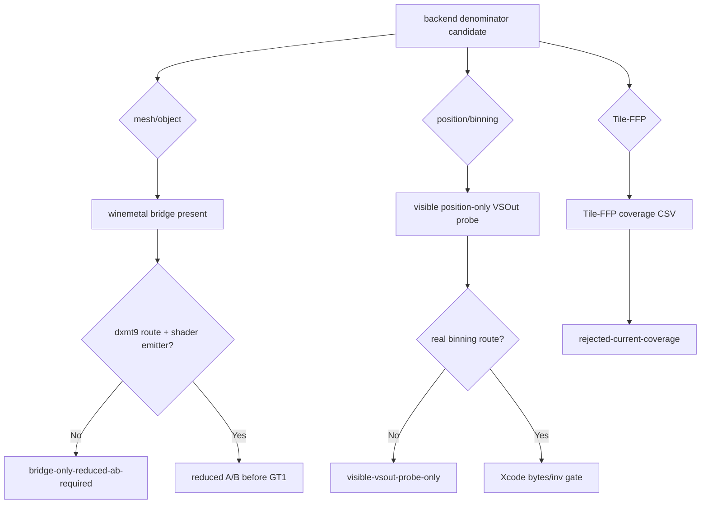
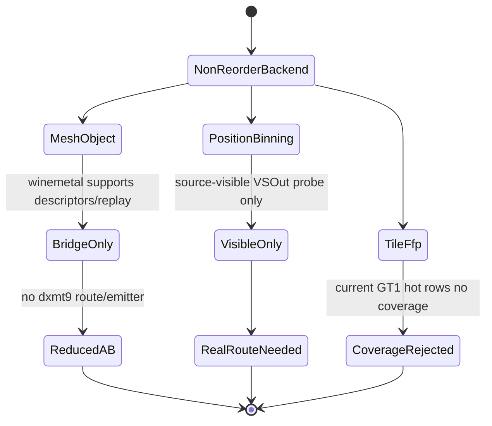

# Backend Escape Surface Audit

**Question / hypothesis.** After current sample-visible locality is blocked by
the final-writer replay gate ([hidden-backend-storage-shape.20](hidden-backend-storage-shape.20.md)), is any
remaining primitive-order-preserving backend escape ready for a GT1 Xcode
capture?

**Method.**

1. Add `audit_backend_escape_surface.py`.
2. Audit winemetal bridge symbols separately from dxmt9 route/shader-emitter
   symbols.
3. Attach the existing frame60 Tile-FFP coverage CSV.
4. Emit a CSV/Markdown gate before scheduling another backend-denominator
   `.gputrace`.

**Result.**

| Candidate | Bridge surface | dxmt9 route | Shader emitter | Evidence | Verdict |
|---|---|---|---|---|---|
| mesh/object | present | missing | missing | none | `bridge-only-reduced-ab-required` |
| position/binning | ordinary render | missing | visible `VSOut` probe | visible-width Xcode rejected | `visible-vsout-probe-only` |
| Tile-FFP | present | present | present | `9` frame60 rows with no coverage | `rejected-current-coverage` |

**Verdict.** Accepted as a no-gputrace backend-escape gate. The mesh/object
surface is not a current GT1 hot-path implementation; it is winemetal bridge
support without a dxmt9 shader emitter or draw-route producer. The
position/binning candidate is still only the already rejected visible
position-only `VSOut` family. Tile-FFP is the only full dxmt9 route, but the
current frame60 coverage gate rejects it for GT1 hot rows. The next
primitive-order-preserving backend work must therefore define a reduced
synthetic/replay A/B for mesh/object or implement a real position/binning route
before any Xcode capture.

**Related.** [hidden-backend-storage](../hidden-backend-storage.md) ·
[hidden-backend-storage-shape.14](hidden-backend-storage-shape.14.md) · [hidden-backend-storage-shape.15](hidden-backend-storage-shape.15.md) ·
[hidden-backend-storage-shape.20](hidden-backend-storage-shape.20.md) · [overview-3dmark05-gt1](../overview-3dmark05-gt1.md).
