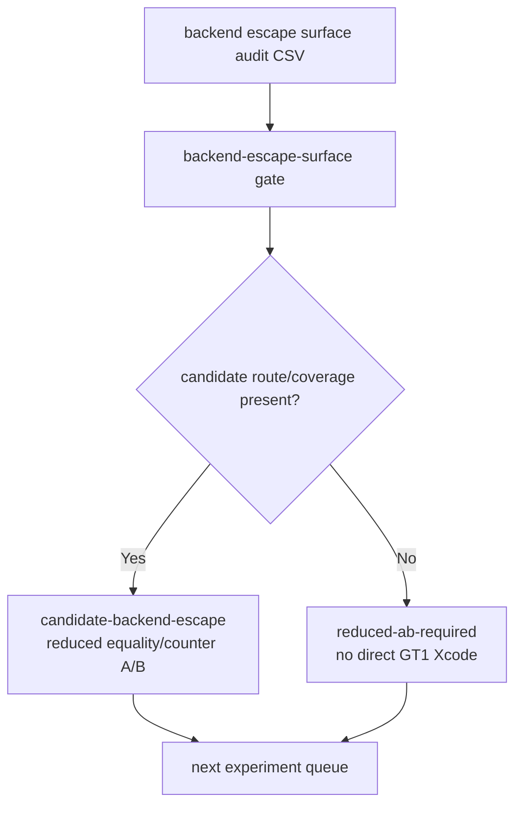
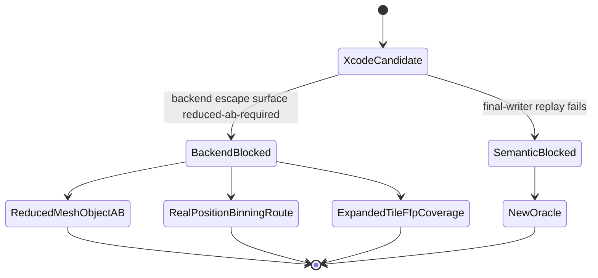

# Backend Escape Surface Is Now a Full Perf Gate

**Question / hypothesis.** [hidden-backend-storage-shape.21](hidden-backend-storage-shape.21.md) audits
mesh/object, position/binning, and Tile-FFP surfaces outside Xcode. Can that
result be carried into the current full perf gate so high proxy rows do not
schedule a direct GT1 capture when the backend escape itself still needs a
reduced A/B or a new route?

**Method.**

1. Add `--backend-escape-surface-csv` to
   `scripts/tools/summarize_3dmark05_perf_gates.py`.
2. Emit `backend-escape-surface` from the audit CSV.
3. Add an implementation-track row.
4. Append the backend-escape result to blocked next-experiment queue rows.

**Result.**

| Gate | Verdict | Evidence |
|---|---|---|
| `backend-escape-surface` | `reduced-ab-required` | `mesh-object=bridge-only-reduced-ab-required`; `position-binning=visible-vsout-probe-only`; `tile-ffp=rejected-current-coverage` |
| `overall` | `semantic-safe-locality-only` | current real-texture replay does not prove final-writer safety, and current backend escapes require a reduced A/B or new route before GT1 Xcode |
| depth-read proxy rows | `blocked-final-writer-replay` | action now includes: current backend-shape family is rejected, current PSO per-draw motion is not isolated, and the backend escape audit requires a reduced A/B or new route |

**Verdict.** Accepted as a gate/tooling improvement. The current full gate now
separates "we need a non-reorder backend mechanism" from "the current backend
escape surface is ready for GT1 Xcode." It is not ready: mesh/object is
bridge-only, position/binning is visible-probe-only, and Tile-FFP has rejected
current coverage. The next backend experiment must first be a reduced
mesh/object equality/counter A/B, a real position/binning route, or expanded
Tile-FFP hot-row coverage.

**Related.** [hidden-backend-storage](index.md) ·
[hidden-backend-storage-shape.21](hidden-backend-storage-shape.21.md) ·
[hidden-backend-storage-shape.20](hidden-backend-storage-shape.20.md) · [overview-3dmark05-gt1](../overview-3dmark05-gt1.md).
