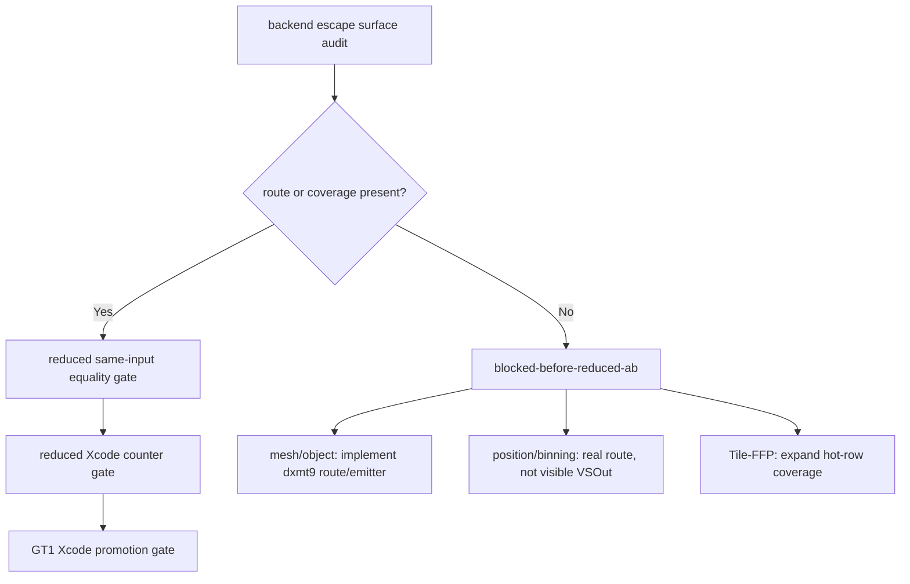
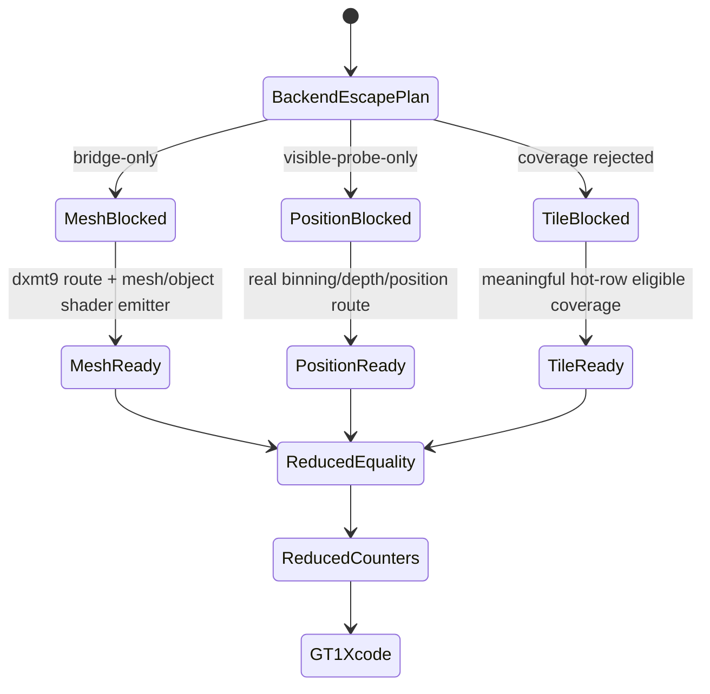

# Backend Escape Reduced A/B Plan

**Question / hypothesis.** [hidden-backend-storage-shape.22](hidden-backend-storage-shape.22.md) blocks direct
GT1 Xcode spend because current backend escape surfaces require a reduced A/B
or a new route. Can that requirement be made executable enough that future
work knows exactly which precondition is missing and which equality/counter
gate must pass before promotion?

**Method.**

1. Add `plan_backend_escape_reduced_ab.py`.
2. Consume `audit_backend_escape_surface.py` CSV rows.
3. Map each backend escape to:
   - route/coverage precondition,
   - reduced equality gate,
   - reduced Xcode counter gate,
   - GT1 promotion gate.
4. Generate CSV/Markdown under the same ignored trace run directory.
5. Add `--backend-escape-reduced-ab-plan-csv` to the full perf gate so the
   same blocker appears in implementation tracks and next-experiment queue
   actions.
6. Attach the Tile-FFP expansion CSV so the Tile-FFP branch distinguishes
   generic coverage absence from a programmable/textured route requirement.

**Result.**

| Candidate | Audit verdict | Reduced A/B status | Meaning |
|---|---|---|---|
| mesh/object | `bridge-only-reduced-ab-required` | `blocked-missing-dxmt9-route` | winemetal has mesh/object support, but dxmt9 has no GT1 route/emitter |
| position/binning | `visible-vsout-probe-only` | `blocked-real-route-missing` | current probe only changes source-visible `VSOut`, which Xcode already rejected |
| Tile-FFP | `rejected-current-coverage` | `blocked-hot-row-coverage / needs-programmable-tile-route` | route exists, but current GT1 hot rows require a programmable/textured route, not current FFP selector widening |

Overall verdict: `blocked-before-reduced-ab`.

When attached to the full perf gate, the new gate row is:

| Gate | Verdict | Evidence |
|---|---|---|
| `backend-escape-reduced-ab-plan` | `blocked-before-reduced-ab` | `mesh-object=blocked-missing-dxmt9-route`; `position-binning=blocked-real-route-missing`; `tile-ffp=blocked-hot-row-coverage/needs-programmable-tile-route` |
| `overall` | `semantic-safe-locality-only` | accepted opaque-depth locality remains; sample-visible locality still fails final-writer replay; backend escapes are blocked before reduced A/B route/coverage |

**Verdict.** Accepted as a planning/gate artifact. This does not prove a new
optimization, but it makes the next optimization step falsifiable. The current
backend escape lane is blocked before reduced A/B: mesh/object needs a dxmt9
route/emitter, position/binning needs a real route below visible `VSOut`, and
Tile-FFP needs meaningful hot-row coverage. A future candidate can enter GT1
Xcode only after it first passes reduced same-input equality and reduced
counter movement. When the plan CSV is attached to the full gate, the gate
emits `backend-escape-reduced-ab-plan=blocked-before-reduced-ab`, and the
`60/2` next-experiment queue rows now include "backend escape reduced A/B is
blocked before route/coverage" in their action text. With the Tile-FFP
expansion CSV attached, the Tile-FFP branch specifically says current widening
is not the GT1 route; a programmable/textured tile or mesh route is required
before reduced A/B.

**Related.** [hidden-backend-storage](index.md) ·
[hidden-backend-storage-shape.21](hidden-backend-storage-shape.21.md) ·
[hidden-backend-storage-shape.22](hidden-backend-storage-shape.22.md) · [overview-3dmark05-gt1](../overview-3dmark05-gt1.md).
