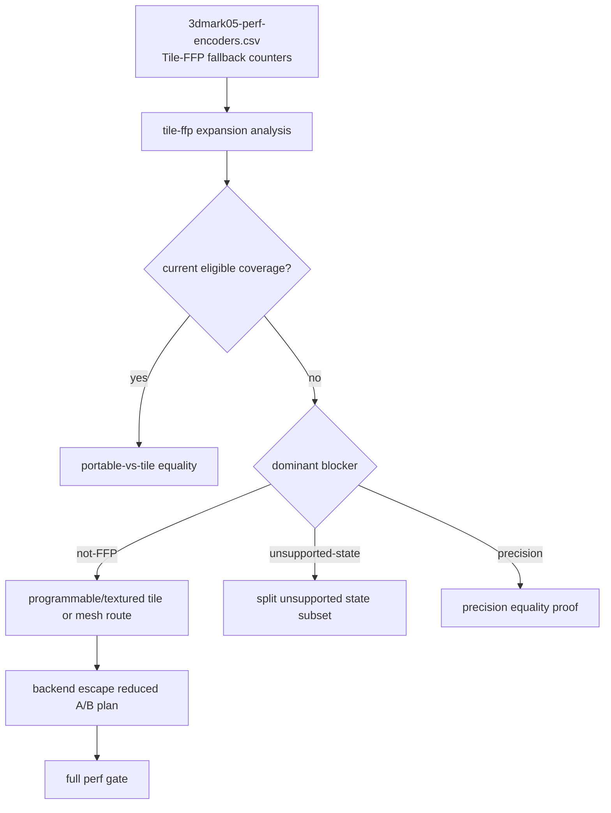
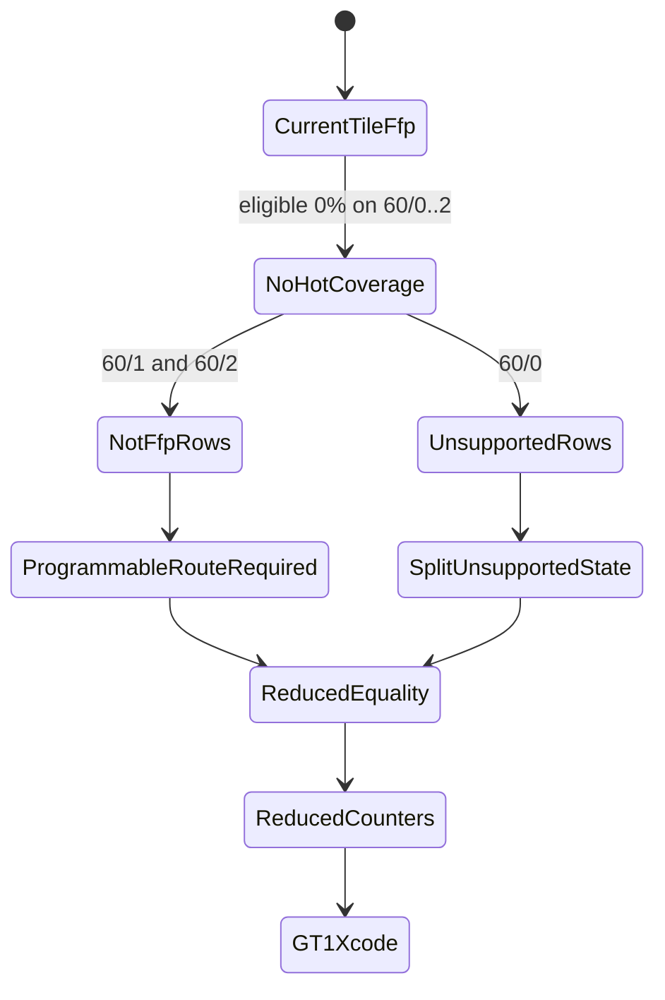

# Tile-FFP Expansion Still Requires a Programmable Route

**Question / hypothesis.** [[hidden-backend-storage-shape.23]] says Tile-FFP is
blocked by hot-row coverage. Is that merely a matter of widening the existing
FFP tile selector, or do GT1 hot rows require a fundamentally different
programmable/textured backend route?

**Method.**

1. Add `analyze_tile_ffp_expansion.py`.
2. Consume `3dmark05-perf-encoders.csv` Tile-FFP fallback counters.
3. Split row coverage by current eligible primitives, not-FFP fallback,
   unsupported-state fallback, precision fallback, programmable draws, and
   textured draws.
4. Feed the generated expansion CSV back into
   `plan_backend_escape_reduced_ab.py`, then into the full perf gate.

**Result.**

Frame60 Tile-FFP expansion:

| Row | Verdict | Dominant blocker | primitives | Current eligible | not-FFP | unsupported | Draw shape |
|---|---|---|---:|---:|---:|---:|---|
| `60/2` | `needs-programmable-tile-route` | `not-ffp` | `389,376` | `0.000%` | `100.000%` | `0.000%` | `187` programmable, `187` textured |
| `60/1` | `needs-programmable-tile-route` | `not-ffp` | `228,725` | `0.000%` | `100.000%` | `0.000%` | `156` programmable |
| `60/0` | `needs-unsupported-state-expansion` | `unsupported-state` | `97,294` | `0.000%` | `0.000%` | `100.000%` | `42` programmable, `42` textured |

The run-top expansion report is even stronger: the top `16` rows all emit
`needs-programmable-tile-route`, dominated by repeated `not-ffp` hot rows.
When the expansion CSV is attached to the reduced A/B plan, the Tile-FFP row
becomes:

| Candidate | Reduced A/B status | Expansion status |
|---|---|---|
| `tile-ffp` | `blocked-hot-row-coverage` | `needs-programmable-tile-route` |

The full gate evidence now carries:
`tile-ffp=blocked-hot-row-coverage/needs-programmable-tile-route`.

**Verdict.** Accepted as a blocker refinement. Current Tile-FFP is not a near
GT1 backend escape by widening FFP eligibility alone. The important hot rows
are programmable/textured or otherwise unsupported by the current tile kernel.
The next Tile-FFP-class backend work is therefore a programmable/textured tile
or mesh-style route, not another GT1 Xcode capture of current Tile-FFP and not
a minor selector threshold tweak.

**Related.** [[hidden-backend-storage]] ·
[[hidden-backend-storage-shape.15]] ·
[[hidden-backend-storage-shape.23]] · [[overview-3dmark05-gt1]].
